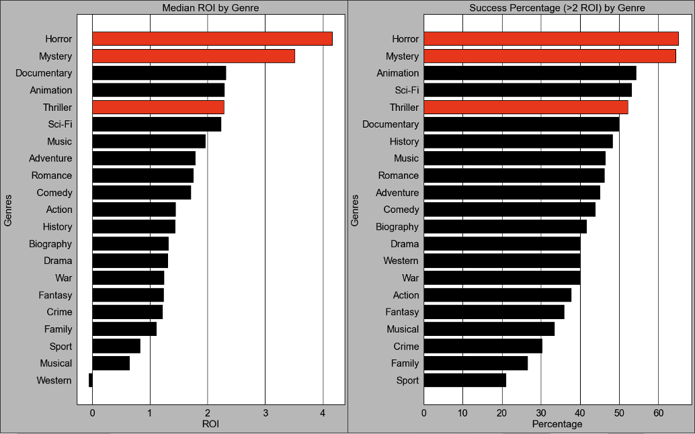
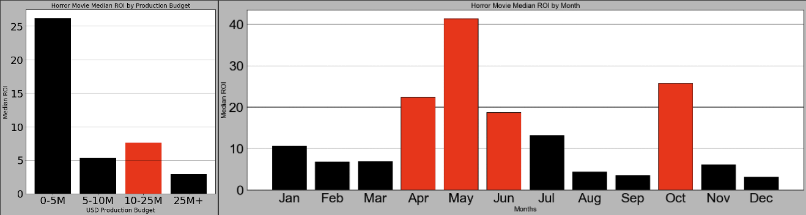
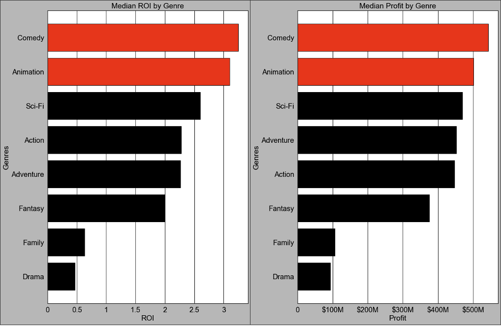

 

# Movie Industry Introduction Analysis

**Author**: Brian Bentson

## **Overview**

This project analyzes various aspects of movie data to gain insights into which choices make a successful movie. In order to create a strong introduction into this industry, Microsoft could utilize this analysis as a starting point toward making data driven decisions on how to proceed with their first movie.

## **Business Problem**

Based on the suceess of their peers, Microsoft has decided to create a new movie studio focused on creating original video content. They have no direct movie creation experience and want to leverage historical movie data in order to determine what are leading indicators of a successful movie. This analysis can be used to make data-driven decisions on parameters of a prospective first movie.

## **Data**

IMDB (International Movie Database), Rotten Tomatoes and TMDB (The Movie Database) all have datasets which provide the data necessary to analyze what makes a movie successful. From these datasets, I will be gathering the following general data:
- Movie-specific meta-data
- Production Cost
- Global Revenue

This data will allow for me to calculate the metric I believe represents a successful movie: Return on Investment (ROI). I also tagged each movie as "Successful" if they acheived a ROI of greater than 2. Other data will be analyzed to maximize ROI.

## **Methods**

This project combines disparate datasets together to answer specific business questions. Descriptive statistics is used to gain insights into important movie selection variables and how they maximize ROI. I only analyzed movies released between 2010-2018 from the 40 largest studios. This ensured that I was not analyzing data outside of how Microsoft will be directly competing against.  

## **Results**

The analysis shows that in order to maximize ROI and the chance of success, Microsoft should narrow in on the Horror genre. Similar adjacent genres of Thriller and Mystery will also produce a high ROI and chance of success. 

The graphs below show 2 different metrics:
- Median ROI by genre
- The percent chance a particular genre will be successful at achieving a ROI greater than 2

 

If Microsoft wanted to proceed with creating a Horror movie, the analysis further showed that spending between $10M and $25M and releasing either in October or during the summer would result in a high ROI and total profit.

 

Lastly, if Microsoft wanted to invest more money to have a high-risk, high-reward option, The best genres to consider when spending above the 90th percentile ($150M) are Animation and Comedy. Going this route will potentially be 9 times more lucrative than producing a Horror film, but at 17 times the cost.

 


## **Conclusions**

In conclusion, the recommendations to maximize ROI based on the analysis are the following:
- Create a Horror movie with elements of Thriller and Mystery
- Spend between $10-$25M
- Release the movie in October or during the summer
- Invest in an Animated Comedy if you want to invest $150M or more.

Further analysis that would benefit Microsofit in the decision making process would include:
- Identify top directors for a Horror film
- Potentially use a different metric of success such as total profit to base the analysis
- Look at revenue opportunities beyond the box office
- Incorporate popularity meassures such as award nominees and winners as well as social media popularity
- Does an acquisition of a successful studio be a better starting point than creating a movie internally

Ultimately, the decision point going forward that will dictate the next logical step is to know how much Microsoft is willing to spend and what risk are they willing to take. Creating a Horror film is the safest entry into the movie industry from a financial perspective and may give them enough of a head of steam to roll into more risky but lucrative movies in the future.

## **For More Information**

Please review our full analysis in [our Jupyter Notebook](https://github.com/bentson1187/dsc-phase-1-project/blob/c42d21abddde4eb3291db611b4eb1c3aa912b3f6/Bentson,%20Brian%20Phase%201%20Project.ipynb) or our [presentation](https://github.com/bentson1187/dsc-phase-1-project/blob/c42d21abddde4eb3291db611b4eb1c3aa912b3f6/Microsoft%20Presentation.pdf).

For any additional questions, please contact **Brian Bentson, bentson.brian@gmail.com**

## Repository Structure

Describe the structure of your repository and its contents, for example:

```
├── README.md                           <- The top-level README for reviewers of this project
├── Bentson,Brian Phase 1 Project.ipynb <- Narrative documentation of analysis in Jupyter notebook
├── Jupyter Notebook.pdf                <- PDF version of the analysis in Jupyter notebook
├── Microsoft Presentation.pdf          <- PDF version of project presentation
├── zippedData                          <- Both sourced externally and generated from code
├── movie_project_erd.png               <- Entity relationship diagram for data                        
└── images                              <- Both sourced externally and generated from code
```
