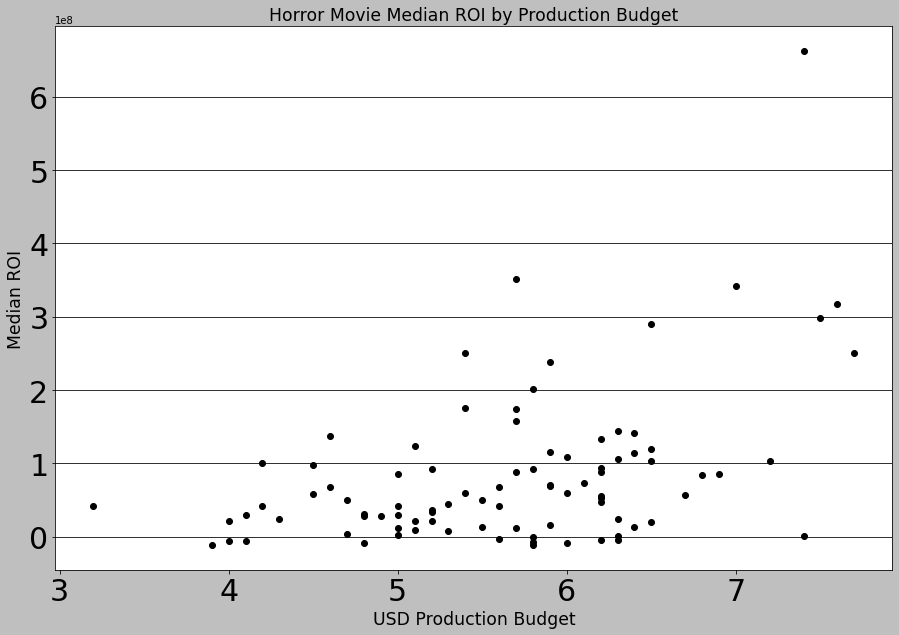

## Final Project Submission

Please fill out:
* Student name: Brian Bentson
* Student pace: Full time
* Scheduled project review date/time: Monday 3/22 @ 3pm CST
* Instructor name: James Irving
* Blog post URL:


## Functions


```python
#import relevant modules
import os, glob
import pandas as pd
import numpy as np
import matplotlib.pyplot as plt
import seaborn as sns
import matplotlib.style as style
import matplotlib.ticker as tick
plt.style.use('grayscale')
import warnings 
warnings.filterwarnings('ignore')
```


```python
pd.set_option('display.max_rows', 100)
```

### Function to Explore Table and Column Info


```python
def get_info(table_name, column=None):
    if column == None:
        print(f'Table Name: {table_name}') 
        print('\n')
        print('Table Columns')
        print(tables[table_name].columns)
        print('\n')
        print('Table Info')
        print(tables[table_name].info())
        print('\n')
        print('Table Descriptive Statistics')
        print(tables[table_name].describe())
    else:
        print(f'Table Name: {table_name}') 
        print('\n')
        print('Table Columns')
        print(tables[table_name].columns)
        print('\n')
        print('Table Info')
        print(tables[table_name].info())
        print('\n')
        print(f'{column.title()} Descriptive Statistics')
        print(tables[table_name][column].describe())
        print('\n')
        print('Table Values')
        print(tables[table_name][column].value_counts(dropna=False))
        print('\n')
        print('Unique Values')
        print(tables[table_name][column].unique())
```

### Function to Update Tick Labels

Sourced from: https://dfrieds.com/data-visualizations/how-format-large-tick-values.html


```python
def reformat_large_tick_values(tick_val, pos):
    """
    Turns large tick values (in the billions, millions and thousands) such as 4500 into 4.5K and also appropriately turns 4000 into 4K (no zero after the decimal).
    """
    if tick_val >= 1000000000:
        val = round(tick_val/1000000000, 1)
        new_tick_format = '${:}B'.format(val)
    elif tick_val >= 1000000:
        val = round(tick_val/1000000, 1)
        new_tick_format = '${:}M'.format(val)
    elif tick_val >= 1000:
        val = round(tick_val/1000, 1)
        new_tick_format = '${:}K'.format(val)
    elif tick_val < 1000:
        new_tick_format = round(tick_val, 1)
    else:
        new_tick_format = tick_val

    # make new_tick_format into a string value
    new_tick_format = str(new_tick_format)
    
    # code below will keep 4.5M as is but change values such as 4.0M to 4M since that zero after the decimal isn't needed
    index_of_decimal = new_tick_format.find(".")
    
    if index_of_decimal != -1:
        value_after_decimal = new_tick_format[index_of_decimal+1]
        if value_after_decimal == "0":
            # remove the 0 after the decimal point since it's not needed
            new_tick_format = new_tick_format[0:index_of_decimal] + new_tick_format[index_of_decimal+2:]
            
    return new_tick_format

```

# Business Statement

Based on the suceess of their peers, Microsoft has decided to create a new movie studio focused on creating original video content. They have no direct movie creation experience and want to leverage historical movie data in order to determine what are leading indicators of a successful movie. This analysis can be used to make data-driven decisions on parameters of a prospective first movie.

# Analysis Methodology

I will be analyzing historic movie data to find actionable insights for the head of Mircrosoft's new movie studio on how to create a successful introduction to the movie industry.

A movie's success can be judged by many factors centered around financial and social measures. Since it is imperative to start on a good footing when entering a new industry, I have decided to focus my analysis on the financial aspect of measuring success. This will mean that a successful movie will have a high relative return on investment. 

# Data Collection

Since I am choosing to judge movie success on the financial metric of return on investment (ROI), I need to gather the correct data in order to make that calculation. The following data will be gathered:
- Movie-specific meta-data
- Production Cost
- Global Revenue
<br>


I have 11 separate files that provide movie meta-data which will be helpful in the analysis. I will import them using panda and determine which files should be utilized in the analysis

## Import Movie Data into Pandas

### Import Modules


```python
#import relevant modules
import os, glob
import pandas as pd
import numpy as np
import matplotlib.pyplot as plt
import seaborn as sns
```

### Preview All Files


```python
#function to preview all available files 
files = glob.glob(f'../dsc-phase-1-project/zippedData/*.[c,t]sv*')

tables = {}
dashes = '---'*25
    
for file in files:
    if 'csv' in file:
        table_name = file.replace('.csv.gz','').split('/')[-1].replace('.','_')
        tables[table_name] = pd.read_csv(file)
        print(dashes)
        print(f'Table Name: {table_name}')
        display(tables[table_name].head())
    else:    
        table_name = file.replace('.tsv.gz','').split('/')[-1].replace('.','_')
        tables[table_name] = pd.read_csv(file, delimiter='\t', encoding='latin-1')
        print(dashes)
        print(f'Table Name: {table_name}')
        display(tables[table_name].head())

rt_reviews = tables['rt_reviews']
rt_movie_info = tables['rt_movie_info']
tmdb_movies = tables['tmdb_movies']
tn_movie_budgets = tables['tn_movie_budgets']
imdb_title_basics = tables['imdb_title_basics']
imdb_title_ratings = tables['imdb_title_ratings']
imdb_name_basics = tables['imdb_name_basics']
imdb_title_principals = tables ['imdb_title_principals']
imdb_title_crew = tables['imdb_title_crew']
imdb_title_akas = tables['imdb_title_akas']
bom_movie_gross = tables['bom_movie_gross']
```

    ---------------------------------------------------------------------------
    Table Name: imdb_title_crew


<div>
<style scoped>
    .dataframe tbody tr th:only-of-type {
        vertical-align: middle;
    }

    .dataframe tbody tr th {
        vertical-align: top;
    }

    .dataframe thead th {
        text-align: right;
    }
</style>
<table border="1" class="dataframe">
  <thead>
    <tr style="text-align: right;">
      <th></th>
      <th>tconst</th>
      <th>directors</th>
      <th>writers</th>
    </tr>
  </thead>
  <tbody>
    <tr>
      <th>0</th>
      <td>tt0285252</td>
      <td>nm0899854</td>
      <td>nm0899854</td>
    </tr>
    <tr>
      <th>1</th>
      <td>tt0438973</td>
      <td>NaN</td>
      <td>nm0175726,nm1802864</td>
    </tr>
    <tr>
      <th>2</th>
      <td>tt0462036</td>
      <td>nm1940585</td>
      <td>nm1940585</td>
    </tr>
    <tr>
      <th>3</th>
      <td>tt0835418</td>
      <td>nm0151540</td>
      <td>nm0310087,nm0841532</td>
    </tr>
    <tr>
      <th>4</th>
      <td>tt0878654</td>
      <td>nm0089502,nm2291498,nm2292011</td>
      <td>nm0284943</td>
    </tr>
  </tbody>
</table>
</div>


    ---------------------------------------------------------------------------
    Table Name: tmdb_movies


<div>
<style scoped>
    .dataframe tbody tr th:only-of-type {
        vertical-align: middle;
    }

    .dataframe tbody tr th {
        vertical-align: top;
    }

    .dataframe thead th {
        text-align: right;
    }
</style>
<table border="1" class="dataframe">
  <thead>
    <tr style="text-align: right;">
      <th></th>
      <th>Unnamed: 0</th>
      <th>genre_ids</th>
      <th>id</th>
      <th>original_language</th>
      <th>original_title</th>
      <th>popularity</th>
      <th>release_date</th>
      <th>title</th>
      <th>vote_average</th>
      <th>vote_count</th>
    </tr>
  </thead>
  <tbody>
    <tr>
      <th>0</th>
      <td>0</td>
      <td>[12, 14, 10751]</td>
      <td>12444</td>
      <td>en</td>
      <td>Harry Potter and the Deathly Hallows: Part 1</td>
      <td>33.533</td>
      <td>2010-11-19</td>
      <td>Harry Potter and the Deathly Hallows: Part 1</td>
      <td>7.7</td>
      <td>10788</td>
    </tr>
    <tr>
      <th>1</th>
      <td>1</td>
      <td>[14, 12, 16, 10751]</td>
      <td>10191</td>
      <td>en</td>
      <td>How to Train Your Dragon</td>
      <td>28.734</td>
      <td>2010-03-26</td>
      <td>How to Train Your Dragon</td>
      <td>7.7</td>
      <td>7610</td>
    </tr>
    <tr>
      <th>2</th>
      <td>2</td>
      <td>[12, 28, 878]</td>
      <td>10138</td>
      <td>en</td>
      <td>Iron Man 2</td>
      <td>28.515</td>
      <td>2010-05-07</td>
      <td>Iron Man 2</td>
      <td>6.8</td>
      <td>12368</td>
    </tr>
    <tr>
      <th>3</th>
      <td>3</td>
      <td>[16, 35, 10751]</td>
      <td>862</td>
      <td>en</td>
      <td>Toy Story</td>
      <td>28.005</td>
      <td>1995-11-22</td>
      <td>Toy Story</td>
      <td>7.9</td>
      <td>10174</td>
    </tr>
    <tr>
      <th>4</th>
      <td>4</td>
      <td>[28, 878, 12]</td>
      <td>27205</td>
      <td>en</td>
      <td>Inception</td>
      <td>27.920</td>
      <td>2010-07-16</td>
      <td>Inception</td>
      <td>8.3</td>
      <td>22186</td>
    </tr>
  </tbody>
</table>
</div>


    ---------------------------------------------------------------------------
    Table Name: imdb_title_akas


<div>
<style scoped>
    .dataframe tbody tr th:only-of-type {
        vertical-align: middle;
    }

    .dataframe tbody tr th {
        vertical-align: top;
    }

    .dataframe thead th {
        text-align: right;
    }
</style>
<table border="1" class="dataframe">
  <thead>
    <tr style="text-align: right;">
      <th></th>
      <th>title_id</th>
      <th>ordering</th>
      <th>title</th>
      <th>region</th>
      <th>language</th>
      <th>types</th>
      <th>attributes</th>
      <th>is_original_title</th>
    </tr>
  </thead>
  <tbody>
    <tr>
      <th>0</th>
      <td>tt0369610</td>
      <td>10</td>
      <td>Джурасик свят</td>
      <td>BG</td>
      <td>bg</td>
      <td>NaN</td>
      <td>NaN</td>
      <td>0.0</td>
    </tr>
    <tr>
      <th>1</th>
      <td>tt0369610</td>
      <td>11</td>
      <td>Jurashikku warudo</td>
      <td>JP</td>
      <td>NaN</td>
      <td>imdbDisplay</td>
      <td>NaN</td>
      <td>0.0</td>
    </tr>
    <tr>
      <th>2</th>
      <td>tt0369610</td>
      <td>12</td>
      <td>Jurassic World: O Mundo dos Dinossauros</td>
      <td>BR</td>
      <td>NaN</td>
      <td>imdbDisplay</td>
      <td>NaN</td>
      <td>0.0</td>
    </tr>
    <tr>
      <th>3</th>
      <td>tt0369610</td>
      <td>13</td>
      <td>O Mundo dos Dinossauros</td>
      <td>BR</td>
      <td>NaN</td>
      <td>NaN</td>
      <td>short title</td>
      <td>0.0</td>
    </tr>
    <tr>
      <th>4</th>
      <td>tt0369610</td>
      <td>14</td>
      <td>Jurassic World</td>
      <td>FR</td>
      <td>NaN</td>
      <td>imdbDisplay</td>
      <td>NaN</td>
      <td>0.0</td>
    </tr>
  </tbody>
</table>
</div>


    ---------------------------------------------------------------------------
    Table Name: imdb_title_ratings


<div>
<style scoped>
    .dataframe tbody tr th:only-of-type {
        vertical-align: middle;
    }

    .dataframe tbody tr th {
        vertical-align: top;
    }

    .dataframe thead th {
        text-align: right;
    }
</style>
<table border="1" class="dataframe">
  <thead>
    <tr style="text-align: right;">
      <th></th>
      <th>tconst</th>
      <th>averagerating</th>
      <th>numvotes</th>
    </tr>
  </thead>
  <tbody>
    <tr>
      <th>0</th>
      <td>tt10356526</td>
      <td>8.3</td>
      <td>31</td>
    </tr>
    <tr>
      <th>1</th>
      <td>tt10384606</td>
      <td>8.9</td>
      <td>559</td>
    </tr>
    <tr>
      <th>2</th>
      <td>tt1042974</td>
      <td>6.4</td>
      <td>20</td>
    </tr>
    <tr>
      <th>3</th>
      <td>tt1043726</td>
      <td>4.2</td>
      <td>50352</td>
    </tr>
    <tr>
      <th>4</th>
      <td>tt1060240</td>
      <td>6.5</td>
      <td>21</td>
    </tr>
  </tbody>
</table>
</div>


    ---------------------------------------------------------------------------
    Table Name: imdb_name_basics


<div>
<style scoped>
    .dataframe tbody tr th:only-of-type {
        vertical-align: middle;
    }

    .dataframe tbody tr th {
        vertical-align: top;
    }

    .dataframe thead th {
        text-align: right;
    }
</style>
<table border="1" class="dataframe">
  <thead>
    <tr style="text-align: right;">
      <th></th>
      <th>nconst</th>
      <th>primary_name</th>
      <th>birth_year</th>
      <th>death_year</th>
      <th>primary_profession</th>
      <th>known_for_titles</th>
    </tr>
  </thead>
  <tbody>
    <tr>
      <th>0</th>
      <td>nm0061671</td>
      <td>Mary Ellen Bauder</td>
      <td>NaN</td>
      <td>NaN</td>
      <td>miscellaneous,production_manager,producer</td>
      <td>tt0837562,tt2398241,tt0844471,tt0118553</td>
    </tr>
    <tr>
      <th>1</th>
      <td>nm0061865</td>
      <td>Joseph Bauer</td>
      <td>NaN</td>
      <td>NaN</td>
      <td>composer,music_department,sound_department</td>
      <td>tt0896534,tt6791238,tt0287072,tt1682940</td>
    </tr>
    <tr>
      <th>2</th>
      <td>nm0062070</td>
      <td>Bruce Baum</td>
      <td>NaN</td>
      <td>NaN</td>
      <td>miscellaneous,actor,writer</td>
      <td>tt1470654,tt0363631,tt0104030,tt0102898</td>
    </tr>
    <tr>
      <th>3</th>
      <td>nm0062195</td>
      <td>Axel Baumann</td>
      <td>NaN</td>
      <td>NaN</td>
      <td>camera_department,cinematographer,art_department</td>
      <td>tt0114371,tt2004304,tt1618448,tt1224387</td>
    </tr>
    <tr>
      <th>4</th>
      <td>nm0062798</td>
      <td>Pete Baxter</td>
      <td>NaN</td>
      <td>NaN</td>
      <td>production_designer,art_department,set_decorator</td>
      <td>tt0452644,tt0452692,tt3458030,tt2178256</td>
    </tr>
  </tbody>
</table>
</div>


    ---------------------------------------------------------------------------
    Table Name: rt_reviews


<div>
<style scoped>
    .dataframe tbody tr th:only-of-type {
        vertical-align: middle;
    }

    .dataframe tbody tr th {
        vertical-align: top;
    }

    .dataframe thead th {
        text-align: right;
    }
</style>
<table border="1" class="dataframe">
  <thead>
    <tr style="text-align: right;">
      <th></th>
      <th>id</th>
      <th>review</th>
      <th>rating</th>
      <th>fresh</th>
      <th>critic</th>
      <th>top_critic</th>
      <th>publisher</th>
      <th>date</th>
    </tr>
  </thead>
  <tbody>
    <tr>
      <th>0</th>
      <td>3</td>
      <td>A distinctly gallows take on contemporary fina...</td>
      <td>3/5</td>
      <td>fresh</td>
      <td>PJ Nabarro</td>
      <td>0</td>
      <td>Patrick Nabarro</td>
      <td>November 10, 2018</td>
    </tr>
    <tr>
      <th>1</th>
      <td>3</td>
      <td>It's an allegory in search of a meaning that n...</td>
      <td>NaN</td>
      <td>rotten</td>
      <td>Annalee Newitz</td>
      <td>0</td>
      <td>io9.com</td>
      <td>May 23, 2018</td>
    </tr>
    <tr>
      <th>2</th>
      <td>3</td>
      <td>... life lived in a bubble in financial dealin...</td>
      <td>NaN</td>
      <td>fresh</td>
      <td>Sean Axmaker</td>
      <td>0</td>
      <td>Stream on Demand</td>
      <td>January 4, 2018</td>
    </tr>
    <tr>
      <th>3</th>
      <td>3</td>
      <td>Continuing along a line introduced in last yea...</td>
      <td>NaN</td>
      <td>fresh</td>
      <td>Daniel Kasman</td>
      <td>0</td>
      <td>MUBI</td>
      <td>November 16, 2017</td>
    </tr>
    <tr>
      <th>4</th>
      <td>3</td>
      <td>... a perverse twist on neorealism...</td>
      <td>NaN</td>
      <td>fresh</td>
      <td>NaN</td>
      <td>0</td>
      <td>Cinema Scope</td>
      <td>October 12, 2017</td>
    </tr>
  </tbody>
</table>
</div>


    ---------------------------------------------------------------------------
    Table Name: imdb_title_basics


<div>
<style scoped>
    .dataframe tbody tr th:only-of-type {
        vertical-align: middle;
    }

    .dataframe tbody tr th {
        vertical-align: top;
    }

    .dataframe thead th {
        text-align: right;
    }
</style>
<table border="1" class="dataframe">
  <thead>
    <tr style="text-align: right;">
      <th></th>
      <th>tconst</th>
      <th>primary_title</th>
      <th>original_title</th>
      <th>start_year</th>
      <th>runtime_minutes</th>
      <th>genres</th>
    </tr>
  </thead>
  <tbody>
    <tr>
      <th>0</th>
      <td>tt0063540</td>
      <td>Sunghursh</td>
      <td>Sunghursh</td>
      <td>2013</td>
      <td>175.0</td>
      <td>Action,Crime,Drama</td>
    </tr>
    <tr>
      <th>1</th>
      <td>tt0066787</td>
      <td>One Day Before the Rainy Season</td>
      <td>Ashad Ka Ek Din</td>
      <td>2019</td>
      <td>114.0</td>
      <td>Biography,Drama</td>
    </tr>
    <tr>
      <th>2</th>
      <td>tt0069049</td>
      <td>The Other Side of the Wind</td>
      <td>The Other Side of the Wind</td>
      <td>2018</td>
      <td>122.0</td>
      <td>Drama</td>
    </tr>
    <tr>
      <th>3</th>
      <td>tt0069204</td>
      <td>Sabse Bada Sukh</td>
      <td>Sabse Bada Sukh</td>
      <td>2018</td>
      <td>NaN</td>
      <td>Comedy,Drama</td>
    </tr>
    <tr>
      <th>4</th>
      <td>tt0100275</td>
      <td>The Wandering Soap Opera</td>
      <td>La Telenovela Errante</td>
      <td>2017</td>
      <td>80.0</td>
      <td>Comedy,Drama,Fantasy</td>
    </tr>
  </tbody>
</table>
</div>


    ---------------------------------------------------------------------------
    Table Name: rt_movie_info


<div>
<style scoped>
    .dataframe tbody tr th:only-of-type {
        vertical-align: middle;
    }

    .dataframe tbody tr th {
        vertical-align: top;
    }

    .dataframe thead th {
        text-align: right;
    }
</style>
<table border="1" class="dataframe">
  <thead>
    <tr style="text-align: right;">
      <th></th>
      <th>id</th>
      <th>synopsis</th>
      <th>rating</th>
      <th>genre</th>
      <th>director</th>
      <th>writer</th>
      <th>theater_date</th>
      <th>dvd_date</th>
      <th>currency</th>
      <th>box_office</th>
      <th>runtime</th>
      <th>studio</th>
    </tr>
  </thead>
  <tbody>
    <tr>
      <th>0</th>
      <td>1</td>
      <td>This gritty, fast-paced, and innovative police...</td>
      <td>R</td>
      <td>Action and Adventure|Classics|Drama</td>
      <td>William Friedkin</td>
      <td>Ernest Tidyman</td>
      <td>Oct 9, 1971</td>
      <td>Sep 25, 2001</td>
      <td>NaN</td>
      <td>NaN</td>
      <td>104 minutes</td>
      <td>NaN</td>
    </tr>
    <tr>
      <th>1</th>
      <td>3</td>
      <td>New York City, not-too-distant-future: Eric Pa...</td>
      <td>R</td>
      <td>Drama|Science Fiction and Fantasy</td>
      <td>David Cronenberg</td>
      <td>David Cronenberg|Don DeLillo</td>
      <td>Aug 17, 2012</td>
      <td>Jan 1, 2013</td>
      <td>$</td>
      <td>600,000</td>
      <td>108 minutes</td>
      <td>Entertainment One</td>
    </tr>
    <tr>
      <th>2</th>
      <td>5</td>
      <td>Illeana Douglas delivers a superb performance ...</td>
      <td>R</td>
      <td>Drama|Musical and Performing Arts</td>
      <td>Allison Anders</td>
      <td>Allison Anders</td>
      <td>Sep 13, 1996</td>
      <td>Apr 18, 2000</td>
      <td>NaN</td>
      <td>NaN</td>
      <td>116 minutes</td>
      <td>NaN</td>
    </tr>
    <tr>
      <th>3</th>
      <td>6</td>
      <td>Michael Douglas runs afoul of a treacherous su...</td>
      <td>R</td>
      <td>Drama|Mystery and Suspense</td>
      <td>Barry Levinson</td>
      <td>Paul Attanasio|Michael Crichton</td>
      <td>Dec 9, 1994</td>
      <td>Aug 27, 1997</td>
      <td>NaN</td>
      <td>NaN</td>
      <td>128 minutes</td>
      <td>NaN</td>
    </tr>
    <tr>
      <th>4</th>
      <td>7</td>
      <td>NaN</td>
      <td>NR</td>
      <td>Drama|Romance</td>
      <td>Rodney Bennett</td>
      <td>Giles Cooper</td>
      <td>NaN</td>
      <td>NaN</td>
      <td>NaN</td>
      <td>NaN</td>
      <td>200 minutes</td>
      <td>NaN</td>
    </tr>
  </tbody>
</table>
</div>


    ---------------------------------------------------------------------------
    Table Name: tn_movie_budgets


<div>
<style scoped>
    .dataframe tbody tr th:only-of-type {
        vertical-align: middle;
    }

    .dataframe tbody tr th {
        vertical-align: top;
    }

    .dataframe thead th {
        text-align: right;
    }
</style>
<table border="1" class="dataframe">
  <thead>
    <tr style="text-align: right;">
      <th></th>
      <th>id</th>
      <th>release_date</th>
      <th>movie</th>
      <th>production_budget</th>
      <th>domestic_gross</th>
      <th>worldwide_gross</th>
    </tr>
  </thead>
  <tbody>
    <tr>
      <th>0</th>
      <td>1</td>
      <td>Dec 18, 2009</td>
      <td>Avatar</td>
      <td>$425,000,000</td>
      <td>$760,507,625</td>
      <td>$2,776,345,279</td>
    </tr>
    <tr>
      <th>1</th>
      <td>2</td>
      <td>May 20, 2011</td>
      <td>Pirates of the Caribbean: On Stranger Tides</td>
      <td>$410,600,000</td>
      <td>$241,063,875</td>
      <td>$1,045,663,875</td>
    </tr>
    <tr>
      <th>2</th>
      <td>3</td>
      <td>Jun 7, 2019</td>
      <td>Dark Phoenix</td>
      <td>$350,000,000</td>
      <td>$42,762,350</td>
      <td>$149,762,350</td>
    </tr>
    <tr>
      <th>3</th>
      <td>4</td>
      <td>May 1, 2015</td>
      <td>Avengers: Age of Ultron</td>
      <td>$330,600,000</td>
      <td>$459,005,868</td>
      <td>$1,403,013,963</td>
    </tr>
    <tr>
      <th>4</th>
      <td>5</td>
      <td>Dec 15, 2017</td>
      <td>Star Wars Ep. VIII: The Last Jedi</td>
      <td>$317,000,000</td>
      <td>$620,181,382</td>
      <td>$1,316,721,747</td>
    </tr>
  </tbody>
</table>
</div>


    ---------------------------------------------------------------------------
    Table Name: bom_movie_gross


<div>
<style scoped>
    .dataframe tbody tr th:only-of-type {
        vertical-align: middle;
    }

    .dataframe tbody tr th {
        vertical-align: top;
    }

    .dataframe thead th {
        text-align: right;
    }
</style>
<table border="1" class="dataframe">
  <thead>
    <tr style="text-align: right;">
      <th></th>
      <th>title</th>
      <th>studio</th>
      <th>domestic_gross</th>
      <th>foreign_gross</th>
      <th>year</th>
    </tr>
  </thead>
  <tbody>
    <tr>
      <th>0</th>
      <td>Toy Story 3</td>
      <td>BV</td>
      <td>415000000.0</td>
      <td>652000000</td>
      <td>2010</td>
    </tr>
    <tr>
      <th>1</th>
      <td>Alice in Wonderland (2010)</td>
      <td>BV</td>
      <td>334200000.0</td>
      <td>691300000</td>
      <td>2010</td>
    </tr>
    <tr>
      <th>2</th>
      <td>Harry Potter and the Deathly Hallows Part 1</td>
      <td>WB</td>
      <td>296000000.0</td>
      <td>664300000</td>
      <td>2010</td>
    </tr>
    <tr>
      <th>3</th>
      <td>Inception</td>
      <td>WB</td>
      <td>292600000.0</td>
      <td>535700000</td>
      <td>2010</td>
    </tr>
    <tr>
      <th>4</th>
      <td>Shrek Forever After</td>
      <td>P/DW</td>
      <td>238700000.0</td>
      <td>513900000</td>
      <td>2010</td>
    </tr>
  </tbody>
</table>
</div>


    ---------------------------------------------------------------------------
    Table Name: imdb_title_principals


<div>
<style scoped>
    .dataframe tbody tr th:only-of-type {
        vertical-align: middle;
    }

    .dataframe tbody tr th {
        vertical-align: top;
    }

    .dataframe thead th {
        text-align: right;
    }
</style>
<table border="1" class="dataframe">
  <thead>
    <tr style="text-align: right;">
      <th></th>
      <th>tconst</th>
      <th>ordering</th>
      <th>nconst</th>
      <th>category</th>
      <th>job</th>
      <th>characters</th>
    </tr>
  </thead>
  <tbody>
    <tr>
      <th>0</th>
      <td>tt0111414</td>
      <td>1</td>
      <td>nm0246005</td>
      <td>actor</td>
      <td>NaN</td>
      <td>["The Man"]</td>
    </tr>
    <tr>
      <th>1</th>
      <td>tt0111414</td>
      <td>2</td>
      <td>nm0398271</td>
      <td>director</td>
      <td>NaN</td>
      <td>NaN</td>
    </tr>
    <tr>
      <th>2</th>
      <td>tt0111414</td>
      <td>3</td>
      <td>nm3739909</td>
      <td>producer</td>
      <td>producer</td>
      <td>NaN</td>
    </tr>
    <tr>
      <th>3</th>
      <td>tt0323808</td>
      <td>10</td>
      <td>nm0059247</td>
      <td>editor</td>
      <td>NaN</td>
      <td>NaN</td>
    </tr>
    <tr>
      <th>4</th>
      <td>tt0323808</td>
      <td>1</td>
      <td>nm3579312</td>
      <td>actress</td>
      <td>NaN</td>
      <td>["Beth Boothby"]</td>
    </tr>
  </tbody>
</table>
</div>


**Analysis**
<br>
It looks like the most relevant files to be analyzed are as follows:
- **imdb_title_basics**
    - Has tconst for linking to other files
    - Has genres for genre specific analysis
- **imdb_title_akas**
    - Has is_original_title to help filter duplicate movie titles from imdb_title_basics
- **tn_movie_budgets**
    - Has production_budget, gross domestic and worldwide revenue
- **imdb_title_ratings**
    - Has user ratings
- **bom_movie_gross**
    - Has movie studios

# Data Cleaning

## Understanding Raw Data

In order to determine if the right information is present and how to join different tables together for my analysis, I first need to understand what each piece of data is and how it can be used. I will do some short data exploration to understand the data better and decide which data processing techniques to use. 

### Column Meanings for Each Table

**imdb_title_crew**
- **tconst**: Unique identifier for each movie (PRIMARY KEY)
- **directors**: Director code
- **writers**: Writer code

<br>**tmdb_movies**
- Unnamed: 0: Can be removed or set as index
- genre_id's: Genre code
- id: Unknown
- original_language: movie language
- original_title: movie title
- popularity: Unknown
- release_date: movie release date
- title: movie title
- vote_average: Unknown
- vote_count: Number of votes

<br>**imdb_title_akas**
- title_id: movie id
- ordering: Unknown
- title: movie title
- region: Country of origin
- language: movie language
- types: Unknown
- attributes: Unknown
- is_original_title: Unknown

<br>**imdb_title_ratings**
- tconst: Unknown
- **averagerating**: movie rating
- **numvotes**: Number of votes

<br>**imdb_name_basics**
- **nconst**: Unique identifier for person (PRIMARY KEY)
- **primary_name**: Name
- birth_year: Year born
- death_year: Year died
- **primary_profession**: Job Roles
- known_for_titles: title id's

<br>**rt_reviews**
- id: Unknown
- review: Review comments
- rating: Movie rating
- fresh: fresh or rotten score
- critic: Critic Name
- top_critic: Unknown
- publisher: Publisher Name
- date: Unknown

<br> **imdb_title_basics**
- **tconst**: Unique identifier for movie
- **primary_title**: Common Movie Name
- original_title: Native Movie Name
- **start_year**: Year of release
- runtime_minutes: Movie length in minutes
- **genres**: movie genre

<br>**rt_movie_info**
- id: Unknown
- synopsis: Movie synopsis
- rating: movie parental rating
- genre: Movie genre
- director: Movie director
- writer: Movie writer
- theater_date: Theater release data
- dvd_date: DVD release date
- currency: Currency type
- box_office: Unknown
- run_time: Movie length
- studio: Movie Production Studio

<br>**tn_movie_budgets**
- id: Unknown
- release_date: Movie release date
- movie: Movie title (PRIMARY KEY)
- **production_budget**: Movie production budget in USD
- **domestic_gross**: Gross revenue domestically
- **worldwide_gross**: Gross revenue worldwide

<br>**bom_movie_gross**
- title: Movie title (PRIMARY KEY)
- studio: Movie studio
- **domestic_gross**: Gross revenue domestically
- **foreign_gross**: Gross revenue worldwide
- year: Release year (PRIMARY KEY)

<br>**imdb_title_principals**
- tconst: Unique identifier for movie (PRIMARY KEY)
- ordering: Unknown
- nconst: Unique identifier for person (PRIMARY KEY)
- category: Job role
- job: Unknown
- characters:Character played in movie

### Entity Relationship Diagram


## Clean Up Tables for Joins

### tn_movie_budgets


```python
#number of rows, columns and first 5 rows
display(tn_movie_budgets.shape,tn_movie_budgets.head())
```


    (5782, 6)


<div>
<style scoped>
    .dataframe tbody tr th:only-of-type {
        vertical-align: middle;
    }

    .dataframe tbody tr th {
        vertical-align: top;
    }

    .dataframe thead th {
        text-align: right;
    }
</style>
<table border="1" class="dataframe">
  <thead>
    <tr style="text-align: right;">
      <th></th>
      <th>id</th>
      <th>release_date</th>
      <th>movie</th>
      <th>production_budget</th>
      <th>domestic_gross</th>
      <th>worldwide_gross</th>
    </tr>
  </thead>
  <tbody>
    <tr>
      <th>0</th>
      <td>1</td>
      <td>Dec 18, 2009</td>
      <td>Avatar</td>
      <td>$425,000,000</td>
      <td>$760,507,625</td>
      <td>$2,776,345,279</td>
    </tr>
    <tr>
      <th>1</th>
      <td>2</td>
      <td>May 20, 2011</td>
      <td>Pirates of the Caribbean: On Stranger Tides</td>
      <td>$410,600,000</td>
      <td>$241,063,875</td>
      <td>$1,045,663,875</td>
    </tr>
    <tr>
      <th>2</th>
      <td>3</td>
      <td>Jun 7, 2019</td>
      <td>Dark Phoenix</td>
      <td>$350,000,000</td>
      <td>$42,762,350</td>
      <td>$149,762,350</td>
    </tr>
    <tr>
      <th>3</th>
      <td>4</td>
      <td>May 1, 2015</td>
      <td>Avengers: Age of Ultron</td>
      <td>$330,600,000</td>
      <td>$459,005,868</td>
      <td>$1,403,013,963</td>
    </tr>
    <tr>
      <th>4</th>
      <td>5</td>
      <td>Dec 15, 2017</td>
      <td>Star Wars Ep. VIII: The Last Jedi</td>
      <td>$317,000,000</td>
      <td>$620,181,382</td>
      <td>$1,316,721,747</td>
    </tr>
  </tbody>
</table>
</div>


#### Remove Columns


```python
#removing id because it doesn't like up with any other id's in other tables
tn_movie_budgets = tn_movie_budgets.drop('id',axis=1)
tn_movie_budgets.head()
```


<div>
<style scoped>
    .dataframe tbody tr th:only-of-type {
        vertical-align: middle;
    }

    .dataframe tbody tr th {
        vertical-align: top;
    }

    .dataframe thead th {
        text-align: right;
    }
</style>
<table border="1" class="dataframe">
  <thead>
    <tr style="text-align: right;">
      <th></th>
      <th>release_date</th>
      <th>movie</th>
      <th>production_budget</th>
      <th>domestic_gross</th>
      <th>worldwide_gross</th>
    </tr>
  </thead>
  <tbody>
    <tr>
      <th>0</th>
      <td>Dec 18, 2009</td>
      <td>Avatar</td>
      <td>$425,000,000</td>
      <td>$760,507,625</td>
      <td>$2,776,345,279</td>
    </tr>
    <tr>
      <th>1</th>
      <td>May 20, 2011</td>
      <td>Pirates of the Caribbean: On Stranger Tides</td>
      <td>$410,600,000</td>
      <td>$241,063,875</td>
      <td>$1,045,663,875</td>
    </tr>
    <tr>
      <th>2</th>
      <td>Jun 7, 2019</td>
      <td>Dark Phoenix</td>
      <td>$350,000,000</td>
      <td>$42,762,350</td>
      <td>$149,762,350</td>
    </tr>
    <tr>
      <th>3</th>
      <td>May 1, 2015</td>
      <td>Avengers: Age of Ultron</td>
      <td>$330,600,000</td>
      <td>$459,005,868</td>
      <td>$1,403,013,963</td>
    </tr>
    <tr>
      <th>4</th>
      <td>Dec 15, 2017</td>
      <td>Star Wars Ep. VIII: The Last Jedi</td>
      <td>$317,000,000</td>
      <td>$620,181,382</td>
      <td>$1,316,721,747</td>
    </tr>
  </tbody>
</table>
</div>


#### Convert Values


```python
#converting release_date to datetime object to be able to extract the year for future joins
tn_movie_budgets['release_date'] = pd.to_datetime(tn_movie_budgets['release_date'])
tn_movie_budgets['start_year'] = tn_movie_budgets['release_date'].dt.year
tn_movie_budgets.head()
```


<div>
<style scoped>
    .dataframe tbody tr th:only-of-type {
        vertical-align: middle;
    }

    .dataframe tbody tr th {
        vertical-align: top;
    }

    .dataframe thead th {
        text-align: right;
    }
</style>
<table border="1" class="dataframe">
  <thead>
    <tr style="text-align: right;">
      <th></th>
      <th>release_date</th>
      <th>movie</th>
      <th>production_budget</th>
      <th>domestic_gross</th>
      <th>worldwide_gross</th>
      <th>start_year</th>
    </tr>
  </thead>
  <tbody>
    <tr>
      <th>0</th>
      <td>2009-12-18</td>
      <td>Avatar</td>
      <td>$425,000,000</td>
      <td>$760,507,625</td>
      <td>$2,776,345,279</td>
      <td>2009</td>
    </tr>
    <tr>
      <th>1</th>
      <td>2011-05-20</td>
      <td>Pirates of the Caribbean: On Stranger Tides</td>
      <td>$410,600,000</td>
      <td>$241,063,875</td>
      <td>$1,045,663,875</td>
      <td>2011</td>
    </tr>
    <tr>
      <th>2</th>
      <td>2019-06-07</td>
      <td>Dark Phoenix</td>
      <td>$350,000,000</td>
      <td>$42,762,350</td>
      <td>$149,762,350</td>
      <td>2019</td>
    </tr>
    <tr>
      <th>3</th>
      <td>2015-05-01</td>
      <td>Avengers: Age of Ultron</td>
      <td>$330,600,000</td>
      <td>$459,005,868</td>
      <td>$1,403,013,963</td>
      <td>2015</td>
    </tr>
    <tr>
      <th>4</th>
      <td>2017-12-15</td>
      <td>Star Wars Ep. VIII: The Last Jedi</td>
      <td>$317,000,000</td>
      <td>$620,181,382</td>
      <td>$1,316,721,747</td>
      <td>2017</td>
    </tr>
  </tbody>
</table>
</div>


```python
#convert financial fields into integers for future calculations
tn_movie_budgets['production_budget'] = tn_movie_budgets['production_budget'].str.replace('$','').str.replace(',','').astype('int')
tn_movie_budgets['domestic_gross'] = tn_movie_budgets['domestic_gross'].str.replace('$','').str.replace(',','').astype('int')
tn_movie_budgets['worldwide_gross'] = tn_movie_budgets['worldwide_gross'].str.replace('$','').str.replace(',','').astype('int')
tn_movie_budgets.head()
```


<div>
<style scoped>
    .dataframe tbody tr th:only-of-type {
        vertical-align: middle;
    }

    .dataframe tbody tr th {
        vertical-align: top;
    }

    .dataframe thead th {
        text-align: right;
    }
</style>
<table border="1" class="dataframe">
  <thead>
    <tr style="text-align: right;">
      <th></th>
      <th>release_date</th>
      <th>movie</th>
      <th>production_budget</th>
      <th>domestic_gross</th>
      <th>worldwide_gross</th>
      <th>start_year</th>
    </tr>
  </thead>
  <tbody>
    <tr>
      <th>0</th>
      <td>2009-12-18</td>
      <td>Avatar</td>
      <td>425000000</td>
      <td>760507625</td>
      <td>2776345279</td>
      <td>2009</td>
    </tr>
    <tr>
      <th>1</th>
      <td>2011-05-20</td>
      <td>Pirates of the Caribbean: On Stranger Tides</td>
      <td>410600000</td>
      <td>241063875</td>
      <td>1045663875</td>
      <td>2011</td>
    </tr>
    <tr>
      <th>2</th>
      <td>2019-06-07</td>
      <td>Dark Phoenix</td>
      <td>350000000</td>
      <td>42762350</td>
      <td>149762350</td>
      <td>2019</td>
    </tr>
    <tr>
      <th>3</th>
      <td>2015-05-01</td>
      <td>Avengers: Age of Ultron</td>
      <td>330600000</td>
      <td>459005868</td>
      <td>1403013963</td>
      <td>2015</td>
    </tr>
    <tr>
      <th>4</th>
      <td>2017-12-15</td>
      <td>Star Wars Ep. VIII: The Last Jedi</td>
      <td>317000000</td>
      <td>620181382</td>
      <td>1316721747</td>
      <td>2017</td>
    </tr>
  </tbody>
</table>
</div>


#### Check for Duplicates


```python
#check for any duplicates for the combination of movie and release_date because
#those are going to the be the primary keys for future joins
tn_movie_budgets.loc[tn_movie_budgets.duplicated(subset=['movie','start_year'], keep=False)]
```


<div>
<style scoped>
    .dataframe tbody tr th:only-of-type {
        vertical-align: middle;
    }

    .dataframe tbody tr th {
        vertical-align: top;
    }

    .dataframe thead th {
        text-align: right;
    }
</style>
<table border="1" class="dataframe">
  <thead>
    <tr style="text-align: right;">
      <th></th>
      <th>release_date</th>
      <th>movie</th>
      <th>production_budget</th>
      <th>domestic_gross</th>
      <th>worldwide_gross</th>
      <th>start_year</th>
    </tr>
  </thead>
  <tbody>
    <tr>
      <th>3455</th>
      <td>2009-06-05</td>
      <td>Home</td>
      <td>12000000</td>
      <td>0</td>
      <td>0</td>
      <td>2009</td>
    </tr>
    <tr>
      <th>5459</th>
      <td>2009-04-23</td>
      <td>Home</td>
      <td>500000</td>
      <td>15433</td>
      <td>44793168</td>
      <td>2009</td>
    </tr>
  </tbody>
</table>
</div>


1 duplicate found. Both will be removed during innner join with imdb_title_basics because they are prior to 2010.

#### Final Table View


```python
tn_movie_budgets
```


<div>
<style scoped>
    .dataframe tbody tr th:only-of-type {
        vertical-align: middle;
    }

    .dataframe tbody tr th {
        vertical-align: top;
    }

    .dataframe thead th {
        text-align: right;
    }
</style>
<table border="1" class="dataframe">
  <thead>
    <tr style="text-align: right;">
      <th></th>
      <th>release_date</th>
      <th>movie</th>
      <th>production_budget</th>
      <th>domestic_gross</th>
      <th>worldwide_gross</th>
      <th>start_year</th>
    </tr>
  </thead>
  <tbody>
    <tr>
      <th>0</th>
      <td>2009-12-18</td>
      <td>Avatar</td>
      <td>425000000</td>
      <td>760507625</td>
      <td>2776345279</td>
      <td>2009</td>
    </tr>
    <tr>
      <th>1</th>
      <td>2011-05-20</td>
      <td>Pirates of the Caribbean: On Stranger Tides</td>
      <td>410600000</td>
      <td>241063875</td>
      <td>1045663875</td>
      <td>2011</td>
    </tr>
    <tr>
      <th>2</th>
      <td>2019-06-07</td>
      <td>Dark Phoenix</td>
      <td>350000000</td>
      <td>42762350</td>
      <td>149762350</td>
      <td>2019</td>
    </tr>
    <tr>
      <th>3</th>
      <td>2015-05-01</td>
      <td>Avengers: Age of Ultron</td>
      <td>330600000</td>
      <td>459005868</td>
      <td>1403013963</td>
      <td>2015</td>
    </tr>
    <tr>
      <th>4</th>
      <td>2017-12-15</td>
      <td>Star Wars Ep. VIII: The Last Jedi</td>
      <td>317000000</td>
      <td>620181382</td>
      <td>1316721747</td>
      <td>2017</td>
    </tr>
    <tr>
      <th>...</th>
      <td>...</td>
      <td>...</td>
      <td>...</td>
      <td>...</td>
      <td>...</td>
      <td>...</td>
    </tr>
    <tr>
      <th>5777</th>
      <td>2018-12-31</td>
      <td>Red 11</td>
      <td>7000</td>
      <td>0</td>
      <td>0</td>
      <td>2018</td>
    </tr>
    <tr>
      <th>5778</th>
      <td>1999-04-02</td>
      <td>Following</td>
      <td>6000</td>
      <td>48482</td>
      <td>240495</td>
      <td>1999</td>
    </tr>
    <tr>
      <th>5779</th>
      <td>2005-07-13</td>
      <td>Return to the Land of Wonders</td>
      <td>5000</td>
      <td>1338</td>
      <td>1338</td>
      <td>2005</td>
    </tr>
    <tr>
      <th>5780</th>
      <td>2015-09-29</td>
      <td>A Plague So Pleasant</td>
      <td>1400</td>
      <td>0</td>
      <td>0</td>
      <td>2015</td>
    </tr>
    <tr>
      <th>5781</th>
      <td>2005-08-05</td>
      <td>My Date With Drew</td>
      <td>1100</td>
      <td>181041</td>
      <td>181041</td>
      <td>2005</td>
    </tr>
  </tbody>
</table>
<p>5782 rows × 6 columns</p>
</div>


### imdb_title_basics


```python
#number of rows, columns and first 5 rows
display(imdb_title_basics.shape,imdb_title_basics.head())
```


    (146144, 6)


<div>
<style scoped>
    .dataframe tbody tr th:only-of-type {
        vertical-align: middle;
    }

    .dataframe tbody tr th {
        vertical-align: top;
    }

    .dataframe thead th {
        text-align: right;
    }
</style>
<table border="1" class="dataframe">
  <thead>
    <tr style="text-align: right;">
      <th></th>
      <th>tconst</th>
      <th>primary_title</th>
      <th>original_title</th>
      <th>start_year</th>
      <th>runtime_minutes</th>
      <th>genres</th>
    </tr>
  </thead>
  <tbody>
    <tr>
      <th>0</th>
      <td>tt0063540</td>
      <td>Sunghursh</td>
      <td>Sunghursh</td>
      <td>2013</td>
      <td>175.0</td>
      <td>Action,Crime,Drama</td>
    </tr>
    <tr>
      <th>1</th>
      <td>tt0066787</td>
      <td>One Day Before the Rainy Season</td>
      <td>Ashad Ka Ek Din</td>
      <td>2019</td>
      <td>114.0</td>
      <td>Biography,Drama</td>
    </tr>
    <tr>
      <th>2</th>
      <td>tt0069049</td>
      <td>The Other Side of the Wind</td>
      <td>The Other Side of the Wind</td>
      <td>2018</td>
      <td>122.0</td>
      <td>Drama</td>
    </tr>
    <tr>
      <th>3</th>
      <td>tt0069204</td>
      <td>Sabse Bada Sukh</td>
      <td>Sabse Bada Sukh</td>
      <td>2018</td>
      <td>NaN</td>
      <td>Comedy,Drama</td>
    </tr>
    <tr>
      <th>4</th>
      <td>tt0100275</td>
      <td>The Wandering Soap Opera</td>
      <td>La Telenovela Errante</td>
      <td>2017</td>
      <td>80.0</td>
      <td>Comedy,Drama,Fantasy</td>
    </tr>
  </tbody>
</table>
</div>


#### Remove Columns


```python
#remove original_title because primary_title looks to be most accurate
imdb_title_basics = imdb_title_basics.drop('original_title',axis=1)
imdb_title_basics.head()
```


<div>
<style scoped>
    .dataframe tbody tr th:only-of-type {
        vertical-align: middle;
    }

    .dataframe tbody tr th {
        vertical-align: top;
    }

    .dataframe thead th {
        text-align: right;
    }
</style>
<table border="1" class="dataframe">
  <thead>
    <tr style="text-align: right;">
      <th></th>
      <th>tconst</th>
      <th>primary_title</th>
      <th>start_year</th>
      <th>runtime_minutes</th>
      <th>genres</th>
    </tr>
  </thead>
  <tbody>
    <tr>
      <th>0</th>
      <td>tt0063540</td>
      <td>Sunghursh</td>
      <td>2013</td>
      <td>175.0</td>
      <td>Action,Crime,Drama</td>
    </tr>
    <tr>
      <th>1</th>
      <td>tt0066787</td>
      <td>One Day Before the Rainy Season</td>
      <td>2019</td>
      <td>114.0</td>
      <td>Biography,Drama</td>
    </tr>
    <tr>
      <th>2</th>
      <td>tt0069049</td>
      <td>The Other Side of the Wind</td>
      <td>2018</td>
      <td>122.0</td>
      <td>Drama</td>
    </tr>
    <tr>
      <th>3</th>
      <td>tt0069204</td>
      <td>Sabse Bada Sukh</td>
      <td>2018</td>
      <td>NaN</td>
      <td>Comedy,Drama</td>
    </tr>
    <tr>
      <th>4</th>
      <td>tt0100275</td>
      <td>The Wandering Soap Opera</td>
      <td>2017</td>
      <td>80.0</td>
      <td>Comedy,Drama,Fantasy</td>
    </tr>
  </tbody>
</table>
</div>


#### Check for Duplicates


```python
#check for any duplicates for the combination of primary_title and start_year
imdb_title_basics.loc[imdb_title_basics.duplicated(subset=['primary_title','start_year'], keep=False)]
```


<div>
<style scoped>
    .dataframe tbody tr th:only-of-type {
        vertical-align: middle;
    }

    .dataframe tbody tr th {
        vertical-align: top;
    }

    .dataframe thead th {
        text-align: right;
    }
</style>
<table border="1" class="dataframe">
  <thead>
    <tr style="text-align: right;">
      <th></th>
      <th>tconst</th>
      <th>primary_title</th>
      <th>start_year</th>
      <th>runtime_minutes</th>
      <th>genres</th>
    </tr>
  </thead>
  <tbody>
    <tr>
      <th>21</th>
      <td>tt0250404</td>
      <td>Godfather</td>
      <td>2012</td>
      <td>NaN</td>
      <td>Crime,Drama</td>
    </tr>
    <tr>
      <th>117</th>
      <td>tt0443465</td>
      <td>Before We Go</td>
      <td>2014</td>
      <td>95.0</td>
      <td>Comedy,Drama,Romance</td>
    </tr>
    <tr>
      <th>133</th>
      <td>tt0452664</td>
      <td>Party Crashers</td>
      <td>2012</td>
      <td>88.0</td>
      <td>Comedy</td>
    </tr>
    <tr>
      <th>211</th>
      <td>tt0490075</td>
      <td>Aftermath</td>
      <td>2013</td>
      <td>84.0</td>
      <td>Crime,Thriller</td>
    </tr>
    <tr>
      <th>276</th>
      <td>tt0800054</td>
      <td>The Guardians</td>
      <td>2010</td>
      <td>88.0</td>
      <td>Comedy,Family</td>
    </tr>
    <tr>
      <th>...</th>
      <td>...</td>
      <td>...</td>
      <td>...</td>
      <td>...</td>
      <td>...</td>
    </tr>
    <tr>
      <th>145919</th>
      <td>tt9886934</td>
      <td>The Projectionist</td>
      <td>2019</td>
      <td>81.0</td>
      <td>Documentary</td>
    </tr>
    <tr>
      <th>145937</th>
      <td>tt9889072</td>
      <td>The Promise</td>
      <td>2017</td>
      <td>NaN</td>
      <td>Drama</td>
    </tr>
    <tr>
      <th>146068</th>
      <td>tt9905256</td>
      <td>The Cross</td>
      <td>2012</td>
      <td>NaN</td>
      <td>Thriller</td>
    </tr>
    <tr>
      <th>146119</th>
      <td>tt9913594</td>
      <td>Bacchanalia</td>
      <td>2017</td>
      <td>72.0</td>
      <td>Drama,Mystery,Thriller</td>
    </tr>
    <tr>
      <th>146120</th>
      <td>tt9913936</td>
      <td>Paradise</td>
      <td>2019</td>
      <td>NaN</td>
      <td>Crime,Drama</td>
    </tr>
  </tbody>
</table>
<p>3942 rows × 5 columns</p>
</div>


Because there are almost 4000 duplicates, I will use the imdb_title_akas table to remove duplicates by ensuring imdb_title_basics holds only original titles

#### Final Table View


```python
imdb_title_basics
```


<div>
<style scoped>
    .dataframe tbody tr th:only-of-type {
        vertical-align: middle;
    }

    .dataframe tbody tr th {
        vertical-align: top;
    }

    .dataframe thead th {
        text-align: right;
    }
</style>
<table border="1" class="dataframe">
  <thead>
    <tr style="text-align: right;">
      <th></th>
      <th>tconst</th>
      <th>primary_title</th>
      <th>start_year</th>
      <th>runtime_minutes</th>
      <th>genres</th>
    </tr>
  </thead>
  <tbody>
    <tr>
      <th>0</th>
      <td>tt0063540</td>
      <td>Sunghursh</td>
      <td>2013</td>
      <td>175.0</td>
      <td>Action,Crime,Drama</td>
    </tr>
    <tr>
      <th>1</th>
      <td>tt0066787</td>
      <td>One Day Before the Rainy Season</td>
      <td>2019</td>
      <td>114.0</td>
      <td>Biography,Drama</td>
    </tr>
    <tr>
      <th>2</th>
      <td>tt0069049</td>
      <td>The Other Side of the Wind</td>
      <td>2018</td>
      <td>122.0</td>
      <td>Drama</td>
    </tr>
    <tr>
      <th>3</th>
      <td>tt0069204</td>
      <td>Sabse Bada Sukh</td>
      <td>2018</td>
      <td>NaN</td>
      <td>Comedy,Drama</td>
    </tr>
    <tr>
      <th>4</th>
      <td>tt0100275</td>
      <td>The Wandering Soap Opera</td>
      <td>2017</td>
      <td>80.0</td>
      <td>Comedy,Drama,Fantasy</td>
    </tr>
    <tr>
      <th>...</th>
      <td>...</td>
      <td>...</td>
      <td>...</td>
      <td>...</td>
      <td>...</td>
    </tr>
    <tr>
      <th>146139</th>
      <td>tt9916538</td>
      <td>Kuambil Lagi Hatiku</td>
      <td>2019</td>
      <td>123.0</td>
      <td>Drama</td>
    </tr>
    <tr>
      <th>146140</th>
      <td>tt9916622</td>
      <td>Rodolpho Teóphilo - O Legado de um Pioneiro</td>
      <td>2015</td>
      <td>NaN</td>
      <td>Documentary</td>
    </tr>
    <tr>
      <th>146141</th>
      <td>tt9916706</td>
      <td>Dankyavar Danka</td>
      <td>2013</td>
      <td>NaN</td>
      <td>Comedy</td>
    </tr>
    <tr>
      <th>146142</th>
      <td>tt9916730</td>
      <td>6 Gunn</td>
      <td>2017</td>
      <td>116.0</td>
      <td>NaN</td>
    </tr>
    <tr>
      <th>146143</th>
      <td>tt9916754</td>
      <td>Chico Albuquerque - Revelações</td>
      <td>2013</td>
      <td>NaN</td>
      <td>Documentary</td>
    </tr>
  </tbody>
</table>
<p>146144 rows × 5 columns</p>
</div>


### imdb_title_akas


```python
#number of rows, columns and first 5 rows
display(imdb_title_akas.shape,imdb_title_akas.head())
```


    (331703, 8)


<div>
<style scoped>
    .dataframe tbody tr th:only-of-type {
        vertical-align: middle;
    }

    .dataframe tbody tr th {
        vertical-align: top;
    }

    .dataframe thead th {
        text-align: right;
    }
</style>
<table border="1" class="dataframe">
  <thead>
    <tr style="text-align: right;">
      <th></th>
      <th>title_id</th>
      <th>ordering</th>
      <th>title</th>
      <th>region</th>
      <th>language</th>
      <th>types</th>
      <th>attributes</th>
      <th>is_original_title</th>
    </tr>
  </thead>
  <tbody>
    <tr>
      <th>0</th>
      <td>tt0369610</td>
      <td>10</td>
      <td>Джурасик свят</td>
      <td>BG</td>
      <td>bg</td>
      <td>NaN</td>
      <td>NaN</td>
      <td>0.0</td>
    </tr>
    <tr>
      <th>1</th>
      <td>tt0369610</td>
      <td>11</td>
      <td>Jurashikku warudo</td>
      <td>JP</td>
      <td>NaN</td>
      <td>imdbDisplay</td>
      <td>NaN</td>
      <td>0.0</td>
    </tr>
    <tr>
      <th>2</th>
      <td>tt0369610</td>
      <td>12</td>
      <td>Jurassic World: O Mundo dos Dinossauros</td>
      <td>BR</td>
      <td>NaN</td>
      <td>imdbDisplay</td>
      <td>NaN</td>
      <td>0.0</td>
    </tr>
    <tr>
      <th>3</th>
      <td>tt0369610</td>
      <td>13</td>
      <td>O Mundo dos Dinossauros</td>
      <td>BR</td>
      <td>NaN</td>
      <td>NaN</td>
      <td>short title</td>
      <td>0.0</td>
    </tr>
    <tr>
      <th>4</th>
      <td>tt0369610</td>
      <td>14</td>
      <td>Jurassic World</td>
      <td>FR</td>
      <td>NaN</td>
      <td>imdbDisplay</td>
      <td>NaN</td>
      <td>0.0</td>
    </tr>
  </tbody>
</table>
</div>


#### Remove Columns


```python
#remove unnecessary columns for future joins
imdb_title_akas = imdb_title_akas.drop(['ordering','language','types','attributes','region'],axis=1)
imdb_title_akas.head()
```


<div>
<style scoped>
    .dataframe tbody tr th:only-of-type {
        vertical-align: middle;
    }

    .dataframe tbody tr th {
        vertical-align: top;
    }

    .dataframe thead th {
        text-align: right;
    }
</style>
<table border="1" class="dataframe">
  <thead>
    <tr style="text-align: right;">
      <th></th>
      <th>title_id</th>
      <th>title</th>
      <th>is_original_title</th>
    </tr>
  </thead>
  <tbody>
    <tr>
      <th>0</th>
      <td>tt0369610</td>
      <td>Джурасик свят</td>
      <td>0.0</td>
    </tr>
    <tr>
      <th>1</th>
      <td>tt0369610</td>
      <td>Jurashikku warudo</td>
      <td>0.0</td>
    </tr>
    <tr>
      <th>2</th>
      <td>tt0369610</td>
      <td>Jurassic World: O Mundo dos Dinossauros</td>
      <td>0.0</td>
    </tr>
    <tr>
      <th>3</th>
      <td>tt0369610</td>
      <td>O Mundo dos Dinossauros</td>
      <td>0.0</td>
    </tr>
    <tr>
      <th>4</th>
      <td>tt0369610</td>
      <td>Jurassic World</td>
      <td>0.0</td>
    </tr>
  </tbody>
</table>
</div>


#### Check for Duplicates


```python
#check for duplicates in title id
imdb_title_akas.loc[imdb_title_akas.duplicated(subset=['title_id'], keep=False)]
```


<div>
<style scoped>
    .dataframe tbody tr th:only-of-type {
        vertical-align: middle;
    }

    .dataframe tbody tr th {
        vertical-align: top;
    }

    .dataframe thead th {
        text-align: right;
    }
</style>
<table border="1" class="dataframe">
  <thead>
    <tr style="text-align: right;">
      <th></th>
      <th>title_id</th>
      <th>title</th>
      <th>is_original_title</th>
    </tr>
  </thead>
  <tbody>
    <tr>
      <th>0</th>
      <td>tt0369610</td>
      <td>Джурасик свят</td>
      <td>0.0</td>
    </tr>
    <tr>
      <th>1</th>
      <td>tt0369610</td>
      <td>Jurashikku warudo</td>
      <td>0.0</td>
    </tr>
    <tr>
      <th>2</th>
      <td>tt0369610</td>
      <td>Jurassic World: O Mundo dos Dinossauros</td>
      <td>0.0</td>
    </tr>
    <tr>
      <th>3</th>
      <td>tt0369610</td>
      <td>O Mundo dos Dinossauros</td>
      <td>0.0</td>
    </tr>
    <tr>
      <th>4</th>
      <td>tt0369610</td>
      <td>Jurassic World</td>
      <td>0.0</td>
    </tr>
    <tr>
      <th>...</th>
      <td>...</td>
      <td>...</td>
      <td>...</td>
    </tr>
    <tr>
      <th>331698</th>
      <td>tt9827784</td>
      <td>Sayonara kuchibiru</td>
      <td>1.0</td>
    </tr>
    <tr>
      <th>331699</th>
      <td>tt9827784</td>
      <td>Farewell Song</td>
      <td>0.0</td>
    </tr>
    <tr>
      <th>331700</th>
      <td>tt9880178</td>
      <td>La atención</td>
      <td>1.0</td>
    </tr>
    <tr>
      <th>331701</th>
      <td>tt9880178</td>
      <td>La atención</td>
      <td>0.0</td>
    </tr>
    <tr>
      <th>331702</th>
      <td>tt9880178</td>
      <td>The Attention</td>
      <td>0.0</td>
    </tr>
  </tbody>
</table>
<p>254087 rows × 3 columns</p>
</div>


```python
imdb_title_akas.loc[imdb_title_akas['title_id'] == 'tt0369610']
```


<div>
<style scoped>
    .dataframe tbody tr th:only-of-type {
        vertical-align: middle;
    }

    .dataframe tbody tr th {
        vertical-align: top;
    }

    .dataframe thead th {
        text-align: right;
    }
</style>
<table border="1" class="dataframe">
  <thead>
    <tr style="text-align: right;">
      <th></th>
      <th>title_id</th>
      <th>title</th>
      <th>is_original_title</th>
    </tr>
  </thead>
  <tbody>
    <tr>
      <th>0</th>
      <td>tt0369610</td>
      <td>Джурасик свят</td>
      <td>0.0</td>
    </tr>
    <tr>
      <th>1</th>
      <td>tt0369610</td>
      <td>Jurashikku warudo</td>
      <td>0.0</td>
    </tr>
    <tr>
      <th>2</th>
      <td>tt0369610</td>
      <td>Jurassic World: O Mundo dos Dinossauros</td>
      <td>0.0</td>
    </tr>
    <tr>
      <th>3</th>
      <td>tt0369610</td>
      <td>O Mundo dos Dinossauros</td>
      <td>0.0</td>
    </tr>
    <tr>
      <th>4</th>
      <td>tt0369610</td>
      <td>Jurassic World</td>
      <td>0.0</td>
    </tr>
    <tr>
      <th>5</th>
      <td>tt0369610</td>
      <td>Jurassic World</td>
      <td>0.0</td>
    </tr>
    <tr>
      <th>6</th>
      <td>tt0369610</td>
      <td>Jurassic World</td>
      <td>0.0</td>
    </tr>
    <tr>
      <th>7</th>
      <td>tt0369610</td>
      <td>Jurski svijet</td>
      <td>0.0</td>
    </tr>
    <tr>
      <th>8</th>
      <td>tt0369610</td>
      <td>Olam ha'Yura</td>
      <td>0.0</td>
    </tr>
    <tr>
      <th>9</th>
      <td>tt0369610</td>
      <td>Jurassic World: Mundo Jurásico</td>
      <td>0.0</td>
    </tr>
    <tr>
      <th>10</th>
      <td>tt0369610</td>
      <td>Jurassic World: Sauruste maailm</td>
      <td>0.0</td>
    </tr>
    <tr>
      <th>11</th>
      <td>tt0369610</td>
      <td>Jurassic World</td>
      <td>0.0</td>
    </tr>
    <tr>
      <th>12</th>
      <td>tt0369610</td>
      <td>Jurassic World 3D</td>
      <td>0.0</td>
    </tr>
    <tr>
      <th>13</th>
      <td>tt0369610</td>
      <td>Jurassic World 3D</td>
      <td>0.0</td>
    </tr>
    <tr>
      <th>14</th>
      <td>tt0369610</td>
      <td>Jurassic World 3D</td>
      <td>0.0</td>
    </tr>
    <tr>
      <th>15</th>
      <td>tt0369610</td>
      <td>Juras laikmeta pasaule</td>
      <td>0.0</td>
    </tr>
    <tr>
      <th>16</th>
      <td>tt0369610</td>
      <td>Mundo Jurássico</td>
      <td>0.0</td>
    </tr>
    <tr>
      <th>17</th>
      <td>tt0369610</td>
      <td>Мир Юрского периода</td>
      <td>0.0</td>
    </tr>
    <tr>
      <th>18</th>
      <td>tt0369610</td>
      <td>Jurský svět</td>
      <td>0.0</td>
    </tr>
    <tr>
      <th>19</th>
      <td>tt0369610</td>
      <td>Monde jurassique</td>
      <td>0.0</td>
    </tr>
    <tr>
      <th>20</th>
      <td>tt0369610</td>
      <td>Jurassic World</td>
      <td>0.0</td>
    </tr>
    <tr>
      <th>21</th>
      <td>tt0369610</td>
      <td>Ebb Tide</td>
      <td>0.0</td>
    </tr>
    <tr>
      <th>22</th>
      <td>tt0369610</td>
      <td>Jurassic World: Mundo Jurásico</td>
      <td>0.0</td>
    </tr>
    <tr>
      <th>23</th>
      <td>tt0369610</td>
      <td>Jurassic World</td>
      <td>0.0</td>
    </tr>
    <tr>
      <th>24</th>
      <td>tt0369610</td>
      <td>Juros periodo pasaulis</td>
      <td>0.0</td>
    </tr>
    <tr>
      <th>25</th>
      <td>tt0369610</td>
      <td>Jurassic World</td>
      <td>0.0</td>
    </tr>
    <tr>
      <th>26</th>
      <td>tt0369610</td>
      <td>Jurassic World: Mundo jurásico</td>
      <td>0.0</td>
    </tr>
    <tr>
      <th>27</th>
      <td>tt0369610</td>
      <td>Jurassic Park 4</td>
      <td>0.0</td>
    </tr>
    <tr>
      <th>28</th>
      <td>tt0369610</td>
      <td>Jurassic Park IV</td>
      <td>0.0</td>
    </tr>
    <tr>
      <th>29</th>
      <td>tt0369610</td>
      <td>Jurassic World</td>
      <td>0.0</td>
    </tr>
    <tr>
      <th>30</th>
      <td>tt0369610</td>
      <td>Jurski svet</td>
      <td>0.0</td>
    </tr>
    <tr>
      <th>31</th>
      <td>tt0369610</td>
      <td>Свiт Юрського перiоду</td>
      <td>0.0</td>
    </tr>
    <tr>
      <th>32</th>
      <td>tt0369610</td>
      <td>The Gioi Khung Long</td>
      <td>0.0</td>
    </tr>
    <tr>
      <th>33</th>
      <td>tt0369610</td>
      <td>Jurassic World</td>
      <td>0.0</td>
    </tr>
    <tr>
      <th>34</th>
      <td>tt0369610</td>
      <td>Svet iz doba jure</td>
      <td>0.0</td>
    </tr>
    <tr>
      <th>35</th>
      <td>tt0369610</td>
      <td>Jurský svet</td>
      <td>0.0</td>
    </tr>
    <tr>
      <th>36</th>
      <td>tt0369610</td>
      <td>Jurassic World</td>
      <td>0.0</td>
    </tr>
    <tr>
      <th>37</th>
      <td>tt0369610</td>
      <td>Jurassic Park 4</td>
      <td>0.0</td>
    </tr>
    <tr>
      <th>38</th>
      <td>tt0369610</td>
      <td>Jurassic World</td>
      <td>1.0</td>
    </tr>
    <tr>
      <th>39</th>
      <td>tt0369610</td>
      <td>Jurassic World</td>
      <td>0.0</td>
    </tr>
    <tr>
      <th>40</th>
      <td>tt0369610</td>
      <td>Jurassic World</td>
      <td>0.0</td>
    </tr>
    <tr>
      <th>41</th>
      <td>tt0369610</td>
      <td>Park jurajski 4</td>
      <td>0.0</td>
    </tr>
    <tr>
      <th>42</th>
      <td>tt0369610</td>
      <td>Yur dövrü Dünyasi</td>
      <td>0.0</td>
    </tr>
    <tr>
      <th>43</th>
      <td>tt0369610</td>
      <td>Iuruli periodis samyaro</td>
      <td>0.0</td>
    </tr>
    <tr>
      <th>44</th>
      <td>tt0369610</td>
      <td>Jurassic World</td>
      <td>0.0</td>
    </tr>
    <tr>
      <th>45</th>
      <td>tt0369610</td>
      <td>Mundo Jurásico</td>
      <td>0.0</td>
    </tr>
    <tr>
      <th>46</th>
      <td>tt0369610</td>
      <td>Jurassic World 3D</td>
      <td>0.0</td>
    </tr>
    <tr>
      <th>47</th>
      <td>tt0369610</td>
      <td>Jurassic World - Mundo Jurásico</td>
      <td>0.0</td>
    </tr>
  </tbody>
</table>
</div>


Many duplicates found. Removing all rows where the is_original_title is 0.0


```python
#only keep rows where is_original_title equal 1 
imdb_title_akas = imdb_title_akas.loc[imdb_title_akas['is_original_title'] == 1]
imdb_title_akas
```


<div>
<style scoped>
    .dataframe tbody tr th:only-of-type {
        vertical-align: middle;
    }

    .dataframe tbody tr th {
        vertical-align: top;
    }

    .dataframe thead th {
        text-align: right;
    }
</style>
<table border="1" class="dataframe">
  <thead>
    <tr style="text-align: right;">
      <th></th>
      <th>title_id</th>
      <th>title</th>
      <th>is_original_title</th>
    </tr>
  </thead>
  <tbody>
    <tr>
      <th>38</th>
      <td>tt0369610</td>
      <td>Jurassic World</td>
      <td>1.0</td>
    </tr>
    <tr>
      <th>80</th>
      <td>tt0401729</td>
      <td>John Carter</td>
      <td>1.0</td>
    </tr>
    <tr>
      <th>83</th>
      <td>tt10010134</td>
      <td>Versailles Rediscovered - The Sun King's Vanis...</td>
      <td>1.0</td>
    </tr>
    <tr>
      <th>86</th>
      <td>tt10027708</td>
      <td>Miguelito - Canto a Borinquen</td>
      <td>1.0</td>
    </tr>
    <tr>
      <th>90</th>
      <td>tt10050722</td>
      <td>Thing I Don't Get</td>
      <td>1.0</td>
    </tr>
    <tr>
      <th>...</th>
      <td>...</td>
      <td>...</td>
      <td>...</td>
    </tr>
    <tr>
      <th>331690</th>
      <td>tt9723084</td>
      <td>Anderswo. Allein in Afrika</td>
      <td>1.0</td>
    </tr>
    <tr>
      <th>331692</th>
      <td>tt9726638</td>
      <td>Monkey King: The Volcano</td>
      <td>1.0</td>
    </tr>
    <tr>
      <th>331696</th>
      <td>tt9755806</td>
      <td>Big Shark</td>
      <td>1.0</td>
    </tr>
    <tr>
      <th>331698</th>
      <td>tt9827784</td>
      <td>Sayonara kuchibiru</td>
      <td>1.0</td>
    </tr>
    <tr>
      <th>331700</th>
      <td>tt9880178</td>
      <td>La atención</td>
      <td>1.0</td>
    </tr>
  </tbody>
</table>
<p>44700 rows × 3 columns</p>
</div>


```python
#recheck for duplicates
imdb_title_akas.loc[imdb_title_akas.duplicated(subset=['title_id'], keep=False)]
```


<div>
<style scoped>
    .dataframe tbody tr th:only-of-type {
        vertical-align: middle;
    }

    .dataframe tbody tr th {
        vertical-align: top;
    }

    .dataframe thead th {
        text-align: right;
    }
</style>
<table border="1" class="dataframe">
  <thead>
    <tr style="text-align: right;">
      <th></th>
      <th>title_id</th>
      <th>title</th>
      <th>is_original_title</th>
    </tr>
  </thead>
  <tbody>
    <tr>
      <th>19255</th>
      <td>tt1226736</td>
      <td>Against the Wind</td>
      <td>1.0</td>
    </tr>
    <tr>
      <th>19256</th>
      <td>tt1226736</td>
      <td>Alexander Jamieson</td>
      <td>1.0</td>
    </tr>
    <tr>
      <th>23989</th>
      <td>tt2392386</td>
      <td>The Sugar Wars: The Life Story of Angelo Lonardo</td>
      <td>1.0</td>
    </tr>
    <tr>
      <th>23990</th>
      <td>tt2392386</td>
      <td>Sugar Wars - The Rise of the Cleveland Mafia</td>
      <td>1.0</td>
    </tr>
    <tr>
      <th>33369</th>
      <td>tt1754830</td>
      <td>Being Us</td>
      <td>1.0</td>
    </tr>
    <tr>
      <th>33372</th>
      <td>tt1754830</td>
      <td>Us</td>
      <td>1.0</td>
    </tr>
    <tr>
      <th>37514</th>
      <td>tt2445698</td>
      <td>Entre Nós</td>
      <td>1.0</td>
    </tr>
    <tr>
      <th>37517</th>
      <td>tt2445698</td>
      <td>A Pele do Cordeiro</td>
      <td>1.0</td>
    </tr>
    <tr>
      <th>42571</th>
      <td>tt2219210</td>
      <td>Crawl Bitch Crawl</td>
      <td>1.0</td>
    </tr>
    <tr>
      <th>42574</th>
      <td>tt2219210</td>
      <td>Crawl or Die</td>
      <td>1.0</td>
    </tr>
    <tr>
      <th>63392</th>
      <td>tt1842446</td>
      <td>Rafina</td>
      <td>1.0</td>
    </tr>
    <tr>
      <th>63395</th>
      <td>tt1842446</td>
      <td>Good Morning Karachi</td>
      <td>1.0</td>
    </tr>
    <tr>
      <th>64647</th>
      <td>tt2756910</td>
      <td>The Next Morning</td>
      <td>1.0</td>
    </tr>
    <tr>
      <th>64648</th>
      <td>tt2756910</td>
      <td>Pretend We're Kissing</td>
      <td>1.0</td>
    </tr>
    <tr>
      <th>65724</th>
      <td>tt1833802</td>
      <td>The Demand</td>
      <td>1.0</td>
    </tr>
    <tr>
      <th>65725</th>
      <td>tt1833802</td>
      <td>Don't Shout Too Loud</td>
      <td>1.0</td>
    </tr>
    <tr>
      <th>69203</th>
      <td>tt2072934</td>
      <td>Breakout</td>
      <td>1.0</td>
    </tr>
    <tr>
      <th>69204</th>
      <td>tt2072934</td>
      <td>Blunt Force</td>
      <td>1.0</td>
    </tr>
    <tr>
      <th>69364</th>
      <td>tt2287214</td>
      <td>Dracula: The Dark Prince</td>
      <td>1.0</td>
    </tr>
    <tr>
      <th>69370</th>
      <td>tt2287214</td>
      <td>The Dark Prince</td>
      <td>1.0</td>
    </tr>
    <tr>
      <th>73947</th>
      <td>tt1683481</td>
      <td>Neighborhood Deal</td>
      <td>1.0</td>
    </tr>
    <tr>
      <th>73949</th>
      <td>tt1683481</td>
      <td>Reel Life</td>
      <td>1.0</td>
    </tr>
    <tr>
      <th>77752</th>
      <td>tt2378191</td>
      <td>The Haunting of Helena</td>
      <td>1.0</td>
    </tr>
    <tr>
      <th>77755</th>
      <td>tt2378191</td>
      <td>Fairytale</td>
      <td>1.0</td>
    </tr>
    <tr>
      <th>77910</th>
      <td>tt2401715</td>
      <td>The Devil's Violinist</td>
      <td>1.0</td>
    </tr>
    <tr>
      <th>77911</th>
      <td>tt2401715</td>
      <td>Paganini: The Devil's Violinist</td>
      <td>1.0</td>
    </tr>
    <tr>
      <th>84455</th>
      <td>tt1796453</td>
      <td>The Sheffield Affair</td>
      <td>1.0</td>
    </tr>
    <tr>
      <th>84457</th>
      <td>tt1796453</td>
      <td>Destination Bumrape</td>
      <td>1.0</td>
    </tr>
    <tr>
      <th>97525</th>
      <td>tt1430116</td>
      <td>Shadows</td>
      <td>1.0</td>
    </tr>
    <tr>
      <th>97527</th>
      <td>tt1430116</td>
      <td>Hellgate</td>
      <td>1.0</td>
    </tr>
    <tr>
      <th>104753</th>
      <td>tt2558318</td>
      <td>The Well</td>
      <td>1.0</td>
    </tr>
    <tr>
      <th>104755</th>
      <td>tt2558318</td>
      <td>The Last Survivors</td>
      <td>1.0</td>
    </tr>
    <tr>
      <th>105164</th>
      <td>tt3115516</td>
      <td>Sokolov</td>
      <td>1.0</td>
    </tr>
    <tr>
      <th>105165</th>
      <td>tt3115516</td>
      <td>Picklock</td>
      <td>1.0</td>
    </tr>
    <tr>
      <th>105166</th>
      <td>tt3115516</td>
      <td>Der Gauner</td>
      <td>1.0</td>
    </tr>
    <tr>
      <th>126770</th>
      <td>tt3519772</td>
      <td>Burn Country</td>
      <td>1.0</td>
    </tr>
    <tr>
      <th>126773</th>
      <td>tt3519772</td>
      <td>The Fixer</td>
      <td>1.0</td>
    </tr>
    <tr>
      <th>132864</th>
      <td>tt1288367</td>
      <td>Operation Belvis Bash</td>
      <td>1.0</td>
    </tr>
    <tr>
      <th>132868</th>
      <td>tt1288367</td>
      <td>Zero Dark Dirty</td>
      <td>1.0</td>
    </tr>
    <tr>
      <th>132869</th>
      <td>tt1288367</td>
      <td>Operation Belvis Bash</td>
      <td>1.0</td>
    </tr>
    <tr>
      <th>137453</th>
      <td>tt2630854</td>
      <td>Standing on Sacred Ground: Profit and Loss</td>
      <td>1.0</td>
    </tr>
    <tr>
      <th>137455</th>
      <td>tt2630854</td>
      <td>Profit and Loss</td>
      <td>1.0</td>
    </tr>
    <tr>
      <th>145627</th>
      <td>tt3012776</td>
      <td>Living with the Dead: A Love Story</td>
      <td>1.0</td>
    </tr>
    <tr>
      <th>145628</th>
      <td>tt3012776</td>
      <td>Living with the Dead</td>
      <td>1.0</td>
    </tr>
    <tr>
      <th>149333</th>
      <td>tt1564563</td>
      <td>Half Empty</td>
      <td>1.0</td>
    </tr>
    <tr>
      <th>149334</th>
      <td>tt1564563</td>
      <td>Fantastic Confabulations</td>
      <td>1.0</td>
    </tr>
    <tr>
      <th>153505</th>
      <td>tt2379402</td>
      <td>Swansong</td>
      <td>1.0</td>
    </tr>
    <tr>
      <th>153507</th>
      <td>tt2379402</td>
      <td>Singer Songwriter Kidnapper</td>
      <td>1.0</td>
    </tr>
    <tr>
      <th>157097</th>
      <td>tt0339736</td>
      <td>The Storyteller</td>
      <td>1.0</td>
    </tr>
    <tr>
      <th>157100</th>
      <td>tt0339736</td>
      <td>The Evil Within</td>
      <td>1.0</td>
    </tr>
    <tr>
      <th>159107</th>
      <td>tt3444312</td>
      <td>Abducted in Plain Sight</td>
      <td>1.0</td>
    </tr>
    <tr>
      <th>159114</th>
      <td>tt3444312</td>
      <td>Forever 'B'</td>
      <td>1.0</td>
    </tr>
    <tr>
      <th>163657</th>
      <td>tt3313314</td>
      <td>Above Ground</td>
      <td>1.0</td>
    </tr>
    <tr>
      <th>163659</th>
      <td>tt3313314</td>
      <td>The Weight</td>
      <td>1.0</td>
    </tr>
    <tr>
      <th>166352</th>
      <td>tt2851954</td>
      <td>Wolfskin: Sister of the Wolf Spirits</td>
      <td>1.0</td>
    </tr>
    <tr>
      <th>166355</th>
      <td>tt2851954</td>
      <td>Wolfskin</td>
      <td>1.0</td>
    </tr>
    <tr>
      <th>175489</th>
      <td>tt5215088</td>
      <td>Ederlezi Rising</td>
      <td>1.0</td>
    </tr>
    <tr>
      <th>175491</th>
      <td>tt5215088</td>
      <td>A.I. Rising</td>
      <td>1.0</td>
    </tr>
    <tr>
      <th>177022</th>
      <td>tt3665498</td>
      <td>Encounter</td>
      <td>1.0</td>
    </tr>
    <tr>
      <th>177029</th>
      <td>tt3665498</td>
      <td>Beyond the Sky</td>
      <td>1.0</td>
    </tr>
    <tr>
      <th>184718</th>
      <td>tt2781950</td>
      <td>Serrano Shoots Cuba</td>
      <td>1.0</td>
    </tr>
    <tr>
      <th>184719</th>
      <td>tt2781950</td>
      <td>Shooting Serrano</td>
      <td>1.0</td>
    </tr>
    <tr>
      <th>198965</th>
      <td>tt4537986</td>
      <td>Zhui bu</td>
      <td>1.0</td>
    </tr>
    <tr>
      <th>198968</th>
      <td>tt4537986</td>
      <td>Zhui bu</td>
      <td>1.0</td>
    </tr>
    <tr>
      <th>199385</th>
      <td>tt5255284</td>
      <td>Pirko</td>
      <td>1.0</td>
    </tr>
    <tr>
      <th>199387</th>
      <td>tt5255284</td>
      <td>Little Feather</td>
      <td>1.0</td>
    </tr>
    <tr>
      <th>200858</th>
      <td>tt3228994</td>
      <td>Set Me Free</td>
      <td>1.0</td>
    </tr>
    <tr>
      <th>200860</th>
      <td>tt3228994</td>
      <td>Straight Outta Oakland</td>
      <td>1.0</td>
    </tr>
    <tr>
      <th>202017</th>
      <td>tt4298966</td>
      <td>The Murder Pact</td>
      <td>1.0</td>
    </tr>
    <tr>
      <th>202021</th>
      <td>tt4298966</td>
      <td>Tell Tale Lies</td>
      <td>1.0</td>
    </tr>
    <tr>
      <th>203918</th>
      <td>tt3914446</td>
      <td>Lord's Arrangement</td>
      <td>1.0</td>
    </tr>
    <tr>
      <th>203919</th>
      <td>tt3914446</td>
      <td>The Congregation</td>
      <td>1.0</td>
    </tr>
    <tr>
      <th>205972</th>
      <td>tt2943910</td>
      <td>You Must Be Joking</td>
      <td>1.0</td>
    </tr>
    <tr>
      <th>205975</th>
      <td>tt2943910</td>
      <td>Are You Joking?</td>
      <td>1.0</td>
    </tr>
    <tr>
      <th>207843</th>
      <td>tt6048118</td>
      <td>Stella: Searching for a Place to Be</td>
      <td>1.0</td>
    </tr>
    <tr>
      <th>207844</th>
      <td>tt6048118</td>
      <td>Stella</td>
      <td>1.0</td>
    </tr>
    <tr>
      <th>235624</th>
      <td>tt2940280</td>
      <td>Viktor</td>
      <td>1.0</td>
    </tr>
    <tr>
      <th>235627</th>
      <td>tt2940280</td>
      <td>Turquoise</td>
      <td>1.0</td>
    </tr>
    <tr>
      <th>279199</th>
      <td>tt8106596</td>
      <td>White Tide: The Legend of Culebra</td>
      <td>1.0</td>
    </tr>
    <tr>
      <th>279201</th>
      <td>tt8106596</td>
      <td>The Legend of Cocaine Island</td>
      <td>1.0</td>
    </tr>
    <tr>
      <th>295057</th>
      <td>tt8707008</td>
      <td>The Viking War</td>
      <td>1.0</td>
    </tr>
    <tr>
      <th>295059</th>
      <td>tt8707008</td>
      <td>Berserker: Death Fields</td>
      <td>1.0</td>
    </tr>
    <tr>
      <th>295995</th>
      <td>tt4295258</td>
      <td>Across the Line</td>
      <td>1.0</td>
    </tr>
    <tr>
      <th>295996</th>
      <td>tt4295258</td>
      <td>Undone</td>
      <td>1.0</td>
    </tr>
    <tr>
      <th>297335</th>
      <td>tt6447474</td>
      <td>The Last of the Haussmans</td>
      <td>1.0</td>
    </tr>
    <tr>
      <th>297336</th>
      <td>tt6447474</td>
      <td>National Theatre Live: The Last of the Haussmans</td>
      <td>1.0</td>
    </tr>
    <tr>
      <th>305215</th>
      <td>tt6982360</td>
      <td>Cinema grattacielo</td>
      <td>1.0</td>
    </tr>
    <tr>
      <th>305216</th>
      <td>tt6982360</td>
      <td>Skyscraper Cinema</td>
      <td>1.0</td>
    </tr>
    <tr>
      <th>312382</th>
      <td>tt5797820</td>
      <td>3.000 Dias no Bunker</td>
      <td>1.0</td>
    </tr>
    <tr>
      <th>312383</th>
      <td>tt5797820</td>
      <td>Real: O Plano por Trás da História</td>
      <td>1.0</td>
    </tr>
    <tr>
      <th>321004</th>
      <td>tt3052652</td>
      <td>Tale of a Raindrop</td>
      <td>1.0</td>
    </tr>
    <tr>
      <th>321005</th>
      <td>tt3052652</td>
      <td>Amatsubu no Chiisana Rekishi</td>
      <td>1.0</td>
    </tr>
  </tbody>
</table>
</div>


```python
#example check
imdb_title_akas.loc[imdb_title_akas['title_id'] == 'tt2219210']
```


<div>
<style scoped>
    .dataframe tbody tr th:only-of-type {
        vertical-align: middle;
    }

    .dataframe tbody tr th {
        vertical-align: top;
    }

    .dataframe thead th {
        text-align: right;
    }
</style>
<table border="1" class="dataframe">
  <thead>
    <tr style="text-align: right;">
      <th></th>
      <th>title_id</th>
      <th>title</th>
      <th>is_original_title</th>
    </tr>
  </thead>
  <tbody>
    <tr>
      <th>42571</th>
      <td>tt2219210</td>
      <td>Crawl Bitch Crawl</td>
      <td>1.0</td>
    </tr>
    <tr>
      <th>42574</th>
      <td>tt2219210</td>
      <td>Crawl or Die</td>
      <td>1.0</td>
    </tr>
  </tbody>
</table>
</div>


Still have a small number of duplicates. Will remove these rows now


```python
#remove duplicates for rows with duplicate title_id
imdb_title_akas.drop_duplicates(subset=['title_id'], inplace=True)
imdb_title_akas
```


<div>
<style scoped>
    .dataframe tbody tr th:only-of-type {
        vertical-align: middle;
    }

    .dataframe tbody tr th {
        vertical-align: top;
    }

    .dataframe thead th {
        text-align: right;
    }
</style>
<table border="1" class="dataframe">
  <thead>
    <tr style="text-align: right;">
      <th></th>
      <th>title_id</th>
      <th>title</th>
      <th>is_original_title</th>
    </tr>
  </thead>
  <tbody>
    <tr>
      <th>38</th>
      <td>tt0369610</td>
      <td>Jurassic World</td>
      <td>1.0</td>
    </tr>
    <tr>
      <th>80</th>
      <td>tt0401729</td>
      <td>John Carter</td>
      <td>1.0</td>
    </tr>
    <tr>
      <th>83</th>
      <td>tt10010134</td>
      <td>Versailles Rediscovered - The Sun King's Vanis...</td>
      <td>1.0</td>
    </tr>
    <tr>
      <th>86</th>
      <td>tt10027708</td>
      <td>Miguelito - Canto a Borinquen</td>
      <td>1.0</td>
    </tr>
    <tr>
      <th>90</th>
      <td>tt10050722</td>
      <td>Thing I Don't Get</td>
      <td>1.0</td>
    </tr>
    <tr>
      <th>...</th>
      <td>...</td>
      <td>...</td>
      <td>...</td>
    </tr>
    <tr>
      <th>331690</th>
      <td>tt9723084</td>
      <td>Anderswo. Allein in Afrika</td>
      <td>1.0</td>
    </tr>
    <tr>
      <th>331692</th>
      <td>tt9726638</td>
      <td>Monkey King: The Volcano</td>
      <td>1.0</td>
    </tr>
    <tr>
      <th>331696</th>
      <td>tt9755806</td>
      <td>Big Shark</td>
      <td>1.0</td>
    </tr>
    <tr>
      <th>331698</th>
      <td>tt9827784</td>
      <td>Sayonara kuchibiru</td>
      <td>1.0</td>
    </tr>
    <tr>
      <th>331700</th>
      <td>tt9880178</td>
      <td>La atención</td>
      <td>1.0</td>
    </tr>
  </tbody>
</table>
<p>44653 rows × 3 columns</p>
</div>


```python
#recheck for duplicates
imdb_title_akas.loc[imdb_title_akas.duplicated(subset=['title_id'], keep=False)]
```


<div>
<style scoped>
    .dataframe tbody tr th:only-of-type {
        vertical-align: middle;
    }

    .dataframe tbody tr th {
        vertical-align: top;
    }

    .dataframe thead th {
        text-align: right;
    }
</style>
<table border="1" class="dataframe">
  <thead>
    <tr style="text-align: right;">
      <th></th>
      <th>title_id</th>
      <th>title</th>
      <th>is_original_title</th>
    </tr>
  </thead>
  <tbody>
  </tbody>
</table>
</div>


No more duplicate title_id's

#### Final Table View


```python
imdb_title_akas
```


<div>
<style scoped>
    .dataframe tbody tr th:only-of-type {
        vertical-align: middle;
    }

    .dataframe tbody tr th {
        vertical-align: top;
    }

    .dataframe thead th {
        text-align: right;
    }
</style>
<table border="1" class="dataframe">
  <thead>
    <tr style="text-align: right;">
      <th></th>
      <th>title_id</th>
      <th>title</th>
      <th>is_original_title</th>
    </tr>
  </thead>
  <tbody>
    <tr>
      <th>38</th>
      <td>tt0369610</td>
      <td>Jurassic World</td>
      <td>1.0</td>
    </tr>
    <tr>
      <th>80</th>
      <td>tt0401729</td>
      <td>John Carter</td>
      <td>1.0</td>
    </tr>
    <tr>
      <th>83</th>
      <td>tt10010134</td>
      <td>Versailles Rediscovered - The Sun King's Vanis...</td>
      <td>1.0</td>
    </tr>
    <tr>
      <th>86</th>
      <td>tt10027708</td>
      <td>Miguelito - Canto a Borinquen</td>
      <td>1.0</td>
    </tr>
    <tr>
      <th>90</th>
      <td>tt10050722</td>
      <td>Thing I Don't Get</td>
      <td>1.0</td>
    </tr>
    <tr>
      <th>...</th>
      <td>...</td>
      <td>...</td>
      <td>...</td>
    </tr>
    <tr>
      <th>331690</th>
      <td>tt9723084</td>
      <td>Anderswo. Allein in Afrika</td>
      <td>1.0</td>
    </tr>
    <tr>
      <th>331692</th>
      <td>tt9726638</td>
      <td>Monkey King: The Volcano</td>
      <td>1.0</td>
    </tr>
    <tr>
      <th>331696</th>
      <td>tt9755806</td>
      <td>Big Shark</td>
      <td>1.0</td>
    </tr>
    <tr>
      <th>331698</th>
      <td>tt9827784</td>
      <td>Sayonara kuchibiru</td>
      <td>1.0</td>
    </tr>
    <tr>
      <th>331700</th>
      <td>tt9880178</td>
      <td>La atención</td>
      <td>1.0</td>
    </tr>
  </tbody>
</table>
<p>44653 rows × 3 columns</p>
</div>


## Joining Tables

I will be joining the tables in the following order:
- imdb_title_basics
- imdb_title_akas
- tn_movie_budgets
- imdb_title_ratings
- imdb_title_principals
- imdb_title_crew
- imdb_name_basics (TBD)

### Join imdb_title_basics and imdb_title_akas

I am starting with this join because there are many duplicate primary_titles in the imdb_title_basics table. I will use the is_original_title field to filter down the titles before joining to imdb_title_basics. This will ensure that when I join with tn_movie_budgets that I am not applying financials to the wrong movies with identical names.

I will be joining these tables on:
- imdb_title_basics: tconst
- imdb_title_akas: title_id


```python
#review the shape of the dataframes prior to join
display(imdb_title_basics.shape, imdb_title_akas.shape)
```


    (146144, 5)


    (44653, 3)


#### Join the tables


```python
movies_df = imdb_title_basics.merge(imdb_title_akas,how='inner',left_on=['tconst'], right_on=['title_id'])
movies_df
```


<div>
<style scoped>
    .dataframe tbody tr th:only-of-type {
        vertical-align: middle;
    }

    .dataframe tbody tr th {
        vertical-align: top;
    }

    .dataframe thead th {
        text-align: right;
    }
</style>
<table border="1" class="dataframe">
  <thead>
    <tr style="text-align: right;">
      <th></th>
      <th>tconst</th>
      <th>primary_title</th>
      <th>start_year</th>
      <th>runtime_minutes</th>
      <th>genres</th>
      <th>title_id</th>
      <th>title</th>
      <th>is_original_title</th>
    </tr>
  </thead>
  <tbody>
    <tr>
      <th>0</th>
      <td>tt0063540</td>
      <td>Sunghursh</td>
      <td>2013</td>
      <td>175.0</td>
      <td>Action,Crime,Drama</td>
      <td>tt0063540</td>
      <td>Sunghursh</td>
      <td>1.0</td>
    </tr>
    <tr>
      <th>1</th>
      <td>tt0066787</td>
      <td>One Day Before the Rainy Season</td>
      <td>2019</td>
      <td>114.0</td>
      <td>Biography,Drama</td>
      <td>tt0066787</td>
      <td>Ashad Ka Ek Din</td>
      <td>1.0</td>
    </tr>
    <tr>
      <th>2</th>
      <td>tt0069049</td>
      <td>The Other Side of the Wind</td>
      <td>2018</td>
      <td>122.0</td>
      <td>Drama</td>
      <td>tt0069049</td>
      <td>The Other Side of the Wind</td>
      <td>1.0</td>
    </tr>
    <tr>
      <th>3</th>
      <td>tt0069204</td>
      <td>Sabse Bada Sukh</td>
      <td>2018</td>
      <td>NaN</td>
      <td>Comedy,Drama</td>
      <td>tt0069204</td>
      <td>Sabse Bada Sukh</td>
      <td>1.0</td>
    </tr>
    <tr>
      <th>4</th>
      <td>tt0100275</td>
      <td>The Wandering Soap Opera</td>
      <td>2017</td>
      <td>80.0</td>
      <td>Comedy,Drama,Fantasy</td>
      <td>tt0100275</td>
      <td>La Telenovela Errante</td>
      <td>1.0</td>
    </tr>
    <tr>
      <th>...</th>
      <td>...</td>
      <td>...</td>
      <td>...</td>
      <td>...</td>
      <td>...</td>
      <td>...</td>
      <td>...</td>
      <td>...</td>
    </tr>
    <tr>
      <th>44648</th>
      <td>tt9911774</td>
      <td>Padmavyuhathile Abhimanyu</td>
      <td>2019</td>
      <td>130.0</td>
      <td>Drama</td>
      <td>tt9911774</td>
      <td>Padmavyuhathile Abhimanyu</td>
      <td>1.0</td>
    </tr>
    <tr>
      <th>44649</th>
      <td>tt9913248</td>
      <td>Nepal - Homebird</td>
      <td>2019</td>
      <td>52.0</td>
      <td>Documentary</td>
      <td>tt9913248</td>
      <td>Nepal - Homebird</td>
      <td>1.0</td>
    </tr>
    <tr>
      <th>44650</th>
      <td>tt9914254</td>
      <td>A Cherry Tale</td>
      <td>2019</td>
      <td>85.0</td>
      <td>Documentary</td>
      <td>tt9914254</td>
      <td>Kirsebæreventyret</td>
      <td>1.0</td>
    </tr>
    <tr>
      <th>44651</th>
      <td>tt9915436</td>
      <td>Vida em Movimento</td>
      <td>2019</td>
      <td>70.0</td>
      <td>Documentary</td>
      <td>tt9915436</td>
      <td>Vida em Movimento</td>
      <td>1.0</td>
    </tr>
    <tr>
      <th>44652</th>
      <td>tt9916170</td>
      <td>The Rehearsal</td>
      <td>2019</td>
      <td>51.0</td>
      <td>Drama</td>
      <td>tt9916170</td>
      <td>O Ensaio</td>
      <td>1.0</td>
    </tr>
  </tbody>
</table>
<p>44653 rows × 8 columns</p>
</div>


#### Check for Duplicates


```python
#check for duplicates in the primary_title field
movies_df.loc[movies_df.duplicated(subset=(['tconst']))]
```


<div>
<style scoped>
    .dataframe tbody tr th:only-of-type {
        vertical-align: middle;
    }

    .dataframe tbody tr th {
        vertical-align: top;
    }

    .dataframe thead th {
        text-align: right;
    }
</style>
<table border="1" class="dataframe">
  <thead>
    <tr style="text-align: right;">
      <th></th>
      <th>tconst</th>
      <th>primary_title</th>
      <th>start_year</th>
      <th>runtime_minutes</th>
      <th>genres</th>
      <th>title_id</th>
      <th>title</th>
      <th>is_original_title</th>
    </tr>
  </thead>
  <tbody>
  </tbody>
</table>
</div>


#### Remove Duplicates


```python
#delete some of the duplicates after manually reviewing
movies_df.drop([32,1226,1500,1501,2238,3340,5070,6278,6877,7433,7572,10150,
                12026,12792,14022,14049,14252,14402,14788,15646,16145,16855,
               17003,17384,17890,17905,18396,18611,19072,19073,19864,20462,
               21259,21870,22843,24549,26617,26634,27813,31341,31564,34063,
               35258,37100,38852,41980,43111], inplace=True)
```


```python
#recheck for duplicates
movies_df.loc[movies_df.duplicated(subset=(['tconst']))]
```


<div>
<style scoped>
    .dataframe tbody tr th:only-of-type {
        vertical-align: middle;
    }

    .dataframe tbody tr th {
        vertical-align: top;
    }

    .dataframe thead th {
        text-align: right;
    }
</style>
<table border="1" class="dataframe">
  <thead>
    <tr style="text-align: right;">
      <th></th>
      <th>tconst</th>
      <th>primary_title</th>
      <th>start_year</th>
      <th>runtime_minutes</th>
      <th>genres</th>
      <th>title_id</th>
      <th>title</th>
      <th>is_original_title</th>
    </tr>
  </thead>
  <tbody>
  </tbody>
</table>
</div>


No more duplicates

#### Final Table View


```python
movies_df
```


<div>
<style scoped>
    .dataframe tbody tr th:only-of-type {
        vertical-align: middle;
    }

    .dataframe tbody tr th {
        vertical-align: top;
    }

    .dataframe thead th {
        text-align: right;
    }
</style>
<table border="1" class="dataframe">
  <thead>
    <tr style="text-align: right;">
      <th></th>
      <th>tconst</th>
      <th>primary_title</th>
      <th>start_year</th>
      <th>runtime_minutes</th>
      <th>genres</th>
      <th>title_id</th>
      <th>title</th>
      <th>is_original_title</th>
    </tr>
  </thead>
  <tbody>
    <tr>
      <th>0</th>
      <td>tt0063540</td>
      <td>Sunghursh</td>
      <td>2013</td>
      <td>175.0</td>
      <td>Action,Crime,Drama</td>
      <td>tt0063540</td>
      <td>Sunghursh</td>
      <td>1.0</td>
    </tr>
    <tr>
      <th>1</th>
      <td>tt0066787</td>
      <td>One Day Before the Rainy Season</td>
      <td>2019</td>
      <td>114.0</td>
      <td>Biography,Drama</td>
      <td>tt0066787</td>
      <td>Ashad Ka Ek Din</td>
      <td>1.0</td>
    </tr>
    <tr>
      <th>2</th>
      <td>tt0069049</td>
      <td>The Other Side of the Wind</td>
      <td>2018</td>
      <td>122.0</td>
      <td>Drama</td>
      <td>tt0069049</td>
      <td>The Other Side of the Wind</td>
      <td>1.0</td>
    </tr>
    <tr>
      <th>3</th>
      <td>tt0069204</td>
      <td>Sabse Bada Sukh</td>
      <td>2018</td>
      <td>NaN</td>
      <td>Comedy,Drama</td>
      <td>tt0069204</td>
      <td>Sabse Bada Sukh</td>
      <td>1.0</td>
    </tr>
    <tr>
      <th>4</th>
      <td>tt0100275</td>
      <td>The Wandering Soap Opera</td>
      <td>2017</td>
      <td>80.0</td>
      <td>Comedy,Drama,Fantasy</td>
      <td>tt0100275</td>
      <td>La Telenovela Errante</td>
      <td>1.0</td>
    </tr>
    <tr>
      <th>...</th>
      <td>...</td>
      <td>...</td>
      <td>...</td>
      <td>...</td>
      <td>...</td>
      <td>...</td>
      <td>...</td>
      <td>...</td>
    </tr>
    <tr>
      <th>44648</th>
      <td>tt9911774</td>
      <td>Padmavyuhathile Abhimanyu</td>
      <td>2019</td>
      <td>130.0</td>
      <td>Drama</td>
      <td>tt9911774</td>
      <td>Padmavyuhathile Abhimanyu</td>
      <td>1.0</td>
    </tr>
    <tr>
      <th>44649</th>
      <td>tt9913248</td>
      <td>Nepal - Homebird</td>
      <td>2019</td>
      <td>52.0</td>
      <td>Documentary</td>
      <td>tt9913248</td>
      <td>Nepal - Homebird</td>
      <td>1.0</td>
    </tr>
    <tr>
      <th>44650</th>
      <td>tt9914254</td>
      <td>A Cherry Tale</td>
      <td>2019</td>
      <td>85.0</td>
      <td>Documentary</td>
      <td>tt9914254</td>
      <td>Kirsebæreventyret</td>
      <td>1.0</td>
    </tr>
    <tr>
      <th>44651</th>
      <td>tt9915436</td>
      <td>Vida em Movimento</td>
      <td>2019</td>
      <td>70.0</td>
      <td>Documentary</td>
      <td>tt9915436</td>
      <td>Vida em Movimento</td>
      <td>1.0</td>
    </tr>
    <tr>
      <th>44652</th>
      <td>tt9916170</td>
      <td>The Rehearsal</td>
      <td>2019</td>
      <td>51.0</td>
      <td>Drama</td>
      <td>tt9916170</td>
      <td>O Ensaio</td>
      <td>1.0</td>
    </tr>
  </tbody>
</table>
<p>44606 rows × 8 columns</p>
</div>


### Join movies_df and tn_movie_budgets

I will be joining these tables on:
- movies_df: [primary_title, start_year]
- tn_movie_budgets: [movie, start_year]


```python
#review the shape of the dataframes prior to join
display(movies_df.shape, tn_movie_budgets.shape)
```


    (44606, 8)


    (5782, 6)


#### Join The Tables


```python
#join tables together
movies_df = movies_df.merge(tn_movie_budgets, how='inner', 
                left_on=['primary_title','start_year'], 
                right_on=['movie','start_year'])
movies_df
```


<div>
<style scoped>
    .dataframe tbody tr th:only-of-type {
        vertical-align: middle;
    }

    .dataframe tbody tr th {
        vertical-align: top;
    }

    .dataframe thead th {
        text-align: right;
    }
</style>
<table border="1" class="dataframe">
  <thead>
    <tr style="text-align: right;">
      <th></th>
      <th>tconst</th>
      <th>primary_title</th>
      <th>start_year</th>
      <th>runtime_minutes</th>
      <th>genres</th>
      <th>title_id</th>
      <th>title</th>
      <th>is_original_title</th>
      <th>release_date</th>
      <th>movie</th>
      <th>production_budget</th>
      <th>domestic_gross</th>
      <th>worldwide_gross</th>
    </tr>
  </thead>
  <tbody>
    <tr>
      <th>0</th>
      <td>tt0249516</td>
      <td>Foodfight!</td>
      <td>2012</td>
      <td>91.0</td>
      <td>Action,Animation,Comedy</td>
      <td>tt0249516</td>
      <td>Foodfight!</td>
      <td>1.0</td>
      <td>2012-12-31</td>
      <td>Foodfight!</td>
      <td>45000000</td>
      <td>0</td>
      <td>73706</td>
    </tr>
    <tr>
      <th>1</th>
      <td>tt0359950</td>
      <td>The Secret Life of Walter Mitty</td>
      <td>2013</td>
      <td>114.0</td>
      <td>Adventure,Comedy,Drama</td>
      <td>tt0359950</td>
      <td>The Secret Life of Walter Mitty</td>
      <td>1.0</td>
      <td>2013-12-25</td>
      <td>The Secret Life of Walter Mitty</td>
      <td>91000000</td>
      <td>58236838</td>
      <td>187861183</td>
    </tr>
    <tr>
      <th>2</th>
      <td>tt0365907</td>
      <td>A Walk Among the Tombstones</td>
      <td>2014</td>
      <td>114.0</td>
      <td>Action,Crime,Drama</td>
      <td>tt0365907</td>
      <td>A Walk Among the Tombstones</td>
      <td>1.0</td>
      <td>2014-09-19</td>
      <td>A Walk Among the Tombstones</td>
      <td>28000000</td>
      <td>26017685</td>
      <td>62108587</td>
    </tr>
    <tr>
      <th>3</th>
      <td>tt0369610</td>
      <td>Jurassic World</td>
      <td>2015</td>
      <td>124.0</td>
      <td>Action,Adventure,Sci-Fi</td>
      <td>tt0369610</td>
      <td>Jurassic World</td>
      <td>1.0</td>
      <td>2015-06-12</td>
      <td>Jurassic World</td>
      <td>215000000</td>
      <td>652270625</td>
      <td>1648854864</td>
    </tr>
    <tr>
      <th>4</th>
      <td>tt0376136</td>
      <td>The Rum Diary</td>
      <td>2011</td>
      <td>119.0</td>
      <td>Comedy,Drama</td>
      <td>tt0376136</td>
      <td>The Rum Diary</td>
      <td>1.0</td>
      <td>2011-10-28</td>
      <td>The Rum Diary</td>
      <td>45000000</td>
      <td>13109815</td>
      <td>21544732</td>
    </tr>
    <tr>
      <th>...</th>
      <td>...</td>
      <td>...</td>
      <td>...</td>
      <td>...</td>
      <td>...</td>
      <td>...</td>
      <td>...</td>
      <td>...</td>
      <td>...</td>
      <td>...</td>
      <td>...</td>
      <td>...</td>
      <td>...</td>
    </tr>
    <tr>
      <th>1444</th>
      <td>tt8155288</td>
      <td>Happy Death Day 2U</td>
      <td>2019</td>
      <td>100.0</td>
      <td>Drama,Horror,Mystery</td>
      <td>tt8155288</td>
      <td>Happy Death Day 2U</td>
      <td>1.0</td>
      <td>2019-02-13</td>
      <td>Happy Death Day 2U</td>
      <td>9000000</td>
      <td>28051045</td>
      <td>64179495</td>
    </tr>
    <tr>
      <th>1445</th>
      <td>tt8266310</td>
      <td>Blinded by the Light</td>
      <td>2019</td>
      <td>117.0</td>
      <td>Biography,Comedy,Drama</td>
      <td>tt8266310</td>
      <td>Blinded by the Light</td>
      <td>1.0</td>
      <td>2019-08-14</td>
      <td>Blinded by the Light</td>
      <td>15000000</td>
      <td>0</td>
      <td>0</td>
    </tr>
    <tr>
      <th>1446</th>
      <td>tt8364368</td>
      <td>Crawl</td>
      <td>2019</td>
      <td>NaN</td>
      <td>Action,Horror,Thriller</td>
      <td>tt8364368</td>
      <td>Crawl</td>
      <td>1.0</td>
      <td>2019-07-12</td>
      <td>Crawl</td>
      <td>17000000</td>
      <td>0</td>
      <td>0</td>
    </tr>
    <tr>
      <th>1447</th>
      <td>tt8632862</td>
      <td>Fahrenheit 11/9</td>
      <td>2018</td>
      <td>128.0</td>
      <td>Documentary</td>
      <td>tt8632862</td>
      <td>Fahrenheit 11/9</td>
      <td>1.0</td>
      <td>2018-09-21</td>
      <td>Fahrenheit 11/9</td>
      <td>5000000</td>
      <td>6352306</td>
      <td>6653715</td>
    </tr>
    <tr>
      <th>1448</th>
      <td>tt9024106</td>
      <td>Unplanned</td>
      <td>2019</td>
      <td>106.0</td>
      <td>Biography,Drama</td>
      <td>tt9024106</td>
      <td>Unplanned</td>
      <td>1.0</td>
      <td>2019-03-29</td>
      <td>Unplanned</td>
      <td>6000000</td>
      <td>18107621</td>
      <td>18107621</td>
    </tr>
  </tbody>
</table>
<p>1449 rows × 13 columns</p>
</div>


#### Check for Duplicates


```python
#check for duplicates
movies_df.loc[movies_df.duplicated(subset=['primary_title', 'start_year'],
                                   keep=False)]
```


<div>
<style scoped>
    .dataframe tbody tr th:only-of-type {
        vertical-align: middle;
    }

    .dataframe tbody tr th {
        vertical-align: top;
    }

    .dataframe thead th {
        text-align: right;
    }
</style>
<table border="1" class="dataframe">
  <thead>
    <tr style="text-align: right;">
      <th></th>
      <th>tconst</th>
      <th>primary_title</th>
      <th>start_year</th>
      <th>runtime_minutes</th>
      <th>genres</th>
      <th>title_id</th>
      <th>title</th>
      <th>is_original_title</th>
      <th>release_date</th>
      <th>movie</th>
      <th>production_budget</th>
      <th>domestic_gross</th>
      <th>worldwide_gross</th>
    </tr>
  </thead>
  <tbody>
    <tr>
      <th>156</th>
      <td>tt1085492</td>
      <td>The Prince</td>
      <td>2014</td>
      <td>93.0</td>
      <td>Action,Thriller</td>
      <td>tt1085492</td>
      <td>The Prince</td>
      <td>1.0</td>
      <td>2014-08-22</td>
      <td>The Prince</td>
      <td>18000000</td>
      <td>0</td>
      <td>0</td>
    </tr>
    <tr>
      <th>157</th>
      <td>tt3918106</td>
      <td>The Prince</td>
      <td>2014</td>
      <td>71.0</td>
      <td>NaN</td>
      <td>tt3918106</td>
      <td>Ksiaze</td>
      <td>1.0</td>
      <td>2014-08-22</td>
      <td>The Prince</td>
      <td>18000000</td>
      <td>0</td>
      <td>0</td>
    </tr>
    <tr>
      <th>158</th>
      <td>tt4161288</td>
      <td>The Prince</td>
      <td>2014</td>
      <td>92.0</td>
      <td>Drama</td>
      <td>tt4161288</td>
      <td>Shah-zadeh</td>
      <td>1.0</td>
      <td>2014-08-22</td>
      <td>The Prince</td>
      <td>18000000</td>
      <td>0</td>
      <td>0</td>
    </tr>
    <tr>
      <th>220</th>
      <td>tt1216492</td>
      <td>Leap Year</td>
      <td>2010</td>
      <td>100.0</td>
      <td>Comedy,Romance</td>
      <td>tt1216492</td>
      <td>Leap Year</td>
      <td>1.0</td>
      <td>2010-01-08</td>
      <td>Leap Year</td>
      <td>19000000</td>
      <td>25918920</td>
      <td>32618920</td>
    </tr>
    <tr>
      <th>221</th>
      <td>tt1537401</td>
      <td>Leap Year</td>
      <td>2010</td>
      <td>94.0</td>
      <td>Drama,Romance</td>
      <td>tt1537401</td>
      <td>Año bisiesto</td>
      <td>1.0</td>
      <td>2010-01-08</td>
      <td>Leap Year</td>
      <td>19000000</td>
      <td>25918920</td>
      <td>32618920</td>
    </tr>
    <tr>
      <th>313</th>
      <td>tt1327709</td>
      <td>Cyrus</td>
      <td>2010</td>
      <td>87.0</td>
      <td>Crime,Horror,Mystery</td>
      <td>tt1327709</td>
      <td>Cyrus</td>
      <td>1.0</td>
      <td>2010-06-18</td>
      <td>Cyrus</td>
      <td>7000000</td>
      <td>7468936</td>
      <td>10062896</td>
    </tr>
    <tr>
      <th>314</th>
      <td>tt1336617</td>
      <td>Cyrus</td>
      <td>2010</td>
      <td>91.0</td>
      <td>Comedy,Drama,Romance</td>
      <td>tt1336617</td>
      <td>Cyrus</td>
      <td>1.0</td>
      <td>2010-06-18</td>
      <td>Cyrus</td>
      <td>7000000</td>
      <td>7468936</td>
      <td>10062896</td>
    </tr>
    <tr>
      <th>474</th>
      <td>tt1554091</td>
      <td>A Better Life</td>
      <td>2011</td>
      <td>98.0</td>
      <td>Drama,Romance</td>
      <td>tt1554091</td>
      <td>A Better Life</td>
      <td>1.0</td>
      <td>2011-06-24</td>
      <td>A Better Life</td>
      <td>10000000</td>
      <td>1759252</td>
      <td>1884251</td>
    </tr>
    <tr>
      <th>475</th>
      <td>tt2027265</td>
      <td>A Better Life</td>
      <td>2011</td>
      <td>110.0</td>
      <td>Drama</td>
      <td>tt2027265</td>
      <td>Une vie meilleure</td>
      <td>1.0</td>
      <td>2011-06-24</td>
      <td>A Better Life</td>
      <td>10000000</td>
      <td>1759252</td>
      <td>1884251</td>
    </tr>
    <tr>
      <th>611</th>
      <td>tt1693107</td>
      <td>Highway</td>
      <td>2012</td>
      <td>77.0</td>
      <td>Comedy</td>
      <td>tt1693107</td>
      <td>Hillbilly Highway</td>
      <td>1.0</td>
      <td>2012-12-31</td>
      <td>Highway</td>
      <td>2000000</td>
      <td>0</td>
      <td>0</td>
    </tr>
    <tr>
      <th>612</th>
      <td>tt2210657</td>
      <td>Highway</td>
      <td>2012</td>
      <td>80.0</td>
      <td>Drama</td>
      <td>tt2210657</td>
      <td>Highway</td>
      <td>1.0</td>
      <td>2012-12-31</td>
      <td>Highway</td>
      <td>2000000</td>
      <td>0</td>
      <td>0</td>
    </tr>
    <tr>
      <th>680</th>
      <td>tt1799508</td>
      <td>After</td>
      <td>2012</td>
      <td>90.0</td>
      <td>Drama,Fantasy,Mystery</td>
      <td>tt1799508</td>
      <td>After</td>
      <td>1.0</td>
      <td>2012-12-31</td>
      <td>After</td>
      <td>650000</td>
      <td>0</td>
      <td>0</td>
    </tr>
    <tr>
      <th>681</th>
      <td>tt2404163</td>
      <td>After</td>
      <td>2012</td>
      <td>83.0</td>
      <td>Romance</td>
      <td>tt2404163</td>
      <td>After</td>
      <td>1.0</td>
      <td>2012-12-31</td>
      <td>After</td>
      <td>650000</td>
      <td>0</td>
      <td>0</td>
    </tr>
    <tr>
      <th>726</th>
      <td>tt1878841</td>
      <td>The Darkness</td>
      <td>2016</td>
      <td>92.0</td>
      <td>Horror,Thriller</td>
      <td>tt1878841</td>
      <td>The Darkness</td>
      <td>1.0</td>
      <td>2016-05-13</td>
      <td>The Darkness</td>
      <td>4000000</td>
      <td>10753574</td>
      <td>10898293</td>
    </tr>
    <tr>
      <th>727</th>
      <td>tt4935746</td>
      <td>The Darkness</td>
      <td>2016</td>
      <td>92.0</td>
      <td>Thriller</td>
      <td>tt4935746</td>
      <td>Las tinieblas</td>
      <td>1.0</td>
      <td>2016-05-13</td>
      <td>The Darkness</td>
      <td>4000000</td>
      <td>10753574</td>
      <td>10898293</td>
    </tr>
    <tr>
      <th>731</th>
      <td>tt1893256</td>
      <td>Redemption</td>
      <td>2013</td>
      <td>100.0</td>
      <td>Action,Crime,Drama</td>
      <td>tt1893256</td>
      <td>Hummingbird</td>
      <td>1.0</td>
      <td>2013-06-28</td>
      <td>Redemption</td>
      <td>23000000</td>
      <td>36686</td>
      <td>13593473</td>
    </tr>
    <tr>
      <th>732</th>
      <td>tt3104228</td>
      <td>Redemption</td>
      <td>2013</td>
      <td>110.0</td>
      <td>Family,Horror,Romance</td>
      <td>tt3104228</td>
      <td>Sha jie</td>
      <td>1.0</td>
      <td>2013-06-28</td>
      <td>Redemption</td>
      <td>23000000</td>
      <td>36686</td>
      <td>13593473</td>
    </tr>
    <tr>
      <th>737</th>
      <td>tt1911644</td>
      <td>The Call</td>
      <td>2013</td>
      <td>94.0</td>
      <td>Crime,Drama,Horror</td>
      <td>tt1911644</td>
      <td>The Call</td>
      <td>1.0</td>
      <td>2013-03-15</td>
      <td>The Call</td>
      <td>12800000</td>
      <td>51872378</td>
      <td>69821476</td>
    </tr>
    <tr>
      <th>738</th>
      <td>tt2926868</td>
      <td>The Call</td>
      <td>2013</td>
      <td>25.0</td>
      <td>Documentary</td>
      <td>tt2926868</td>
      <td>Lokroep</td>
      <td>1.0</td>
      <td>2013-03-15</td>
      <td>The Call</td>
      <td>12800000</td>
      <td>51872378</td>
      <td>69821476</td>
    </tr>
    <tr>
      <th>871</th>
      <td>tt2224026</td>
      <td>Home</td>
      <td>2015</td>
      <td>94.0</td>
      <td>Adventure,Animation,Comedy</td>
      <td>tt2224026</td>
      <td>Home</td>
      <td>1.0</td>
      <td>2015-03-27</td>
      <td>Home</td>
      <td>130000000</td>
      <td>177397510</td>
      <td>385997896</td>
    </tr>
    <tr>
      <th>872</th>
      <td>tt5775862</td>
      <td>Home</td>
      <td>2015</td>
      <td>4.0</td>
      <td>Drama</td>
      <td>tt5775862</td>
      <td>Innocent</td>
      <td>1.0</td>
      <td>2015-03-27</td>
      <td>Home</td>
      <td>130000000</td>
      <td>177397510</td>
      <td>385997896</td>
    </tr>
    <tr>
      <th>873</th>
      <td>tt5884960</td>
      <td>Home</td>
      <td>2015</td>
      <td>58.0</td>
      <td>Documentary</td>
      <td>tt5884960</td>
      <td>Home</td>
      <td>1.0</td>
      <td>2015-03-27</td>
      <td>Home</td>
      <td>130000000</td>
      <td>177397510</td>
      <td>385997896</td>
    </tr>
    <tr>
      <th>916</th>
      <td>tt2312718</td>
      <td>Homefront</td>
      <td>2013</td>
      <td>100.0</td>
      <td>Action,Thriller</td>
      <td>tt2312718</td>
      <td>Homefront</td>
      <td>1.0</td>
      <td>2013-11-27</td>
      <td>Homefront</td>
      <td>22000000</td>
      <td>20158492</td>
      <td>51695362</td>
    </tr>
    <tr>
      <th>917</th>
      <td>tt2558484</td>
      <td>Homefront</td>
      <td>2013</td>
      <td>111.0</td>
      <td>Drama</td>
      <td>tt2558484</td>
      <td>The Things We Leave Behind</td>
      <td>1.0</td>
      <td>2013-11-27</td>
      <td>Homefront</td>
      <td>22000000</td>
      <td>20158492</td>
      <td>51695362</td>
    </tr>
    <tr>
      <th>983</th>
      <td>tt2486682</td>
      <td>The Square</td>
      <td>2013</td>
      <td>108.0</td>
      <td>Documentary,Drama,History</td>
      <td>tt2486682</td>
      <td>Al midan</td>
      <td>1.0</td>
      <td>2013-10-25</td>
      <td>The Square</td>
      <td>1500000</td>
      <td>124244</td>
      <td>176262</td>
    </tr>
    <tr>
      <th>984</th>
      <td>tt3753108</td>
      <td>The Square</td>
      <td>2013</td>
      <td>52.0</td>
      <td>Documentary</td>
      <td>tt3753108</td>
      <td>A tér</td>
      <td>1.0</td>
      <td>2013-10-25</td>
      <td>The Square</td>
      <td>1500000</td>
      <td>124244</td>
      <td>176262</td>
    </tr>
    <tr>
      <th>1114</th>
      <td>tt3262990</td>
      <td>Brotherly Love</td>
      <td>2015</td>
      <td>89.0</td>
      <td>Drama</td>
      <td>tt3262990</td>
      <td>Brotherly Love</td>
      <td>1.0</td>
      <td>2015-04-24</td>
      <td>Brotherly Love</td>
      <td>1900000</td>
      <td>478595</td>
      <td>478595</td>
    </tr>
    <tr>
      <th>1115</th>
      <td>tt3787742</td>
      <td>Brotherly Love</td>
      <td>2015</td>
      <td>57.0</td>
      <td>Horror</td>
      <td>tt3787742</td>
      <td>Brotherly Love</td>
      <td>1.0</td>
      <td>2015-04-24</td>
      <td>Brotherly Love</td>
      <td>1900000</td>
      <td>478595</td>
      <td>478595</td>
    </tr>
    <tr>
      <th>1139</th>
      <td>tt3387542</td>
      <td>The Forest</td>
      <td>2016</td>
      <td>93.0</td>
      <td>Horror,Mystery,Thriller</td>
      <td>tt3387542</td>
      <td>The Forest</td>
      <td>1.0</td>
      <td>2016-01-08</td>
      <td>The Forest</td>
      <td>10000000</td>
      <td>26594261</td>
      <td>40749230</td>
    </tr>
    <tr>
      <th>1140</th>
      <td>tt4982356</td>
      <td>The Forest</td>
      <td>2016</td>
      <td>109.0</td>
      <td>Drama,Fantasy,Horror</td>
      <td>tt4982356</td>
      <td>The Forest</td>
      <td>1.0</td>
      <td>2016-01-08</td>
      <td>The Forest</td>
      <td>10000000</td>
      <td>26594261</td>
      <td>40749230</td>
    </tr>
    <tr>
      <th>1187</th>
      <td>tt3650484</td>
      <td>Brothers</td>
      <td>2015</td>
      <td>100.0</td>
      <td>Documentary</td>
      <td>tt3650484</td>
      <td>Brødre</td>
      <td>1.0</td>
      <td>2015-08-14</td>
      <td>Brothers</td>
      <td>13000000</td>
      <td>656688</td>
      <td>17856688</td>
    </tr>
    <tr>
      <th>1188</th>
      <td>tt3802576</td>
      <td>Brothers</td>
      <td>2015</td>
      <td>156.0</td>
      <td>Action,Drama,Sport</td>
      <td>tt3802576</td>
      <td>Brothers</td>
      <td>1.0</td>
      <td>2015-08-14</td>
      <td>Brothers</td>
      <td>13000000</td>
      <td>656688</td>
      <td>17856688</td>
    </tr>
    <tr>
      <th>1189</th>
      <td>tt4952376</td>
      <td>Brothers</td>
      <td>2015</td>
      <td>68.0</td>
      <td>Documentary</td>
      <td>tt4952376</td>
      <td>Bracia</td>
      <td>1.0</td>
      <td>2015-08-14</td>
      <td>Brothers</td>
      <td>13000000</td>
      <td>656688</td>
      <td>17856688</td>
    </tr>
    <tr>
      <th>1227</th>
      <td>tt3881784</td>
      <td>Stronger</td>
      <td>2017</td>
      <td>119.0</td>
      <td>Biography,Drama</td>
      <td>tt3881784</td>
      <td>Stronger</td>
      <td>1.0</td>
      <td>2017-09-22</td>
      <td>Stronger</td>
      <td>30000000</td>
      <td>4211129</td>
      <td>8786752</td>
    </tr>
    <tr>
      <th>1228</th>
      <td>tt5738152</td>
      <td>Stronger</td>
      <td>2017</td>
      <td>125.0</td>
      <td>Drama</td>
      <td>tt5738152</td>
      <td>Stronger</td>
      <td>1.0</td>
      <td>2017-09-22</td>
      <td>Stronger</td>
      <td>30000000</td>
      <td>4211129</td>
      <td>8786752</td>
    </tr>
    <tr>
      <th>1376</th>
      <td>tt5804314</td>
      <td>Let There Be Light</td>
      <td>2017</td>
      <td>100.0</td>
      <td>Drama</td>
      <td>tt5804314</td>
      <td>Let There Be Light</td>
      <td>1.0</td>
      <td>2017-10-27</td>
      <td>Let There Be Light</td>
      <td>3000000</td>
      <td>7233471</td>
      <td>7241309</td>
    </tr>
    <tr>
      <th>1377</th>
      <td>tt6184774</td>
      <td>Let There Be Light</td>
      <td>2017</td>
      <td>80.0</td>
      <td>Documentary</td>
      <td>tt6184774</td>
      <td>Let There Be Light</td>
      <td>1.0</td>
      <td>2017-10-27</td>
      <td>Let There Be Light</td>
      <td>3000000</td>
      <td>7233471</td>
      <td>7241309</td>
    </tr>
    <tr>
      <th>1411</th>
      <td>tt6772950</td>
      <td>Truth or Dare</td>
      <td>2018</td>
      <td>100.0</td>
      <td>Horror,Thriller</td>
      <td>tt6772950</td>
      <td>Truth or Dare</td>
      <td>1.0</td>
      <td>2018-04-13</td>
      <td>Truth or Dare</td>
      <td>3500000</td>
      <td>41411015</td>
      <td>95127344</td>
    </tr>
    <tr>
      <th>1412</th>
      <td>tt6869948</td>
      <td>Truth or Dare</td>
      <td>2018</td>
      <td>92.0</td>
      <td>Comedy,Drama,Romance</td>
      <td>tt6869948</td>
      <td>Truth or Dare</td>
      <td>1.0</td>
      <td>2018-04-13</td>
      <td>Truth or Dare</td>
      <td>3500000</td>
      <td>41411015</td>
      <td>95127344</td>
    </tr>
  </tbody>
</table>
</div>


```python
#example check
movies_df.loc[movies_df['primary_title'] == 'The Prince']
```


<div>
<style scoped>
    .dataframe tbody tr th:only-of-type {
        vertical-align: middle;
    }

    .dataframe tbody tr th {
        vertical-align: top;
    }

    .dataframe thead th {
        text-align: right;
    }
</style>
<table border="1" class="dataframe">
  <thead>
    <tr style="text-align: right;">
      <th></th>
      <th>tconst</th>
      <th>primary_title</th>
      <th>start_year</th>
      <th>runtime_minutes</th>
      <th>genres</th>
      <th>title_id</th>
      <th>title</th>
      <th>is_original_title</th>
      <th>release_date</th>
      <th>movie</th>
      <th>production_budget</th>
      <th>domestic_gross</th>
      <th>worldwide_gross</th>
    </tr>
  </thead>
  <tbody>
    <tr>
      <th>156</th>
      <td>tt1085492</td>
      <td>The Prince</td>
      <td>2014</td>
      <td>93.0</td>
      <td>Action,Thriller</td>
      <td>tt1085492</td>
      <td>The Prince</td>
      <td>1.0</td>
      <td>2014-08-22</td>
      <td>The Prince</td>
      <td>18000000</td>
      <td>0</td>
      <td>0</td>
    </tr>
    <tr>
      <th>157</th>
      <td>tt3918106</td>
      <td>The Prince</td>
      <td>2014</td>
      <td>71.0</td>
      <td>NaN</td>
      <td>tt3918106</td>
      <td>Ksiaze</td>
      <td>1.0</td>
      <td>2014-08-22</td>
      <td>The Prince</td>
      <td>18000000</td>
      <td>0</td>
      <td>0</td>
    </tr>
    <tr>
      <th>158</th>
      <td>tt4161288</td>
      <td>The Prince</td>
      <td>2014</td>
      <td>92.0</td>
      <td>Drama</td>
      <td>tt4161288</td>
      <td>Shah-zadeh</td>
      <td>1.0</td>
      <td>2014-08-22</td>
      <td>The Prince</td>
      <td>18000000</td>
      <td>0</td>
      <td>0</td>
    </tr>
  </tbody>
</table>
</div>


#### Remove Duplicates


```python
#remove 39 duplicates
movies_df.drop_duplicates(subset=['primary_title','start_year'],inplace=True)
```


```python
#recheck the duplicates
movies_df.loc[movies_df.duplicated(subset=['primary_title', 'start_year'],
                                   keep=False)]
```


<div>
<style scoped>
    .dataframe tbody tr th:only-of-type {
        vertical-align: middle;
    }

    .dataframe tbody tr th {
        vertical-align: top;
    }

    .dataframe thead th {
        text-align: right;
    }
</style>
<table border="1" class="dataframe">
  <thead>
    <tr style="text-align: right;">
      <th></th>
      <th>tconst</th>
      <th>primary_title</th>
      <th>start_year</th>
      <th>runtime_minutes</th>
      <th>genres</th>
      <th>title_id</th>
      <th>title</th>
      <th>is_original_title</th>
      <th>release_date</th>
      <th>movie</th>
      <th>production_budget</th>
      <th>domestic_gross</th>
      <th>worldwide_gross</th>
    </tr>
  </thead>
  <tbody>
  </tbody>
</table>
</div>


No duplicates for primary_title and start_year as well as tconst

#### Final Table View


```python
movies_df
```


<div>
<style scoped>
    .dataframe tbody tr th:only-of-type {
        vertical-align: middle;
    }

    .dataframe tbody tr th {
        vertical-align: top;
    }

    .dataframe thead th {
        text-align: right;
    }
</style>
<table border="1" class="dataframe">
  <thead>
    <tr style="text-align: right;">
      <th></th>
      <th>tconst</th>
      <th>primary_title</th>
      <th>start_year</th>
      <th>runtime_minutes</th>
      <th>genres</th>
      <th>title_id</th>
      <th>title</th>
      <th>is_original_title</th>
      <th>release_date</th>
      <th>movie</th>
      <th>production_budget</th>
      <th>domestic_gross</th>
      <th>worldwide_gross</th>
    </tr>
  </thead>
  <tbody>
    <tr>
      <th>0</th>
      <td>tt0249516</td>
      <td>Foodfight!</td>
      <td>2012</td>
      <td>91.0</td>
      <td>Action,Animation,Comedy</td>
      <td>tt0249516</td>
      <td>Foodfight!</td>
      <td>1.0</td>
      <td>2012-12-31</td>
      <td>Foodfight!</td>
      <td>45000000</td>
      <td>0</td>
      <td>73706</td>
    </tr>
    <tr>
      <th>1</th>
      <td>tt0359950</td>
      <td>The Secret Life of Walter Mitty</td>
      <td>2013</td>
      <td>114.0</td>
      <td>Adventure,Comedy,Drama</td>
      <td>tt0359950</td>
      <td>The Secret Life of Walter Mitty</td>
      <td>1.0</td>
      <td>2013-12-25</td>
      <td>The Secret Life of Walter Mitty</td>
      <td>91000000</td>
      <td>58236838</td>
      <td>187861183</td>
    </tr>
    <tr>
      <th>2</th>
      <td>tt0365907</td>
      <td>A Walk Among the Tombstones</td>
      <td>2014</td>
      <td>114.0</td>
      <td>Action,Crime,Drama</td>
      <td>tt0365907</td>
      <td>A Walk Among the Tombstones</td>
      <td>1.0</td>
      <td>2014-09-19</td>
      <td>A Walk Among the Tombstones</td>
      <td>28000000</td>
      <td>26017685</td>
      <td>62108587</td>
    </tr>
    <tr>
      <th>3</th>
      <td>tt0369610</td>
      <td>Jurassic World</td>
      <td>2015</td>
      <td>124.0</td>
      <td>Action,Adventure,Sci-Fi</td>
      <td>tt0369610</td>
      <td>Jurassic World</td>
      <td>1.0</td>
      <td>2015-06-12</td>
      <td>Jurassic World</td>
      <td>215000000</td>
      <td>652270625</td>
      <td>1648854864</td>
    </tr>
    <tr>
      <th>4</th>
      <td>tt0376136</td>
      <td>The Rum Diary</td>
      <td>2011</td>
      <td>119.0</td>
      <td>Comedy,Drama</td>
      <td>tt0376136</td>
      <td>The Rum Diary</td>
      <td>1.0</td>
      <td>2011-10-28</td>
      <td>The Rum Diary</td>
      <td>45000000</td>
      <td>13109815</td>
      <td>21544732</td>
    </tr>
    <tr>
      <th>...</th>
      <td>...</td>
      <td>...</td>
      <td>...</td>
      <td>...</td>
      <td>...</td>
      <td>...</td>
      <td>...</td>
      <td>...</td>
      <td>...</td>
      <td>...</td>
      <td>...</td>
      <td>...</td>
      <td>...</td>
    </tr>
    <tr>
      <th>1444</th>
      <td>tt8155288</td>
      <td>Happy Death Day 2U</td>
      <td>2019</td>
      <td>100.0</td>
      <td>Drama,Horror,Mystery</td>
      <td>tt8155288</td>
      <td>Happy Death Day 2U</td>
      <td>1.0</td>
      <td>2019-02-13</td>
      <td>Happy Death Day 2U</td>
      <td>9000000</td>
      <td>28051045</td>
      <td>64179495</td>
    </tr>
    <tr>
      <th>1445</th>
      <td>tt8266310</td>
      <td>Blinded by the Light</td>
      <td>2019</td>
      <td>117.0</td>
      <td>Biography,Comedy,Drama</td>
      <td>tt8266310</td>
      <td>Blinded by the Light</td>
      <td>1.0</td>
      <td>2019-08-14</td>
      <td>Blinded by the Light</td>
      <td>15000000</td>
      <td>0</td>
      <td>0</td>
    </tr>
    <tr>
      <th>1446</th>
      <td>tt8364368</td>
      <td>Crawl</td>
      <td>2019</td>
      <td>NaN</td>
      <td>Action,Horror,Thriller</td>
      <td>tt8364368</td>
      <td>Crawl</td>
      <td>1.0</td>
      <td>2019-07-12</td>
      <td>Crawl</td>
      <td>17000000</td>
      <td>0</td>
      <td>0</td>
    </tr>
    <tr>
      <th>1447</th>
      <td>tt8632862</td>
      <td>Fahrenheit 11/9</td>
      <td>2018</td>
      <td>128.0</td>
      <td>Documentary</td>
      <td>tt8632862</td>
      <td>Fahrenheit 11/9</td>
      <td>1.0</td>
      <td>2018-09-21</td>
      <td>Fahrenheit 11/9</td>
      <td>5000000</td>
      <td>6352306</td>
      <td>6653715</td>
    </tr>
    <tr>
      <th>1448</th>
      <td>tt9024106</td>
      <td>Unplanned</td>
      <td>2019</td>
      <td>106.0</td>
      <td>Biography,Drama</td>
      <td>tt9024106</td>
      <td>Unplanned</td>
      <td>1.0</td>
      <td>2019-03-29</td>
      <td>Unplanned</td>
      <td>6000000</td>
      <td>18107621</td>
      <td>18107621</td>
    </tr>
  </tbody>
</table>
<p>1428 rows × 13 columns</p>
</div>


### Join movies_df and imdb_title_ratings

I will be joining these tables on:
- movies_df: [tconst]
- imdb_title_ratings: [tconst]


```python
#review the shape of the dataframes prior to join
display(movies_df.shape, imdb_title_ratings.shape)
```


    (1428, 13)


    (73856, 3)


#### Join the Tables


```python
#join tables together
movies_df = movies_df.merge(imdb_title_ratings, how='inner', on='tconst')
movies_df
```


<div>
<style scoped>
    .dataframe tbody tr th:only-of-type {
        vertical-align: middle;
    }

    .dataframe tbody tr th {
        vertical-align: top;
    }

    .dataframe thead th {
        text-align: right;
    }
</style>
<table border="1" class="dataframe">
  <thead>
    <tr style="text-align: right;">
      <th></th>
      <th>tconst</th>
      <th>primary_title</th>
      <th>start_year</th>
      <th>runtime_minutes</th>
      <th>genres</th>
      <th>title_id</th>
      <th>title</th>
      <th>is_original_title</th>
      <th>release_date</th>
      <th>movie</th>
      <th>production_budget</th>
      <th>domestic_gross</th>
      <th>worldwide_gross</th>
      <th>averagerating</th>
      <th>numvotes</th>
    </tr>
  </thead>
  <tbody>
    <tr>
      <th>0</th>
      <td>tt0249516</td>
      <td>Foodfight!</td>
      <td>2012</td>
      <td>91.0</td>
      <td>Action,Animation,Comedy</td>
      <td>tt0249516</td>
      <td>Foodfight!</td>
      <td>1.0</td>
      <td>2012-12-31</td>
      <td>Foodfight!</td>
      <td>45000000</td>
      <td>0</td>
      <td>73706</td>
      <td>1.9</td>
      <td>8248</td>
    </tr>
    <tr>
      <th>1</th>
      <td>tt0359950</td>
      <td>The Secret Life of Walter Mitty</td>
      <td>2013</td>
      <td>114.0</td>
      <td>Adventure,Comedy,Drama</td>
      <td>tt0359950</td>
      <td>The Secret Life of Walter Mitty</td>
      <td>1.0</td>
      <td>2013-12-25</td>
      <td>The Secret Life of Walter Mitty</td>
      <td>91000000</td>
      <td>58236838</td>
      <td>187861183</td>
      <td>7.3</td>
      <td>275300</td>
    </tr>
    <tr>
      <th>2</th>
      <td>tt0365907</td>
      <td>A Walk Among the Tombstones</td>
      <td>2014</td>
      <td>114.0</td>
      <td>Action,Crime,Drama</td>
      <td>tt0365907</td>
      <td>A Walk Among the Tombstones</td>
      <td>1.0</td>
      <td>2014-09-19</td>
      <td>A Walk Among the Tombstones</td>
      <td>28000000</td>
      <td>26017685</td>
      <td>62108587</td>
      <td>6.5</td>
      <td>105116</td>
    </tr>
    <tr>
      <th>3</th>
      <td>tt0369610</td>
      <td>Jurassic World</td>
      <td>2015</td>
      <td>124.0</td>
      <td>Action,Adventure,Sci-Fi</td>
      <td>tt0369610</td>
      <td>Jurassic World</td>
      <td>1.0</td>
      <td>2015-06-12</td>
      <td>Jurassic World</td>
      <td>215000000</td>
      <td>652270625</td>
      <td>1648854864</td>
      <td>7.0</td>
      <td>539338</td>
    </tr>
    <tr>
      <th>4</th>
      <td>tt0376136</td>
      <td>The Rum Diary</td>
      <td>2011</td>
      <td>119.0</td>
      <td>Comedy,Drama</td>
      <td>tt0376136</td>
      <td>The Rum Diary</td>
      <td>1.0</td>
      <td>2011-10-28</td>
      <td>The Rum Diary</td>
      <td>45000000</td>
      <td>13109815</td>
      <td>21544732</td>
      <td>6.2</td>
      <td>94787</td>
    </tr>
    <tr>
      <th>...</th>
      <td>...</td>
      <td>...</td>
      <td>...</td>
      <td>...</td>
      <td>...</td>
      <td>...</td>
      <td>...</td>
      <td>...</td>
      <td>...</td>
      <td>...</td>
      <td>...</td>
      <td>...</td>
      <td>...</td>
      <td>...</td>
      <td>...</td>
    </tr>
    <tr>
      <th>1413</th>
      <td>tt8043306</td>
      <td>Teefa in Trouble</td>
      <td>2018</td>
      <td>155.0</td>
      <td>Action,Comedy,Crime</td>
      <td>tt8043306</td>
      <td>Teefa in Trouble</td>
      <td>1.0</td>
      <td>2018-07-20</td>
      <td>Teefa in Trouble</td>
      <td>1500000</td>
      <td>0</td>
      <td>98806</td>
      <td>7.4</td>
      <td>2724</td>
    </tr>
    <tr>
      <th>1414</th>
      <td>tt8155288</td>
      <td>Happy Death Day 2U</td>
      <td>2019</td>
      <td>100.0</td>
      <td>Drama,Horror,Mystery</td>
      <td>tt8155288</td>
      <td>Happy Death Day 2U</td>
      <td>1.0</td>
      <td>2019-02-13</td>
      <td>Happy Death Day 2U</td>
      <td>9000000</td>
      <td>28051045</td>
      <td>64179495</td>
      <td>6.3</td>
      <td>27462</td>
    </tr>
    <tr>
      <th>1415</th>
      <td>tt8266310</td>
      <td>Blinded by the Light</td>
      <td>2019</td>
      <td>117.0</td>
      <td>Biography,Comedy,Drama</td>
      <td>tt8266310</td>
      <td>Blinded by the Light</td>
      <td>1.0</td>
      <td>2019-08-14</td>
      <td>Blinded by the Light</td>
      <td>15000000</td>
      <td>0</td>
      <td>0</td>
      <td>6.2</td>
      <td>173</td>
    </tr>
    <tr>
      <th>1416</th>
      <td>tt8632862</td>
      <td>Fahrenheit 11/9</td>
      <td>2018</td>
      <td>128.0</td>
      <td>Documentary</td>
      <td>tt8632862</td>
      <td>Fahrenheit 11/9</td>
      <td>1.0</td>
      <td>2018-09-21</td>
      <td>Fahrenheit 11/9</td>
      <td>5000000</td>
      <td>6352306</td>
      <td>6653715</td>
      <td>6.7</td>
      <td>11628</td>
    </tr>
    <tr>
      <th>1417</th>
      <td>tt9024106</td>
      <td>Unplanned</td>
      <td>2019</td>
      <td>106.0</td>
      <td>Biography,Drama</td>
      <td>tt9024106</td>
      <td>Unplanned</td>
      <td>1.0</td>
      <td>2019-03-29</td>
      <td>Unplanned</td>
      <td>6000000</td>
      <td>18107621</td>
      <td>18107621</td>
      <td>6.3</td>
      <td>5945</td>
    </tr>
  </tbody>
</table>
<p>1418 rows × 15 columns</p>
</div>


#### Final Table View


```python
movies_df
```


<div>
<style scoped>
    .dataframe tbody tr th:only-of-type {
        vertical-align: middle;
    }

    .dataframe tbody tr th {
        vertical-align: top;
    }

    .dataframe thead th {
        text-align: right;
    }
</style>
<table border="1" class="dataframe">
  <thead>
    <tr style="text-align: right;">
      <th></th>
      <th>tconst</th>
      <th>primary_title</th>
      <th>start_year</th>
      <th>runtime_minutes</th>
      <th>genres</th>
      <th>title_id</th>
      <th>title</th>
      <th>is_original_title</th>
      <th>release_date</th>
      <th>movie</th>
      <th>production_budget</th>
      <th>domestic_gross</th>
      <th>worldwide_gross</th>
      <th>averagerating</th>
      <th>numvotes</th>
    </tr>
  </thead>
  <tbody>
    <tr>
      <th>0</th>
      <td>tt0249516</td>
      <td>Foodfight!</td>
      <td>2012</td>
      <td>91.0</td>
      <td>Action,Animation,Comedy</td>
      <td>tt0249516</td>
      <td>Foodfight!</td>
      <td>1.0</td>
      <td>2012-12-31</td>
      <td>Foodfight!</td>
      <td>45000000</td>
      <td>0</td>
      <td>73706</td>
      <td>1.9</td>
      <td>8248</td>
    </tr>
    <tr>
      <th>1</th>
      <td>tt0359950</td>
      <td>The Secret Life of Walter Mitty</td>
      <td>2013</td>
      <td>114.0</td>
      <td>Adventure,Comedy,Drama</td>
      <td>tt0359950</td>
      <td>The Secret Life of Walter Mitty</td>
      <td>1.0</td>
      <td>2013-12-25</td>
      <td>The Secret Life of Walter Mitty</td>
      <td>91000000</td>
      <td>58236838</td>
      <td>187861183</td>
      <td>7.3</td>
      <td>275300</td>
    </tr>
    <tr>
      <th>2</th>
      <td>tt0365907</td>
      <td>A Walk Among the Tombstones</td>
      <td>2014</td>
      <td>114.0</td>
      <td>Action,Crime,Drama</td>
      <td>tt0365907</td>
      <td>A Walk Among the Tombstones</td>
      <td>1.0</td>
      <td>2014-09-19</td>
      <td>A Walk Among the Tombstones</td>
      <td>28000000</td>
      <td>26017685</td>
      <td>62108587</td>
      <td>6.5</td>
      <td>105116</td>
    </tr>
    <tr>
      <th>3</th>
      <td>tt0369610</td>
      <td>Jurassic World</td>
      <td>2015</td>
      <td>124.0</td>
      <td>Action,Adventure,Sci-Fi</td>
      <td>tt0369610</td>
      <td>Jurassic World</td>
      <td>1.0</td>
      <td>2015-06-12</td>
      <td>Jurassic World</td>
      <td>215000000</td>
      <td>652270625</td>
      <td>1648854864</td>
      <td>7.0</td>
      <td>539338</td>
    </tr>
    <tr>
      <th>4</th>
      <td>tt0376136</td>
      <td>The Rum Diary</td>
      <td>2011</td>
      <td>119.0</td>
      <td>Comedy,Drama</td>
      <td>tt0376136</td>
      <td>The Rum Diary</td>
      <td>1.0</td>
      <td>2011-10-28</td>
      <td>The Rum Diary</td>
      <td>45000000</td>
      <td>13109815</td>
      <td>21544732</td>
      <td>6.2</td>
      <td>94787</td>
    </tr>
    <tr>
      <th>...</th>
      <td>...</td>
      <td>...</td>
      <td>...</td>
      <td>...</td>
      <td>...</td>
      <td>...</td>
      <td>...</td>
      <td>...</td>
      <td>...</td>
      <td>...</td>
      <td>...</td>
      <td>...</td>
      <td>...</td>
      <td>...</td>
      <td>...</td>
    </tr>
    <tr>
      <th>1413</th>
      <td>tt8043306</td>
      <td>Teefa in Trouble</td>
      <td>2018</td>
      <td>155.0</td>
      <td>Action,Comedy,Crime</td>
      <td>tt8043306</td>
      <td>Teefa in Trouble</td>
      <td>1.0</td>
      <td>2018-07-20</td>
      <td>Teefa in Trouble</td>
      <td>1500000</td>
      <td>0</td>
      <td>98806</td>
      <td>7.4</td>
      <td>2724</td>
    </tr>
    <tr>
      <th>1414</th>
      <td>tt8155288</td>
      <td>Happy Death Day 2U</td>
      <td>2019</td>
      <td>100.0</td>
      <td>Drama,Horror,Mystery</td>
      <td>tt8155288</td>
      <td>Happy Death Day 2U</td>
      <td>1.0</td>
      <td>2019-02-13</td>
      <td>Happy Death Day 2U</td>
      <td>9000000</td>
      <td>28051045</td>
      <td>64179495</td>
      <td>6.3</td>
      <td>27462</td>
    </tr>
    <tr>
      <th>1415</th>
      <td>tt8266310</td>
      <td>Blinded by the Light</td>
      <td>2019</td>
      <td>117.0</td>
      <td>Biography,Comedy,Drama</td>
      <td>tt8266310</td>
      <td>Blinded by the Light</td>
      <td>1.0</td>
      <td>2019-08-14</td>
      <td>Blinded by the Light</td>
      <td>15000000</td>
      <td>0</td>
      <td>0</td>
      <td>6.2</td>
      <td>173</td>
    </tr>
    <tr>
      <th>1416</th>
      <td>tt8632862</td>
      <td>Fahrenheit 11/9</td>
      <td>2018</td>
      <td>128.0</td>
      <td>Documentary</td>
      <td>tt8632862</td>
      <td>Fahrenheit 11/9</td>
      <td>1.0</td>
      <td>2018-09-21</td>
      <td>Fahrenheit 11/9</td>
      <td>5000000</td>
      <td>6352306</td>
      <td>6653715</td>
      <td>6.7</td>
      <td>11628</td>
    </tr>
    <tr>
      <th>1417</th>
      <td>tt9024106</td>
      <td>Unplanned</td>
      <td>2019</td>
      <td>106.0</td>
      <td>Biography,Drama</td>
      <td>tt9024106</td>
      <td>Unplanned</td>
      <td>1.0</td>
      <td>2019-03-29</td>
      <td>Unplanned</td>
      <td>6000000</td>
      <td>18107621</td>
      <td>18107621</td>
      <td>6.3</td>
      <td>5945</td>
    </tr>
  </tbody>
</table>
<p>1418 rows × 15 columns</p>
</div>


### Join movies_df and bom_movies_gross

I will be joining these tables on:
- movies_df: [movie,start_year]
- bom_movies_gross: [title,year]


```python
#join tables
movies_df = movies_df.merge(bom_movie_gross, how='inner', left_on=['movie','start_year'], right_on=['title','year'])
movies_df
```


<div>
<style scoped>
    .dataframe tbody tr th:only-of-type {
        vertical-align: middle;
    }

    .dataframe tbody tr th {
        vertical-align: top;
    }

    .dataframe thead th {
        text-align: right;
    }
</style>
<table border="1" class="dataframe">
  <thead>
    <tr style="text-align: right;">
      <th></th>
      <th>tconst</th>
      <th>primary_title</th>
      <th>start_year</th>
      <th>runtime_minutes</th>
      <th>genres</th>
      <th>title_id</th>
      <th>title_x</th>
      <th>is_original_title</th>
      <th>release_date</th>
      <th>movie</th>
      <th>production_budget</th>
      <th>domestic_gross_x</th>
      <th>worldwide_gross</th>
      <th>averagerating</th>
      <th>numvotes</th>
      <th>title_y</th>
      <th>studio</th>
      <th>domestic_gross_y</th>
      <th>foreign_gross</th>
      <th>year</th>
    </tr>
  </thead>
  <tbody>
    <tr>
      <th>0</th>
      <td>tt0359950</td>
      <td>The Secret Life of Walter Mitty</td>
      <td>2013</td>
      <td>114.0</td>
      <td>Adventure,Comedy,Drama</td>
      <td>tt0359950</td>
      <td>The Secret Life of Walter Mitty</td>
      <td>1.0</td>
      <td>2013-12-25</td>
      <td>The Secret Life of Walter Mitty</td>
      <td>91000000</td>
      <td>58236838</td>
      <td>187861183</td>
      <td>7.3</td>
      <td>275300</td>
      <td>The Secret Life of Walter Mitty</td>
      <td>Fox</td>
      <td>58200000.0</td>
      <td>129900000</td>
      <td>2013</td>
    </tr>
    <tr>
      <th>1</th>
      <td>tt0365907</td>
      <td>A Walk Among the Tombstones</td>
      <td>2014</td>
      <td>114.0</td>
      <td>Action,Crime,Drama</td>
      <td>tt0365907</td>
      <td>A Walk Among the Tombstones</td>
      <td>1.0</td>
      <td>2014-09-19</td>
      <td>A Walk Among the Tombstones</td>
      <td>28000000</td>
      <td>26017685</td>
      <td>62108587</td>
      <td>6.5</td>
      <td>105116</td>
      <td>A Walk Among the Tombstones</td>
      <td>Uni.</td>
      <td>26300000.0</td>
      <td>26900000</td>
      <td>2014</td>
    </tr>
    <tr>
      <th>2</th>
      <td>tt0369610</td>
      <td>Jurassic World</td>
      <td>2015</td>
      <td>124.0</td>
      <td>Action,Adventure,Sci-Fi</td>
      <td>tt0369610</td>
      <td>Jurassic World</td>
      <td>1.0</td>
      <td>2015-06-12</td>
      <td>Jurassic World</td>
      <td>215000000</td>
      <td>652270625</td>
      <td>1648854864</td>
      <td>7.0</td>
      <td>539338</td>
      <td>Jurassic World</td>
      <td>Uni.</td>
      <td>652300000.0</td>
      <td>1,019.4</td>
      <td>2015</td>
    </tr>
    <tr>
      <th>3</th>
      <td>tt0376136</td>
      <td>The Rum Diary</td>
      <td>2011</td>
      <td>119.0</td>
      <td>Comedy,Drama</td>
      <td>tt0376136</td>
      <td>The Rum Diary</td>
      <td>1.0</td>
      <td>2011-10-28</td>
      <td>The Rum Diary</td>
      <td>45000000</td>
      <td>13109815</td>
      <td>21544732</td>
      <td>6.2</td>
      <td>94787</td>
      <td>The Rum Diary</td>
      <td>FD</td>
      <td>13100000.0</td>
      <td>10800000</td>
      <td>2011</td>
    </tr>
    <tr>
      <th>4</th>
      <td>tt0383010</td>
      <td>The Three Stooges</td>
      <td>2012</td>
      <td>92.0</td>
      <td>Comedy,Family</td>
      <td>tt0383010</td>
      <td>The Three Stooges</td>
      <td>1.0</td>
      <td>2012-04-13</td>
      <td>The Three Stooges</td>
      <td>30000000</td>
      <td>44338224</td>
      <td>54052249</td>
      <td>5.1</td>
      <td>28570</td>
      <td>The Three Stooges</td>
      <td>Fox</td>
      <td>44300000.0</td>
      <td>10500000</td>
      <td>2012</td>
    </tr>
    <tr>
      <th>...</th>
      <td>...</td>
      <td>...</td>
      <td>...</td>
      <td>...</td>
      <td>...</td>
      <td>...</td>
      <td>...</td>
      <td>...</td>
      <td>...</td>
      <td>...</td>
      <td>...</td>
      <td>...</td>
      <td>...</td>
      <td>...</td>
      <td>...</td>
      <td>...</td>
      <td>...</td>
      <td>...</td>
      <td>...</td>
      <td>...</td>
    </tr>
    <tr>
      <th>1018</th>
      <td>tt7388562</td>
      <td>Paul, Apostle of Christ</td>
      <td>2018</td>
      <td>108.0</td>
      <td>Adventure,Biography,Drama</td>
      <td>tt7388562</td>
      <td>Paul, Apostle of Christ</td>
      <td>1.0</td>
      <td>2018-03-23</td>
      <td>Paul, Apostle of Christ</td>
      <td>5000000</td>
      <td>17547999</td>
      <td>25529498</td>
      <td>6.7</td>
      <td>5662</td>
      <td>Paul, Apostle of Christ</td>
      <td>Affirm</td>
      <td>17600000.0</td>
      <td>5500000</td>
      <td>2018</td>
    </tr>
    <tr>
      <th>1019</th>
      <td>tt7401588</td>
      <td>Instant Family</td>
      <td>2018</td>
      <td>118.0</td>
      <td>Comedy,Drama</td>
      <td>tt7401588</td>
      <td>Instant Family</td>
      <td>1.0</td>
      <td>2018-11-16</td>
      <td>Instant Family</td>
      <td>48000000</td>
      <td>67363237</td>
      <td>119736188</td>
      <td>7.4</td>
      <td>46728</td>
      <td>Instant Family</td>
      <td>Par.</td>
      <td>67400000.0</td>
      <td>53200000</td>
      <td>2018</td>
    </tr>
    <tr>
      <th>1020</th>
      <td>tt7535780</td>
      <td>The Great Wall</td>
      <td>2017</td>
      <td>72.0</td>
      <td>Documentary</td>
      <td>tt7535780</td>
      <td>The Great Wall</td>
      <td>1.0</td>
      <td>2017-02-17</td>
      <td>The Great Wall</td>
      <td>150000000</td>
      <td>45157105</td>
      <td>334486852</td>
      <td>6.5</td>
      <td>24</td>
      <td>The Great Wall</td>
      <td>Uni.</td>
      <td>45500000.0</td>
      <td>289400000</td>
      <td>2017</td>
    </tr>
    <tr>
      <th>1021</th>
      <td>tt7784604</td>
      <td>Hereditary</td>
      <td>2018</td>
      <td>127.0</td>
      <td>Drama,Horror,Mystery</td>
      <td>tt7784604</td>
      <td>Hereditary</td>
      <td>1.0</td>
      <td>2018-06-08</td>
      <td>Hereditary</td>
      <td>10000000</td>
      <td>44069456</td>
      <td>70133905</td>
      <td>7.3</td>
      <td>151571</td>
      <td>Hereditary</td>
      <td>A24</td>
      <td>44100000.0</td>
      <td>35300000</td>
      <td>2018</td>
    </tr>
    <tr>
      <th>1022</th>
      <td>tt7959026</td>
      <td>The Mule</td>
      <td>2018</td>
      <td>116.0</td>
      <td>Crime,Drama,Thriller</td>
      <td>tt7959026</td>
      <td>The Mule</td>
      <td>1.0</td>
      <td>2018-12-14</td>
      <td>The Mule</td>
      <td>50000000</td>
      <td>103804407</td>
      <td>170857676</td>
      <td>7.1</td>
      <td>58955</td>
      <td>The Mule</td>
      <td>WB</td>
      <td>103800000.0</td>
      <td>68700000</td>
      <td>2018</td>
    </tr>
  </tbody>
</table>
<p>1023 rows × 20 columns</p>
</div>


### Join movies_df and imdb_title_principals (not proceeding yet)

I will be joining these tables on:
- movies_df: [tconst]
- imdb_title_principals: [tconst]


```python
#review the shape of the dataframes prior to join
display(movies_df.shape, imdb_title_principals.shape)
```


    (1023, 20)


    (1028186, 6)


**Question: How do I deal with the expansion of rows when trying to bring in directors and writers?**

## Post-Join Clean-Up of movies_df

It is now time to clean up the joined dataset in order to minimize noise in the data. This will include looking for:
<br>
- deleting columns
- deleting rows
- duplicates
- nulls 
- changing data types


```python
movies_df
```


<div>
<style scoped>
    .dataframe tbody tr th:only-of-type {
        vertical-align: middle;
    }

    .dataframe tbody tr th {
        vertical-align: top;
    }

    .dataframe thead th {
        text-align: right;
    }
</style>
<table border="1" class="dataframe">
  <thead>
    <tr style="text-align: right;">
      <th></th>
      <th>tconst</th>
      <th>primary_title</th>
      <th>start_year</th>
      <th>runtime_minutes</th>
      <th>genres</th>
      <th>title_id</th>
      <th>title_x</th>
      <th>is_original_title</th>
      <th>release_date</th>
      <th>movie</th>
      <th>production_budget</th>
      <th>domestic_gross_x</th>
      <th>worldwide_gross</th>
      <th>averagerating</th>
      <th>numvotes</th>
      <th>title_y</th>
      <th>studio</th>
      <th>domestic_gross_y</th>
      <th>foreign_gross</th>
      <th>year</th>
    </tr>
  </thead>
  <tbody>
    <tr>
      <th>0</th>
      <td>tt0359950</td>
      <td>The Secret Life of Walter Mitty</td>
      <td>2013</td>
      <td>114.0</td>
      <td>Adventure,Comedy,Drama</td>
      <td>tt0359950</td>
      <td>The Secret Life of Walter Mitty</td>
      <td>1.0</td>
      <td>2013-12-25</td>
      <td>The Secret Life of Walter Mitty</td>
      <td>91000000</td>
      <td>58236838</td>
      <td>187861183</td>
      <td>7.3</td>
      <td>275300</td>
      <td>The Secret Life of Walter Mitty</td>
      <td>Fox</td>
      <td>58200000.0</td>
      <td>129900000</td>
      <td>2013</td>
    </tr>
    <tr>
      <th>1</th>
      <td>tt0365907</td>
      <td>A Walk Among the Tombstones</td>
      <td>2014</td>
      <td>114.0</td>
      <td>Action,Crime,Drama</td>
      <td>tt0365907</td>
      <td>A Walk Among the Tombstones</td>
      <td>1.0</td>
      <td>2014-09-19</td>
      <td>A Walk Among the Tombstones</td>
      <td>28000000</td>
      <td>26017685</td>
      <td>62108587</td>
      <td>6.5</td>
      <td>105116</td>
      <td>A Walk Among the Tombstones</td>
      <td>Uni.</td>
      <td>26300000.0</td>
      <td>26900000</td>
      <td>2014</td>
    </tr>
    <tr>
      <th>2</th>
      <td>tt0369610</td>
      <td>Jurassic World</td>
      <td>2015</td>
      <td>124.0</td>
      <td>Action,Adventure,Sci-Fi</td>
      <td>tt0369610</td>
      <td>Jurassic World</td>
      <td>1.0</td>
      <td>2015-06-12</td>
      <td>Jurassic World</td>
      <td>215000000</td>
      <td>652270625</td>
      <td>1648854864</td>
      <td>7.0</td>
      <td>539338</td>
      <td>Jurassic World</td>
      <td>Uni.</td>
      <td>652300000.0</td>
      <td>1,019.4</td>
      <td>2015</td>
    </tr>
    <tr>
      <th>3</th>
      <td>tt0376136</td>
      <td>The Rum Diary</td>
      <td>2011</td>
      <td>119.0</td>
      <td>Comedy,Drama</td>
      <td>tt0376136</td>
      <td>The Rum Diary</td>
      <td>1.0</td>
      <td>2011-10-28</td>
      <td>The Rum Diary</td>
      <td>45000000</td>
      <td>13109815</td>
      <td>21544732</td>
      <td>6.2</td>
      <td>94787</td>
      <td>The Rum Diary</td>
      <td>FD</td>
      <td>13100000.0</td>
      <td>10800000</td>
      <td>2011</td>
    </tr>
    <tr>
      <th>4</th>
      <td>tt0383010</td>
      <td>The Three Stooges</td>
      <td>2012</td>
      <td>92.0</td>
      <td>Comedy,Family</td>
      <td>tt0383010</td>
      <td>The Three Stooges</td>
      <td>1.0</td>
      <td>2012-04-13</td>
      <td>The Three Stooges</td>
      <td>30000000</td>
      <td>44338224</td>
      <td>54052249</td>
      <td>5.1</td>
      <td>28570</td>
      <td>The Three Stooges</td>
      <td>Fox</td>
      <td>44300000.0</td>
      <td>10500000</td>
      <td>2012</td>
    </tr>
    <tr>
      <th>...</th>
      <td>...</td>
      <td>...</td>
      <td>...</td>
      <td>...</td>
      <td>...</td>
      <td>...</td>
      <td>...</td>
      <td>...</td>
      <td>...</td>
      <td>...</td>
      <td>...</td>
      <td>...</td>
      <td>...</td>
      <td>...</td>
      <td>...</td>
      <td>...</td>
      <td>...</td>
      <td>...</td>
      <td>...</td>
      <td>...</td>
    </tr>
    <tr>
      <th>1018</th>
      <td>tt7388562</td>
      <td>Paul, Apostle of Christ</td>
      <td>2018</td>
      <td>108.0</td>
      <td>Adventure,Biography,Drama</td>
      <td>tt7388562</td>
      <td>Paul, Apostle of Christ</td>
      <td>1.0</td>
      <td>2018-03-23</td>
      <td>Paul, Apostle of Christ</td>
      <td>5000000</td>
      <td>17547999</td>
      <td>25529498</td>
      <td>6.7</td>
      <td>5662</td>
      <td>Paul, Apostle of Christ</td>
      <td>Affirm</td>
      <td>17600000.0</td>
      <td>5500000</td>
      <td>2018</td>
    </tr>
    <tr>
      <th>1019</th>
      <td>tt7401588</td>
      <td>Instant Family</td>
      <td>2018</td>
      <td>118.0</td>
      <td>Comedy,Drama</td>
      <td>tt7401588</td>
      <td>Instant Family</td>
      <td>1.0</td>
      <td>2018-11-16</td>
      <td>Instant Family</td>
      <td>48000000</td>
      <td>67363237</td>
      <td>119736188</td>
      <td>7.4</td>
      <td>46728</td>
      <td>Instant Family</td>
      <td>Par.</td>
      <td>67400000.0</td>
      <td>53200000</td>
      <td>2018</td>
    </tr>
    <tr>
      <th>1020</th>
      <td>tt7535780</td>
      <td>The Great Wall</td>
      <td>2017</td>
      <td>72.0</td>
      <td>Documentary</td>
      <td>tt7535780</td>
      <td>The Great Wall</td>
      <td>1.0</td>
      <td>2017-02-17</td>
      <td>The Great Wall</td>
      <td>150000000</td>
      <td>45157105</td>
      <td>334486852</td>
      <td>6.5</td>
      <td>24</td>
      <td>The Great Wall</td>
      <td>Uni.</td>
      <td>45500000.0</td>
      <td>289400000</td>
      <td>2017</td>
    </tr>
    <tr>
      <th>1021</th>
      <td>tt7784604</td>
      <td>Hereditary</td>
      <td>2018</td>
      <td>127.0</td>
      <td>Drama,Horror,Mystery</td>
      <td>tt7784604</td>
      <td>Hereditary</td>
      <td>1.0</td>
      <td>2018-06-08</td>
      <td>Hereditary</td>
      <td>10000000</td>
      <td>44069456</td>
      <td>70133905</td>
      <td>7.3</td>
      <td>151571</td>
      <td>Hereditary</td>
      <td>A24</td>
      <td>44100000.0</td>
      <td>35300000</td>
      <td>2018</td>
    </tr>
    <tr>
      <th>1022</th>
      <td>tt7959026</td>
      <td>The Mule</td>
      <td>2018</td>
      <td>116.0</td>
      <td>Crime,Drama,Thriller</td>
      <td>tt7959026</td>
      <td>The Mule</td>
      <td>1.0</td>
      <td>2018-12-14</td>
      <td>The Mule</td>
      <td>50000000</td>
      <td>103804407</td>
      <td>170857676</td>
      <td>7.1</td>
      <td>58955</td>
      <td>The Mule</td>
      <td>WB</td>
      <td>103800000.0</td>
      <td>68700000</td>
      <td>2018</td>
    </tr>
  </tbody>
</table>
<p>1023 rows × 20 columns</p>
</div>


### Deleting Rows

I want to look at the statistics around production budget to ensure that the dataset is not dominated by movies from indie studios. In order to determine which studios are considered the "top studios", I will join the tn_movie_budgets and bom_movie_gross tables and find the studios which have had at least one film in the top 50% of production budget.

I will be joining these tables on:
- tn_movie_budgets: [movie,start_year]
- bom_movie_gross: [title,year]


```python
#join the tables
prod_budget_df = tn_movie_budgets.merge(bom_movie_gross, how='inner', 
                                         left_on=['movie','start_year'], 
                                         right_on=['title','year'])
prod_budget_df
```


<div>
<style scoped>
    .dataframe tbody tr th:only-of-type {
        vertical-align: middle;
    }

    .dataframe tbody tr th {
        vertical-align: top;
    }

    .dataframe thead th {
        text-align: right;
    }
</style>
<table border="1" class="dataframe">
  <thead>
    <tr style="text-align: right;">
      <th></th>
      <th>release_date</th>
      <th>movie</th>
      <th>production_budget</th>
      <th>domestic_gross_x</th>
      <th>worldwide_gross</th>
      <th>start_year</th>
      <th>title</th>
      <th>studio</th>
      <th>domestic_gross_y</th>
      <th>foreign_gross</th>
      <th>year</th>
    </tr>
  </thead>
  <tbody>
    <tr>
      <th>0</th>
      <td>2011-05-20</td>
      <td>Pirates of the Caribbean: On Stranger Tides</td>
      <td>410600000</td>
      <td>241063875</td>
      <td>1045663875</td>
      <td>2011</td>
      <td>Pirates of the Caribbean: On Stranger Tides</td>
      <td>BV</td>
      <td>241100000.0</td>
      <td>804600000</td>
      <td>2011</td>
    </tr>
    <tr>
      <th>1</th>
      <td>2015-05-01</td>
      <td>Avengers: Age of Ultron</td>
      <td>330600000</td>
      <td>459005868</td>
      <td>1403013963</td>
      <td>2015</td>
      <td>Avengers: Age of Ultron</td>
      <td>BV</td>
      <td>459000000.0</td>
      <td>946400000</td>
      <td>2015</td>
    </tr>
    <tr>
      <th>2</th>
      <td>2018-04-27</td>
      <td>Avengers: Infinity War</td>
      <td>300000000</td>
      <td>678815482</td>
      <td>2048134200</td>
      <td>2018</td>
      <td>Avengers: Infinity War</td>
      <td>BV</td>
      <td>678800000.0</td>
      <td>1,369.5</td>
      <td>2018</td>
    </tr>
    <tr>
      <th>3</th>
      <td>2017-11-17</td>
      <td>Justice League</td>
      <td>300000000</td>
      <td>229024295</td>
      <td>655945209</td>
      <td>2017</td>
      <td>Justice League</td>
      <td>WB</td>
      <td>229000000.0</td>
      <td>428900000</td>
      <td>2017</td>
    </tr>
    <tr>
      <th>4</th>
      <td>2015-11-06</td>
      <td>Spectre</td>
      <td>300000000</td>
      <td>200074175</td>
      <td>879620923</td>
      <td>2015</td>
      <td>Spectre</td>
      <td>Sony</td>
      <td>200100000.0</td>
      <td>680600000</td>
      <td>2015</td>
    </tr>
    <tr>
      <th>...</th>
      <td>...</td>
      <td>...</td>
      <td>...</td>
      <td>...</td>
      <td>...</td>
      <td>...</td>
      <td>...</td>
      <td>...</td>
      <td>...</td>
      <td>...</td>
      <td>...</td>
    </tr>
    <tr>
      <th>1210</th>
      <td>2012-04-27</td>
      <td>Sound of My Voice</td>
      <td>135000</td>
      <td>408015</td>
      <td>429448</td>
      <td>2012</td>
      <td>Sound of My Voice</td>
      <td>FoxS</td>
      <td>408000.0</td>
      <td>NaN</td>
      <td>2012</td>
    </tr>
    <tr>
      <th>1211</th>
      <td>2012-06-15</td>
      <td>Your Sister's Sister</td>
      <td>120000</td>
      <td>1597486</td>
      <td>3090593</td>
      <td>2012</td>
      <td>Your Sister's Sister</td>
      <td>IFC</td>
      <td>1600000.0</td>
      <td>NaN</td>
      <td>2012</td>
    </tr>
    <tr>
      <th>1212</th>
      <td>2015-07-10</td>
      <td>The Gallows</td>
      <td>100000</td>
      <td>22764410</td>
      <td>41656474</td>
      <td>2015</td>
      <td>The Gallows</td>
      <td>WB (NL)</td>
      <td>22800000.0</td>
      <td>20200000</td>
      <td>2015</td>
    </tr>
    <tr>
      <th>1213</th>
      <td>2017-07-07</td>
      <td>A Ghost Story</td>
      <td>100000</td>
      <td>1594798</td>
      <td>2769782</td>
      <td>2017</td>
      <td>A Ghost Story</td>
      <td>A24</td>
      <td>1600000.0</td>
      <td>NaN</td>
      <td>2017</td>
    </tr>
    <tr>
      <th>1214</th>
      <td>2010-11-12</td>
      <td>Tiny Furniture</td>
      <td>50000</td>
      <td>391674</td>
      <td>424149</td>
      <td>2010</td>
      <td>Tiny Furniture</td>
      <td>IFC</td>
      <td>392000.0</td>
      <td>NaN</td>
      <td>2010</td>
    </tr>
  </tbody>
</table>
<p>1215 rows × 11 columns</p>
</div>


```python
#what are the studios in the top 50% of spend
top_studio_list = set(list(prod_budget_df.loc[prod_budget_df['production_budget'] 
                                              > prod_budget_df['production_budget'].
                                              quantile(q=0.5)]['studio']))
```


```python
#number and names of unique top studios
print(len(top_studio_list))
list(top_studio_list)
```

    40


    ['MNE',
     'Sony',
     'STX',
     'SPC',
     'Annapurna',
     'WB',
     'Magn.',
     'CBS',
     'MGM',
     'BG',
     'EOne',
     'Focus',
     'TriS',
     'RAtt.',
     'Fox',
     'Gold.',
     'SGem',
     'BST',
     'Uni.',
     'WB (NL)',
     'GrtIndia',
     'Free',
     'Wein.',
     'Studio 8',
     'RTWC',
     'Par.',
     'BV',
     'LG/S',
     'Sum.',
     'NM',
     'P/DW',
     'W/Dim.',
     'BSC',
     'Rela.',
     'FoxS',
     'ENTMP',
     'LGF',
     'FD',
     'VE',
     'ORF']


```python
#filter movies_df to include only movies from top_studios_list
movies_df = movies_df.loc[movies_df['studio'].isin(top_studio_list)]
movies_df
```


<div>
<style scoped>
    .dataframe tbody tr th:only-of-type {
        vertical-align: middle;
    }

    .dataframe tbody tr th {
        vertical-align: top;
    }

    .dataframe thead th {
        text-align: right;
    }
</style>
<table border="1" class="dataframe">
  <thead>
    <tr style="text-align: right;">
      <th></th>
      <th>tconst</th>
      <th>primary_title</th>
      <th>start_year</th>
      <th>runtime_minutes</th>
      <th>genres</th>
      <th>title_id</th>
      <th>title_x</th>
      <th>is_original_title</th>
      <th>release_date</th>
      <th>movie</th>
      <th>production_budget</th>
      <th>domestic_gross_x</th>
      <th>worldwide_gross</th>
      <th>averagerating</th>
      <th>numvotes</th>
      <th>title_y</th>
      <th>studio</th>
      <th>domestic_gross_y</th>
      <th>foreign_gross</th>
      <th>year</th>
    </tr>
  </thead>
  <tbody>
    <tr>
      <th>0</th>
      <td>tt0359950</td>
      <td>The Secret Life of Walter Mitty</td>
      <td>2013</td>
      <td>114.0</td>
      <td>Adventure,Comedy,Drama</td>
      <td>tt0359950</td>
      <td>The Secret Life of Walter Mitty</td>
      <td>1.0</td>
      <td>2013-12-25</td>
      <td>The Secret Life of Walter Mitty</td>
      <td>91000000</td>
      <td>58236838</td>
      <td>187861183</td>
      <td>7.3</td>
      <td>275300</td>
      <td>The Secret Life of Walter Mitty</td>
      <td>Fox</td>
      <td>58200000.0</td>
      <td>129900000</td>
      <td>2013</td>
    </tr>
    <tr>
      <th>1</th>
      <td>tt0365907</td>
      <td>A Walk Among the Tombstones</td>
      <td>2014</td>
      <td>114.0</td>
      <td>Action,Crime,Drama</td>
      <td>tt0365907</td>
      <td>A Walk Among the Tombstones</td>
      <td>1.0</td>
      <td>2014-09-19</td>
      <td>A Walk Among the Tombstones</td>
      <td>28000000</td>
      <td>26017685</td>
      <td>62108587</td>
      <td>6.5</td>
      <td>105116</td>
      <td>A Walk Among the Tombstones</td>
      <td>Uni.</td>
      <td>26300000.0</td>
      <td>26900000</td>
      <td>2014</td>
    </tr>
    <tr>
      <th>2</th>
      <td>tt0369610</td>
      <td>Jurassic World</td>
      <td>2015</td>
      <td>124.0</td>
      <td>Action,Adventure,Sci-Fi</td>
      <td>tt0369610</td>
      <td>Jurassic World</td>
      <td>1.0</td>
      <td>2015-06-12</td>
      <td>Jurassic World</td>
      <td>215000000</td>
      <td>652270625</td>
      <td>1648854864</td>
      <td>7.0</td>
      <td>539338</td>
      <td>Jurassic World</td>
      <td>Uni.</td>
      <td>652300000.0</td>
      <td>1,019.4</td>
      <td>2015</td>
    </tr>
    <tr>
      <th>3</th>
      <td>tt0376136</td>
      <td>The Rum Diary</td>
      <td>2011</td>
      <td>119.0</td>
      <td>Comedy,Drama</td>
      <td>tt0376136</td>
      <td>The Rum Diary</td>
      <td>1.0</td>
      <td>2011-10-28</td>
      <td>The Rum Diary</td>
      <td>45000000</td>
      <td>13109815</td>
      <td>21544732</td>
      <td>6.2</td>
      <td>94787</td>
      <td>The Rum Diary</td>
      <td>FD</td>
      <td>13100000.0</td>
      <td>10800000</td>
      <td>2011</td>
    </tr>
    <tr>
      <th>4</th>
      <td>tt0383010</td>
      <td>The Three Stooges</td>
      <td>2012</td>
      <td>92.0</td>
      <td>Comedy,Family</td>
      <td>tt0383010</td>
      <td>The Three Stooges</td>
      <td>1.0</td>
      <td>2012-04-13</td>
      <td>The Three Stooges</td>
      <td>30000000</td>
      <td>44338224</td>
      <td>54052249</td>
      <td>5.1</td>
      <td>28570</td>
      <td>The Three Stooges</td>
      <td>Fox</td>
      <td>44300000.0</td>
      <td>10500000</td>
      <td>2012</td>
    </tr>
    <tr>
      <th>...</th>
      <td>...</td>
      <td>...</td>
      <td>...</td>
      <td>...</td>
      <td>...</td>
      <td>...</td>
      <td>...</td>
      <td>...</td>
      <td>...</td>
      <td>...</td>
      <td>...</td>
      <td>...</td>
      <td>...</td>
      <td>...</td>
      <td>...</td>
      <td>...</td>
      <td>...</td>
      <td>...</td>
      <td>...</td>
      <td>...</td>
    </tr>
    <tr>
      <th>1016</th>
      <td>tt7334528</td>
      <td>Uncle Drew</td>
      <td>2018</td>
      <td>103.0</td>
      <td>Comedy,Sport</td>
      <td>tt7334528</td>
      <td>Uncle Drew</td>
      <td>1.0</td>
      <td>2018-06-29</td>
      <td>Uncle Drew</td>
      <td>18000000</td>
      <td>42469946</td>
      <td>46527161</td>
      <td>5.7</td>
      <td>9739</td>
      <td>Uncle Drew</td>
      <td>LG/S</td>
      <td>42500000.0</td>
      <td>4200000</td>
      <td>2018</td>
    </tr>
    <tr>
      <th>1017</th>
      <td>tt7349662</td>
      <td>BlacKkKlansman</td>
      <td>2018</td>
      <td>135.0</td>
      <td>Biography,Crime,Drama</td>
      <td>tt7349662</td>
      <td>BlacKkKlansman</td>
      <td>1.0</td>
      <td>2018-08-10</td>
      <td>BlacKkKlansman</td>
      <td>15000000</td>
      <td>49275340</td>
      <td>93017335</td>
      <td>7.5</td>
      <td>149005</td>
      <td>BlacKkKlansman</td>
      <td>Focus</td>
      <td>49300000.0</td>
      <td>44000000</td>
      <td>2018</td>
    </tr>
    <tr>
      <th>1019</th>
      <td>tt7401588</td>
      <td>Instant Family</td>
      <td>2018</td>
      <td>118.0</td>
      <td>Comedy,Drama</td>
      <td>tt7401588</td>
      <td>Instant Family</td>
      <td>1.0</td>
      <td>2018-11-16</td>
      <td>Instant Family</td>
      <td>48000000</td>
      <td>67363237</td>
      <td>119736188</td>
      <td>7.4</td>
      <td>46728</td>
      <td>Instant Family</td>
      <td>Par.</td>
      <td>67400000.0</td>
      <td>53200000</td>
      <td>2018</td>
    </tr>
    <tr>
      <th>1020</th>
      <td>tt7535780</td>
      <td>The Great Wall</td>
      <td>2017</td>
      <td>72.0</td>
      <td>Documentary</td>
      <td>tt7535780</td>
      <td>The Great Wall</td>
      <td>1.0</td>
      <td>2017-02-17</td>
      <td>The Great Wall</td>
      <td>150000000</td>
      <td>45157105</td>
      <td>334486852</td>
      <td>6.5</td>
      <td>24</td>
      <td>The Great Wall</td>
      <td>Uni.</td>
      <td>45500000.0</td>
      <td>289400000</td>
      <td>2017</td>
    </tr>
    <tr>
      <th>1022</th>
      <td>tt7959026</td>
      <td>The Mule</td>
      <td>2018</td>
      <td>116.0</td>
      <td>Crime,Drama,Thriller</td>
      <td>tt7959026</td>
      <td>The Mule</td>
      <td>1.0</td>
      <td>2018-12-14</td>
      <td>The Mule</td>
      <td>50000000</td>
      <td>103804407</td>
      <td>170857676</td>
      <td>7.1</td>
      <td>58955</td>
      <td>The Mule</td>
      <td>WB</td>
      <td>103800000.0</td>
      <td>68700000</td>
      <td>2018</td>
    </tr>
  </tbody>
</table>
<p>945 rows × 20 columns</p>
</div>


### Deleting Columns


```python
#remove columns
movies_df = movies_df.drop(['title_x','is_original_title','title_y','domestic_gross_y','primary_title','title_id','is_original_title','foreign_gross'],axis=1)
movies_df
```


<div>
<style scoped>
    .dataframe tbody tr th:only-of-type {
        vertical-align: middle;
    }

    .dataframe tbody tr th {
        vertical-align: top;
    }

    .dataframe thead th {
        text-align: right;
    }
</style>
<table border="1" class="dataframe">
  <thead>
    <tr style="text-align: right;">
      <th></th>
      <th>tconst</th>
      <th>start_year</th>
      <th>runtime_minutes</th>
      <th>genres</th>
      <th>release_date</th>
      <th>movie</th>
      <th>production_budget</th>
      <th>domestic_gross_x</th>
      <th>worldwide_gross</th>
      <th>averagerating</th>
      <th>numvotes</th>
      <th>studio</th>
      <th>year</th>
    </tr>
  </thead>
  <tbody>
    <tr>
      <th>0</th>
      <td>tt0359950</td>
      <td>2013</td>
      <td>114.0</td>
      <td>Adventure,Comedy,Drama</td>
      <td>2013-12-25</td>
      <td>The Secret Life of Walter Mitty</td>
      <td>91000000</td>
      <td>58236838</td>
      <td>187861183</td>
      <td>7.3</td>
      <td>275300</td>
      <td>Fox</td>
      <td>2013</td>
    </tr>
    <tr>
      <th>1</th>
      <td>tt0365907</td>
      <td>2014</td>
      <td>114.0</td>
      <td>Action,Crime,Drama</td>
      <td>2014-09-19</td>
      <td>A Walk Among the Tombstones</td>
      <td>28000000</td>
      <td>26017685</td>
      <td>62108587</td>
      <td>6.5</td>
      <td>105116</td>
      <td>Uni.</td>
      <td>2014</td>
    </tr>
    <tr>
      <th>2</th>
      <td>tt0369610</td>
      <td>2015</td>
      <td>124.0</td>
      <td>Action,Adventure,Sci-Fi</td>
      <td>2015-06-12</td>
      <td>Jurassic World</td>
      <td>215000000</td>
      <td>652270625</td>
      <td>1648854864</td>
      <td>7.0</td>
      <td>539338</td>
      <td>Uni.</td>
      <td>2015</td>
    </tr>
    <tr>
      <th>3</th>
      <td>tt0376136</td>
      <td>2011</td>
      <td>119.0</td>
      <td>Comedy,Drama</td>
      <td>2011-10-28</td>
      <td>The Rum Diary</td>
      <td>45000000</td>
      <td>13109815</td>
      <td>21544732</td>
      <td>6.2</td>
      <td>94787</td>
      <td>FD</td>
      <td>2011</td>
    </tr>
    <tr>
      <th>4</th>
      <td>tt0383010</td>
      <td>2012</td>
      <td>92.0</td>
      <td>Comedy,Family</td>
      <td>2012-04-13</td>
      <td>The Three Stooges</td>
      <td>30000000</td>
      <td>44338224</td>
      <td>54052249</td>
      <td>5.1</td>
      <td>28570</td>
      <td>Fox</td>
      <td>2012</td>
    </tr>
    <tr>
      <th>...</th>
      <td>...</td>
      <td>...</td>
      <td>...</td>
      <td>...</td>
      <td>...</td>
      <td>...</td>
      <td>...</td>
      <td>...</td>
      <td>...</td>
      <td>...</td>
      <td>...</td>
      <td>...</td>
      <td>...</td>
    </tr>
    <tr>
      <th>1016</th>
      <td>tt7334528</td>
      <td>2018</td>
      <td>103.0</td>
      <td>Comedy,Sport</td>
      <td>2018-06-29</td>
      <td>Uncle Drew</td>
      <td>18000000</td>
      <td>42469946</td>
      <td>46527161</td>
      <td>5.7</td>
      <td>9739</td>
      <td>LG/S</td>
      <td>2018</td>
    </tr>
    <tr>
      <th>1017</th>
      <td>tt7349662</td>
      <td>2018</td>
      <td>135.0</td>
      <td>Biography,Crime,Drama</td>
      <td>2018-08-10</td>
      <td>BlacKkKlansman</td>
      <td>15000000</td>
      <td>49275340</td>
      <td>93017335</td>
      <td>7.5</td>
      <td>149005</td>
      <td>Focus</td>
      <td>2018</td>
    </tr>
    <tr>
      <th>1019</th>
      <td>tt7401588</td>
      <td>2018</td>
      <td>118.0</td>
      <td>Comedy,Drama</td>
      <td>2018-11-16</td>
      <td>Instant Family</td>
      <td>48000000</td>
      <td>67363237</td>
      <td>119736188</td>
      <td>7.4</td>
      <td>46728</td>
      <td>Par.</td>
      <td>2018</td>
    </tr>
    <tr>
      <th>1020</th>
      <td>tt7535780</td>
      <td>2017</td>
      <td>72.0</td>
      <td>Documentary</td>
      <td>2017-02-17</td>
      <td>The Great Wall</td>
      <td>150000000</td>
      <td>45157105</td>
      <td>334486852</td>
      <td>6.5</td>
      <td>24</td>
      <td>Uni.</td>
      <td>2017</td>
    </tr>
    <tr>
      <th>1022</th>
      <td>tt7959026</td>
      <td>2018</td>
      <td>116.0</td>
      <td>Crime,Drama,Thriller</td>
      <td>2018-12-14</td>
      <td>The Mule</td>
      <td>50000000</td>
      <td>103804407</td>
      <td>170857676</td>
      <td>7.1</td>
      <td>58955</td>
      <td>WB</td>
      <td>2018</td>
    </tr>
  </tbody>
</table>
<p>945 rows × 13 columns</p>
</div>


```python
#rename columns
movies_df = movies_df.rename(columns={'domestic_gross_x':'domestic_gross'})
```

QUESTION:Do higher ratings correlate with more revenue?
<br>
ANSWER: there is a weak positive correlation between average rating and domestic_gross

### Fixing Duplicates


```python
#checking the number of duplicates in the dataframe
movies_df.duplicated().sum()
```


    0


### Fixing Nulls


```python
#checking the number of null values in each column
movies_df.isna().sum()
```


    tconst               0
    start_year           0
    runtime_minutes      0
    genres               0
    release_date         0
    movie                0
    production_budget    0
    domestic_gross       0
    worldwide_gross      0
    averagerating        0
    numvotes             0
    studio               0
    year                 0
    dtype: int64


```python
#checking for zeros
movies_df.loc[(movies_df['domestic_gross'] == 0) & (movies_df['worldwide_gross'] == 0)].count()
```


    tconst               0
    start_year           0
    runtime_minutes      0
    genres               0
    release_date         0
    movie                0
    production_budget    0
    domestic_gross       0
    worldwide_gross      0
    averagerating        0
    numvotes             0
    studio               0
    year                 0
    dtype: int64


### Changing Data Types


```python
#checking the current data types of all columns
display(movies_df.info(),movies_df.head(2))
```

    <class 'pandas.core.frame.DataFrame'>
    Int64Index: 945 entries, 0 to 1022
    Data columns (total 13 columns):
     #   Column             Non-Null Count  Dtype         
    ---  ------             --------------  -----         
     0   tconst             945 non-null    object        
     1   start_year         945 non-null    int64         
     2   runtime_minutes    945 non-null    float64       
     3   genres             945 non-null    object        
     4   release_date       945 non-null    datetime64[ns]
     5   movie              945 non-null    object        
     6   production_budget  945 non-null    int64         
     7   domestic_gross     945 non-null    int64         
     8   worldwide_gross    945 non-null    int64         
     9   averagerating      945 non-null    float64       
     10  numvotes           945 non-null    int64         
     11  studio             945 non-null    object        
     12  year               945 non-null    int64         
    dtypes: datetime64[ns](1), float64(2), int64(6), object(4)
    memory usage: 103.4+ KB


    None


<div>
<style scoped>
    .dataframe tbody tr th:only-of-type {
        vertical-align: middle;
    }

    .dataframe tbody tr th {
        vertical-align: top;
    }

    .dataframe thead th {
        text-align: right;
    }
</style>
<table border="1" class="dataframe">
  <thead>
    <tr style="text-align: right;">
      <th></th>
      <th>tconst</th>
      <th>start_year</th>
      <th>runtime_minutes</th>
      <th>genres</th>
      <th>release_date</th>
      <th>movie</th>
      <th>production_budget</th>
      <th>domestic_gross</th>
      <th>worldwide_gross</th>
      <th>averagerating</th>
      <th>numvotes</th>
      <th>studio</th>
      <th>year</th>
    </tr>
  </thead>
  <tbody>
    <tr>
      <th>0</th>
      <td>tt0359950</td>
      <td>2013</td>
      <td>114.0</td>
      <td>Adventure,Comedy,Drama</td>
      <td>2013-12-25</td>
      <td>The Secret Life of Walter Mitty</td>
      <td>91000000</td>
      <td>58236838</td>
      <td>187861183</td>
      <td>7.3</td>
      <td>275300</td>
      <td>Fox</td>
      <td>2013</td>
    </tr>
    <tr>
      <th>1</th>
      <td>tt0365907</td>
      <td>2014</td>
      <td>114.0</td>
      <td>Action,Crime,Drama</td>
      <td>2014-09-19</td>
      <td>A Walk Among the Tombstones</td>
      <td>28000000</td>
      <td>26017685</td>
      <td>62108587</td>
      <td>6.5</td>
      <td>105116</td>
      <td>Uni.</td>
      <td>2014</td>
    </tr>
  </tbody>
</table>
</div>


Data types are reasonable for the values

### Adding Release Month

Adding a column for the release month will allow me to see which months are most common to release a movie


```python
movies_df['release_month'] = movies_df['release_date'].dt.month
```

### Final Table View


```python
movies_df
```


<div>
<style scoped>
    .dataframe tbody tr th:only-of-type {
        vertical-align: middle;
    }

    .dataframe tbody tr th {
        vertical-align: top;
    }

    .dataframe thead th {
        text-align: right;
    }
</style>
<table border="1" class="dataframe">
  <thead>
    <tr style="text-align: right;">
      <th></th>
      <th>tconst</th>
      <th>start_year</th>
      <th>runtime_minutes</th>
      <th>genres</th>
      <th>release_date</th>
      <th>movie</th>
      <th>production_budget</th>
      <th>domestic_gross</th>
      <th>worldwide_gross</th>
      <th>averagerating</th>
      <th>numvotes</th>
      <th>studio</th>
      <th>year</th>
      <th>release_month</th>
    </tr>
  </thead>
  <tbody>
    <tr>
      <th>0</th>
      <td>tt0359950</td>
      <td>2013</td>
      <td>114.0</td>
      <td>Adventure,Comedy,Drama</td>
      <td>2013-12-25</td>
      <td>The Secret Life of Walter Mitty</td>
      <td>91000000</td>
      <td>58236838</td>
      <td>187861183</td>
      <td>7.3</td>
      <td>275300</td>
      <td>Fox</td>
      <td>2013</td>
      <td>12</td>
    </tr>
    <tr>
      <th>1</th>
      <td>tt0365907</td>
      <td>2014</td>
      <td>114.0</td>
      <td>Action,Crime,Drama</td>
      <td>2014-09-19</td>
      <td>A Walk Among the Tombstones</td>
      <td>28000000</td>
      <td>26017685</td>
      <td>62108587</td>
      <td>6.5</td>
      <td>105116</td>
      <td>Uni.</td>
      <td>2014</td>
      <td>9</td>
    </tr>
    <tr>
      <th>2</th>
      <td>tt0369610</td>
      <td>2015</td>
      <td>124.0</td>
      <td>Action,Adventure,Sci-Fi</td>
      <td>2015-06-12</td>
      <td>Jurassic World</td>
      <td>215000000</td>
      <td>652270625</td>
      <td>1648854864</td>
      <td>7.0</td>
      <td>539338</td>
      <td>Uni.</td>
      <td>2015</td>
      <td>6</td>
    </tr>
    <tr>
      <th>3</th>
      <td>tt0376136</td>
      <td>2011</td>
      <td>119.0</td>
      <td>Comedy,Drama</td>
      <td>2011-10-28</td>
      <td>The Rum Diary</td>
      <td>45000000</td>
      <td>13109815</td>
      <td>21544732</td>
      <td>6.2</td>
      <td>94787</td>
      <td>FD</td>
      <td>2011</td>
      <td>10</td>
    </tr>
    <tr>
      <th>4</th>
      <td>tt0383010</td>
      <td>2012</td>
      <td>92.0</td>
      <td>Comedy,Family</td>
      <td>2012-04-13</td>
      <td>The Three Stooges</td>
      <td>30000000</td>
      <td>44338224</td>
      <td>54052249</td>
      <td>5.1</td>
      <td>28570</td>
      <td>Fox</td>
      <td>2012</td>
      <td>4</td>
    </tr>
    <tr>
      <th>...</th>
      <td>...</td>
      <td>...</td>
      <td>...</td>
      <td>...</td>
      <td>...</td>
      <td>...</td>
      <td>...</td>
      <td>...</td>
      <td>...</td>
      <td>...</td>
      <td>...</td>
      <td>...</td>
      <td>...</td>
      <td>...</td>
    </tr>
    <tr>
      <th>1016</th>
      <td>tt7334528</td>
      <td>2018</td>
      <td>103.0</td>
      <td>Comedy,Sport</td>
      <td>2018-06-29</td>
      <td>Uncle Drew</td>
      <td>18000000</td>
      <td>42469946</td>
      <td>46527161</td>
      <td>5.7</td>
      <td>9739</td>
      <td>LG/S</td>
      <td>2018</td>
      <td>6</td>
    </tr>
    <tr>
      <th>1017</th>
      <td>tt7349662</td>
      <td>2018</td>
      <td>135.0</td>
      <td>Biography,Crime,Drama</td>
      <td>2018-08-10</td>
      <td>BlacKkKlansman</td>
      <td>15000000</td>
      <td>49275340</td>
      <td>93017335</td>
      <td>7.5</td>
      <td>149005</td>
      <td>Focus</td>
      <td>2018</td>
      <td>8</td>
    </tr>
    <tr>
      <th>1019</th>
      <td>tt7401588</td>
      <td>2018</td>
      <td>118.0</td>
      <td>Comedy,Drama</td>
      <td>2018-11-16</td>
      <td>Instant Family</td>
      <td>48000000</td>
      <td>67363237</td>
      <td>119736188</td>
      <td>7.4</td>
      <td>46728</td>
      <td>Par.</td>
      <td>2018</td>
      <td>11</td>
    </tr>
    <tr>
      <th>1020</th>
      <td>tt7535780</td>
      <td>2017</td>
      <td>72.0</td>
      <td>Documentary</td>
      <td>2017-02-17</td>
      <td>The Great Wall</td>
      <td>150000000</td>
      <td>45157105</td>
      <td>334486852</td>
      <td>6.5</td>
      <td>24</td>
      <td>Uni.</td>
      <td>2017</td>
      <td>2</td>
    </tr>
    <tr>
      <th>1022</th>
      <td>tt7959026</td>
      <td>2018</td>
      <td>116.0</td>
      <td>Crime,Drama,Thriller</td>
      <td>2018-12-14</td>
      <td>The Mule</td>
      <td>50000000</td>
      <td>103804407</td>
      <td>170857676</td>
      <td>7.1</td>
      <td>58955</td>
      <td>WB</td>
      <td>2018</td>
      <td>12</td>
    </tr>
  </tbody>
</table>
<p>945 rows × 14 columns</p>
</div>


## Calculations

### Calculating Return on Investment

Return on Investment is the quantitative metric I am using to determine which movies are historically successful. This metric takes into account how much was invested to make the film and how much more revenue was received versus that cost. Also, return on investment does not need to be inflation adjusted.
<br>
Return on Investment takes the amount of profit (worldwide_gross - production_budget) and divides it by the initial investment cost (production_budget). This metric will give a sense of which movies were successful relative to how much they spent instead of making it an absolute metric on total profit. Later I will analyze if you can spending more is effective in profiting more.

To calculate Return on Investment, I will use the following equation:
<br>
(worldwide_gross - production_budget) / (production_budget)
<br>
Why am i using worldwide_gross vs domestic_gross?


```python
#calculate roi and place into a new column
movies_df['roi'] = (movies_df['worldwide_gross'] 
                    - movies_df['production_budget']) / movies_df['production_budget']
```


```python
#check the new column
movies_df.sort_values('roi',ascending=False).head()
```


<div>
<style scoped>
    .dataframe tbody tr th:only-of-type {
        vertical-align: middle;
    }

    .dataframe tbody tr th {
        vertical-align: top;
    }

    .dataframe thead th {
        text-align: right;
    }
</style>
<table border="1" class="dataframe">
  <thead>
    <tr style="text-align: right;">
      <th></th>
      <th>tconst</th>
      <th>start_year</th>
      <th>runtime_minutes</th>
      <th>genres</th>
      <th>release_date</th>
      <th>movie</th>
      <th>production_budget</th>
      <th>domestic_gross</th>
      <th>worldwide_gross</th>
      <th>averagerating</th>
      <th>numvotes</th>
      <th>studio</th>
      <th>year</th>
      <th>release_month</th>
      <th>roi</th>
    </tr>
  </thead>
  <tbody>
    <tr>
      <th>694</th>
      <td>tt2309260</td>
      <td>2015</td>
      <td>81.0</td>
      <td>Horror,Mystery,Thriller</td>
      <td>2015-07-10</td>
      <td>The Gallows</td>
      <td>100000</td>
      <td>22764410</td>
      <td>41656474</td>
      <td>4.2</td>
      <td>17763</td>
      <td>WB (NL)</td>
      <td>2015</td>
      <td>7</td>
      <td>415.564740</td>
    </tr>
    <tr>
      <th>384</th>
      <td>tt1560985</td>
      <td>2012</td>
      <td>83.0</td>
      <td>Horror</td>
      <td>2012-01-06</td>
      <td>The Devil Inside</td>
      <td>1000000</td>
      <td>53262945</td>
      <td>101759490</td>
      <td>4.2</td>
      <td>33522</td>
      <td>Par.</td>
      <td>2012</td>
      <td>1</td>
      <td>100.759490</td>
    </tr>
    <tr>
      <th>372</th>
      <td>tt1536044</td>
      <td>2010</td>
      <td>91.0</td>
      <td>Horror</td>
      <td>2010-10-20</td>
      <td>Paranormal Activity 2</td>
      <td>3000000</td>
      <td>84752907</td>
      <td>177512032</td>
      <td>5.7</td>
      <td>93122</td>
      <td>Par.</td>
      <td>2010</td>
      <td>10</td>
      <td>58.170677</td>
    </tr>
    <tr>
      <th>960</th>
      <td>tt5052448</td>
      <td>2017</td>
      <td>104.0</td>
      <td>Horror,Mystery,Thriller</td>
      <td>2017-02-24</td>
      <td>Get Out</td>
      <td>5000000</td>
      <td>176040665</td>
      <td>255367951</td>
      <td>7.7</td>
      <td>400474</td>
      <td>Uni.</td>
      <td>2017</td>
      <td>2</td>
      <td>50.073590</td>
    </tr>
    <tr>
      <th>605</th>
      <td>tt1991245</td>
      <td>2012</td>
      <td>86.0</td>
      <td>Horror,Mystery,Thriller</td>
      <td>2012-05-25</td>
      <td>Chernobyl Diaries</td>
      <td>1000000</td>
      <td>18119640</td>
      <td>42411721</td>
      <td>5.0</td>
      <td>60304</td>
      <td>WB</td>
      <td>2012</td>
      <td>5</td>
      <td>41.411721</td>
    </tr>
  </tbody>
</table>
</div>


### Calculating Worldwide Profit

I want to have visibility on how profitability varies with movie variables. I will focus on worldwide profit as I believe Microsoft should release globally based on potential for more revenue.


```python
#create new ww_profit column
movies_df['ww_profit'] = movies_df['worldwide_gross'] - movies_df['production_budget']
movies_df
```


<div>
<style scoped>
    .dataframe tbody tr th:only-of-type {
        vertical-align: middle;
    }

    .dataframe tbody tr th {
        vertical-align: top;
    }

    .dataframe thead th {
        text-align: right;
    }
</style>
<table border="1" class="dataframe">
  <thead>
    <tr style="text-align: right;">
      <th></th>
      <th>tconst</th>
      <th>start_year</th>
      <th>runtime_minutes</th>
      <th>genres</th>
      <th>release_date</th>
      <th>movie</th>
      <th>production_budget</th>
      <th>domestic_gross</th>
      <th>worldwide_gross</th>
      <th>averagerating</th>
      <th>numvotes</th>
      <th>studio</th>
      <th>year</th>
      <th>release_month</th>
      <th>roi</th>
      <th>ww_profit</th>
    </tr>
  </thead>
  <tbody>
    <tr>
      <th>0</th>
      <td>tt0359950</td>
      <td>2013</td>
      <td>114.0</td>
      <td>Adventure,Comedy,Drama</td>
      <td>2013-12-25</td>
      <td>The Secret Life of Walter Mitty</td>
      <td>91000000</td>
      <td>58236838</td>
      <td>187861183</td>
      <td>7.3</td>
      <td>275300</td>
      <td>Fox</td>
      <td>2013</td>
      <td>12</td>
      <td>1.064409</td>
      <td>96861183</td>
    </tr>
    <tr>
      <th>1</th>
      <td>tt0365907</td>
      <td>2014</td>
      <td>114.0</td>
      <td>Action,Crime,Drama</td>
      <td>2014-09-19</td>
      <td>A Walk Among the Tombstones</td>
      <td>28000000</td>
      <td>26017685</td>
      <td>62108587</td>
      <td>6.5</td>
      <td>105116</td>
      <td>Uni.</td>
      <td>2014</td>
      <td>9</td>
      <td>1.218164</td>
      <td>34108587</td>
    </tr>
    <tr>
      <th>2</th>
      <td>tt0369610</td>
      <td>2015</td>
      <td>124.0</td>
      <td>Action,Adventure,Sci-Fi</td>
      <td>2015-06-12</td>
      <td>Jurassic World</td>
      <td>215000000</td>
      <td>652270625</td>
      <td>1648854864</td>
      <td>7.0</td>
      <td>539338</td>
      <td>Uni.</td>
      <td>2015</td>
      <td>6</td>
      <td>6.669092</td>
      <td>1433854864</td>
    </tr>
    <tr>
      <th>3</th>
      <td>tt0376136</td>
      <td>2011</td>
      <td>119.0</td>
      <td>Comedy,Drama</td>
      <td>2011-10-28</td>
      <td>The Rum Diary</td>
      <td>45000000</td>
      <td>13109815</td>
      <td>21544732</td>
      <td>6.2</td>
      <td>94787</td>
      <td>FD</td>
      <td>2011</td>
      <td>10</td>
      <td>-0.521228</td>
      <td>-23455268</td>
    </tr>
    <tr>
      <th>4</th>
      <td>tt0383010</td>
      <td>2012</td>
      <td>92.0</td>
      <td>Comedy,Family</td>
      <td>2012-04-13</td>
      <td>The Three Stooges</td>
      <td>30000000</td>
      <td>44338224</td>
      <td>54052249</td>
      <td>5.1</td>
      <td>28570</td>
      <td>Fox</td>
      <td>2012</td>
      <td>4</td>
      <td>0.801742</td>
      <td>24052249</td>
    </tr>
    <tr>
      <th>...</th>
      <td>...</td>
      <td>...</td>
      <td>...</td>
      <td>...</td>
      <td>...</td>
      <td>...</td>
      <td>...</td>
      <td>...</td>
      <td>...</td>
      <td>...</td>
      <td>...</td>
      <td>...</td>
      <td>...</td>
      <td>...</td>
      <td>...</td>
      <td>...</td>
    </tr>
    <tr>
      <th>1016</th>
      <td>tt7334528</td>
      <td>2018</td>
      <td>103.0</td>
      <td>Comedy,Sport</td>
      <td>2018-06-29</td>
      <td>Uncle Drew</td>
      <td>18000000</td>
      <td>42469946</td>
      <td>46527161</td>
      <td>5.7</td>
      <td>9739</td>
      <td>LG/S</td>
      <td>2018</td>
      <td>6</td>
      <td>1.584842</td>
      <td>28527161</td>
    </tr>
    <tr>
      <th>1017</th>
      <td>tt7349662</td>
      <td>2018</td>
      <td>135.0</td>
      <td>Biography,Crime,Drama</td>
      <td>2018-08-10</td>
      <td>BlacKkKlansman</td>
      <td>15000000</td>
      <td>49275340</td>
      <td>93017335</td>
      <td>7.5</td>
      <td>149005</td>
      <td>Focus</td>
      <td>2018</td>
      <td>8</td>
      <td>5.201156</td>
      <td>78017335</td>
    </tr>
    <tr>
      <th>1019</th>
      <td>tt7401588</td>
      <td>2018</td>
      <td>118.0</td>
      <td>Comedy,Drama</td>
      <td>2018-11-16</td>
      <td>Instant Family</td>
      <td>48000000</td>
      <td>67363237</td>
      <td>119736188</td>
      <td>7.4</td>
      <td>46728</td>
      <td>Par.</td>
      <td>2018</td>
      <td>11</td>
      <td>1.494504</td>
      <td>71736188</td>
    </tr>
    <tr>
      <th>1020</th>
      <td>tt7535780</td>
      <td>2017</td>
      <td>72.0</td>
      <td>Documentary</td>
      <td>2017-02-17</td>
      <td>The Great Wall</td>
      <td>150000000</td>
      <td>45157105</td>
      <td>334486852</td>
      <td>6.5</td>
      <td>24</td>
      <td>Uni.</td>
      <td>2017</td>
      <td>2</td>
      <td>1.229912</td>
      <td>184486852</td>
    </tr>
    <tr>
      <th>1022</th>
      <td>tt7959026</td>
      <td>2018</td>
      <td>116.0</td>
      <td>Crime,Drama,Thriller</td>
      <td>2018-12-14</td>
      <td>The Mule</td>
      <td>50000000</td>
      <td>103804407</td>
      <td>170857676</td>
      <td>7.1</td>
      <td>58955</td>
      <td>WB</td>
      <td>2018</td>
      <td>12</td>
      <td>2.417154</td>
      <td>120857676</td>
    </tr>
  </tbody>
</table>
<p>945 rows × 16 columns</p>
</div>


# EDA and Visualization

I am going to explore the data and create specific visualizations based on questions I'd like to ask. 


```python
#current state of the dataframe
movies_df
```


<div>
<style scoped>
    .dataframe tbody tr th:only-of-type {
        vertical-align: middle;
    }

    .dataframe tbody tr th {
        vertical-align: top;
    }

    .dataframe thead th {
        text-align: right;
    }
</style>
<table border="1" class="dataframe">
  <thead>
    <tr style="text-align: right;">
      <th></th>
      <th>tconst</th>
      <th>start_year</th>
      <th>runtime_minutes</th>
      <th>genres</th>
      <th>release_date</th>
      <th>movie</th>
      <th>production_budget</th>
      <th>domestic_gross</th>
      <th>worldwide_gross</th>
      <th>averagerating</th>
      <th>numvotes</th>
      <th>studio</th>
      <th>year</th>
      <th>release_month</th>
      <th>roi</th>
      <th>ww_profit</th>
    </tr>
  </thead>
  <tbody>
    <tr>
      <th>0</th>
      <td>tt0359950</td>
      <td>2013</td>
      <td>114.0</td>
      <td>Adventure,Comedy,Drama</td>
      <td>2013-12-25</td>
      <td>The Secret Life of Walter Mitty</td>
      <td>91000000</td>
      <td>58236838</td>
      <td>187861183</td>
      <td>7.3</td>
      <td>275300</td>
      <td>Fox</td>
      <td>2013</td>
      <td>12</td>
      <td>1.064409</td>
      <td>96861183</td>
    </tr>
    <tr>
      <th>1</th>
      <td>tt0365907</td>
      <td>2014</td>
      <td>114.0</td>
      <td>Action,Crime,Drama</td>
      <td>2014-09-19</td>
      <td>A Walk Among the Tombstones</td>
      <td>28000000</td>
      <td>26017685</td>
      <td>62108587</td>
      <td>6.5</td>
      <td>105116</td>
      <td>Uni.</td>
      <td>2014</td>
      <td>9</td>
      <td>1.218164</td>
      <td>34108587</td>
    </tr>
    <tr>
      <th>2</th>
      <td>tt0369610</td>
      <td>2015</td>
      <td>124.0</td>
      <td>Action,Adventure,Sci-Fi</td>
      <td>2015-06-12</td>
      <td>Jurassic World</td>
      <td>215000000</td>
      <td>652270625</td>
      <td>1648854864</td>
      <td>7.0</td>
      <td>539338</td>
      <td>Uni.</td>
      <td>2015</td>
      <td>6</td>
      <td>6.669092</td>
      <td>1433854864</td>
    </tr>
    <tr>
      <th>3</th>
      <td>tt0376136</td>
      <td>2011</td>
      <td>119.0</td>
      <td>Comedy,Drama</td>
      <td>2011-10-28</td>
      <td>The Rum Diary</td>
      <td>45000000</td>
      <td>13109815</td>
      <td>21544732</td>
      <td>6.2</td>
      <td>94787</td>
      <td>FD</td>
      <td>2011</td>
      <td>10</td>
      <td>-0.521228</td>
      <td>-23455268</td>
    </tr>
    <tr>
      <th>4</th>
      <td>tt0383010</td>
      <td>2012</td>
      <td>92.0</td>
      <td>Comedy,Family</td>
      <td>2012-04-13</td>
      <td>The Three Stooges</td>
      <td>30000000</td>
      <td>44338224</td>
      <td>54052249</td>
      <td>5.1</td>
      <td>28570</td>
      <td>Fox</td>
      <td>2012</td>
      <td>4</td>
      <td>0.801742</td>
      <td>24052249</td>
    </tr>
    <tr>
      <th>...</th>
      <td>...</td>
      <td>...</td>
      <td>...</td>
      <td>...</td>
      <td>...</td>
      <td>...</td>
      <td>...</td>
      <td>...</td>
      <td>...</td>
      <td>...</td>
      <td>...</td>
      <td>...</td>
      <td>...</td>
      <td>...</td>
      <td>...</td>
      <td>...</td>
    </tr>
    <tr>
      <th>1016</th>
      <td>tt7334528</td>
      <td>2018</td>
      <td>103.0</td>
      <td>Comedy,Sport</td>
      <td>2018-06-29</td>
      <td>Uncle Drew</td>
      <td>18000000</td>
      <td>42469946</td>
      <td>46527161</td>
      <td>5.7</td>
      <td>9739</td>
      <td>LG/S</td>
      <td>2018</td>
      <td>6</td>
      <td>1.584842</td>
      <td>28527161</td>
    </tr>
    <tr>
      <th>1017</th>
      <td>tt7349662</td>
      <td>2018</td>
      <td>135.0</td>
      <td>Biography,Crime,Drama</td>
      <td>2018-08-10</td>
      <td>BlacKkKlansman</td>
      <td>15000000</td>
      <td>49275340</td>
      <td>93017335</td>
      <td>7.5</td>
      <td>149005</td>
      <td>Focus</td>
      <td>2018</td>
      <td>8</td>
      <td>5.201156</td>
      <td>78017335</td>
    </tr>
    <tr>
      <th>1019</th>
      <td>tt7401588</td>
      <td>2018</td>
      <td>118.0</td>
      <td>Comedy,Drama</td>
      <td>2018-11-16</td>
      <td>Instant Family</td>
      <td>48000000</td>
      <td>67363237</td>
      <td>119736188</td>
      <td>7.4</td>
      <td>46728</td>
      <td>Par.</td>
      <td>2018</td>
      <td>11</td>
      <td>1.494504</td>
      <td>71736188</td>
    </tr>
    <tr>
      <th>1020</th>
      <td>tt7535780</td>
      <td>2017</td>
      <td>72.0</td>
      <td>Documentary</td>
      <td>2017-02-17</td>
      <td>The Great Wall</td>
      <td>150000000</td>
      <td>45157105</td>
      <td>334486852</td>
      <td>6.5</td>
      <td>24</td>
      <td>Uni.</td>
      <td>2017</td>
      <td>2</td>
      <td>1.229912</td>
      <td>184486852</td>
    </tr>
    <tr>
      <th>1022</th>
      <td>tt7959026</td>
      <td>2018</td>
      <td>116.0</td>
      <td>Crime,Drama,Thriller</td>
      <td>2018-12-14</td>
      <td>The Mule</td>
      <td>50000000</td>
      <td>103804407</td>
      <td>170857676</td>
      <td>7.1</td>
      <td>58955</td>
      <td>WB</td>
      <td>2018</td>
      <td>12</td>
      <td>2.417154</td>
      <td>120857676</td>
    </tr>
  </tbody>
</table>
<p>945 rows × 16 columns</p>
</div>


## Q1: How has the movie industry grown over time?

I want to understand the overall landscape of the movie industry and how it has done both domestically and worldwide.


```python
#create a dataframe specifically for this graph
financials_df = movies_df[['start_year','domestic_gross','worldwide_gross',
                  'production_budget']]
financials_by_year = financials_df.groupby(by='start_year')[['domestic_gross',
                                                             'worldwide_gross',
                                                             'production_budget']].mean()
financials_by_year.reset_index(inplace=True)
```


```python
#view the dataframe
financials_by_year
```


<div>
<style scoped>
    .dataframe tbody tr th:only-of-type {
        vertical-align: middle;
    }

    .dataframe tbody tr th {
        vertical-align: top;
    }

    .dataframe thead th {
        text-align: right;
    }
</style>
<table border="1" class="dataframe">
  <thead>
    <tr style="text-align: right;">
      <th></th>
      <th>start_year</th>
      <th>domestic_gross</th>
      <th>worldwide_gross</th>
      <th>production_budget</th>
    </tr>
  </thead>
  <tbody>
    <tr>
      <th>0</th>
      <td>2010</td>
      <td>6.297399e+07</td>
      <td>1.427252e+08</td>
      <td>5.058240e+07</td>
    </tr>
    <tr>
      <th>1</th>
      <td>2011</td>
      <td>5.758976e+07</td>
      <td>1.424199e+08</td>
      <td>5.057118e+07</td>
    </tr>
    <tr>
      <th>2</th>
      <td>2012</td>
      <td>7.092585e+07</td>
      <td>1.787259e+08</td>
      <td>5.560105e+07</td>
    </tr>
    <tr>
      <th>3</th>
      <td>2013</td>
      <td>7.932322e+07</td>
      <td>1.974203e+08</td>
      <td>6.211574e+07</td>
    </tr>
    <tr>
      <th>4</th>
      <td>2014</td>
      <td>7.659738e+07</td>
      <td>1.953114e+08</td>
      <td>5.378010e+07</td>
    </tr>
    <tr>
      <th>5</th>
      <td>2015</td>
      <td>7.292466e+07</td>
      <td>1.846366e+08</td>
      <td>5.317925e+07</td>
    </tr>
    <tr>
      <th>6</th>
      <td>2016</td>
      <td>8.035124e+07</td>
      <td>1.947212e+08</td>
      <td>5.710727e+07</td>
    </tr>
    <tr>
      <th>7</th>
      <td>2017</td>
      <td>8.869387e+07</td>
      <td>2.515364e+08</td>
      <td>6.849872e+07</td>
    </tr>
    <tr>
      <th>8</th>
      <td>2018</td>
      <td>9.691103e+07</td>
      <td>2.442186e+08</td>
      <td>6.007000e+07</td>
    </tr>
  </tbody>
</table>
</div>


```python
#create line graph of financials over time
fig, ax = plt.subplots(figsize=(15,10))
x = financials_by_year['start_year']
y1 = financials_by_year['domestic_gross']
y2 = financials_by_year['worldwide_gross']
y3 = financials_by_year['production_budget']

ax.plot(x,y1, label='Domestic Gross')
ax.plot(x,y2, label='Worldwide Gross', color='red')
ax.plot(x,y3, label='Production Budget', color='black')
ax.text(2014.4,59000000,'Production Budget', fontsize='large')
ax.text(2014.5,80000000,'Domestic Gross', fontsize='large')
ax.text(2014.2,200000000,'Worldwide Gross', color='red', fontsize='xx-large')
ax.set_title('Movie Financials Per Year', fontsize='xx-large')
ax.set_xlabel('Release Year', fontsize='xx-large')
ax.set_ylabel('Mean Revenue or Production Budget', fontsize='xx-large')
ax.yaxis.set_major_formatter(tick.FuncFormatter(reformat_large_tick_values));
ax.grid(axis='y')
ax.tick_params(axis='both', which='major', labelsize=20)
```


    

    


**Analysis**
<br>
The graph shows that worldwide gross revenue has increased at a faster rate than domestic in the past 10 years. This informs us that a worldwide release is preferred over domestic only.

### Calculate percentage increase in worldwide revenue in last 10 years


```python
#calculating the percent difference between year 2018 and 2010 for worldwide_gross
((financials_by_year['worldwide_gross'][8] - 
financials_by_year['worldwide_gross'][0])/financials_by_year['worldwide_gross'][0])*100
```


    71.11104004494872


**Analysis**
<br>
There has been a 71% increase in worldwide gross revenue from 2010-2018

### Calculate percentage of movies that do not make their money back


```python
#Calculate percentage of movies that do not make money
movies_df.loc[movies_df['roi'] <= 0]['roi'].count()/len(movies_df)*100
```


    14.920634920634921


**Analysis**
<br>
15% of movies do not make their money back

## Q2: Which genres produced the best ROI?

I want understand which genres produce the best ROI historically. I will use median because of the presence of outliers which I believe should be kept in the dataset because they are accurate.

**Adding Genre Columns**

Splitting the genres into columns will allow for the analysis of financial information by genre to see which genres are most successful.


```python
#df.explode can be used to create multiple rows
movies_df_genres = movies_df
movies_df_genres['genres'] = movies_df_genres['genres'].map(lambda x: 
                                                            x.split(','))
movies_df_genres = movies_df.explode('genres')
movies_df_genres
```


<div>
<style scoped>
    .dataframe tbody tr th:only-of-type {
        vertical-align: middle;
    }

    .dataframe tbody tr th {
        vertical-align: top;
    }

    .dataframe thead th {
        text-align: right;
    }
</style>
<table border="1" class="dataframe">
  <thead>
    <tr style="text-align: right;">
      <th></th>
      <th>tconst</th>
      <th>start_year</th>
      <th>runtime_minutes</th>
      <th>genres</th>
      <th>release_date</th>
      <th>movie</th>
      <th>production_budget</th>
      <th>domestic_gross</th>
      <th>worldwide_gross</th>
      <th>averagerating</th>
      <th>numvotes</th>
      <th>studio</th>
      <th>year</th>
      <th>release_month</th>
      <th>roi</th>
      <th>ww_profit</th>
    </tr>
  </thead>
  <tbody>
    <tr>
      <th>0</th>
      <td>tt0359950</td>
      <td>2013</td>
      <td>114.0</td>
      <td>Adventure</td>
      <td>2013-12-25</td>
      <td>The Secret Life of Walter Mitty</td>
      <td>91000000</td>
      <td>58236838</td>
      <td>187861183</td>
      <td>7.3</td>
      <td>275300</td>
      <td>Fox</td>
      <td>2013</td>
      <td>12</td>
      <td>1.064409</td>
      <td>96861183</td>
    </tr>
    <tr>
      <th>0</th>
      <td>tt0359950</td>
      <td>2013</td>
      <td>114.0</td>
      <td>Comedy</td>
      <td>2013-12-25</td>
      <td>The Secret Life of Walter Mitty</td>
      <td>91000000</td>
      <td>58236838</td>
      <td>187861183</td>
      <td>7.3</td>
      <td>275300</td>
      <td>Fox</td>
      <td>2013</td>
      <td>12</td>
      <td>1.064409</td>
      <td>96861183</td>
    </tr>
    <tr>
      <th>0</th>
      <td>tt0359950</td>
      <td>2013</td>
      <td>114.0</td>
      <td>Drama</td>
      <td>2013-12-25</td>
      <td>The Secret Life of Walter Mitty</td>
      <td>91000000</td>
      <td>58236838</td>
      <td>187861183</td>
      <td>7.3</td>
      <td>275300</td>
      <td>Fox</td>
      <td>2013</td>
      <td>12</td>
      <td>1.064409</td>
      <td>96861183</td>
    </tr>
    <tr>
      <th>1</th>
      <td>tt0365907</td>
      <td>2014</td>
      <td>114.0</td>
      <td>Action</td>
      <td>2014-09-19</td>
      <td>A Walk Among the Tombstones</td>
      <td>28000000</td>
      <td>26017685</td>
      <td>62108587</td>
      <td>6.5</td>
      <td>105116</td>
      <td>Uni.</td>
      <td>2014</td>
      <td>9</td>
      <td>1.218164</td>
      <td>34108587</td>
    </tr>
    <tr>
      <th>1</th>
      <td>tt0365907</td>
      <td>2014</td>
      <td>114.0</td>
      <td>Crime</td>
      <td>2014-09-19</td>
      <td>A Walk Among the Tombstones</td>
      <td>28000000</td>
      <td>26017685</td>
      <td>62108587</td>
      <td>6.5</td>
      <td>105116</td>
      <td>Uni.</td>
      <td>2014</td>
      <td>9</td>
      <td>1.218164</td>
      <td>34108587</td>
    </tr>
    <tr>
      <th>...</th>
      <td>...</td>
      <td>...</td>
      <td>...</td>
      <td>...</td>
      <td>...</td>
      <td>...</td>
      <td>...</td>
      <td>...</td>
      <td>...</td>
      <td>...</td>
      <td>...</td>
      <td>...</td>
      <td>...</td>
      <td>...</td>
      <td>...</td>
      <td>...</td>
    </tr>
    <tr>
      <th>1019</th>
      <td>tt7401588</td>
      <td>2018</td>
      <td>118.0</td>
      <td>Drama</td>
      <td>2018-11-16</td>
      <td>Instant Family</td>
      <td>48000000</td>
      <td>67363237</td>
      <td>119736188</td>
      <td>7.4</td>
      <td>46728</td>
      <td>Par.</td>
      <td>2018</td>
      <td>11</td>
      <td>1.494504</td>
      <td>71736188</td>
    </tr>
    <tr>
      <th>1020</th>
      <td>tt7535780</td>
      <td>2017</td>
      <td>72.0</td>
      <td>Documentary</td>
      <td>2017-02-17</td>
      <td>The Great Wall</td>
      <td>150000000</td>
      <td>45157105</td>
      <td>334486852</td>
      <td>6.5</td>
      <td>24</td>
      <td>Uni.</td>
      <td>2017</td>
      <td>2</td>
      <td>1.229912</td>
      <td>184486852</td>
    </tr>
    <tr>
      <th>1022</th>
      <td>tt7959026</td>
      <td>2018</td>
      <td>116.0</td>
      <td>Crime</td>
      <td>2018-12-14</td>
      <td>The Mule</td>
      <td>50000000</td>
      <td>103804407</td>
      <td>170857676</td>
      <td>7.1</td>
      <td>58955</td>
      <td>WB</td>
      <td>2018</td>
      <td>12</td>
      <td>2.417154</td>
      <td>120857676</td>
    </tr>
    <tr>
      <th>1022</th>
      <td>tt7959026</td>
      <td>2018</td>
      <td>116.0</td>
      <td>Drama</td>
      <td>2018-12-14</td>
      <td>The Mule</td>
      <td>50000000</td>
      <td>103804407</td>
      <td>170857676</td>
      <td>7.1</td>
      <td>58955</td>
      <td>WB</td>
      <td>2018</td>
      <td>12</td>
      <td>2.417154</td>
      <td>120857676</td>
    </tr>
    <tr>
      <th>1022</th>
      <td>tt7959026</td>
      <td>2018</td>
      <td>116.0</td>
      <td>Thriller</td>
      <td>2018-12-14</td>
      <td>The Mule</td>
      <td>50000000</td>
      <td>103804407</td>
      <td>170857676</td>
      <td>7.1</td>
      <td>58955</td>
      <td>WB</td>
      <td>2018</td>
      <td>12</td>
      <td>2.417154</td>
      <td>120857676</td>
    </tr>
  </tbody>
</table>
<p>2497 rows × 16 columns</p>
</div>


```python
#create the necessary series of median roi by genre
roi_by_genres = movies_df_genres.groupby('genres').median()['roi'].sort_values(ascending=True)
roi_by_genres
```


    genres
    Western       -0.054538
    Musical        0.646412
    Sport          0.822305
    Family         1.106108
    Crime          1.218164
    Fantasy        1.234364
    War            1.240222
    Drama          1.306136
    Biography      1.318634
    History        1.431779
    Action         1.443181
    Comedy         1.711576
    Romance        1.748406
    Adventure      1.779868
    Music          1.955618
    Sci-Fi         2.231891
    Thriller       2.278181
    Animation      2.292976
    Documentary    2.312333
    Mystery        3.508959
    Horror         4.163727
    Name: roi, dtype: float64


```python
#ordering roi by genre from most to least
genre_roi_order = movies_df_genres.groupby('genres').median()['roi'].sort_values(ascending=False).index
genre_roi_order_list = list(genre_roi_order)
genre_roi_order_list.reverse()
```


```python
#create a barplot of median roi per genre
fig, ax = plt.subplots(figsize=(10,15))
y = genre_roi_order_list
width = roi_by_genres

ax.barh(y=y,width=width, color=['black','black','black','black','black',
                                'black','black','black','black','black','black',
                                'black','black','black','black','black','red',
                                'black','black','red','red'])
ax.set_title('Median ROI by Genre',fontsize='xx-large')
ax.set_xlabel('ROI', fontsize='xx-large')
ax.set_ylabel('Genres', fontsize='xx-large')
ax.tick_params(axis='both', which='major', labelsize=20)
ax.grid(axis='x')
```


    

    


**Analysis**
<br>
The graph shows that Horror has twice the ROI over the median of other genres. This is mostly due to their low cost per film. I recommend that Microsoft start off safe and pick a primary genre of Horror and secondary genres of Mystery and Thriller to create a storyline.

### Median Cost per Film Horror/Thriller/Mystery vs Others

I want to see what the median production cost is for a horror/mystery/thriller film vs other genres


```python
#find the median cost per horror/thriller/mystery film
horror_production_cost = movies_df_genres.loc[movies_df_genres['genres'].isin(['Horror','Thriller','Mystery'])]
horror_production_cost.groupby('movie').median()['production_budget'].median()
```


    27250000.0


The median production cost of a Horror/Thriller/Mystery movie is $27,250,000


```python
#find the median cost for all other types of genres
other_production_cost = movies_df_genres.loc[~movies_df_genres['genres'].isin(['Horror','Thriller','Mystery'])]
other_production_cost.groupby('movie').median()['production_budget'].median()
```


    35000000.0


```python
horror_production_cost['genres'].value_counts()
```


    Thriller    163
    Horror       89
    Mystery      76
    Name: genres, dtype: int64


The median production cost of a non-Horror/Thriller/Mystery movie is $35,000,000

**Analysis**
<br>
Horror/Thriller/Mystery movies are about 28% cheaper to produce

### What if Microsoft wants to invest in the top 90% of production spend? What Genre?


```python
movies_df
```


<div>
<style scoped>
    .dataframe tbody tr th:only-of-type {
        vertical-align: middle;
    }

    .dataframe tbody tr th {
        vertical-align: top;
    }

    .dataframe thead th {
        text-align: right;
    }
</style>
<table border="1" class="dataframe">
  <thead>
    <tr style="text-align: right;">
      <th></th>
      <th>tconst</th>
      <th>start_year</th>
      <th>runtime_minutes</th>
      <th>genres</th>
      <th>release_date</th>
      <th>movie</th>
      <th>production_budget</th>
      <th>domestic_gross</th>
      <th>worldwide_gross</th>
      <th>averagerating</th>
      <th>numvotes</th>
      <th>studio</th>
      <th>year</th>
      <th>release_month</th>
      <th>roi</th>
      <th>ww_profit</th>
    </tr>
  </thead>
  <tbody>
    <tr>
      <th>0</th>
      <td>tt0359950</td>
      <td>2013</td>
      <td>114.0</td>
      <td>[Adventure, Comedy, Drama]</td>
      <td>2013-12-25</td>
      <td>The Secret Life of Walter Mitty</td>
      <td>91000000</td>
      <td>58236838</td>
      <td>187861183</td>
      <td>7.3</td>
      <td>275300</td>
      <td>Fox</td>
      <td>2013</td>
      <td>12</td>
      <td>1.064409</td>
      <td>96861183</td>
    </tr>
    <tr>
      <th>1</th>
      <td>tt0365907</td>
      <td>2014</td>
      <td>114.0</td>
      <td>[Action, Crime, Drama]</td>
      <td>2014-09-19</td>
      <td>A Walk Among the Tombstones</td>
      <td>28000000</td>
      <td>26017685</td>
      <td>62108587</td>
      <td>6.5</td>
      <td>105116</td>
      <td>Uni.</td>
      <td>2014</td>
      <td>9</td>
      <td>1.218164</td>
      <td>34108587</td>
    </tr>
    <tr>
      <th>2</th>
      <td>tt0369610</td>
      <td>2015</td>
      <td>124.0</td>
      <td>[Action, Adventure, Sci-Fi]</td>
      <td>2015-06-12</td>
      <td>Jurassic World</td>
      <td>215000000</td>
      <td>652270625</td>
      <td>1648854864</td>
      <td>7.0</td>
      <td>539338</td>
      <td>Uni.</td>
      <td>2015</td>
      <td>6</td>
      <td>6.669092</td>
      <td>1433854864</td>
    </tr>
    <tr>
      <th>3</th>
      <td>tt0376136</td>
      <td>2011</td>
      <td>119.0</td>
      <td>[Comedy, Drama]</td>
      <td>2011-10-28</td>
      <td>The Rum Diary</td>
      <td>45000000</td>
      <td>13109815</td>
      <td>21544732</td>
      <td>6.2</td>
      <td>94787</td>
      <td>FD</td>
      <td>2011</td>
      <td>10</td>
      <td>-0.521228</td>
      <td>-23455268</td>
    </tr>
    <tr>
      <th>4</th>
      <td>tt0383010</td>
      <td>2012</td>
      <td>92.0</td>
      <td>[Comedy, Family]</td>
      <td>2012-04-13</td>
      <td>The Three Stooges</td>
      <td>30000000</td>
      <td>44338224</td>
      <td>54052249</td>
      <td>5.1</td>
      <td>28570</td>
      <td>Fox</td>
      <td>2012</td>
      <td>4</td>
      <td>0.801742</td>
      <td>24052249</td>
    </tr>
    <tr>
      <th>...</th>
      <td>...</td>
      <td>...</td>
      <td>...</td>
      <td>...</td>
      <td>...</td>
      <td>...</td>
      <td>...</td>
      <td>...</td>
      <td>...</td>
      <td>...</td>
      <td>...</td>
      <td>...</td>
      <td>...</td>
      <td>...</td>
      <td>...</td>
      <td>...</td>
    </tr>
    <tr>
      <th>1016</th>
      <td>tt7334528</td>
      <td>2018</td>
      <td>103.0</td>
      <td>[Comedy, Sport]</td>
      <td>2018-06-29</td>
      <td>Uncle Drew</td>
      <td>18000000</td>
      <td>42469946</td>
      <td>46527161</td>
      <td>5.7</td>
      <td>9739</td>
      <td>LG/S</td>
      <td>2018</td>
      <td>6</td>
      <td>1.584842</td>
      <td>28527161</td>
    </tr>
    <tr>
      <th>1017</th>
      <td>tt7349662</td>
      <td>2018</td>
      <td>135.0</td>
      <td>[Biography, Crime, Drama]</td>
      <td>2018-08-10</td>
      <td>BlacKkKlansman</td>
      <td>15000000</td>
      <td>49275340</td>
      <td>93017335</td>
      <td>7.5</td>
      <td>149005</td>
      <td>Focus</td>
      <td>2018</td>
      <td>8</td>
      <td>5.201156</td>
      <td>78017335</td>
    </tr>
    <tr>
      <th>1019</th>
      <td>tt7401588</td>
      <td>2018</td>
      <td>118.0</td>
      <td>[Comedy, Drama]</td>
      <td>2018-11-16</td>
      <td>Instant Family</td>
      <td>48000000</td>
      <td>67363237</td>
      <td>119736188</td>
      <td>7.4</td>
      <td>46728</td>
      <td>Par.</td>
      <td>2018</td>
      <td>11</td>
      <td>1.494504</td>
      <td>71736188</td>
    </tr>
    <tr>
      <th>1020</th>
      <td>tt7535780</td>
      <td>2017</td>
      <td>72.0</td>
      <td>[Documentary]</td>
      <td>2017-02-17</td>
      <td>The Great Wall</td>
      <td>150000000</td>
      <td>45157105</td>
      <td>334486852</td>
      <td>6.5</td>
      <td>24</td>
      <td>Uni.</td>
      <td>2017</td>
      <td>2</td>
      <td>1.229912</td>
      <td>184486852</td>
    </tr>
    <tr>
      <th>1022</th>
      <td>tt7959026</td>
      <td>2018</td>
      <td>116.0</td>
      <td>[Crime, Drama, Thriller]</td>
      <td>2018-12-14</td>
      <td>The Mule</td>
      <td>50000000</td>
      <td>103804407</td>
      <td>170857676</td>
      <td>7.1</td>
      <td>58955</td>
      <td>WB</td>
      <td>2018</td>
      <td>12</td>
      <td>2.417154</td>
      <td>120857676</td>
    </tr>
  </tbody>
</table>
<p>945 rows × 16 columns</p>
</div>


```python
#look at the spend at the 90% percentile
movies_df_genres.groupby('movie').mean()['production_budget'].quantile(q=.9)
```


    150000000.0


Top 90% of spend is $150,000,000


```python
#filter movies_df_genres by a production spend of >= $150M
top_spend = movies_df_genres[movies_df_genres['production_budget'] >= 150000000]
```


```python
#determine number of movies that fit production budget criteria by genre
top_spend.groupby('genres').count()['movie']
```


    genres
    Action         76
    Adventure      93
    Animation      20
    Comedy         19
    Crime           2
    Documentary     1
    Drama          14
    Family         11
    Fantasy        23
    History         2
    Horror          4
    Mystery         1
    Sci-Fi         36
    Thriller        6
    Western         1
    Name: movie, dtype: int64


```python
#going to eleminate any genres where the count is < 10
top_spend = top_spend.loc[~top_spend['genres'].isin(['Crime','Documentary',
                                               'History','Horror','Mystery',
                                               'Thriller','Western'])]
top_spend['genres'].value_counts()
```


    Adventure    93
    Action       76
    Sci-Fi       36
    Fantasy      23
    Animation    20
    Comedy       19
    Drama        14
    Family       11
    Name: genres, dtype: int64


```python
#create median profit dataframe
profit_top_spend = top_spend.groupby('genres').median()['ww_profit'].sort_values()
profit_top_spend
```


    genres
    Drama         93408207.0
    Family       106928112.0
    Fantasy      376072059.0
    Action       447077953.5
    Adventure    452220086.0
    Sci-Fi       470071588.0
    Animation    501177456.0
    Comedy       543588329.0
    Name: ww_profit, dtype: float64


```python
#create a barplot of median roi per genre for high production cost
fig, ax = plt.subplots(figsize=(10,15))
y = profit_top_spend.index
width = profit_top_spend.sort_values()

ax.barh(y=y,width=width, color=['black','black','black','black','black',
                                'black','red','red'])
ax.set_title('Median Profit by Genre',fontsize='xx-large')
ax.set_xlabel('Profit', fontsize='xx-large')
ax.set_ylabel('Genres', fontsize='xx-large')
ax.tick_params(axis='both', which='major', labelsize=20)
ax.grid(axis='x')
ax.xaxis.set_major_formatter(tick.FuncFormatter(reformat_large_tick_values));
```


    

    


**Analysis**
<br>
The chart shows that Comedy and Animation movies return the best profit in movies which spend over $150M


```python
#create roi series for graphing
roi_top_spend = top_spend.groupby('genres').median()['roi'].sort_values()
roi_top_spend
```


    genres
    Drama        0.468726
    Family       0.628989
    Fantasy      1.995511
    Adventure    2.261100
    Action       2.276625
    Sci-Fi       2.599421
    Animation    3.101203
    Comedy       3.250116
    Name: roi, dtype: float64


```python
#create a barplot of median roi per genre for high production cost
fig, ax = plt.subplots(figsize=(10,15))
y = roi_top_spend.index
width = roi_top_spend.sort_values()

ax.barh(y=y,width=width, color=['black','black','black','black','black',
                                'black','red','red'])
ax.set_title('Median ROI by Genre',fontsize='xx-large')
ax.set_xlabel('ROI', fontsize='xx-large')
ax.set_ylabel('Genres', fontsize='xx-large')
ax.tick_params(axis='both', which='major', labelsize=20)
ax.grid(axis='x')
ax.xaxis.set_major_formatter(tick.FuncFormatter(reformat_large_tick_values));
```


    

    


**Analysis**
<br>
The chart shows that Comedy and Animation movies return the best ROI in movies which spend over $150M


```python
#median profit of animated or comedy movies above $150M
data = top_spend.loc[top_spend['genres'].isin(['Comedy','Animation'])]
data.groupby('movie').median()['ww_profit'].median()
```


    501177456.0


The median profit for a comedy or animated movie is 501M dollars when spending over 150M dollars


```python
#median production cost of animated or comedy movies above $150M
data.groupby('movie').median()['production_budget'].median()
```


    172500000.0


The median production cost for a comedy or animated movie is 172.5M dollars when spending over 150M dollars


```python
#median profit of horror movies
data_2 = movies_df_genres.loc[movies_df_genres['genres'] =='Horror']
data_2.groupby('movie').median()['ww_profit'].median()
```


    55989590.0


The median profit for a horror movie is 56M dollars


```python
#median production cost of a horror movie
data_2.groupby('movie').median()['production_budget'].median()
```


    10000000.0


The median production cost for a horror movie is 10M dollars


```python
movies_df
```


<div>
<style scoped>
    .dataframe tbody tr th:only-of-type {
        vertical-align: middle;
    }

    .dataframe tbody tr th {
        vertical-align: top;
    }

    .dataframe thead th {
        text-align: right;
    }
</style>
<table border="1" class="dataframe">
  <thead>
    <tr style="text-align: right;">
      <th></th>
      <th>tconst</th>
      <th>start_year</th>
      <th>runtime_minutes</th>
      <th>genres</th>
      <th>release_date</th>
      <th>movie</th>
      <th>production_budget</th>
      <th>domestic_gross</th>
      <th>worldwide_gross</th>
      <th>averagerating</th>
      <th>numvotes</th>
      <th>studio</th>
      <th>year</th>
      <th>release_month</th>
      <th>roi</th>
      <th>ww_profit</th>
    </tr>
  </thead>
  <tbody>
    <tr>
      <th>0</th>
      <td>tt0359950</td>
      <td>2013</td>
      <td>114.0</td>
      <td>[Adventure, Comedy, Drama]</td>
      <td>2013-12-25</td>
      <td>The Secret Life of Walter Mitty</td>
      <td>91000000</td>
      <td>58236838</td>
      <td>187861183</td>
      <td>7.3</td>
      <td>275300</td>
      <td>Fox</td>
      <td>2013</td>
      <td>12</td>
      <td>1.064409</td>
      <td>96861183</td>
    </tr>
    <tr>
      <th>1</th>
      <td>tt0365907</td>
      <td>2014</td>
      <td>114.0</td>
      <td>[Action, Crime, Drama]</td>
      <td>2014-09-19</td>
      <td>A Walk Among the Tombstones</td>
      <td>28000000</td>
      <td>26017685</td>
      <td>62108587</td>
      <td>6.5</td>
      <td>105116</td>
      <td>Uni.</td>
      <td>2014</td>
      <td>9</td>
      <td>1.218164</td>
      <td>34108587</td>
    </tr>
    <tr>
      <th>2</th>
      <td>tt0369610</td>
      <td>2015</td>
      <td>124.0</td>
      <td>[Action, Adventure, Sci-Fi]</td>
      <td>2015-06-12</td>
      <td>Jurassic World</td>
      <td>215000000</td>
      <td>652270625</td>
      <td>1648854864</td>
      <td>7.0</td>
      <td>539338</td>
      <td>Uni.</td>
      <td>2015</td>
      <td>6</td>
      <td>6.669092</td>
      <td>1433854864</td>
    </tr>
    <tr>
      <th>3</th>
      <td>tt0376136</td>
      <td>2011</td>
      <td>119.0</td>
      <td>[Comedy, Drama]</td>
      <td>2011-10-28</td>
      <td>The Rum Diary</td>
      <td>45000000</td>
      <td>13109815</td>
      <td>21544732</td>
      <td>6.2</td>
      <td>94787</td>
      <td>FD</td>
      <td>2011</td>
      <td>10</td>
      <td>-0.521228</td>
      <td>-23455268</td>
    </tr>
    <tr>
      <th>4</th>
      <td>tt0383010</td>
      <td>2012</td>
      <td>92.0</td>
      <td>[Comedy, Family]</td>
      <td>2012-04-13</td>
      <td>The Three Stooges</td>
      <td>30000000</td>
      <td>44338224</td>
      <td>54052249</td>
      <td>5.1</td>
      <td>28570</td>
      <td>Fox</td>
      <td>2012</td>
      <td>4</td>
      <td>0.801742</td>
      <td>24052249</td>
    </tr>
    <tr>
      <th>...</th>
      <td>...</td>
      <td>...</td>
      <td>...</td>
      <td>...</td>
      <td>...</td>
      <td>...</td>
      <td>...</td>
      <td>...</td>
      <td>...</td>
      <td>...</td>
      <td>...</td>
      <td>...</td>
      <td>...</td>
      <td>...</td>
      <td>...</td>
      <td>...</td>
    </tr>
    <tr>
      <th>1016</th>
      <td>tt7334528</td>
      <td>2018</td>
      <td>103.0</td>
      <td>[Comedy, Sport]</td>
      <td>2018-06-29</td>
      <td>Uncle Drew</td>
      <td>18000000</td>
      <td>42469946</td>
      <td>46527161</td>
      <td>5.7</td>
      <td>9739</td>
      <td>LG/S</td>
      <td>2018</td>
      <td>6</td>
      <td>1.584842</td>
      <td>28527161</td>
    </tr>
    <tr>
      <th>1017</th>
      <td>tt7349662</td>
      <td>2018</td>
      <td>135.0</td>
      <td>[Biography, Crime, Drama]</td>
      <td>2018-08-10</td>
      <td>BlacKkKlansman</td>
      <td>15000000</td>
      <td>49275340</td>
      <td>93017335</td>
      <td>7.5</td>
      <td>149005</td>
      <td>Focus</td>
      <td>2018</td>
      <td>8</td>
      <td>5.201156</td>
      <td>78017335</td>
    </tr>
    <tr>
      <th>1019</th>
      <td>tt7401588</td>
      <td>2018</td>
      <td>118.0</td>
      <td>[Comedy, Drama]</td>
      <td>2018-11-16</td>
      <td>Instant Family</td>
      <td>48000000</td>
      <td>67363237</td>
      <td>119736188</td>
      <td>7.4</td>
      <td>46728</td>
      <td>Par.</td>
      <td>2018</td>
      <td>11</td>
      <td>1.494504</td>
      <td>71736188</td>
    </tr>
    <tr>
      <th>1020</th>
      <td>tt7535780</td>
      <td>2017</td>
      <td>72.0</td>
      <td>[Documentary]</td>
      <td>2017-02-17</td>
      <td>The Great Wall</td>
      <td>150000000</td>
      <td>45157105</td>
      <td>334486852</td>
      <td>6.5</td>
      <td>24</td>
      <td>Uni.</td>
      <td>2017</td>
      <td>2</td>
      <td>1.229912</td>
      <td>184486852</td>
    </tr>
    <tr>
      <th>1022</th>
      <td>tt7959026</td>
      <td>2018</td>
      <td>116.0</td>
      <td>[Crime, Drama, Thriller]</td>
      <td>2018-12-14</td>
      <td>The Mule</td>
      <td>50000000</td>
      <td>103804407</td>
      <td>170857676</td>
      <td>7.1</td>
      <td>58955</td>
      <td>WB</td>
      <td>2018</td>
      <td>12</td>
      <td>2.417154</td>
      <td>120857676</td>
    </tr>
  </tbody>
</table>
<p>945 rows × 16 columns</p>
</div>


The median production budget for a comedy or animated movie is 172.5M dollars when spending over 150M dollars

## Q3: Which genres have the highest chance of success?

I will define success of a movie where the roi is greater than or equal to 2 which is that the film has returned 2 times more profit than the initial cost.


```python
#create a new column based off roi which measures success or failure
movies_df_5_3 = movies_df_genres.loc[:,['genres','roi']]
movies_df_5_3['Success'] = np.where(movies_df_5_3['roi'] >= 2, True, False)
movies_df_5_3
```


<div>
<style scoped>
    .dataframe tbody tr th:only-of-type {
        vertical-align: middle;
    }

    .dataframe tbody tr th {
        vertical-align: top;
    }

    .dataframe thead th {
        text-align: right;
    }
</style>
<table border="1" class="dataframe">
  <thead>
    <tr style="text-align: right;">
      <th></th>
      <th>genres</th>
      <th>roi</th>
      <th>Success</th>
    </tr>
  </thead>
  <tbody>
    <tr>
      <th>0</th>
      <td>Adventure</td>
      <td>1.064409</td>
      <td>False</td>
    </tr>
    <tr>
      <th>0</th>
      <td>Comedy</td>
      <td>1.064409</td>
      <td>False</td>
    </tr>
    <tr>
      <th>0</th>
      <td>Drama</td>
      <td>1.064409</td>
      <td>False</td>
    </tr>
    <tr>
      <th>1</th>
      <td>Action</td>
      <td>1.218164</td>
      <td>False</td>
    </tr>
    <tr>
      <th>1</th>
      <td>Crime</td>
      <td>1.218164</td>
      <td>False</td>
    </tr>
    <tr>
      <th>...</th>
      <td>...</td>
      <td>...</td>
      <td>...</td>
    </tr>
    <tr>
      <th>1019</th>
      <td>Drama</td>
      <td>1.494504</td>
      <td>False</td>
    </tr>
    <tr>
      <th>1020</th>
      <td>Documentary</td>
      <td>1.229912</td>
      <td>False</td>
    </tr>
    <tr>
      <th>1022</th>
      <td>Crime</td>
      <td>2.417154</td>
      <td>True</td>
    </tr>
    <tr>
      <th>1022</th>
      <td>Drama</td>
      <td>2.417154</td>
      <td>True</td>
    </tr>
    <tr>
      <th>1022</th>
      <td>Thriller</td>
      <td>2.417154</td>
      <td>True</td>
    </tr>
  </tbody>
</table>
<p>2497 rows × 3 columns</p>
</div>


```python
#create success dataframe and calculating percentage success for 
movies_df_5_3.loc[movies_df_5_2['Success'] == True]
```


<div>
<style scoped>
    .dataframe tbody tr th:only-of-type {
        vertical-align: middle;
    }

    .dataframe tbody tr th {
        vertical-align: top;
    }

    .dataframe thead th {
        text-align: right;
    }
</style>
<table border="1" class="dataframe">
  <thead>
    <tr style="text-align: right;">
      <th></th>
      <th>genres</th>
      <th>roi</th>
      <th>Success</th>
    </tr>
  </thead>
  <tbody>
    <tr>
      <th>2</th>
      <td>Action</td>
      <td>6.669092</td>
      <td>True</td>
    </tr>
    <tr>
      <th>2</th>
      <td>Adventure</td>
      <td>6.669092</td>
      <td>True</td>
    </tr>
    <tr>
      <th>2</th>
      <td>Sci-Fi</td>
      <td>6.669092</td>
      <td>True</td>
    </tr>
    <tr>
      <th>9</th>
      <td>Horror</td>
      <td>4.923219</td>
      <td>True</td>
    </tr>
    <tr>
      <th>9</th>
      <td>Mystery</td>
      <td>4.923219</td>
      <td>True</td>
    </tr>
    <tr>
      <th>...</th>
      <td>...</td>
      <td>...</td>
      <td>...</td>
    </tr>
    <tr>
      <th>1017</th>
      <td>Crime</td>
      <td>5.201156</td>
      <td>True</td>
    </tr>
    <tr>
      <th>1017</th>
      <td>Drama</td>
      <td>5.201156</td>
      <td>True</td>
    </tr>
    <tr>
      <th>1022</th>
      <td>Crime</td>
      <td>2.417154</td>
      <td>True</td>
    </tr>
    <tr>
      <th>1022</th>
      <td>Drama</td>
      <td>2.417154</td>
      <td>True</td>
    </tr>
    <tr>
      <th>1022</th>
      <td>Thriller</td>
      <td>2.417154</td>
      <td>True</td>
    </tr>
  </tbody>
</table>
<p>1088 rows × 3 columns</p>
</div>


```python
#calculate percentage successful for Horror, Thriller and Mystery movies only
table_5_3 = pd.DataFrame(movies_df_5_3.groupby(by='genres').sum()['Success']/movies_df_5_3.groupby(by='genres').count()['Success']*100)
table_5_3 = table_5_3.sort_values('Success').reset_index()
table_5_3.loc[table_5_3['genres'].isin(['Horror','Thriller','Mystery'])]['Success'].mean()
#used both 0 and 2 as roi thresholds in cell above to get numbers in presentation
```


    60.59648760005757


**Analysis**
<br>
Horror/Thriller/Mystery has a 61% chance of getting a ROI above 2


```python
#calculating percentage successful for all other genres
table_5_3 = pd.DataFrame(movies_df_5_3.groupby(by='genres').sum()['Success']/movies_df_5_3.groupby(by='genres').count()['Success']*100)
table_5_3 = table_5_3.sort_values('Success').reset_index()
table_5_3.loc[~table_5_3['genres'].isin(['Horror','Thriller','Mystery'])]['Success'].mean()
#used both 0 and 2 as roi thresholds in cell above to get numbers in presentation
```


    40.74711937639691


**Analysis**
<br>
All other genres have a 41% chance of getting a ROI above 2


```python
#create a barplot of percentage success per genre
fig, ax = plt.subplots(figsize=(10,15))
y = table_5_3['genres']
width = table_5_3['Success']

ax.barh(y=y,width=width, color=['black','black','black','black','black',
                                'black','black','black','black','black','black',
                                'black','black','black','black','black','red',
                                'black','black','red','red'])
ax.set_title('Success Percentage (>2 ROI) by Genre', fontsize='xx-large')
ax.set_xlabel('Percentage', fontsize='xx-large')
ax.set_ylabel('Genres', fontsize='xx-large')
ax.tick_params(axis='both', which='major', labelsize=20)
ax.grid(axis='x')
```


    

    


**Analysis**
<br>
Horror movies have a 61% chance of having a ROI of greater than or equal to 2. This is the highest chance of any genre with Mystery and Thriller being extremely high as well.

## Q4: Which month should a Horror movie be released?

I want to know what months are successful Horror movies released


```python
#look at dataframe
movies_df_genres
```


<div>
<style scoped>
    .dataframe tbody tr th:only-of-type {
        vertical-align: middle;
    }

    .dataframe tbody tr th {
        vertical-align: top;
    }

    .dataframe thead th {
        text-align: right;
    }
</style>
<table border="1" class="dataframe">
  <thead>
    <tr style="text-align: right;">
      <th></th>
      <th>tconst</th>
      <th>start_year</th>
      <th>runtime_minutes</th>
      <th>genres</th>
      <th>release_date</th>
      <th>movie</th>
      <th>production_budget</th>
      <th>domestic_gross</th>
      <th>worldwide_gross</th>
      <th>averagerating</th>
      <th>numvotes</th>
      <th>studio</th>
      <th>year</th>
      <th>release_month</th>
      <th>roi</th>
      <th>ww_profit</th>
    </tr>
  </thead>
  <tbody>
    <tr>
      <th>0</th>
      <td>tt0359950</td>
      <td>2013</td>
      <td>114.0</td>
      <td>Adventure</td>
      <td>2013-12-25</td>
      <td>The Secret Life of Walter Mitty</td>
      <td>91000000</td>
      <td>58236838</td>
      <td>187861183</td>
      <td>7.3</td>
      <td>275300</td>
      <td>Fox</td>
      <td>2013</td>
      <td>12</td>
      <td>1.064409</td>
      <td>96861183</td>
    </tr>
    <tr>
      <th>0</th>
      <td>tt0359950</td>
      <td>2013</td>
      <td>114.0</td>
      <td>Comedy</td>
      <td>2013-12-25</td>
      <td>The Secret Life of Walter Mitty</td>
      <td>91000000</td>
      <td>58236838</td>
      <td>187861183</td>
      <td>7.3</td>
      <td>275300</td>
      <td>Fox</td>
      <td>2013</td>
      <td>12</td>
      <td>1.064409</td>
      <td>96861183</td>
    </tr>
    <tr>
      <th>0</th>
      <td>tt0359950</td>
      <td>2013</td>
      <td>114.0</td>
      <td>Drama</td>
      <td>2013-12-25</td>
      <td>The Secret Life of Walter Mitty</td>
      <td>91000000</td>
      <td>58236838</td>
      <td>187861183</td>
      <td>7.3</td>
      <td>275300</td>
      <td>Fox</td>
      <td>2013</td>
      <td>12</td>
      <td>1.064409</td>
      <td>96861183</td>
    </tr>
    <tr>
      <th>1</th>
      <td>tt0365907</td>
      <td>2014</td>
      <td>114.0</td>
      <td>Action</td>
      <td>2014-09-19</td>
      <td>A Walk Among the Tombstones</td>
      <td>28000000</td>
      <td>26017685</td>
      <td>62108587</td>
      <td>6.5</td>
      <td>105116</td>
      <td>Uni.</td>
      <td>2014</td>
      <td>9</td>
      <td>1.218164</td>
      <td>34108587</td>
    </tr>
    <tr>
      <th>1</th>
      <td>tt0365907</td>
      <td>2014</td>
      <td>114.0</td>
      <td>Crime</td>
      <td>2014-09-19</td>
      <td>A Walk Among the Tombstones</td>
      <td>28000000</td>
      <td>26017685</td>
      <td>62108587</td>
      <td>6.5</td>
      <td>105116</td>
      <td>Uni.</td>
      <td>2014</td>
      <td>9</td>
      <td>1.218164</td>
      <td>34108587</td>
    </tr>
    <tr>
      <th>...</th>
      <td>...</td>
      <td>...</td>
      <td>...</td>
      <td>...</td>
      <td>...</td>
      <td>...</td>
      <td>...</td>
      <td>...</td>
      <td>...</td>
      <td>...</td>
      <td>...</td>
      <td>...</td>
      <td>...</td>
      <td>...</td>
      <td>...</td>
      <td>...</td>
    </tr>
    <tr>
      <th>1019</th>
      <td>tt7401588</td>
      <td>2018</td>
      <td>118.0</td>
      <td>Drama</td>
      <td>2018-11-16</td>
      <td>Instant Family</td>
      <td>48000000</td>
      <td>67363237</td>
      <td>119736188</td>
      <td>7.4</td>
      <td>46728</td>
      <td>Par.</td>
      <td>2018</td>
      <td>11</td>
      <td>1.494504</td>
      <td>71736188</td>
    </tr>
    <tr>
      <th>1020</th>
      <td>tt7535780</td>
      <td>2017</td>
      <td>72.0</td>
      <td>Documentary</td>
      <td>2017-02-17</td>
      <td>The Great Wall</td>
      <td>150000000</td>
      <td>45157105</td>
      <td>334486852</td>
      <td>6.5</td>
      <td>24</td>
      <td>Uni.</td>
      <td>2017</td>
      <td>2</td>
      <td>1.229912</td>
      <td>184486852</td>
    </tr>
    <tr>
      <th>1022</th>
      <td>tt7959026</td>
      <td>2018</td>
      <td>116.0</td>
      <td>Crime</td>
      <td>2018-12-14</td>
      <td>The Mule</td>
      <td>50000000</td>
      <td>103804407</td>
      <td>170857676</td>
      <td>7.1</td>
      <td>58955</td>
      <td>WB</td>
      <td>2018</td>
      <td>12</td>
      <td>2.417154</td>
      <td>120857676</td>
    </tr>
    <tr>
      <th>1022</th>
      <td>tt7959026</td>
      <td>2018</td>
      <td>116.0</td>
      <td>Drama</td>
      <td>2018-12-14</td>
      <td>The Mule</td>
      <td>50000000</td>
      <td>103804407</td>
      <td>170857676</td>
      <td>7.1</td>
      <td>58955</td>
      <td>WB</td>
      <td>2018</td>
      <td>12</td>
      <td>2.417154</td>
      <td>120857676</td>
    </tr>
    <tr>
      <th>1022</th>
      <td>tt7959026</td>
      <td>2018</td>
      <td>116.0</td>
      <td>Thriller</td>
      <td>2018-12-14</td>
      <td>The Mule</td>
      <td>50000000</td>
      <td>103804407</td>
      <td>170857676</td>
      <td>7.1</td>
      <td>58955</td>
      <td>WB</td>
      <td>2018</td>
      <td>12</td>
      <td>2.417154</td>
      <td>120857676</td>
    </tr>
  </tbody>
</table>
<p>2497 rows × 16 columns</p>
</div>


```python
#add success column
movies_df_genres['Success'] = np.where(movies_df_5_3['roi'] >= 2, True, False)
movies_df_genres
```


<div>
<style scoped>
    .dataframe tbody tr th:only-of-type {
        vertical-align: middle;
    }

    .dataframe tbody tr th {
        vertical-align: top;
    }

    .dataframe thead th {
        text-align: right;
    }
</style>
<table border="1" class="dataframe">
  <thead>
    <tr style="text-align: right;">
      <th></th>
      <th>tconst</th>
      <th>start_year</th>
      <th>runtime_minutes</th>
      <th>genres</th>
      <th>release_date</th>
      <th>movie</th>
      <th>production_budget</th>
      <th>domestic_gross</th>
      <th>worldwide_gross</th>
      <th>averagerating</th>
      <th>numvotes</th>
      <th>studio</th>
      <th>year</th>
      <th>release_month</th>
      <th>roi</th>
      <th>ww_profit</th>
      <th>Success</th>
    </tr>
  </thead>
  <tbody>
    <tr>
      <th>0</th>
      <td>tt0359950</td>
      <td>2013</td>
      <td>114.0</td>
      <td>Adventure</td>
      <td>2013-12-25</td>
      <td>The Secret Life of Walter Mitty</td>
      <td>91000000</td>
      <td>58236838</td>
      <td>187861183</td>
      <td>7.3</td>
      <td>275300</td>
      <td>Fox</td>
      <td>2013</td>
      <td>12</td>
      <td>1.064409</td>
      <td>96861183</td>
      <td>False</td>
    </tr>
    <tr>
      <th>0</th>
      <td>tt0359950</td>
      <td>2013</td>
      <td>114.0</td>
      <td>Comedy</td>
      <td>2013-12-25</td>
      <td>The Secret Life of Walter Mitty</td>
      <td>91000000</td>
      <td>58236838</td>
      <td>187861183</td>
      <td>7.3</td>
      <td>275300</td>
      <td>Fox</td>
      <td>2013</td>
      <td>12</td>
      <td>1.064409</td>
      <td>96861183</td>
      <td>False</td>
    </tr>
    <tr>
      <th>0</th>
      <td>tt0359950</td>
      <td>2013</td>
      <td>114.0</td>
      <td>Drama</td>
      <td>2013-12-25</td>
      <td>The Secret Life of Walter Mitty</td>
      <td>91000000</td>
      <td>58236838</td>
      <td>187861183</td>
      <td>7.3</td>
      <td>275300</td>
      <td>Fox</td>
      <td>2013</td>
      <td>12</td>
      <td>1.064409</td>
      <td>96861183</td>
      <td>False</td>
    </tr>
    <tr>
      <th>1</th>
      <td>tt0365907</td>
      <td>2014</td>
      <td>114.0</td>
      <td>Action</td>
      <td>2014-09-19</td>
      <td>A Walk Among the Tombstones</td>
      <td>28000000</td>
      <td>26017685</td>
      <td>62108587</td>
      <td>6.5</td>
      <td>105116</td>
      <td>Uni.</td>
      <td>2014</td>
      <td>9</td>
      <td>1.218164</td>
      <td>34108587</td>
      <td>False</td>
    </tr>
    <tr>
      <th>1</th>
      <td>tt0365907</td>
      <td>2014</td>
      <td>114.0</td>
      <td>Crime</td>
      <td>2014-09-19</td>
      <td>A Walk Among the Tombstones</td>
      <td>28000000</td>
      <td>26017685</td>
      <td>62108587</td>
      <td>6.5</td>
      <td>105116</td>
      <td>Uni.</td>
      <td>2014</td>
      <td>9</td>
      <td>1.218164</td>
      <td>34108587</td>
      <td>False</td>
    </tr>
    <tr>
      <th>...</th>
      <td>...</td>
      <td>...</td>
      <td>...</td>
      <td>...</td>
      <td>...</td>
      <td>...</td>
      <td>...</td>
      <td>...</td>
      <td>...</td>
      <td>...</td>
      <td>...</td>
      <td>...</td>
      <td>...</td>
      <td>...</td>
      <td>...</td>
      <td>...</td>
      <td>...</td>
    </tr>
    <tr>
      <th>1019</th>
      <td>tt7401588</td>
      <td>2018</td>
      <td>118.0</td>
      <td>Drama</td>
      <td>2018-11-16</td>
      <td>Instant Family</td>
      <td>48000000</td>
      <td>67363237</td>
      <td>119736188</td>
      <td>7.4</td>
      <td>46728</td>
      <td>Par.</td>
      <td>2018</td>
      <td>11</td>
      <td>1.494504</td>
      <td>71736188</td>
      <td>False</td>
    </tr>
    <tr>
      <th>1020</th>
      <td>tt7535780</td>
      <td>2017</td>
      <td>72.0</td>
      <td>Documentary</td>
      <td>2017-02-17</td>
      <td>The Great Wall</td>
      <td>150000000</td>
      <td>45157105</td>
      <td>334486852</td>
      <td>6.5</td>
      <td>24</td>
      <td>Uni.</td>
      <td>2017</td>
      <td>2</td>
      <td>1.229912</td>
      <td>184486852</td>
      <td>False</td>
    </tr>
    <tr>
      <th>1022</th>
      <td>tt7959026</td>
      <td>2018</td>
      <td>116.0</td>
      <td>Crime</td>
      <td>2018-12-14</td>
      <td>The Mule</td>
      <td>50000000</td>
      <td>103804407</td>
      <td>170857676</td>
      <td>7.1</td>
      <td>58955</td>
      <td>WB</td>
      <td>2018</td>
      <td>12</td>
      <td>2.417154</td>
      <td>120857676</td>
      <td>True</td>
    </tr>
    <tr>
      <th>1022</th>
      <td>tt7959026</td>
      <td>2018</td>
      <td>116.0</td>
      <td>Drama</td>
      <td>2018-12-14</td>
      <td>The Mule</td>
      <td>50000000</td>
      <td>103804407</td>
      <td>170857676</td>
      <td>7.1</td>
      <td>58955</td>
      <td>WB</td>
      <td>2018</td>
      <td>12</td>
      <td>2.417154</td>
      <td>120857676</td>
      <td>True</td>
    </tr>
    <tr>
      <th>1022</th>
      <td>tt7959026</td>
      <td>2018</td>
      <td>116.0</td>
      <td>Thriller</td>
      <td>2018-12-14</td>
      <td>The Mule</td>
      <td>50000000</td>
      <td>103804407</td>
      <td>170857676</td>
      <td>7.1</td>
      <td>58955</td>
      <td>WB</td>
      <td>2018</td>
      <td>12</td>
      <td>2.417154</td>
      <td>120857676</td>
      <td>True</td>
    </tr>
  </tbody>
</table>
<p>2497 rows × 17 columns</p>
</div>


```python
#create a new dataframe with only horror movies which are successful
movies_df_horror = movies_df_genres.loc[(movies_df_genres['genres'] == 
                                         'Horror') & (movies_df_genres['Success'] == 
                                                      True)]
movies_df_horror
```


<div>
<style scoped>
    .dataframe tbody tr th:only-of-type {
        vertical-align: middle;
    }

    .dataframe tbody tr th {
        vertical-align: top;
    }

    .dataframe thead th {
        text-align: right;
    }
</style>
<table border="1" class="dataframe">
  <thead>
    <tr style="text-align: right;">
      <th></th>
      <th>tconst</th>
      <th>start_year</th>
      <th>runtime_minutes</th>
      <th>genres</th>
      <th>release_date</th>
      <th>movie</th>
      <th>production_budget</th>
      <th>domestic_gross</th>
      <th>worldwide_gross</th>
      <th>averagerating</th>
      <th>numvotes</th>
      <th>studio</th>
      <th>year</th>
      <th>release_month</th>
      <th>roi</th>
      <th>ww_profit</th>
      <th>Success</th>
    </tr>
  </thead>
  <tbody>
    <tr>
      <th>9</th>
      <td>tt0431021</td>
      <td>2012</td>
      <td>92.0</td>
      <td>Horror</td>
      <td>2012-08-31</td>
      <td>The Possession</td>
      <td>14000000</td>
      <td>49130588</td>
      <td>82925064</td>
      <td>5.9</td>
      <td>53649</td>
      <td>LGF</td>
      <td>2012</td>
      <td>8</td>
      <td>4.923219</td>
      <td>68925064</td>
      <td>True</td>
    </tr>
    <tr>
      <th>20</th>
      <td>tt0464154</td>
      <td>2010</td>
      <td>88.0</td>
      <td>Horror</td>
      <td>2010-08-20</td>
      <td>Piranha 3D</td>
      <td>24000000</td>
      <td>25003155</td>
      <td>83660160</td>
      <td>5.4</td>
      <td>81327</td>
      <td>W/Dim.</td>
      <td>2010</td>
      <td>8</td>
      <td>2.485840</td>
      <td>59660160</td>
      <td>True</td>
    </tr>
    <tr>
      <th>38</th>
      <td>tt0498381</td>
      <td>2017</td>
      <td>102.0</td>
      <td>Horror</td>
      <td>2017-02-03</td>
      <td>Rings</td>
      <td>25000000</td>
      <td>27793018</td>
      <td>82917283</td>
      <td>4.5</td>
      <td>34151</td>
      <td>Par.</td>
      <td>2017</td>
      <td>2</td>
      <td>2.316691</td>
      <td>57917283</td>
      <td>True</td>
    </tr>
    <tr>
      <th>154</th>
      <td>tt1179933</td>
      <td>2016</td>
      <td>103.0</td>
      <td>Horror</td>
      <td>2016-03-11</td>
      <td>10 Cloverfield Lane</td>
      <td>5000000</td>
      <td>72082999</td>
      <td>108286422</td>
      <td>7.2</td>
      <td>260383</td>
      <td>Par.</td>
      <td>2016</td>
      <td>3</td>
      <td>20.657284</td>
      <td>103286422</td>
      <td>True</td>
    </tr>
    <tr>
      <th>166</th>
      <td>tt1204977</td>
      <td>2014</td>
      <td>89.0</td>
      <td>Horror</td>
      <td>2014-10-24</td>
      <td>Ouija</td>
      <td>5000000</td>
      <td>50856010</td>
      <td>103300632</td>
      <td>4.5</td>
      <td>44054</td>
      <td>Uni.</td>
      <td>2014</td>
      <td>10</td>
      <td>19.660126</td>
      <td>98300632</td>
      <td>True</td>
    </tr>
    <tr>
      <th>183</th>
      <td>tt1220634</td>
      <td>2010</td>
      <td>96.0</td>
      <td>Horror</td>
      <td>2010-09-10</td>
      <td>Resident Evil: Afterlife</td>
      <td>57500000</td>
      <td>60128566</td>
      <td>295874190</td>
      <td>5.9</td>
      <td>153270</td>
      <td>SGem</td>
      <td>2010</td>
      <td>9</td>
      <td>4.145638</td>
      <td>238374190</td>
      <td>True</td>
    </tr>
    <tr>
      <th>235</th>
      <td>tt1314655</td>
      <td>2010</td>
      <td>80.0</td>
      <td>Horror</td>
      <td>2010-09-17</td>
      <td>Devil</td>
      <td>10000000</td>
      <td>33679655</td>
      <td>63354114</td>
      <td>6.2</td>
      <td>122080</td>
      <td>Uni.</td>
      <td>2010</td>
      <td>9</td>
      <td>5.335411</td>
      <td>53354114</td>
      <td>True</td>
    </tr>
    <tr>
      <th>239</th>
      <td>tt1320244</td>
      <td>2010</td>
      <td>87.0</td>
      <td>Horror</td>
      <td>2010-08-27</td>
      <td>The Last Exorcism</td>
      <td>1800000</td>
      <td>41034350</td>
      <td>70165900</td>
      <td>5.6</td>
      <td>45815</td>
      <td>LGF</td>
      <td>2010</td>
      <td>8</td>
      <td>37.981056</td>
      <td>68365900</td>
      <td>True</td>
    </tr>
    <tr>
      <th>277</th>
      <td>tt1389139</td>
      <td>2016</td>
      <td>107.0</td>
      <td>Horror</td>
      <td>2016-09-09</td>
      <td>When the Bough Breaks</td>
      <td>10000000</td>
      <td>29747603</td>
      <td>30768449</td>
      <td>5.1</td>
      <td>4729</td>
      <td>SGem</td>
      <td>2016</td>
      <td>9</td>
      <td>2.076845</td>
      <td>20768449</td>
      <td>True</td>
    </tr>
    <tr>
      <th>283</th>
      <td>tt1396484</td>
      <td>2017</td>
      <td>135.0</td>
      <td>Horror</td>
      <td>2017-09-08</td>
      <td>It</td>
      <td>35000000</td>
      <td>327481748</td>
      <td>697457969</td>
      <td>7.4</td>
      <td>359123</td>
      <td>WB (NL)</td>
      <td>2017</td>
      <td>9</td>
      <td>18.927371</td>
      <td>662457969</td>
      <td>True</td>
    </tr>
    <tr>
      <th>331</th>
      <td>tt1457767</td>
      <td>2013</td>
      <td>112.0</td>
      <td>Horror</td>
      <td>2013-07-19</td>
      <td>The Conjuring</td>
      <td>20000000</td>
      <td>137400141</td>
      <td>318000141</td>
      <td>7.5</td>
      <td>397233</td>
      <td>WB (NL)</td>
      <td>2013</td>
      <td>7</td>
      <td>14.900007</td>
      <td>298000141</td>
      <td>True</td>
    </tr>
    <tr>
      <th>372</th>
      <td>tt1536044</td>
      <td>2010</td>
      <td>91.0</td>
      <td>Horror</td>
      <td>2010-10-20</td>
      <td>Paranormal Activity 2</td>
      <td>3000000</td>
      <td>84752907</td>
      <td>177512032</td>
      <td>5.7</td>
      <td>93122</td>
      <td>Par.</td>
      <td>2010</td>
      <td>10</td>
      <td>58.170677</td>
      <td>174512032</td>
      <td>True</td>
    </tr>
    <tr>
      <th>374</th>
      <td>tt1540011</td>
      <td>2016</td>
      <td>89.0</td>
      <td>Horror</td>
      <td>2016-09-16</td>
      <td>Blair Witch</td>
      <td>10000000</td>
      <td>20777061</td>
      <td>38985577</td>
      <td>5.0</td>
      <td>36867</td>
      <td>LGF</td>
      <td>2016</td>
      <td>9</td>
      <td>2.898558</td>
      <td>28985577</td>
      <td>True</td>
    </tr>
    <tr>
      <th>384</th>
      <td>tt1560985</td>
      <td>2012</td>
      <td>83.0</td>
      <td>Horror</td>
      <td>2012-01-06</td>
      <td>The Devil Inside</td>
      <td>1000000</td>
      <td>53262945</td>
      <td>101759490</td>
      <td>4.2</td>
      <td>33522</td>
      <td>Par.</td>
      <td>2012</td>
      <td>1</td>
      <td>100.759490</td>
      <td>100759490</td>
      <td>True</td>
    </tr>
    <tr>
      <th>403</th>
      <td>tt1588173</td>
      <td>2013</td>
      <td>98.0</td>
      <td>Horror</td>
      <td>2013-02-01</td>
      <td>Warm Bodies</td>
      <td>30000000</td>
      <td>66380662</td>
      <td>115121608</td>
      <td>6.9</td>
      <td>208709</td>
      <td>LG/S</td>
      <td>2013</td>
      <td>2</td>
      <td>2.837387</td>
      <td>85121608</td>
      <td>True</td>
    </tr>
    <tr>
      <th>412</th>
      <td>tt1596365</td>
      <td>2012</td>
      <td>95.0</td>
      <td>Horror</td>
      <td>2012-02-03</td>
      <td>The Woman in Black</td>
      <td>15000000</td>
      <td>54333290</td>
      <td>128955898</td>
      <td>6.4</td>
      <td>165357</td>
      <td>CBS</td>
      <td>2012</td>
      <td>2</td>
      <td>7.597060</td>
      <td>113955898</td>
      <td>True</td>
    </tr>
    <tr>
      <th>439</th>
      <td>tt1622979</td>
      <td>2011</td>
      <td>92.0</td>
      <td>Horror</td>
      <td>2011-08-12</td>
      <td>Final Destination 5</td>
      <td>40000000</td>
      <td>42587643</td>
      <td>155011165</td>
      <td>5.9</td>
      <td>98061</td>
      <td>WB (NL)</td>
      <td>2011</td>
      <td>8</td>
      <td>2.875279</td>
      <td>115011165</td>
      <td>True</td>
    </tr>
    <tr>
      <th>521</th>
      <td>tt1772240</td>
      <td>2011</td>
      <td>86.0</td>
      <td>Horror</td>
      <td>2011-09-02</td>
      <td>Apollo 18</td>
      <td>5000000</td>
      <td>17686929</td>
      <td>26517819</td>
      <td>5.2</td>
      <td>51427</td>
      <td>W/Dim.</td>
      <td>2011</td>
      <td>9</td>
      <td>4.303564</td>
      <td>21517819</td>
      <td>True</td>
    </tr>
    <tr>
      <th>524</th>
      <td>tt1778304</td>
      <td>2011</td>
      <td>83.0</td>
      <td>Horror</td>
      <td>2011-10-21</td>
      <td>Paranormal Activity 3</td>
      <td>5000000</td>
      <td>104028807</td>
      <td>207039844</td>
      <td>5.8</td>
      <td>85689</td>
      <td>Par.</td>
      <td>2011</td>
      <td>10</td>
      <td>40.407969</td>
      <td>202039844</td>
      <td>True</td>
    </tr>
    <tr>
      <th>556</th>
      <td>tt1855325</td>
      <td>2012</td>
      <td>95.0</td>
      <td>Horror</td>
      <td>2012-09-14</td>
      <td>Resident Evil: Retribution</td>
      <td>65000000</td>
      <td>42345531</td>
      <td>240647629</td>
      <td>5.4</td>
      <td>125191</td>
      <td>SGem</td>
      <td>2012</td>
      <td>9</td>
      <td>2.702271</td>
      <td>175647629</td>
      <td>True</td>
    </tr>
    <tr>
      <th>575</th>
      <td>tt1911644</td>
      <td>2013</td>
      <td>94.0</td>
      <td>Horror</td>
      <td>2013-03-15</td>
      <td>The Call</td>
      <td>12800000</td>
      <td>51872378</td>
      <td>69821476</td>
      <td>6.7</td>
      <td>103780</td>
      <td>TriS</td>
      <td>2013</td>
      <td>3</td>
      <td>4.454803</td>
      <td>57021476</td>
      <td>True</td>
    </tr>
    <tr>
      <th>580</th>
      <td>tt1922777</td>
      <td>2012</td>
      <td>110.0</td>
      <td>Horror</td>
      <td>2012-10-12</td>
      <td>Sinister</td>
      <td>3000000</td>
      <td>48086903</td>
      <td>87727807</td>
      <td>6.8</td>
      <td>198345</td>
      <td>LG/S</td>
      <td>2012</td>
      <td>10</td>
      <td>28.242602</td>
      <td>84727807</td>
      <td>True</td>
    </tr>
    <tr>
      <th>605</th>
      <td>tt1991245</td>
      <td>2012</td>
      <td>86.0</td>
      <td>Horror</td>
      <td>2012-05-25</td>
      <td>Chernobyl Diaries</td>
      <td>1000000</td>
      <td>18119640</td>
      <td>42411721</td>
      <td>5.0</td>
      <td>60304</td>
      <td>WB</td>
      <td>2012</td>
      <td>5</td>
      <td>41.411721</td>
      <td>41411721</td>
      <td>True</td>
    </tr>
    <tr>
      <th>606</th>
      <td>tt1999890</td>
      <td>2018</td>
      <td>89.0</td>
      <td>Horror</td>
      <td>2018-09-28</td>
      <td>Hell Fest</td>
      <td>5500000</td>
      <td>11107431</td>
      <td>18119231</td>
      <td>5.5</td>
      <td>8662</td>
      <td>LGF</td>
      <td>2018</td>
      <td>9</td>
      <td>2.294406</td>
      <td>12619231</td>
      <td>True</td>
    </tr>
    <tr>
      <th>614</th>
      <td>tt2023587</td>
      <td>2013</td>
      <td>100.0</td>
      <td>Horror</td>
      <td>2013-01-18</td>
      <td>Mama</td>
      <td>15000000</td>
      <td>71628180</td>
      <td>148095566</td>
      <td>6.2</td>
      <td>158487</td>
      <td>Uni.</td>
      <td>2013</td>
      <td>1</td>
      <td>8.873038</td>
      <td>133095566</td>
      <td>True</td>
    </tr>
    <tr>
      <th>619</th>
      <td>tt2034139</td>
      <td>2013</td>
      <td>88.0</td>
      <td>Horror</td>
      <td>2013-03-01</td>
      <td>The Last Exorcism Part II</td>
      <td>4000000</td>
      <td>15179303</td>
      <td>25448707</td>
      <td>4.0</td>
      <td>15124</td>
      <td>CBS</td>
      <td>2013</td>
      <td>3</td>
      <td>5.362177</td>
      <td>21448707</td>
      <td>True</td>
    </tr>
    <tr>
      <th>635</th>
      <td>tt2109184</td>
      <td>2012</td>
      <td>88.0</td>
      <td>Horror</td>
      <td>2012-10-19</td>
      <td>Paranormal Activity 4</td>
      <td>5000000</td>
      <td>53900335</td>
      <td>142817992</td>
      <td>4.6</td>
      <td>58408</td>
      <td>Par.</td>
      <td>2012</td>
      <td>10</td>
      <td>27.563598</td>
      <td>137817992</td>
      <td>True</td>
    </tr>
    <tr>
      <th>656</th>
      <td>tt2184339</td>
      <td>2013</td>
      <td>85.0</td>
      <td>Horror</td>
      <td>2013-06-07</td>
      <td>The Purge</td>
      <td>3000000</td>
      <td>64473115</td>
      <td>91266581</td>
      <td>5.7</td>
      <td>183549</td>
      <td>Uni.</td>
      <td>2013</td>
      <td>6</td>
      <td>29.422194</td>
      <td>88266581</td>
      <td>True</td>
    </tr>
    <tr>
      <th>694</th>
      <td>tt2309260</td>
      <td>2015</td>
      <td>81.0</td>
      <td>Horror</td>
      <td>2015-07-10</td>
      <td>The Gallows</td>
      <td>100000</td>
      <td>22764410</td>
      <td>41656474</td>
      <td>4.2</td>
      <td>17763</td>
      <td>WB (NL)</td>
      <td>2015</td>
      <td>7</td>
      <td>415.564740</td>
      <td>41556474</td>
      <td>True</td>
    </tr>
    <tr>
      <th>718</th>
      <td>tt2387433</td>
      <td>2013</td>
      <td>97.0</td>
      <td>Horror</td>
      <td>2013-02-22</td>
      <td>Dark Skies</td>
      <td>3500000</td>
      <td>17418667</td>
      <td>27704111</td>
      <td>6.3</td>
      <td>65754</td>
      <td>W/Dim.</td>
      <td>2013</td>
      <td>2</td>
      <td>6.915460</td>
      <td>24204111</td>
      <td>True</td>
    </tr>
    <tr>
      <th>737</th>
      <td>tt2473510</td>
      <td>2015</td>
      <td>88.0</td>
      <td>Horror</td>
      <td>2015-10-23</td>
      <td>Paranormal Activity: The Ghost Dimension</td>
      <td>10000000</td>
      <td>18297124</td>
      <td>77959374</td>
      <td>4.6</td>
      <td>22361</td>
      <td>Par.</td>
      <td>2015</td>
      <td>10</td>
      <td>6.795937</td>
      <td>67959374</td>
      <td>True</td>
    </tr>
    <tr>
      <th>738</th>
      <td>tt2473682</td>
      <td>2014</td>
      <td>84.0</td>
      <td>Horror</td>
      <td>2014-01-03</td>
      <td>Paranormal Activity: The Marked Ones</td>
      <td>5000000</td>
      <td>32462372</td>
      <td>90904854</td>
      <td>5.0</td>
      <td>37147</td>
      <td>Par.</td>
      <td>2014</td>
      <td>1</td>
      <td>17.180971</td>
      <td>85904854</td>
      <td>True</td>
    </tr>
    <tr>
      <th>774</th>
      <td>tt2752758</td>
      <td>2014</td>
      <td>89.0</td>
      <td>Horror</td>
      <td>2014-01-17</td>
      <td>Devil's Due</td>
      <td>7000000</td>
      <td>15821461</td>
      <td>36146087</td>
      <td>4.1</td>
      <td>15502</td>
      <td>Fox</td>
      <td>2014</td>
      <td>1</td>
      <td>4.163727</td>
      <td>29146087</td>
      <td>True</td>
    </tr>
    <tr>
      <th>775</th>
      <td>tt2752772</td>
      <td>2015</td>
      <td>97.0</td>
      <td>Horror</td>
      <td>2015-08-21</td>
      <td>Sinister 2</td>
      <td>10000000</td>
      <td>27740955</td>
      <td>54104225</td>
      <td>5.3</td>
      <td>41782</td>
      <td>Focus</td>
      <td>2015</td>
      <td>8</td>
      <td>4.410423</td>
      <td>44104225</td>
      <td>True</td>
    </tr>
    <tr>
      <th>791</th>
      <td>tt2918436</td>
      <td>2015</td>
      <td>83.0</td>
      <td>Horror</td>
      <td>2015-02-27</td>
      <td>The Lazarus Effect</td>
      <td>5000000</td>
      <td>25801570</td>
      <td>38359310</td>
      <td>5.2</td>
      <td>37675</td>
      <td>Rela.</td>
      <td>2015</td>
      <td>2</td>
      <td>6.671862</td>
      <td>33359310</td>
      <td>True</td>
    </tr>
    <tr>
      <th>797</th>
      <td>tt2975578</td>
      <td>2014</td>
      <td>103.0</td>
      <td>Horror</td>
      <td>2014-07-18</td>
      <td>The Purge: Anarchy</td>
      <td>9000000</td>
      <td>71562550</td>
      <td>111534881</td>
      <td>6.5</td>
      <td>126203</td>
      <td>Uni.</td>
      <td>2014</td>
      <td>7</td>
      <td>11.392765</td>
      <td>102534881</td>
      <td>True</td>
    </tr>
    <tr>
      <th>814</th>
      <td>tt3181822</td>
      <td>2015</td>
      <td>91.0</td>
      <td>Horror</td>
      <td>2015-01-23</td>
      <td>The Boy Next Door</td>
      <td>4000000</td>
      <td>36006065</td>
      <td>53401938</td>
      <td>4.7</td>
      <td>34816</td>
      <td>Uni.</td>
      <td>2015</td>
      <td>1</td>
      <td>12.350485</td>
      <td>49401938</td>
      <td>True</td>
    </tr>
    <tr>
      <th>823</th>
      <td>tt3322940</td>
      <td>2014</td>
      <td>99.0</td>
      <td>Horror</td>
      <td>2014-10-03</td>
      <td>Annabelle</td>
      <td>6500000</td>
      <td>84273813</td>
      <td>256862920</td>
      <td>5.4</td>
      <td>122039</td>
      <td>WB (NL)</td>
      <td>2014</td>
      <td>10</td>
      <td>38.517372</td>
      <td>250362920</td>
      <td>True</td>
    </tr>
    <tr>
      <th>825</th>
      <td>tt3348730</td>
      <td>2017</td>
      <td>92.0</td>
      <td>Horror</td>
      <td>2017-10-27</td>
      <td>Jigsaw</td>
      <td>10000000</td>
      <td>38052832</td>
      <td>102445196</td>
      <td>5.8</td>
      <td>57184</td>
      <td>LGF</td>
      <td>2017</td>
      <td>10</td>
      <td>9.244520</td>
      <td>92445196</td>
      <td>True</td>
    </tr>
    <tr>
      <th>830</th>
      <td>tt3387542</td>
      <td>2016</td>
      <td>93.0</td>
      <td>Horror</td>
      <td>2016-01-08</td>
      <td>The Forest</td>
      <td>10000000</td>
      <td>26594261</td>
      <td>40749230</td>
      <td>4.8</td>
      <td>36423</td>
      <td>Focus</td>
      <td>2016</td>
      <td>1</td>
      <td>3.074923</td>
      <td>30749230</td>
      <td>True</td>
    </tr>
    <tr>
      <th>853</th>
      <td>tt3567288</td>
      <td>2015</td>
      <td>94.0</td>
      <td>Horror</td>
      <td>2015-09-11</td>
      <td>The Visit</td>
      <td>5000000</td>
      <td>65206105</td>
      <td>98677816</td>
      <td>6.2</td>
      <td>102459</td>
      <td>Uni.</td>
      <td>2015</td>
      <td>9</td>
      <td>18.735563</td>
      <td>93677816</td>
      <td>True</td>
    </tr>
    <tr>
      <th>882</th>
      <td>tt3850590</td>
      <td>2015</td>
      <td>98.0</td>
      <td>Horror</td>
      <td>2015-12-04</td>
      <td>Krampus</td>
      <td>15000000</td>
      <td>42725475</td>
      <td>61788393</td>
      <td>6.2</td>
      <td>55400</td>
      <td>Uni.</td>
      <td>2015</td>
      <td>12</td>
      <td>3.119226</td>
      <td>46788393</td>
      <td>True</td>
    </tr>
    <tr>
      <th>883</th>
      <td>tt3862750</td>
      <td>2015</td>
      <td>100.0</td>
      <td>Horror</td>
      <td>2015-09-11</td>
      <td>The Perfect Guy</td>
      <td>18000000</td>
      <td>57027435</td>
      <td>60278166</td>
      <td>5.6</td>
      <td>8998</td>
      <td>SGem</td>
      <td>2015</td>
      <td>9</td>
      <td>2.348787</td>
      <td>42278166</td>
      <td>True</td>
    </tr>
    <tr>
      <th>891</th>
      <td>tt4030600</td>
      <td>2017</td>
      <td>96.0</td>
      <td>Horror</td>
      <td>2017-01-13</td>
      <td>The Bye Bye Man</td>
      <td>7400000</td>
      <td>22395806</td>
      <td>31187727</td>
      <td>4.3</td>
      <td>17743</td>
      <td>STX</td>
      <td>2017</td>
      <td>1</td>
      <td>3.214558</td>
      <td>23787727</td>
      <td>True</td>
    </tr>
    <tr>
      <th>895</th>
      <td>tt4052882</td>
      <td>2016</td>
      <td>86.0</td>
      <td>Horror</td>
      <td>2016-06-24</td>
      <td>The Shallows</td>
      <td>13000000</td>
      <td>55121623</td>
      <td>118763442</td>
      <td>6.3</td>
      <td>106927</td>
      <td>Sony</td>
      <td>2016</td>
      <td>6</td>
      <td>8.135649</td>
      <td>105763442</td>
      <td>True</td>
    </tr>
    <tr>
      <th>898</th>
      <td>tt4094724</td>
      <td>2016</td>
      <td>108.0</td>
      <td>Horror</td>
      <td>2016-07-01</td>
      <td>The Purge: Election Year</td>
      <td>10000000</td>
      <td>79042440</td>
      <td>118514727</td>
      <td>6.0</td>
      <td>80254</td>
      <td>Uni.</td>
      <td>2016</td>
      <td>7</td>
      <td>10.851473</td>
      <td>108514727</td>
      <td>True</td>
    </tr>
    <tr>
      <th>911</th>
      <td>tt4361050</td>
      <td>2016</td>
      <td>99.0</td>
      <td>Horror</td>
      <td>2016-10-21</td>
      <td>Ouija: Origin of Evil</td>
      <td>9000000</td>
      <td>35144505</td>
      <td>81831866</td>
      <td>6.1</td>
      <td>47099</td>
      <td>Uni.</td>
      <td>2016</td>
      <td>10</td>
      <td>8.092430</td>
      <td>72831866</td>
      <td>True</td>
    </tr>
    <tr>
      <th>945</th>
      <td>tt4786282</td>
      <td>2016</td>
      <td>81.0</td>
      <td>Horror</td>
      <td>2016-07-22</td>
      <td>Lights Out</td>
      <td>5000000</td>
      <td>67268835</td>
      <td>148806510</td>
      <td>6.3</td>
      <td>100650</td>
      <td>WB (NL)</td>
      <td>2016</td>
      <td>7</td>
      <td>28.761302</td>
      <td>143806510</td>
      <td>True</td>
    </tr>
    <tr>
      <th>960</th>
      <td>tt5052448</td>
      <td>2017</td>
      <td>104.0</td>
      <td>Horror</td>
      <td>2017-02-24</td>
      <td>Get Out</td>
      <td>5000000</td>
      <td>176040665</td>
      <td>255367951</td>
      <td>7.7</td>
      <td>400474</td>
      <td>Uni.</td>
      <td>2017</td>
      <td>2</td>
      <td>50.073590</td>
      <td>250367951</td>
      <td>True</td>
    </tr>
    <tr>
      <th>966</th>
      <td>tt5140878</td>
      <td>2017</td>
      <td>109.0</td>
      <td>Horror</td>
      <td>2017-08-11</td>
      <td>Annabelle: Creation</td>
      <td>15000000</td>
      <td>102092201</td>
      <td>305384865</td>
      <td>6.5</td>
      <td>90402</td>
      <td>WB (NL)</td>
      <td>2017</td>
      <td>8</td>
      <td>19.358991</td>
      <td>290384865</td>
      <td>True</td>
    </tr>
    <tr>
      <th>970</th>
      <td>tt5308322</td>
      <td>2017</td>
      <td>96.0</td>
      <td>Horror</td>
      <td>2017-10-13</td>
      <td>Happy Death Day</td>
      <td>5000000</td>
      <td>55683845</td>
      <td>125010260</td>
      <td>6.5</td>
      <td>87132</td>
      <td>Uni.</td>
      <td>2017</td>
      <td>10</td>
      <td>24.002052</td>
      <td>120010260</td>
      <td>True</td>
    </tr>
    <tr>
      <th>983</th>
      <td>tt5690360</td>
      <td>2018</td>
      <td>93.0</td>
      <td>Horror</td>
      <td>2018-08-10</td>
      <td>Slender Man</td>
      <td>10000000</td>
      <td>30564825</td>
      <td>51723644</td>
      <td>3.2</td>
      <td>19650</td>
      <td>SGem</td>
      <td>2018</td>
      <td>8</td>
      <td>4.172364</td>
      <td>41723644</td>
      <td>True</td>
    </tr>
    <tr>
      <th>986</th>
      <td>tt5726086</td>
      <td>2018</td>
      <td>103.0</td>
      <td>Horror</td>
      <td>2018-01-05</td>
      <td>Insidious: The Last Key</td>
      <td>10000000</td>
      <td>67745330</td>
      <td>167885588</td>
      <td>5.7</td>
      <td>42154</td>
      <td>Uni.</td>
      <td>2018</td>
      <td>1</td>
      <td>15.788559</td>
      <td>157885588</td>
      <td>True</td>
    </tr>
    <tr>
      <th>987</th>
      <td>tt5734576</td>
      <td>2018</td>
      <td>86.0</td>
      <td>Horror</td>
      <td>2018-11-30</td>
      <td>The Possession of Hannah Grace</td>
      <td>6000000</td>
      <td>14836174</td>
      <td>42785387</td>
      <td>5.2</td>
      <td>11629</td>
      <td>SGem</td>
      <td>2018</td>
      <td>11</td>
      <td>6.130898</td>
      <td>36785387</td>
      <td>True</td>
    </tr>
    <tr>
      <th>993</th>
      <td>tt6133466</td>
      <td>2018</td>
      <td>98.0</td>
      <td>Horror</td>
      <td>2018-07-04</td>
      <td>The First Purge</td>
      <td>13000000</td>
      <td>69488745</td>
      <td>136617305</td>
      <td>5.1</td>
      <td>41741</td>
      <td>Uni.</td>
      <td>2018</td>
      <td>7</td>
      <td>9.509023</td>
      <td>123617305</td>
      <td>True</td>
    </tr>
    <tr>
      <th>1004</th>
      <td>tt6644200</td>
      <td>2018</td>
      <td>90.0</td>
      <td>Horror</td>
      <td>2018-04-06</td>
      <td>A Quiet Place</td>
      <td>17000000</td>
      <td>188024361</td>
      <td>334522294</td>
      <td>7.6</td>
      <td>305031</td>
      <td>Par.</td>
      <td>2018</td>
      <td>4</td>
      <td>18.677782</td>
      <td>317522294</td>
      <td>True</td>
    </tr>
    <tr>
      <th>1005</th>
      <td>tt6772950</td>
      <td>2018</td>
      <td>100.0</td>
      <td>Horror</td>
      <td>2018-04-13</td>
      <td>Truth or Dare</td>
      <td>3500000</td>
      <td>41411015</td>
      <td>95127344</td>
      <td>5.2</td>
      <td>33621</td>
      <td>Uni.</td>
      <td>2018</td>
      <td>4</td>
      <td>26.179241</td>
      <td>91627344</td>
      <td>True</td>
    </tr>
    <tr>
      <th>1015</th>
      <td>tt7153766</td>
      <td>2018</td>
      <td>98.0</td>
      <td>Horror</td>
      <td>2018-03-23</td>
      <td>Unsane</td>
      <td>1500000</td>
      <td>7690044</td>
      <td>14244931</td>
      <td>6.4</td>
      <td>32049</td>
      <td>BST</td>
      <td>2018</td>
      <td>3</td>
      <td>8.496621</td>
      <td>12744931</td>
      <td>True</td>
    </tr>
  </tbody>
</table>
</div>


```python
#create a dataframe for graphing
graph_release_month = movies_df_horror.groupby('release_month')['roi'].agg(movie_count='count', roi_median='median')


graph_release_month.reset_index(inplace=True)
month_dict = {1:'Jan',2:'Feb',3:'Mar',4:'Apr',5:'May',6:'Jun',7:'Jul',8:'Aug',
              9:'Sep',10:'Oct',11:'Nov',12:'Dec'}
graph_release_month.replace({'release_month':month_dict}, inplace=True)
graph_release_month
```


<div>
<style scoped>
    .dataframe tbody tr th:only-of-type {
        vertical-align: middle;
    }

    .dataframe tbody tr th {
        vertical-align: top;
    }

    .dataframe thead th {
        text-align: right;
    }
</style>
<table border="1" class="dataframe">
  <thead>
    <tr style="text-align: right;">
      <th></th>
      <th>release_month</th>
      <th>movie_count</th>
      <th>roi_median</th>
    </tr>
  </thead>
  <tbody>
    <tr>
      <th>0</th>
      <td>Jan</td>
      <td>8</td>
      <td>10.611761</td>
    </tr>
    <tr>
      <th>1</th>
      <td>Feb</td>
      <td>6</td>
      <td>6.793661</td>
    </tr>
    <tr>
      <th>2</th>
      <td>Mar</td>
      <td>4</td>
      <td>6.929399</td>
    </tr>
    <tr>
      <th>3</th>
      <td>Apr</td>
      <td>2</td>
      <td>22.428512</td>
    </tr>
    <tr>
      <th>4</th>
      <td>May</td>
      <td>1</td>
      <td>41.411721</td>
    </tr>
    <tr>
      <th>5</th>
      <td>Jun</td>
      <td>2</td>
      <td>18.778922</td>
    </tr>
    <tr>
      <th>6</th>
      <td>Jul</td>
      <td>6</td>
      <td>13.146386</td>
    </tr>
    <tr>
      <th>7</th>
      <td>Aug</td>
      <td>7</td>
      <td>4.410423</td>
    </tr>
    <tr>
      <th>8</th>
      <td>Sep</td>
      <td>10</td>
      <td>3.522098</td>
    </tr>
    <tr>
      <th>9</th>
      <td>Oct</td>
      <td>10</td>
      <td>25.782825</td>
    </tr>
    <tr>
      <th>10</th>
      <td>Nov</td>
      <td>1</td>
      <td>6.130898</td>
    </tr>
    <tr>
      <th>11</th>
      <td>Dec</td>
      <td>1</td>
      <td>3.119226</td>
    </tr>
  </tbody>
</table>
</div>


```python
#create a barplot showing count of movie releases by month for Horror movies
fig, ax = plt.subplots(figsize=(30,10))
x=graph_release_month['release_month']
y=graph_release_month['movie_count']

ax.bar(x=x, height=y, color=['black', 'black','black', 'black','black', 'black',
                              'black', 'black','red', 'red','black', 'black'])

ax.set_title('Horror Movie Releases by Month', fontsize='xx-large')
ax.set_xlabel('Months', fontsize='xx-large')
ax.set_ylabel('Count of Movie Releases', fontsize='xx-large')
ax.tick_params(axis='both', which='major', labelsize=40)
ax.grid(axis='y')
```


    

    


**Analysis**
<br>
This graph shows that the most frequent month that a horror movie gets releases is in September and October.


```python
#create a barplot showing median roi of movie releases by month for Horror movies
fig, ax = plt.subplots(figsize=(30,10))
x=graph_release_month['release_month']
y=graph_release_month['roi_median']

ax.bar(x=x, height=y, color=['black', 'black','black', 'red','red', 'red',
                              'black', 'black','black', 'red','black', 'black'])

ax.set_title('Horror Movie Median ROI by Month', fontsize='xx-large')
ax.set_xlabel('Months', fontsize='xx-large')
ax.set_ylabel('Median ROI', fontsize='xx-large')
ax.tick_params(axis='both', which='major', labelsize=40)
ax.grid(axis='y')
```


    

    


**Analysis**
<br>
This graph shows that the highest median ROI for a horror movie is in October. I believe releasing a movie in October would be ideal.

### What Does Release Count and ROI Look Like For All Genres?

I want to see what the distribution of movie release count and roi are for each release month for all movies


```python
#create dataframe for graphs
graph_release_month_all = movies_df.groupby('release_month')['roi'].agg(movie_count='count', roi_median='median')


graph_release_month_all.reset_index(inplace=True)
month_dict = {1:'Jan',2:'Feb',3:'Mar',4:'Apr',5:'May',6:'Jun',7:'Jul',8:'Aug',
              9:'Sep',10:'Oct',11:'Nov',12:'Dec'}
graph_release_month_all.replace({'release_month':month_dict}, inplace=True)
graph_release_month_all
```


<div>
<style scoped>
    .dataframe tbody tr th:only-of-type {
        vertical-align: middle;
    }

    .dataframe tbody tr th {
        vertical-align: top;
    }

    .dataframe thead th {
        text-align: right;
    }
</style>
<table border="1" class="dataframe">
  <thead>
    <tr style="text-align: right;">
      <th></th>
      <th>release_month</th>
      <th>movie_count</th>
      <th>roi_median</th>
    </tr>
  </thead>
  <tbody>
    <tr>
      <th>0</th>
      <td>Jan</td>
      <td>53</td>
      <td>1.383301</td>
    </tr>
    <tr>
      <th>1</th>
      <td>Feb</td>
      <td>60</td>
      <td>2.198686</td>
    </tr>
    <tr>
      <th>2</th>
      <td>Mar</td>
      <td>76</td>
      <td>1.335502</td>
    </tr>
    <tr>
      <th>3</th>
      <td>Apr</td>
      <td>55</td>
      <td>1.622187</td>
    </tr>
    <tr>
      <th>4</th>
      <td>May</td>
      <td>65</td>
      <td>1.771521</td>
    </tr>
    <tr>
      <th>5</th>
      <td>Jun</td>
      <td>80</td>
      <td>1.799111</td>
    </tr>
    <tr>
      <th>6</th>
      <td>Jul</td>
      <td>90</td>
      <td>2.232599</td>
    </tr>
    <tr>
      <th>7</th>
      <td>Aug</td>
      <td>81</td>
      <td>1.287002</td>
    </tr>
    <tr>
      <th>8</th>
      <td>Sep</td>
      <td>92</td>
      <td>1.482396</td>
    </tr>
    <tr>
      <th>9</th>
      <td>Oct</td>
      <td>91</td>
      <td>1.447092</td>
    </tr>
    <tr>
      <th>10</th>
      <td>Nov</td>
      <td>105</td>
      <td>1.932070</td>
    </tr>
    <tr>
      <th>11</th>
      <td>Dec</td>
      <td>97</td>
      <td>1.678453</td>
    </tr>
  </tbody>
</table>
</div>


```python
#create a barplot showing count of movie releases by month for all movies
fig, ax = plt.subplots(figsize=(30,10))
x=graph_release_month_all['release_month']
y=graph_release_month_all['movie_count']

ax.bar(x=x, height=y, color=['black', 'black','black', 'black','black', 'black',
                              'black', 'black','black', 'black','black', 'black'])

ax.set_title('Movie Releases by Month', fontsize='xx-large')
ax.set_xlabel('Months', fontsize='xx-large')
ax.set_ylabel('Count of Movie Releases', fontsize='xx-large')
ax.tick_params(axis='both', which='major', labelsize=40)
ax.grid(axis='y')
```


    

    


**Analysis**
<br>
The most common month for a movie release is in November


```python
#create a barplot showing median roi of movie releases by month for all movies
fig, ax = plt.subplots(figsize=(30,10))
x=graph_release_month_all['release_month']
y=graph_release_month_all['roi_median']

ax.bar(x=x, height=y, color=['black', 'black','black', 'black','black', 'black',
                              'black', 'black','black', 'black','black', 'black'])

ax.set_title('Movie Median ROI by Month', fontsize='xx-large')
ax.set_xlabel('Months', fontsize='xx-large')
ax.set_ylabel('Median ROI', fontsize='xx-large')
ax.tick_params(axis='both', which='major', labelsize=40)
ax.grid(axis='y')
```


    

    


**Analysis**
<br>
The most successful month for ROI to release a movie is in July

## Q5: How much should be spent on a Horror movie to get the best ROI?

I want to understand how production budget relates to roi for a horror film so that I can recommend a production budget range.


```python
movies_df_horror
```


<div>
<style scoped>
    .dataframe tbody tr th:only-of-type {
        vertical-align: middle;
    }

    .dataframe tbody tr th {
        vertical-align: top;
    }

    .dataframe thead th {
        text-align: right;
    }
</style>
<table border="1" class="dataframe">
  <thead>
    <tr style="text-align: right;">
      <th></th>
      <th>tconst</th>
      <th>start_year</th>
      <th>runtime_minutes</th>
      <th>genres</th>
      <th>release_date</th>
      <th>movie</th>
      <th>production_budget</th>
      <th>domestic_gross</th>
      <th>worldwide_gross</th>
      <th>averagerating</th>
      <th>numvotes</th>
      <th>studio</th>
      <th>year</th>
      <th>release_month</th>
      <th>roi</th>
      <th>ww_profit</th>
      <th>Success</th>
    </tr>
  </thead>
  <tbody>
    <tr>
      <th>9</th>
      <td>tt0431021</td>
      <td>2012</td>
      <td>92.0</td>
      <td>Horror</td>
      <td>2012-08-31</td>
      <td>The Possession</td>
      <td>14000000</td>
      <td>49130588</td>
      <td>82925064</td>
      <td>5.9</td>
      <td>53649</td>
      <td>LGF</td>
      <td>2012</td>
      <td>8</td>
      <td>4.923219</td>
      <td>68925064</td>
      <td>True</td>
    </tr>
    <tr>
      <th>20</th>
      <td>tt0464154</td>
      <td>2010</td>
      <td>88.0</td>
      <td>Horror</td>
      <td>2010-08-20</td>
      <td>Piranha 3D</td>
      <td>24000000</td>
      <td>25003155</td>
      <td>83660160</td>
      <td>5.4</td>
      <td>81327</td>
      <td>W/Dim.</td>
      <td>2010</td>
      <td>8</td>
      <td>2.485840</td>
      <td>59660160</td>
      <td>True</td>
    </tr>
    <tr>
      <th>38</th>
      <td>tt0498381</td>
      <td>2017</td>
      <td>102.0</td>
      <td>Horror</td>
      <td>2017-02-03</td>
      <td>Rings</td>
      <td>25000000</td>
      <td>27793018</td>
      <td>82917283</td>
      <td>4.5</td>
      <td>34151</td>
      <td>Par.</td>
      <td>2017</td>
      <td>2</td>
      <td>2.316691</td>
      <td>57917283</td>
      <td>True</td>
    </tr>
    <tr>
      <th>154</th>
      <td>tt1179933</td>
      <td>2016</td>
      <td>103.0</td>
      <td>Horror</td>
      <td>2016-03-11</td>
      <td>10 Cloverfield Lane</td>
      <td>5000000</td>
      <td>72082999</td>
      <td>108286422</td>
      <td>7.2</td>
      <td>260383</td>
      <td>Par.</td>
      <td>2016</td>
      <td>3</td>
      <td>20.657284</td>
      <td>103286422</td>
      <td>True</td>
    </tr>
    <tr>
      <th>166</th>
      <td>tt1204977</td>
      <td>2014</td>
      <td>89.0</td>
      <td>Horror</td>
      <td>2014-10-24</td>
      <td>Ouija</td>
      <td>5000000</td>
      <td>50856010</td>
      <td>103300632</td>
      <td>4.5</td>
      <td>44054</td>
      <td>Uni.</td>
      <td>2014</td>
      <td>10</td>
      <td>19.660126</td>
      <td>98300632</td>
      <td>True</td>
    </tr>
    <tr>
      <th>183</th>
      <td>tt1220634</td>
      <td>2010</td>
      <td>96.0</td>
      <td>Horror</td>
      <td>2010-09-10</td>
      <td>Resident Evil: Afterlife</td>
      <td>57500000</td>
      <td>60128566</td>
      <td>295874190</td>
      <td>5.9</td>
      <td>153270</td>
      <td>SGem</td>
      <td>2010</td>
      <td>9</td>
      <td>4.145638</td>
      <td>238374190</td>
      <td>True</td>
    </tr>
    <tr>
      <th>235</th>
      <td>tt1314655</td>
      <td>2010</td>
      <td>80.0</td>
      <td>Horror</td>
      <td>2010-09-17</td>
      <td>Devil</td>
      <td>10000000</td>
      <td>33679655</td>
      <td>63354114</td>
      <td>6.2</td>
      <td>122080</td>
      <td>Uni.</td>
      <td>2010</td>
      <td>9</td>
      <td>5.335411</td>
      <td>53354114</td>
      <td>True</td>
    </tr>
    <tr>
      <th>239</th>
      <td>tt1320244</td>
      <td>2010</td>
      <td>87.0</td>
      <td>Horror</td>
      <td>2010-08-27</td>
      <td>The Last Exorcism</td>
      <td>1800000</td>
      <td>41034350</td>
      <td>70165900</td>
      <td>5.6</td>
      <td>45815</td>
      <td>LGF</td>
      <td>2010</td>
      <td>8</td>
      <td>37.981056</td>
      <td>68365900</td>
      <td>True</td>
    </tr>
    <tr>
      <th>277</th>
      <td>tt1389139</td>
      <td>2016</td>
      <td>107.0</td>
      <td>Horror</td>
      <td>2016-09-09</td>
      <td>When the Bough Breaks</td>
      <td>10000000</td>
      <td>29747603</td>
      <td>30768449</td>
      <td>5.1</td>
      <td>4729</td>
      <td>SGem</td>
      <td>2016</td>
      <td>9</td>
      <td>2.076845</td>
      <td>20768449</td>
      <td>True</td>
    </tr>
    <tr>
      <th>283</th>
      <td>tt1396484</td>
      <td>2017</td>
      <td>135.0</td>
      <td>Horror</td>
      <td>2017-09-08</td>
      <td>It</td>
      <td>35000000</td>
      <td>327481748</td>
      <td>697457969</td>
      <td>7.4</td>
      <td>359123</td>
      <td>WB (NL)</td>
      <td>2017</td>
      <td>9</td>
      <td>18.927371</td>
      <td>662457969</td>
      <td>True</td>
    </tr>
    <tr>
      <th>331</th>
      <td>tt1457767</td>
      <td>2013</td>
      <td>112.0</td>
      <td>Horror</td>
      <td>2013-07-19</td>
      <td>The Conjuring</td>
      <td>20000000</td>
      <td>137400141</td>
      <td>318000141</td>
      <td>7.5</td>
      <td>397233</td>
      <td>WB (NL)</td>
      <td>2013</td>
      <td>7</td>
      <td>14.900007</td>
      <td>298000141</td>
      <td>True</td>
    </tr>
    <tr>
      <th>372</th>
      <td>tt1536044</td>
      <td>2010</td>
      <td>91.0</td>
      <td>Horror</td>
      <td>2010-10-20</td>
      <td>Paranormal Activity 2</td>
      <td>3000000</td>
      <td>84752907</td>
      <td>177512032</td>
      <td>5.7</td>
      <td>93122</td>
      <td>Par.</td>
      <td>2010</td>
      <td>10</td>
      <td>58.170677</td>
      <td>174512032</td>
      <td>True</td>
    </tr>
    <tr>
      <th>374</th>
      <td>tt1540011</td>
      <td>2016</td>
      <td>89.0</td>
      <td>Horror</td>
      <td>2016-09-16</td>
      <td>Blair Witch</td>
      <td>10000000</td>
      <td>20777061</td>
      <td>38985577</td>
      <td>5.0</td>
      <td>36867</td>
      <td>LGF</td>
      <td>2016</td>
      <td>9</td>
      <td>2.898558</td>
      <td>28985577</td>
      <td>True</td>
    </tr>
    <tr>
      <th>384</th>
      <td>tt1560985</td>
      <td>2012</td>
      <td>83.0</td>
      <td>Horror</td>
      <td>2012-01-06</td>
      <td>The Devil Inside</td>
      <td>1000000</td>
      <td>53262945</td>
      <td>101759490</td>
      <td>4.2</td>
      <td>33522</td>
      <td>Par.</td>
      <td>2012</td>
      <td>1</td>
      <td>100.759490</td>
      <td>100759490</td>
      <td>True</td>
    </tr>
    <tr>
      <th>403</th>
      <td>tt1588173</td>
      <td>2013</td>
      <td>98.0</td>
      <td>Horror</td>
      <td>2013-02-01</td>
      <td>Warm Bodies</td>
      <td>30000000</td>
      <td>66380662</td>
      <td>115121608</td>
      <td>6.9</td>
      <td>208709</td>
      <td>LG/S</td>
      <td>2013</td>
      <td>2</td>
      <td>2.837387</td>
      <td>85121608</td>
      <td>True</td>
    </tr>
    <tr>
      <th>412</th>
      <td>tt1596365</td>
      <td>2012</td>
      <td>95.0</td>
      <td>Horror</td>
      <td>2012-02-03</td>
      <td>The Woman in Black</td>
      <td>15000000</td>
      <td>54333290</td>
      <td>128955898</td>
      <td>6.4</td>
      <td>165357</td>
      <td>CBS</td>
      <td>2012</td>
      <td>2</td>
      <td>7.597060</td>
      <td>113955898</td>
      <td>True</td>
    </tr>
    <tr>
      <th>439</th>
      <td>tt1622979</td>
      <td>2011</td>
      <td>92.0</td>
      <td>Horror</td>
      <td>2011-08-12</td>
      <td>Final Destination 5</td>
      <td>40000000</td>
      <td>42587643</td>
      <td>155011165</td>
      <td>5.9</td>
      <td>98061</td>
      <td>WB (NL)</td>
      <td>2011</td>
      <td>8</td>
      <td>2.875279</td>
      <td>115011165</td>
      <td>True</td>
    </tr>
    <tr>
      <th>521</th>
      <td>tt1772240</td>
      <td>2011</td>
      <td>86.0</td>
      <td>Horror</td>
      <td>2011-09-02</td>
      <td>Apollo 18</td>
      <td>5000000</td>
      <td>17686929</td>
      <td>26517819</td>
      <td>5.2</td>
      <td>51427</td>
      <td>W/Dim.</td>
      <td>2011</td>
      <td>9</td>
      <td>4.303564</td>
      <td>21517819</td>
      <td>True</td>
    </tr>
    <tr>
      <th>524</th>
      <td>tt1778304</td>
      <td>2011</td>
      <td>83.0</td>
      <td>Horror</td>
      <td>2011-10-21</td>
      <td>Paranormal Activity 3</td>
      <td>5000000</td>
      <td>104028807</td>
      <td>207039844</td>
      <td>5.8</td>
      <td>85689</td>
      <td>Par.</td>
      <td>2011</td>
      <td>10</td>
      <td>40.407969</td>
      <td>202039844</td>
      <td>True</td>
    </tr>
    <tr>
      <th>556</th>
      <td>tt1855325</td>
      <td>2012</td>
      <td>95.0</td>
      <td>Horror</td>
      <td>2012-09-14</td>
      <td>Resident Evil: Retribution</td>
      <td>65000000</td>
      <td>42345531</td>
      <td>240647629</td>
      <td>5.4</td>
      <td>125191</td>
      <td>SGem</td>
      <td>2012</td>
      <td>9</td>
      <td>2.702271</td>
      <td>175647629</td>
      <td>True</td>
    </tr>
    <tr>
      <th>575</th>
      <td>tt1911644</td>
      <td>2013</td>
      <td>94.0</td>
      <td>Horror</td>
      <td>2013-03-15</td>
      <td>The Call</td>
      <td>12800000</td>
      <td>51872378</td>
      <td>69821476</td>
      <td>6.7</td>
      <td>103780</td>
      <td>TriS</td>
      <td>2013</td>
      <td>3</td>
      <td>4.454803</td>
      <td>57021476</td>
      <td>True</td>
    </tr>
    <tr>
      <th>580</th>
      <td>tt1922777</td>
      <td>2012</td>
      <td>110.0</td>
      <td>Horror</td>
      <td>2012-10-12</td>
      <td>Sinister</td>
      <td>3000000</td>
      <td>48086903</td>
      <td>87727807</td>
      <td>6.8</td>
      <td>198345</td>
      <td>LG/S</td>
      <td>2012</td>
      <td>10</td>
      <td>28.242602</td>
      <td>84727807</td>
      <td>True</td>
    </tr>
    <tr>
      <th>605</th>
      <td>tt1991245</td>
      <td>2012</td>
      <td>86.0</td>
      <td>Horror</td>
      <td>2012-05-25</td>
      <td>Chernobyl Diaries</td>
      <td>1000000</td>
      <td>18119640</td>
      <td>42411721</td>
      <td>5.0</td>
      <td>60304</td>
      <td>WB</td>
      <td>2012</td>
      <td>5</td>
      <td>41.411721</td>
      <td>41411721</td>
      <td>True</td>
    </tr>
    <tr>
      <th>606</th>
      <td>tt1999890</td>
      <td>2018</td>
      <td>89.0</td>
      <td>Horror</td>
      <td>2018-09-28</td>
      <td>Hell Fest</td>
      <td>5500000</td>
      <td>11107431</td>
      <td>18119231</td>
      <td>5.5</td>
      <td>8662</td>
      <td>LGF</td>
      <td>2018</td>
      <td>9</td>
      <td>2.294406</td>
      <td>12619231</td>
      <td>True</td>
    </tr>
    <tr>
      <th>614</th>
      <td>tt2023587</td>
      <td>2013</td>
      <td>100.0</td>
      <td>Horror</td>
      <td>2013-01-18</td>
      <td>Mama</td>
      <td>15000000</td>
      <td>71628180</td>
      <td>148095566</td>
      <td>6.2</td>
      <td>158487</td>
      <td>Uni.</td>
      <td>2013</td>
      <td>1</td>
      <td>8.873038</td>
      <td>133095566</td>
      <td>True</td>
    </tr>
    <tr>
      <th>619</th>
      <td>tt2034139</td>
      <td>2013</td>
      <td>88.0</td>
      <td>Horror</td>
      <td>2013-03-01</td>
      <td>The Last Exorcism Part II</td>
      <td>4000000</td>
      <td>15179303</td>
      <td>25448707</td>
      <td>4.0</td>
      <td>15124</td>
      <td>CBS</td>
      <td>2013</td>
      <td>3</td>
      <td>5.362177</td>
      <td>21448707</td>
      <td>True</td>
    </tr>
    <tr>
      <th>635</th>
      <td>tt2109184</td>
      <td>2012</td>
      <td>88.0</td>
      <td>Horror</td>
      <td>2012-10-19</td>
      <td>Paranormal Activity 4</td>
      <td>5000000</td>
      <td>53900335</td>
      <td>142817992</td>
      <td>4.6</td>
      <td>58408</td>
      <td>Par.</td>
      <td>2012</td>
      <td>10</td>
      <td>27.563598</td>
      <td>137817992</td>
      <td>True</td>
    </tr>
    <tr>
      <th>656</th>
      <td>tt2184339</td>
      <td>2013</td>
      <td>85.0</td>
      <td>Horror</td>
      <td>2013-06-07</td>
      <td>The Purge</td>
      <td>3000000</td>
      <td>64473115</td>
      <td>91266581</td>
      <td>5.7</td>
      <td>183549</td>
      <td>Uni.</td>
      <td>2013</td>
      <td>6</td>
      <td>29.422194</td>
      <td>88266581</td>
      <td>True</td>
    </tr>
    <tr>
      <th>694</th>
      <td>tt2309260</td>
      <td>2015</td>
      <td>81.0</td>
      <td>Horror</td>
      <td>2015-07-10</td>
      <td>The Gallows</td>
      <td>100000</td>
      <td>22764410</td>
      <td>41656474</td>
      <td>4.2</td>
      <td>17763</td>
      <td>WB (NL)</td>
      <td>2015</td>
      <td>7</td>
      <td>415.564740</td>
      <td>41556474</td>
      <td>True</td>
    </tr>
    <tr>
      <th>718</th>
      <td>tt2387433</td>
      <td>2013</td>
      <td>97.0</td>
      <td>Horror</td>
      <td>2013-02-22</td>
      <td>Dark Skies</td>
      <td>3500000</td>
      <td>17418667</td>
      <td>27704111</td>
      <td>6.3</td>
      <td>65754</td>
      <td>W/Dim.</td>
      <td>2013</td>
      <td>2</td>
      <td>6.915460</td>
      <td>24204111</td>
      <td>True</td>
    </tr>
    <tr>
      <th>737</th>
      <td>tt2473510</td>
      <td>2015</td>
      <td>88.0</td>
      <td>Horror</td>
      <td>2015-10-23</td>
      <td>Paranormal Activity: The Ghost Dimension</td>
      <td>10000000</td>
      <td>18297124</td>
      <td>77959374</td>
      <td>4.6</td>
      <td>22361</td>
      <td>Par.</td>
      <td>2015</td>
      <td>10</td>
      <td>6.795937</td>
      <td>67959374</td>
      <td>True</td>
    </tr>
    <tr>
      <th>738</th>
      <td>tt2473682</td>
      <td>2014</td>
      <td>84.0</td>
      <td>Horror</td>
      <td>2014-01-03</td>
      <td>Paranormal Activity: The Marked Ones</td>
      <td>5000000</td>
      <td>32462372</td>
      <td>90904854</td>
      <td>5.0</td>
      <td>37147</td>
      <td>Par.</td>
      <td>2014</td>
      <td>1</td>
      <td>17.180971</td>
      <td>85904854</td>
      <td>True</td>
    </tr>
    <tr>
      <th>774</th>
      <td>tt2752758</td>
      <td>2014</td>
      <td>89.0</td>
      <td>Horror</td>
      <td>2014-01-17</td>
      <td>Devil's Due</td>
      <td>7000000</td>
      <td>15821461</td>
      <td>36146087</td>
      <td>4.1</td>
      <td>15502</td>
      <td>Fox</td>
      <td>2014</td>
      <td>1</td>
      <td>4.163727</td>
      <td>29146087</td>
      <td>True</td>
    </tr>
    <tr>
      <th>775</th>
      <td>tt2752772</td>
      <td>2015</td>
      <td>97.0</td>
      <td>Horror</td>
      <td>2015-08-21</td>
      <td>Sinister 2</td>
      <td>10000000</td>
      <td>27740955</td>
      <td>54104225</td>
      <td>5.3</td>
      <td>41782</td>
      <td>Focus</td>
      <td>2015</td>
      <td>8</td>
      <td>4.410423</td>
      <td>44104225</td>
      <td>True</td>
    </tr>
    <tr>
      <th>791</th>
      <td>tt2918436</td>
      <td>2015</td>
      <td>83.0</td>
      <td>Horror</td>
      <td>2015-02-27</td>
      <td>The Lazarus Effect</td>
      <td>5000000</td>
      <td>25801570</td>
      <td>38359310</td>
      <td>5.2</td>
      <td>37675</td>
      <td>Rela.</td>
      <td>2015</td>
      <td>2</td>
      <td>6.671862</td>
      <td>33359310</td>
      <td>True</td>
    </tr>
    <tr>
      <th>797</th>
      <td>tt2975578</td>
      <td>2014</td>
      <td>103.0</td>
      <td>Horror</td>
      <td>2014-07-18</td>
      <td>The Purge: Anarchy</td>
      <td>9000000</td>
      <td>71562550</td>
      <td>111534881</td>
      <td>6.5</td>
      <td>126203</td>
      <td>Uni.</td>
      <td>2014</td>
      <td>7</td>
      <td>11.392765</td>
      <td>102534881</td>
      <td>True</td>
    </tr>
    <tr>
      <th>814</th>
      <td>tt3181822</td>
      <td>2015</td>
      <td>91.0</td>
      <td>Horror</td>
      <td>2015-01-23</td>
      <td>The Boy Next Door</td>
      <td>4000000</td>
      <td>36006065</td>
      <td>53401938</td>
      <td>4.7</td>
      <td>34816</td>
      <td>Uni.</td>
      <td>2015</td>
      <td>1</td>
      <td>12.350485</td>
      <td>49401938</td>
      <td>True</td>
    </tr>
    <tr>
      <th>823</th>
      <td>tt3322940</td>
      <td>2014</td>
      <td>99.0</td>
      <td>Horror</td>
      <td>2014-10-03</td>
      <td>Annabelle</td>
      <td>6500000</td>
      <td>84273813</td>
      <td>256862920</td>
      <td>5.4</td>
      <td>122039</td>
      <td>WB (NL)</td>
      <td>2014</td>
      <td>10</td>
      <td>38.517372</td>
      <td>250362920</td>
      <td>True</td>
    </tr>
    <tr>
      <th>825</th>
      <td>tt3348730</td>
      <td>2017</td>
      <td>92.0</td>
      <td>Horror</td>
      <td>2017-10-27</td>
      <td>Jigsaw</td>
      <td>10000000</td>
      <td>38052832</td>
      <td>102445196</td>
      <td>5.8</td>
      <td>57184</td>
      <td>LGF</td>
      <td>2017</td>
      <td>10</td>
      <td>9.244520</td>
      <td>92445196</td>
      <td>True</td>
    </tr>
    <tr>
      <th>830</th>
      <td>tt3387542</td>
      <td>2016</td>
      <td>93.0</td>
      <td>Horror</td>
      <td>2016-01-08</td>
      <td>The Forest</td>
      <td>10000000</td>
      <td>26594261</td>
      <td>40749230</td>
      <td>4.8</td>
      <td>36423</td>
      <td>Focus</td>
      <td>2016</td>
      <td>1</td>
      <td>3.074923</td>
      <td>30749230</td>
      <td>True</td>
    </tr>
    <tr>
      <th>853</th>
      <td>tt3567288</td>
      <td>2015</td>
      <td>94.0</td>
      <td>Horror</td>
      <td>2015-09-11</td>
      <td>The Visit</td>
      <td>5000000</td>
      <td>65206105</td>
      <td>98677816</td>
      <td>6.2</td>
      <td>102459</td>
      <td>Uni.</td>
      <td>2015</td>
      <td>9</td>
      <td>18.735563</td>
      <td>93677816</td>
      <td>True</td>
    </tr>
    <tr>
      <th>882</th>
      <td>tt3850590</td>
      <td>2015</td>
      <td>98.0</td>
      <td>Horror</td>
      <td>2015-12-04</td>
      <td>Krampus</td>
      <td>15000000</td>
      <td>42725475</td>
      <td>61788393</td>
      <td>6.2</td>
      <td>55400</td>
      <td>Uni.</td>
      <td>2015</td>
      <td>12</td>
      <td>3.119226</td>
      <td>46788393</td>
      <td>True</td>
    </tr>
    <tr>
      <th>883</th>
      <td>tt3862750</td>
      <td>2015</td>
      <td>100.0</td>
      <td>Horror</td>
      <td>2015-09-11</td>
      <td>The Perfect Guy</td>
      <td>18000000</td>
      <td>57027435</td>
      <td>60278166</td>
      <td>5.6</td>
      <td>8998</td>
      <td>SGem</td>
      <td>2015</td>
      <td>9</td>
      <td>2.348787</td>
      <td>42278166</td>
      <td>True</td>
    </tr>
    <tr>
      <th>891</th>
      <td>tt4030600</td>
      <td>2017</td>
      <td>96.0</td>
      <td>Horror</td>
      <td>2017-01-13</td>
      <td>The Bye Bye Man</td>
      <td>7400000</td>
      <td>22395806</td>
      <td>31187727</td>
      <td>4.3</td>
      <td>17743</td>
      <td>STX</td>
      <td>2017</td>
      <td>1</td>
      <td>3.214558</td>
      <td>23787727</td>
      <td>True</td>
    </tr>
    <tr>
      <th>895</th>
      <td>tt4052882</td>
      <td>2016</td>
      <td>86.0</td>
      <td>Horror</td>
      <td>2016-06-24</td>
      <td>The Shallows</td>
      <td>13000000</td>
      <td>55121623</td>
      <td>118763442</td>
      <td>6.3</td>
      <td>106927</td>
      <td>Sony</td>
      <td>2016</td>
      <td>6</td>
      <td>8.135649</td>
      <td>105763442</td>
      <td>True</td>
    </tr>
    <tr>
      <th>898</th>
      <td>tt4094724</td>
      <td>2016</td>
      <td>108.0</td>
      <td>Horror</td>
      <td>2016-07-01</td>
      <td>The Purge: Election Year</td>
      <td>10000000</td>
      <td>79042440</td>
      <td>118514727</td>
      <td>6.0</td>
      <td>80254</td>
      <td>Uni.</td>
      <td>2016</td>
      <td>7</td>
      <td>10.851473</td>
      <td>108514727</td>
      <td>True</td>
    </tr>
    <tr>
      <th>911</th>
      <td>tt4361050</td>
      <td>2016</td>
      <td>99.0</td>
      <td>Horror</td>
      <td>2016-10-21</td>
      <td>Ouija: Origin of Evil</td>
      <td>9000000</td>
      <td>35144505</td>
      <td>81831866</td>
      <td>6.1</td>
      <td>47099</td>
      <td>Uni.</td>
      <td>2016</td>
      <td>10</td>
      <td>8.092430</td>
      <td>72831866</td>
      <td>True</td>
    </tr>
    <tr>
      <th>945</th>
      <td>tt4786282</td>
      <td>2016</td>
      <td>81.0</td>
      <td>Horror</td>
      <td>2016-07-22</td>
      <td>Lights Out</td>
      <td>5000000</td>
      <td>67268835</td>
      <td>148806510</td>
      <td>6.3</td>
      <td>100650</td>
      <td>WB (NL)</td>
      <td>2016</td>
      <td>7</td>
      <td>28.761302</td>
      <td>143806510</td>
      <td>True</td>
    </tr>
    <tr>
      <th>960</th>
      <td>tt5052448</td>
      <td>2017</td>
      <td>104.0</td>
      <td>Horror</td>
      <td>2017-02-24</td>
      <td>Get Out</td>
      <td>5000000</td>
      <td>176040665</td>
      <td>255367951</td>
      <td>7.7</td>
      <td>400474</td>
      <td>Uni.</td>
      <td>2017</td>
      <td>2</td>
      <td>50.073590</td>
      <td>250367951</td>
      <td>True</td>
    </tr>
    <tr>
      <th>966</th>
      <td>tt5140878</td>
      <td>2017</td>
      <td>109.0</td>
      <td>Horror</td>
      <td>2017-08-11</td>
      <td>Annabelle: Creation</td>
      <td>15000000</td>
      <td>102092201</td>
      <td>305384865</td>
      <td>6.5</td>
      <td>90402</td>
      <td>WB (NL)</td>
      <td>2017</td>
      <td>8</td>
      <td>19.358991</td>
      <td>290384865</td>
      <td>True</td>
    </tr>
    <tr>
      <th>970</th>
      <td>tt5308322</td>
      <td>2017</td>
      <td>96.0</td>
      <td>Horror</td>
      <td>2017-10-13</td>
      <td>Happy Death Day</td>
      <td>5000000</td>
      <td>55683845</td>
      <td>125010260</td>
      <td>6.5</td>
      <td>87132</td>
      <td>Uni.</td>
      <td>2017</td>
      <td>10</td>
      <td>24.002052</td>
      <td>120010260</td>
      <td>True</td>
    </tr>
    <tr>
      <th>983</th>
      <td>tt5690360</td>
      <td>2018</td>
      <td>93.0</td>
      <td>Horror</td>
      <td>2018-08-10</td>
      <td>Slender Man</td>
      <td>10000000</td>
      <td>30564825</td>
      <td>51723644</td>
      <td>3.2</td>
      <td>19650</td>
      <td>SGem</td>
      <td>2018</td>
      <td>8</td>
      <td>4.172364</td>
      <td>41723644</td>
      <td>True</td>
    </tr>
    <tr>
      <th>986</th>
      <td>tt5726086</td>
      <td>2018</td>
      <td>103.0</td>
      <td>Horror</td>
      <td>2018-01-05</td>
      <td>Insidious: The Last Key</td>
      <td>10000000</td>
      <td>67745330</td>
      <td>167885588</td>
      <td>5.7</td>
      <td>42154</td>
      <td>Uni.</td>
      <td>2018</td>
      <td>1</td>
      <td>15.788559</td>
      <td>157885588</td>
      <td>True</td>
    </tr>
    <tr>
      <th>987</th>
      <td>tt5734576</td>
      <td>2018</td>
      <td>86.0</td>
      <td>Horror</td>
      <td>2018-11-30</td>
      <td>The Possession of Hannah Grace</td>
      <td>6000000</td>
      <td>14836174</td>
      <td>42785387</td>
      <td>5.2</td>
      <td>11629</td>
      <td>SGem</td>
      <td>2018</td>
      <td>11</td>
      <td>6.130898</td>
      <td>36785387</td>
      <td>True</td>
    </tr>
    <tr>
      <th>993</th>
      <td>tt6133466</td>
      <td>2018</td>
      <td>98.0</td>
      <td>Horror</td>
      <td>2018-07-04</td>
      <td>The First Purge</td>
      <td>13000000</td>
      <td>69488745</td>
      <td>136617305</td>
      <td>5.1</td>
      <td>41741</td>
      <td>Uni.</td>
      <td>2018</td>
      <td>7</td>
      <td>9.509023</td>
      <td>123617305</td>
      <td>True</td>
    </tr>
    <tr>
      <th>1004</th>
      <td>tt6644200</td>
      <td>2018</td>
      <td>90.0</td>
      <td>Horror</td>
      <td>2018-04-06</td>
      <td>A Quiet Place</td>
      <td>17000000</td>
      <td>188024361</td>
      <td>334522294</td>
      <td>7.6</td>
      <td>305031</td>
      <td>Par.</td>
      <td>2018</td>
      <td>4</td>
      <td>18.677782</td>
      <td>317522294</td>
      <td>True</td>
    </tr>
    <tr>
      <th>1005</th>
      <td>tt6772950</td>
      <td>2018</td>
      <td>100.0</td>
      <td>Horror</td>
      <td>2018-04-13</td>
      <td>Truth or Dare</td>
      <td>3500000</td>
      <td>41411015</td>
      <td>95127344</td>
      <td>5.2</td>
      <td>33621</td>
      <td>Uni.</td>
      <td>2018</td>
      <td>4</td>
      <td>26.179241</td>
      <td>91627344</td>
      <td>True</td>
    </tr>
    <tr>
      <th>1015</th>
      <td>tt7153766</td>
      <td>2018</td>
      <td>98.0</td>
      <td>Horror</td>
      <td>2018-03-23</td>
      <td>Unsane</td>
      <td>1500000</td>
      <td>7690044</td>
      <td>14244931</td>
      <td>6.4</td>
      <td>32049</td>
      <td>BST</td>
      <td>2018</td>
      <td>3</td>
      <td>8.496621</td>
      <td>12744931</td>
      <td>True</td>
    </tr>
  </tbody>
</table>
</div>


```python
#create a dataframe for analysis
roi_vs_production_budget = movies_df_horror[['movie','production_budget',
                                             'roi','worldwide_gross']]
roi_vs_production_budget['ww_profit'] = roi_vs_production_budget['worldwide_gross'] - roi_vs_production_budget['production_budget']
roi_vs_production_budget
```


<div>
<style scoped>
    .dataframe tbody tr th:only-of-type {
        vertical-align: middle;
    }

    .dataframe tbody tr th {
        vertical-align: top;
    }

    .dataframe thead th {
        text-align: right;
    }
</style>
<table border="1" class="dataframe">
  <thead>
    <tr style="text-align: right;">
      <th></th>
      <th>movie</th>
      <th>production_budget</th>
      <th>roi</th>
      <th>worldwide_gross</th>
      <th>ww_profit</th>
    </tr>
  </thead>
  <tbody>
    <tr>
      <th>9</th>
      <td>The Possession</td>
      <td>14000000</td>
      <td>4.923219</td>
      <td>82925064</td>
      <td>68925064</td>
    </tr>
    <tr>
      <th>20</th>
      <td>Piranha 3D</td>
      <td>24000000</td>
      <td>2.485840</td>
      <td>83660160</td>
      <td>59660160</td>
    </tr>
    <tr>
      <th>38</th>
      <td>Rings</td>
      <td>25000000</td>
      <td>2.316691</td>
      <td>82917283</td>
      <td>57917283</td>
    </tr>
    <tr>
      <th>154</th>
      <td>10 Cloverfield Lane</td>
      <td>5000000</td>
      <td>20.657284</td>
      <td>108286422</td>
      <td>103286422</td>
    </tr>
    <tr>
      <th>166</th>
      <td>Ouija</td>
      <td>5000000</td>
      <td>19.660126</td>
      <td>103300632</td>
      <td>98300632</td>
    </tr>
    <tr>
      <th>183</th>
      <td>Resident Evil: Afterlife</td>
      <td>57500000</td>
      <td>4.145638</td>
      <td>295874190</td>
      <td>238374190</td>
    </tr>
    <tr>
      <th>235</th>
      <td>Devil</td>
      <td>10000000</td>
      <td>5.335411</td>
      <td>63354114</td>
      <td>53354114</td>
    </tr>
    <tr>
      <th>239</th>
      <td>The Last Exorcism</td>
      <td>1800000</td>
      <td>37.981056</td>
      <td>70165900</td>
      <td>68365900</td>
    </tr>
    <tr>
      <th>277</th>
      <td>When the Bough Breaks</td>
      <td>10000000</td>
      <td>2.076845</td>
      <td>30768449</td>
      <td>20768449</td>
    </tr>
    <tr>
      <th>283</th>
      <td>It</td>
      <td>35000000</td>
      <td>18.927371</td>
      <td>697457969</td>
      <td>662457969</td>
    </tr>
    <tr>
      <th>331</th>
      <td>The Conjuring</td>
      <td>20000000</td>
      <td>14.900007</td>
      <td>318000141</td>
      <td>298000141</td>
    </tr>
    <tr>
      <th>372</th>
      <td>Paranormal Activity 2</td>
      <td>3000000</td>
      <td>58.170677</td>
      <td>177512032</td>
      <td>174512032</td>
    </tr>
    <tr>
      <th>374</th>
      <td>Blair Witch</td>
      <td>10000000</td>
      <td>2.898558</td>
      <td>38985577</td>
      <td>28985577</td>
    </tr>
    <tr>
      <th>384</th>
      <td>The Devil Inside</td>
      <td>1000000</td>
      <td>100.759490</td>
      <td>101759490</td>
      <td>100759490</td>
    </tr>
    <tr>
      <th>403</th>
      <td>Warm Bodies</td>
      <td>30000000</td>
      <td>2.837387</td>
      <td>115121608</td>
      <td>85121608</td>
    </tr>
    <tr>
      <th>412</th>
      <td>The Woman in Black</td>
      <td>15000000</td>
      <td>7.597060</td>
      <td>128955898</td>
      <td>113955898</td>
    </tr>
    <tr>
      <th>439</th>
      <td>Final Destination 5</td>
      <td>40000000</td>
      <td>2.875279</td>
      <td>155011165</td>
      <td>115011165</td>
    </tr>
    <tr>
      <th>521</th>
      <td>Apollo 18</td>
      <td>5000000</td>
      <td>4.303564</td>
      <td>26517819</td>
      <td>21517819</td>
    </tr>
    <tr>
      <th>524</th>
      <td>Paranormal Activity 3</td>
      <td>5000000</td>
      <td>40.407969</td>
      <td>207039844</td>
      <td>202039844</td>
    </tr>
    <tr>
      <th>556</th>
      <td>Resident Evil: Retribution</td>
      <td>65000000</td>
      <td>2.702271</td>
      <td>240647629</td>
      <td>175647629</td>
    </tr>
    <tr>
      <th>575</th>
      <td>The Call</td>
      <td>12800000</td>
      <td>4.454803</td>
      <td>69821476</td>
      <td>57021476</td>
    </tr>
    <tr>
      <th>580</th>
      <td>Sinister</td>
      <td>3000000</td>
      <td>28.242602</td>
      <td>87727807</td>
      <td>84727807</td>
    </tr>
    <tr>
      <th>605</th>
      <td>Chernobyl Diaries</td>
      <td>1000000</td>
      <td>41.411721</td>
      <td>42411721</td>
      <td>41411721</td>
    </tr>
    <tr>
      <th>606</th>
      <td>Hell Fest</td>
      <td>5500000</td>
      <td>2.294406</td>
      <td>18119231</td>
      <td>12619231</td>
    </tr>
    <tr>
      <th>614</th>
      <td>Mama</td>
      <td>15000000</td>
      <td>8.873038</td>
      <td>148095566</td>
      <td>133095566</td>
    </tr>
    <tr>
      <th>619</th>
      <td>The Last Exorcism Part II</td>
      <td>4000000</td>
      <td>5.362177</td>
      <td>25448707</td>
      <td>21448707</td>
    </tr>
    <tr>
      <th>635</th>
      <td>Paranormal Activity 4</td>
      <td>5000000</td>
      <td>27.563598</td>
      <td>142817992</td>
      <td>137817992</td>
    </tr>
    <tr>
      <th>656</th>
      <td>The Purge</td>
      <td>3000000</td>
      <td>29.422194</td>
      <td>91266581</td>
      <td>88266581</td>
    </tr>
    <tr>
      <th>694</th>
      <td>The Gallows</td>
      <td>100000</td>
      <td>415.564740</td>
      <td>41656474</td>
      <td>41556474</td>
    </tr>
    <tr>
      <th>718</th>
      <td>Dark Skies</td>
      <td>3500000</td>
      <td>6.915460</td>
      <td>27704111</td>
      <td>24204111</td>
    </tr>
    <tr>
      <th>737</th>
      <td>Paranormal Activity: The Ghost Dimension</td>
      <td>10000000</td>
      <td>6.795937</td>
      <td>77959374</td>
      <td>67959374</td>
    </tr>
    <tr>
      <th>738</th>
      <td>Paranormal Activity: The Marked Ones</td>
      <td>5000000</td>
      <td>17.180971</td>
      <td>90904854</td>
      <td>85904854</td>
    </tr>
    <tr>
      <th>774</th>
      <td>Devil's Due</td>
      <td>7000000</td>
      <td>4.163727</td>
      <td>36146087</td>
      <td>29146087</td>
    </tr>
    <tr>
      <th>775</th>
      <td>Sinister 2</td>
      <td>10000000</td>
      <td>4.410423</td>
      <td>54104225</td>
      <td>44104225</td>
    </tr>
    <tr>
      <th>791</th>
      <td>The Lazarus Effect</td>
      <td>5000000</td>
      <td>6.671862</td>
      <td>38359310</td>
      <td>33359310</td>
    </tr>
    <tr>
      <th>797</th>
      <td>The Purge: Anarchy</td>
      <td>9000000</td>
      <td>11.392765</td>
      <td>111534881</td>
      <td>102534881</td>
    </tr>
    <tr>
      <th>814</th>
      <td>The Boy Next Door</td>
      <td>4000000</td>
      <td>12.350485</td>
      <td>53401938</td>
      <td>49401938</td>
    </tr>
    <tr>
      <th>823</th>
      <td>Annabelle</td>
      <td>6500000</td>
      <td>38.517372</td>
      <td>256862920</td>
      <td>250362920</td>
    </tr>
    <tr>
      <th>825</th>
      <td>Jigsaw</td>
      <td>10000000</td>
      <td>9.244520</td>
      <td>102445196</td>
      <td>92445196</td>
    </tr>
    <tr>
      <th>830</th>
      <td>The Forest</td>
      <td>10000000</td>
      <td>3.074923</td>
      <td>40749230</td>
      <td>30749230</td>
    </tr>
    <tr>
      <th>853</th>
      <td>The Visit</td>
      <td>5000000</td>
      <td>18.735563</td>
      <td>98677816</td>
      <td>93677816</td>
    </tr>
    <tr>
      <th>882</th>
      <td>Krampus</td>
      <td>15000000</td>
      <td>3.119226</td>
      <td>61788393</td>
      <td>46788393</td>
    </tr>
    <tr>
      <th>883</th>
      <td>The Perfect Guy</td>
      <td>18000000</td>
      <td>2.348787</td>
      <td>60278166</td>
      <td>42278166</td>
    </tr>
    <tr>
      <th>891</th>
      <td>The Bye Bye Man</td>
      <td>7400000</td>
      <td>3.214558</td>
      <td>31187727</td>
      <td>23787727</td>
    </tr>
    <tr>
      <th>895</th>
      <td>The Shallows</td>
      <td>13000000</td>
      <td>8.135649</td>
      <td>118763442</td>
      <td>105763442</td>
    </tr>
    <tr>
      <th>898</th>
      <td>The Purge: Election Year</td>
      <td>10000000</td>
      <td>10.851473</td>
      <td>118514727</td>
      <td>108514727</td>
    </tr>
    <tr>
      <th>911</th>
      <td>Ouija: Origin of Evil</td>
      <td>9000000</td>
      <td>8.092430</td>
      <td>81831866</td>
      <td>72831866</td>
    </tr>
    <tr>
      <th>945</th>
      <td>Lights Out</td>
      <td>5000000</td>
      <td>28.761302</td>
      <td>148806510</td>
      <td>143806510</td>
    </tr>
    <tr>
      <th>960</th>
      <td>Get Out</td>
      <td>5000000</td>
      <td>50.073590</td>
      <td>255367951</td>
      <td>250367951</td>
    </tr>
    <tr>
      <th>966</th>
      <td>Annabelle: Creation</td>
      <td>15000000</td>
      <td>19.358991</td>
      <td>305384865</td>
      <td>290384865</td>
    </tr>
    <tr>
      <th>970</th>
      <td>Happy Death Day</td>
      <td>5000000</td>
      <td>24.002052</td>
      <td>125010260</td>
      <td>120010260</td>
    </tr>
    <tr>
      <th>983</th>
      <td>Slender Man</td>
      <td>10000000</td>
      <td>4.172364</td>
      <td>51723644</td>
      <td>41723644</td>
    </tr>
    <tr>
      <th>986</th>
      <td>Insidious: The Last Key</td>
      <td>10000000</td>
      <td>15.788559</td>
      <td>167885588</td>
      <td>157885588</td>
    </tr>
    <tr>
      <th>987</th>
      <td>The Possession of Hannah Grace</td>
      <td>6000000</td>
      <td>6.130898</td>
      <td>42785387</td>
      <td>36785387</td>
    </tr>
    <tr>
      <th>993</th>
      <td>The First Purge</td>
      <td>13000000</td>
      <td>9.509023</td>
      <td>136617305</td>
      <td>123617305</td>
    </tr>
    <tr>
      <th>1004</th>
      <td>A Quiet Place</td>
      <td>17000000</td>
      <td>18.677782</td>
      <td>334522294</td>
      <td>317522294</td>
    </tr>
    <tr>
      <th>1005</th>
      <td>Truth or Dare</td>
      <td>3500000</td>
      <td>26.179241</td>
      <td>95127344</td>
      <td>91627344</td>
    </tr>
    <tr>
      <th>1015</th>
      <td>Unsane</td>
      <td>1500000</td>
      <td>8.496621</td>
      <td>14244931</td>
      <td>12744931</td>
    </tr>
  </tbody>
</table>
</div>


```python
#create a list of conditions to bucket production_budget
conditions = [(roi_vs_production_budget['production_budget'] >0) 
               & (roi_vs_production_budget['production_budget'] <= 5000000),
              (roi_vs_production_budget['production_budget'] > 5000000) 
               & (roi_vs_production_budget['production_budget'] <= 10000000),
              (roi_vs_production_budget['production_budget'] > 10000000) 
               & (roi_vs_production_budget['production_budget'] <= 25000000),
              (roi_vs_production_budget['production_budget'] > 25000000)]

values = ['0-5M','5-10M','10-25M','25M+']

roi_vs_production_budget['cat'] = np.select(conditions,values)
roi_vs_production_budget
```


<div>
<style scoped>
    .dataframe tbody tr th:only-of-type {
        vertical-align: middle;
    }

    .dataframe tbody tr th {
        vertical-align: top;
    }

    .dataframe thead th {
        text-align: right;
    }
</style>
<table border="1" class="dataframe">
  <thead>
    <tr style="text-align: right;">
      <th></th>
      <th>movie</th>
      <th>production_budget</th>
      <th>roi</th>
      <th>worldwide_gross</th>
      <th>ww_profit</th>
      <th>cat</th>
    </tr>
  </thead>
  <tbody>
    <tr>
      <th>9</th>
      <td>The Possession</td>
      <td>14000000</td>
      <td>4.923219</td>
      <td>82925064</td>
      <td>68925064</td>
      <td>10-25M</td>
    </tr>
    <tr>
      <th>20</th>
      <td>Piranha 3D</td>
      <td>24000000</td>
      <td>2.485840</td>
      <td>83660160</td>
      <td>59660160</td>
      <td>10-25M</td>
    </tr>
    <tr>
      <th>38</th>
      <td>Rings</td>
      <td>25000000</td>
      <td>2.316691</td>
      <td>82917283</td>
      <td>57917283</td>
      <td>10-25M</td>
    </tr>
    <tr>
      <th>154</th>
      <td>10 Cloverfield Lane</td>
      <td>5000000</td>
      <td>20.657284</td>
      <td>108286422</td>
      <td>103286422</td>
      <td>0-5M</td>
    </tr>
    <tr>
      <th>166</th>
      <td>Ouija</td>
      <td>5000000</td>
      <td>19.660126</td>
      <td>103300632</td>
      <td>98300632</td>
      <td>0-5M</td>
    </tr>
    <tr>
      <th>183</th>
      <td>Resident Evil: Afterlife</td>
      <td>57500000</td>
      <td>4.145638</td>
      <td>295874190</td>
      <td>238374190</td>
      <td>25M+</td>
    </tr>
    <tr>
      <th>235</th>
      <td>Devil</td>
      <td>10000000</td>
      <td>5.335411</td>
      <td>63354114</td>
      <td>53354114</td>
      <td>5-10M</td>
    </tr>
    <tr>
      <th>239</th>
      <td>The Last Exorcism</td>
      <td>1800000</td>
      <td>37.981056</td>
      <td>70165900</td>
      <td>68365900</td>
      <td>0-5M</td>
    </tr>
    <tr>
      <th>277</th>
      <td>When the Bough Breaks</td>
      <td>10000000</td>
      <td>2.076845</td>
      <td>30768449</td>
      <td>20768449</td>
      <td>5-10M</td>
    </tr>
    <tr>
      <th>283</th>
      <td>It</td>
      <td>35000000</td>
      <td>18.927371</td>
      <td>697457969</td>
      <td>662457969</td>
      <td>25M+</td>
    </tr>
    <tr>
      <th>331</th>
      <td>The Conjuring</td>
      <td>20000000</td>
      <td>14.900007</td>
      <td>318000141</td>
      <td>298000141</td>
      <td>10-25M</td>
    </tr>
    <tr>
      <th>372</th>
      <td>Paranormal Activity 2</td>
      <td>3000000</td>
      <td>58.170677</td>
      <td>177512032</td>
      <td>174512032</td>
      <td>0-5M</td>
    </tr>
    <tr>
      <th>374</th>
      <td>Blair Witch</td>
      <td>10000000</td>
      <td>2.898558</td>
      <td>38985577</td>
      <td>28985577</td>
      <td>5-10M</td>
    </tr>
    <tr>
      <th>384</th>
      <td>The Devil Inside</td>
      <td>1000000</td>
      <td>100.759490</td>
      <td>101759490</td>
      <td>100759490</td>
      <td>0-5M</td>
    </tr>
    <tr>
      <th>403</th>
      <td>Warm Bodies</td>
      <td>30000000</td>
      <td>2.837387</td>
      <td>115121608</td>
      <td>85121608</td>
      <td>25M+</td>
    </tr>
    <tr>
      <th>412</th>
      <td>The Woman in Black</td>
      <td>15000000</td>
      <td>7.597060</td>
      <td>128955898</td>
      <td>113955898</td>
      <td>10-25M</td>
    </tr>
    <tr>
      <th>439</th>
      <td>Final Destination 5</td>
      <td>40000000</td>
      <td>2.875279</td>
      <td>155011165</td>
      <td>115011165</td>
      <td>25M+</td>
    </tr>
    <tr>
      <th>521</th>
      <td>Apollo 18</td>
      <td>5000000</td>
      <td>4.303564</td>
      <td>26517819</td>
      <td>21517819</td>
      <td>0-5M</td>
    </tr>
    <tr>
      <th>524</th>
      <td>Paranormal Activity 3</td>
      <td>5000000</td>
      <td>40.407969</td>
      <td>207039844</td>
      <td>202039844</td>
      <td>0-5M</td>
    </tr>
    <tr>
      <th>556</th>
      <td>Resident Evil: Retribution</td>
      <td>65000000</td>
      <td>2.702271</td>
      <td>240647629</td>
      <td>175647629</td>
      <td>25M+</td>
    </tr>
    <tr>
      <th>575</th>
      <td>The Call</td>
      <td>12800000</td>
      <td>4.454803</td>
      <td>69821476</td>
      <td>57021476</td>
      <td>10-25M</td>
    </tr>
    <tr>
      <th>580</th>
      <td>Sinister</td>
      <td>3000000</td>
      <td>28.242602</td>
      <td>87727807</td>
      <td>84727807</td>
      <td>0-5M</td>
    </tr>
    <tr>
      <th>605</th>
      <td>Chernobyl Diaries</td>
      <td>1000000</td>
      <td>41.411721</td>
      <td>42411721</td>
      <td>41411721</td>
      <td>0-5M</td>
    </tr>
    <tr>
      <th>606</th>
      <td>Hell Fest</td>
      <td>5500000</td>
      <td>2.294406</td>
      <td>18119231</td>
      <td>12619231</td>
      <td>5-10M</td>
    </tr>
    <tr>
      <th>614</th>
      <td>Mama</td>
      <td>15000000</td>
      <td>8.873038</td>
      <td>148095566</td>
      <td>133095566</td>
      <td>10-25M</td>
    </tr>
    <tr>
      <th>619</th>
      <td>The Last Exorcism Part II</td>
      <td>4000000</td>
      <td>5.362177</td>
      <td>25448707</td>
      <td>21448707</td>
      <td>0-5M</td>
    </tr>
    <tr>
      <th>635</th>
      <td>Paranormal Activity 4</td>
      <td>5000000</td>
      <td>27.563598</td>
      <td>142817992</td>
      <td>137817992</td>
      <td>0-5M</td>
    </tr>
    <tr>
      <th>656</th>
      <td>The Purge</td>
      <td>3000000</td>
      <td>29.422194</td>
      <td>91266581</td>
      <td>88266581</td>
      <td>0-5M</td>
    </tr>
    <tr>
      <th>694</th>
      <td>The Gallows</td>
      <td>100000</td>
      <td>415.564740</td>
      <td>41656474</td>
      <td>41556474</td>
      <td>0-5M</td>
    </tr>
    <tr>
      <th>718</th>
      <td>Dark Skies</td>
      <td>3500000</td>
      <td>6.915460</td>
      <td>27704111</td>
      <td>24204111</td>
      <td>0-5M</td>
    </tr>
    <tr>
      <th>737</th>
      <td>Paranormal Activity: The Ghost Dimension</td>
      <td>10000000</td>
      <td>6.795937</td>
      <td>77959374</td>
      <td>67959374</td>
      <td>5-10M</td>
    </tr>
    <tr>
      <th>738</th>
      <td>Paranormal Activity: The Marked Ones</td>
      <td>5000000</td>
      <td>17.180971</td>
      <td>90904854</td>
      <td>85904854</td>
      <td>0-5M</td>
    </tr>
    <tr>
      <th>774</th>
      <td>Devil's Due</td>
      <td>7000000</td>
      <td>4.163727</td>
      <td>36146087</td>
      <td>29146087</td>
      <td>5-10M</td>
    </tr>
    <tr>
      <th>775</th>
      <td>Sinister 2</td>
      <td>10000000</td>
      <td>4.410423</td>
      <td>54104225</td>
      <td>44104225</td>
      <td>5-10M</td>
    </tr>
    <tr>
      <th>791</th>
      <td>The Lazarus Effect</td>
      <td>5000000</td>
      <td>6.671862</td>
      <td>38359310</td>
      <td>33359310</td>
      <td>0-5M</td>
    </tr>
    <tr>
      <th>797</th>
      <td>The Purge: Anarchy</td>
      <td>9000000</td>
      <td>11.392765</td>
      <td>111534881</td>
      <td>102534881</td>
      <td>5-10M</td>
    </tr>
    <tr>
      <th>814</th>
      <td>The Boy Next Door</td>
      <td>4000000</td>
      <td>12.350485</td>
      <td>53401938</td>
      <td>49401938</td>
      <td>0-5M</td>
    </tr>
    <tr>
      <th>823</th>
      <td>Annabelle</td>
      <td>6500000</td>
      <td>38.517372</td>
      <td>256862920</td>
      <td>250362920</td>
      <td>5-10M</td>
    </tr>
    <tr>
      <th>825</th>
      <td>Jigsaw</td>
      <td>10000000</td>
      <td>9.244520</td>
      <td>102445196</td>
      <td>92445196</td>
      <td>5-10M</td>
    </tr>
    <tr>
      <th>830</th>
      <td>The Forest</td>
      <td>10000000</td>
      <td>3.074923</td>
      <td>40749230</td>
      <td>30749230</td>
      <td>5-10M</td>
    </tr>
    <tr>
      <th>853</th>
      <td>The Visit</td>
      <td>5000000</td>
      <td>18.735563</td>
      <td>98677816</td>
      <td>93677816</td>
      <td>0-5M</td>
    </tr>
    <tr>
      <th>882</th>
      <td>Krampus</td>
      <td>15000000</td>
      <td>3.119226</td>
      <td>61788393</td>
      <td>46788393</td>
      <td>10-25M</td>
    </tr>
    <tr>
      <th>883</th>
      <td>The Perfect Guy</td>
      <td>18000000</td>
      <td>2.348787</td>
      <td>60278166</td>
      <td>42278166</td>
      <td>10-25M</td>
    </tr>
    <tr>
      <th>891</th>
      <td>The Bye Bye Man</td>
      <td>7400000</td>
      <td>3.214558</td>
      <td>31187727</td>
      <td>23787727</td>
      <td>5-10M</td>
    </tr>
    <tr>
      <th>895</th>
      <td>The Shallows</td>
      <td>13000000</td>
      <td>8.135649</td>
      <td>118763442</td>
      <td>105763442</td>
      <td>10-25M</td>
    </tr>
    <tr>
      <th>898</th>
      <td>The Purge: Election Year</td>
      <td>10000000</td>
      <td>10.851473</td>
      <td>118514727</td>
      <td>108514727</td>
      <td>5-10M</td>
    </tr>
    <tr>
      <th>911</th>
      <td>Ouija: Origin of Evil</td>
      <td>9000000</td>
      <td>8.092430</td>
      <td>81831866</td>
      <td>72831866</td>
      <td>5-10M</td>
    </tr>
    <tr>
      <th>945</th>
      <td>Lights Out</td>
      <td>5000000</td>
      <td>28.761302</td>
      <td>148806510</td>
      <td>143806510</td>
      <td>0-5M</td>
    </tr>
    <tr>
      <th>960</th>
      <td>Get Out</td>
      <td>5000000</td>
      <td>50.073590</td>
      <td>255367951</td>
      <td>250367951</td>
      <td>0-5M</td>
    </tr>
    <tr>
      <th>966</th>
      <td>Annabelle: Creation</td>
      <td>15000000</td>
      <td>19.358991</td>
      <td>305384865</td>
      <td>290384865</td>
      <td>10-25M</td>
    </tr>
    <tr>
      <th>970</th>
      <td>Happy Death Day</td>
      <td>5000000</td>
      <td>24.002052</td>
      <td>125010260</td>
      <td>120010260</td>
      <td>0-5M</td>
    </tr>
    <tr>
      <th>983</th>
      <td>Slender Man</td>
      <td>10000000</td>
      <td>4.172364</td>
      <td>51723644</td>
      <td>41723644</td>
      <td>5-10M</td>
    </tr>
    <tr>
      <th>986</th>
      <td>Insidious: The Last Key</td>
      <td>10000000</td>
      <td>15.788559</td>
      <td>167885588</td>
      <td>157885588</td>
      <td>5-10M</td>
    </tr>
    <tr>
      <th>987</th>
      <td>The Possession of Hannah Grace</td>
      <td>6000000</td>
      <td>6.130898</td>
      <td>42785387</td>
      <td>36785387</td>
      <td>5-10M</td>
    </tr>
    <tr>
      <th>993</th>
      <td>The First Purge</td>
      <td>13000000</td>
      <td>9.509023</td>
      <td>136617305</td>
      <td>123617305</td>
      <td>10-25M</td>
    </tr>
    <tr>
      <th>1004</th>
      <td>A Quiet Place</td>
      <td>17000000</td>
      <td>18.677782</td>
      <td>334522294</td>
      <td>317522294</td>
      <td>10-25M</td>
    </tr>
    <tr>
      <th>1005</th>
      <td>Truth or Dare</td>
      <td>3500000</td>
      <td>26.179241</td>
      <td>95127344</td>
      <td>91627344</td>
      <td>0-5M</td>
    </tr>
    <tr>
      <th>1015</th>
      <td>Unsane</td>
      <td>1500000</td>
      <td>8.496621</td>
      <td>14244931</td>
      <td>12744931</td>
      <td>0-5M</td>
    </tr>
  </tbody>
</table>
</div>


```python
#creating dataframe to graph roi by quartile production budget
graph_roi_vs_prod_budget = roi_vs_production_budget.groupby('cat').median()
graph_roi_vs_prod_budget = graph_roi_vs_prod_budget.reindex(['0-5M','5-10M','10-25M', '25M+'])
graph_roi_vs_prod_budget
```


<div>
<style scoped>
    .dataframe tbody tr th:only-of-type {
        vertical-align: middle;
    }

    .dataframe tbody tr th {
        vertical-align: top;
    }

    .dataframe thead th {
        text-align: right;
    }
</style>
<table border="1" class="dataframe">
  <thead>
    <tr style="text-align: right;">
      <th></th>
      <th>production_budget</th>
      <th>roi</th>
      <th>worldwide_gross</th>
      <th>ww_profit</th>
    </tr>
    <tr>
      <th>cat</th>
      <th></th>
      <th></th>
      <th></th>
      <th></th>
    </tr>
  </thead>
  <tbody>
    <tr>
      <th>0-5M</th>
      <td>4000000</td>
      <td>26.179241</td>
      <td>91266581</td>
      <td>88266581</td>
    </tr>
    <tr>
      <th>5-10M</th>
      <td>10000000</td>
      <td>5.335411</td>
      <td>54104225</td>
      <td>44104225</td>
    </tr>
    <tr>
      <th>10-25M</th>
      <td>15000000</td>
      <td>7.597060</td>
      <td>118763442</td>
      <td>105763442</td>
    </tr>
    <tr>
      <th>25M+</th>
      <td>40000000</td>
      <td>2.875279</td>
      <td>240647629</td>
      <td>175647629</td>
    </tr>
  </tbody>
</table>
</div>


```python
#create a barplot showing the median roi by production_budget quartile
fig, ax = plt.subplots(figsize=(10,10))
x=graph_roi_vs_prod_budget.index
y=graph_roi_vs_prod_budget['roi']

ax.bar(x=x, height=y, color=['black','black','red','black'])

ax.set_title('Horror Movie Median ROI by Production Budget', fontsize='xx-large')
ax.set_xlabel('USD Production Budget',fontsize='xx-large')
ax.set_ylabel('Median ROI',fontsize='xx-large')
ax.tick_params(axis='both', which='major', labelsize=30)
ax.grid(axis='y')
```


    

    


**Analysis**
<br>
This graph shows that ROI drops drastically the more you spend. Spending less than 5 million dollars will ensure a very high ROI. However, spending more will get you a still outstanding ROI compared to other genres.

### Getting movie names and studios for examples of success.


```python
#sort horror dataframe to get examples
movies_df_horror.sort_values('roi', ascending=False)
```


<div>
<style scoped>
    .dataframe tbody tr th:only-of-type {
        vertical-align: middle;
    }

    .dataframe tbody tr th {
        vertical-align: top;
    }

    .dataframe thead th {
        text-align: right;
    }
</style>
<table border="1" class="dataframe">
  <thead>
    <tr style="text-align: right;">
      <th></th>
      <th>tconst</th>
      <th>start_year</th>
      <th>runtime_minutes</th>
      <th>genres</th>
      <th>release_date</th>
      <th>movie</th>
      <th>production_budget</th>
      <th>domestic_gross</th>
      <th>worldwide_gross</th>
      <th>averagerating</th>
      <th>numvotes</th>
      <th>studio</th>
      <th>year</th>
      <th>release_month</th>
      <th>roi</th>
      <th>ww_profit</th>
      <th>Success</th>
    </tr>
  </thead>
  <tbody>
    <tr>
      <th>694</th>
      <td>tt2309260</td>
      <td>2015</td>
      <td>81.0</td>
      <td>Horror</td>
      <td>2015-07-10</td>
      <td>The Gallows</td>
      <td>100000</td>
      <td>22764410</td>
      <td>41656474</td>
      <td>4.2</td>
      <td>17763</td>
      <td>WB (NL)</td>
      <td>2015</td>
      <td>7</td>
      <td>415.564740</td>
      <td>41556474</td>
      <td>True</td>
    </tr>
    <tr>
      <th>384</th>
      <td>tt1560985</td>
      <td>2012</td>
      <td>83.0</td>
      <td>Horror</td>
      <td>2012-01-06</td>
      <td>The Devil Inside</td>
      <td>1000000</td>
      <td>53262945</td>
      <td>101759490</td>
      <td>4.2</td>
      <td>33522</td>
      <td>Par.</td>
      <td>2012</td>
      <td>1</td>
      <td>100.759490</td>
      <td>100759490</td>
      <td>True</td>
    </tr>
    <tr>
      <th>372</th>
      <td>tt1536044</td>
      <td>2010</td>
      <td>91.0</td>
      <td>Horror</td>
      <td>2010-10-20</td>
      <td>Paranormal Activity 2</td>
      <td>3000000</td>
      <td>84752907</td>
      <td>177512032</td>
      <td>5.7</td>
      <td>93122</td>
      <td>Par.</td>
      <td>2010</td>
      <td>10</td>
      <td>58.170677</td>
      <td>174512032</td>
      <td>True</td>
    </tr>
    <tr>
      <th>960</th>
      <td>tt5052448</td>
      <td>2017</td>
      <td>104.0</td>
      <td>Horror</td>
      <td>2017-02-24</td>
      <td>Get Out</td>
      <td>5000000</td>
      <td>176040665</td>
      <td>255367951</td>
      <td>7.7</td>
      <td>400474</td>
      <td>Uni.</td>
      <td>2017</td>
      <td>2</td>
      <td>50.073590</td>
      <td>250367951</td>
      <td>True</td>
    </tr>
    <tr>
      <th>605</th>
      <td>tt1991245</td>
      <td>2012</td>
      <td>86.0</td>
      <td>Horror</td>
      <td>2012-05-25</td>
      <td>Chernobyl Diaries</td>
      <td>1000000</td>
      <td>18119640</td>
      <td>42411721</td>
      <td>5.0</td>
      <td>60304</td>
      <td>WB</td>
      <td>2012</td>
      <td>5</td>
      <td>41.411721</td>
      <td>41411721</td>
      <td>True</td>
    </tr>
    <tr>
      <th>524</th>
      <td>tt1778304</td>
      <td>2011</td>
      <td>83.0</td>
      <td>Horror</td>
      <td>2011-10-21</td>
      <td>Paranormal Activity 3</td>
      <td>5000000</td>
      <td>104028807</td>
      <td>207039844</td>
      <td>5.8</td>
      <td>85689</td>
      <td>Par.</td>
      <td>2011</td>
      <td>10</td>
      <td>40.407969</td>
      <td>202039844</td>
      <td>True</td>
    </tr>
    <tr>
      <th>823</th>
      <td>tt3322940</td>
      <td>2014</td>
      <td>99.0</td>
      <td>Horror</td>
      <td>2014-10-03</td>
      <td>Annabelle</td>
      <td>6500000</td>
      <td>84273813</td>
      <td>256862920</td>
      <td>5.4</td>
      <td>122039</td>
      <td>WB (NL)</td>
      <td>2014</td>
      <td>10</td>
      <td>38.517372</td>
      <td>250362920</td>
      <td>True</td>
    </tr>
    <tr>
      <th>239</th>
      <td>tt1320244</td>
      <td>2010</td>
      <td>87.0</td>
      <td>Horror</td>
      <td>2010-08-27</td>
      <td>The Last Exorcism</td>
      <td>1800000</td>
      <td>41034350</td>
      <td>70165900</td>
      <td>5.6</td>
      <td>45815</td>
      <td>LGF</td>
      <td>2010</td>
      <td>8</td>
      <td>37.981056</td>
      <td>68365900</td>
      <td>True</td>
    </tr>
    <tr>
      <th>656</th>
      <td>tt2184339</td>
      <td>2013</td>
      <td>85.0</td>
      <td>Horror</td>
      <td>2013-06-07</td>
      <td>The Purge</td>
      <td>3000000</td>
      <td>64473115</td>
      <td>91266581</td>
      <td>5.7</td>
      <td>183549</td>
      <td>Uni.</td>
      <td>2013</td>
      <td>6</td>
      <td>29.422194</td>
      <td>88266581</td>
      <td>True</td>
    </tr>
    <tr>
      <th>945</th>
      <td>tt4786282</td>
      <td>2016</td>
      <td>81.0</td>
      <td>Horror</td>
      <td>2016-07-22</td>
      <td>Lights Out</td>
      <td>5000000</td>
      <td>67268835</td>
      <td>148806510</td>
      <td>6.3</td>
      <td>100650</td>
      <td>WB (NL)</td>
      <td>2016</td>
      <td>7</td>
      <td>28.761302</td>
      <td>143806510</td>
      <td>True</td>
    </tr>
    <tr>
      <th>580</th>
      <td>tt1922777</td>
      <td>2012</td>
      <td>110.0</td>
      <td>Horror</td>
      <td>2012-10-12</td>
      <td>Sinister</td>
      <td>3000000</td>
      <td>48086903</td>
      <td>87727807</td>
      <td>6.8</td>
      <td>198345</td>
      <td>LG/S</td>
      <td>2012</td>
      <td>10</td>
      <td>28.242602</td>
      <td>84727807</td>
      <td>True</td>
    </tr>
    <tr>
      <th>635</th>
      <td>tt2109184</td>
      <td>2012</td>
      <td>88.0</td>
      <td>Horror</td>
      <td>2012-10-19</td>
      <td>Paranormal Activity 4</td>
      <td>5000000</td>
      <td>53900335</td>
      <td>142817992</td>
      <td>4.6</td>
      <td>58408</td>
      <td>Par.</td>
      <td>2012</td>
      <td>10</td>
      <td>27.563598</td>
      <td>137817992</td>
      <td>True</td>
    </tr>
    <tr>
      <th>1005</th>
      <td>tt6772950</td>
      <td>2018</td>
      <td>100.0</td>
      <td>Horror</td>
      <td>2018-04-13</td>
      <td>Truth or Dare</td>
      <td>3500000</td>
      <td>41411015</td>
      <td>95127344</td>
      <td>5.2</td>
      <td>33621</td>
      <td>Uni.</td>
      <td>2018</td>
      <td>4</td>
      <td>26.179241</td>
      <td>91627344</td>
      <td>True</td>
    </tr>
    <tr>
      <th>970</th>
      <td>tt5308322</td>
      <td>2017</td>
      <td>96.0</td>
      <td>Horror</td>
      <td>2017-10-13</td>
      <td>Happy Death Day</td>
      <td>5000000</td>
      <td>55683845</td>
      <td>125010260</td>
      <td>6.5</td>
      <td>87132</td>
      <td>Uni.</td>
      <td>2017</td>
      <td>10</td>
      <td>24.002052</td>
      <td>120010260</td>
      <td>True</td>
    </tr>
    <tr>
      <th>154</th>
      <td>tt1179933</td>
      <td>2016</td>
      <td>103.0</td>
      <td>Horror</td>
      <td>2016-03-11</td>
      <td>10 Cloverfield Lane</td>
      <td>5000000</td>
      <td>72082999</td>
      <td>108286422</td>
      <td>7.2</td>
      <td>260383</td>
      <td>Par.</td>
      <td>2016</td>
      <td>3</td>
      <td>20.657284</td>
      <td>103286422</td>
      <td>True</td>
    </tr>
    <tr>
      <th>166</th>
      <td>tt1204977</td>
      <td>2014</td>
      <td>89.0</td>
      <td>Horror</td>
      <td>2014-10-24</td>
      <td>Ouija</td>
      <td>5000000</td>
      <td>50856010</td>
      <td>103300632</td>
      <td>4.5</td>
      <td>44054</td>
      <td>Uni.</td>
      <td>2014</td>
      <td>10</td>
      <td>19.660126</td>
      <td>98300632</td>
      <td>True</td>
    </tr>
    <tr>
      <th>966</th>
      <td>tt5140878</td>
      <td>2017</td>
      <td>109.0</td>
      <td>Horror</td>
      <td>2017-08-11</td>
      <td>Annabelle: Creation</td>
      <td>15000000</td>
      <td>102092201</td>
      <td>305384865</td>
      <td>6.5</td>
      <td>90402</td>
      <td>WB (NL)</td>
      <td>2017</td>
      <td>8</td>
      <td>19.358991</td>
      <td>290384865</td>
      <td>True</td>
    </tr>
    <tr>
      <th>283</th>
      <td>tt1396484</td>
      <td>2017</td>
      <td>135.0</td>
      <td>Horror</td>
      <td>2017-09-08</td>
      <td>It</td>
      <td>35000000</td>
      <td>327481748</td>
      <td>697457969</td>
      <td>7.4</td>
      <td>359123</td>
      <td>WB (NL)</td>
      <td>2017</td>
      <td>9</td>
      <td>18.927371</td>
      <td>662457969</td>
      <td>True</td>
    </tr>
    <tr>
      <th>853</th>
      <td>tt3567288</td>
      <td>2015</td>
      <td>94.0</td>
      <td>Horror</td>
      <td>2015-09-11</td>
      <td>The Visit</td>
      <td>5000000</td>
      <td>65206105</td>
      <td>98677816</td>
      <td>6.2</td>
      <td>102459</td>
      <td>Uni.</td>
      <td>2015</td>
      <td>9</td>
      <td>18.735563</td>
      <td>93677816</td>
      <td>True</td>
    </tr>
    <tr>
      <th>1004</th>
      <td>tt6644200</td>
      <td>2018</td>
      <td>90.0</td>
      <td>Horror</td>
      <td>2018-04-06</td>
      <td>A Quiet Place</td>
      <td>17000000</td>
      <td>188024361</td>
      <td>334522294</td>
      <td>7.6</td>
      <td>305031</td>
      <td>Par.</td>
      <td>2018</td>
      <td>4</td>
      <td>18.677782</td>
      <td>317522294</td>
      <td>True</td>
    </tr>
    <tr>
      <th>738</th>
      <td>tt2473682</td>
      <td>2014</td>
      <td>84.0</td>
      <td>Horror</td>
      <td>2014-01-03</td>
      <td>Paranormal Activity: The Marked Ones</td>
      <td>5000000</td>
      <td>32462372</td>
      <td>90904854</td>
      <td>5.0</td>
      <td>37147</td>
      <td>Par.</td>
      <td>2014</td>
      <td>1</td>
      <td>17.180971</td>
      <td>85904854</td>
      <td>True</td>
    </tr>
    <tr>
      <th>986</th>
      <td>tt5726086</td>
      <td>2018</td>
      <td>103.0</td>
      <td>Horror</td>
      <td>2018-01-05</td>
      <td>Insidious: The Last Key</td>
      <td>10000000</td>
      <td>67745330</td>
      <td>167885588</td>
      <td>5.7</td>
      <td>42154</td>
      <td>Uni.</td>
      <td>2018</td>
      <td>1</td>
      <td>15.788559</td>
      <td>157885588</td>
      <td>True</td>
    </tr>
    <tr>
      <th>331</th>
      <td>tt1457767</td>
      <td>2013</td>
      <td>112.0</td>
      <td>Horror</td>
      <td>2013-07-19</td>
      <td>The Conjuring</td>
      <td>20000000</td>
      <td>137400141</td>
      <td>318000141</td>
      <td>7.5</td>
      <td>397233</td>
      <td>WB (NL)</td>
      <td>2013</td>
      <td>7</td>
      <td>14.900007</td>
      <td>298000141</td>
      <td>True</td>
    </tr>
    <tr>
      <th>814</th>
      <td>tt3181822</td>
      <td>2015</td>
      <td>91.0</td>
      <td>Horror</td>
      <td>2015-01-23</td>
      <td>The Boy Next Door</td>
      <td>4000000</td>
      <td>36006065</td>
      <td>53401938</td>
      <td>4.7</td>
      <td>34816</td>
      <td>Uni.</td>
      <td>2015</td>
      <td>1</td>
      <td>12.350485</td>
      <td>49401938</td>
      <td>True</td>
    </tr>
    <tr>
      <th>797</th>
      <td>tt2975578</td>
      <td>2014</td>
      <td>103.0</td>
      <td>Horror</td>
      <td>2014-07-18</td>
      <td>The Purge: Anarchy</td>
      <td>9000000</td>
      <td>71562550</td>
      <td>111534881</td>
      <td>6.5</td>
      <td>126203</td>
      <td>Uni.</td>
      <td>2014</td>
      <td>7</td>
      <td>11.392765</td>
      <td>102534881</td>
      <td>True</td>
    </tr>
    <tr>
      <th>898</th>
      <td>tt4094724</td>
      <td>2016</td>
      <td>108.0</td>
      <td>Horror</td>
      <td>2016-07-01</td>
      <td>The Purge: Election Year</td>
      <td>10000000</td>
      <td>79042440</td>
      <td>118514727</td>
      <td>6.0</td>
      <td>80254</td>
      <td>Uni.</td>
      <td>2016</td>
      <td>7</td>
      <td>10.851473</td>
      <td>108514727</td>
      <td>True</td>
    </tr>
    <tr>
      <th>993</th>
      <td>tt6133466</td>
      <td>2018</td>
      <td>98.0</td>
      <td>Horror</td>
      <td>2018-07-04</td>
      <td>The First Purge</td>
      <td>13000000</td>
      <td>69488745</td>
      <td>136617305</td>
      <td>5.1</td>
      <td>41741</td>
      <td>Uni.</td>
      <td>2018</td>
      <td>7</td>
      <td>9.509023</td>
      <td>123617305</td>
      <td>True</td>
    </tr>
    <tr>
      <th>825</th>
      <td>tt3348730</td>
      <td>2017</td>
      <td>92.0</td>
      <td>Horror</td>
      <td>2017-10-27</td>
      <td>Jigsaw</td>
      <td>10000000</td>
      <td>38052832</td>
      <td>102445196</td>
      <td>5.8</td>
      <td>57184</td>
      <td>LGF</td>
      <td>2017</td>
      <td>10</td>
      <td>9.244520</td>
      <td>92445196</td>
      <td>True</td>
    </tr>
    <tr>
      <th>614</th>
      <td>tt2023587</td>
      <td>2013</td>
      <td>100.0</td>
      <td>Horror</td>
      <td>2013-01-18</td>
      <td>Mama</td>
      <td>15000000</td>
      <td>71628180</td>
      <td>148095566</td>
      <td>6.2</td>
      <td>158487</td>
      <td>Uni.</td>
      <td>2013</td>
      <td>1</td>
      <td>8.873038</td>
      <td>133095566</td>
      <td>True</td>
    </tr>
    <tr>
      <th>1015</th>
      <td>tt7153766</td>
      <td>2018</td>
      <td>98.0</td>
      <td>Horror</td>
      <td>2018-03-23</td>
      <td>Unsane</td>
      <td>1500000</td>
      <td>7690044</td>
      <td>14244931</td>
      <td>6.4</td>
      <td>32049</td>
      <td>BST</td>
      <td>2018</td>
      <td>3</td>
      <td>8.496621</td>
      <td>12744931</td>
      <td>True</td>
    </tr>
    <tr>
      <th>895</th>
      <td>tt4052882</td>
      <td>2016</td>
      <td>86.0</td>
      <td>Horror</td>
      <td>2016-06-24</td>
      <td>The Shallows</td>
      <td>13000000</td>
      <td>55121623</td>
      <td>118763442</td>
      <td>6.3</td>
      <td>106927</td>
      <td>Sony</td>
      <td>2016</td>
      <td>6</td>
      <td>8.135649</td>
      <td>105763442</td>
      <td>True</td>
    </tr>
    <tr>
      <th>911</th>
      <td>tt4361050</td>
      <td>2016</td>
      <td>99.0</td>
      <td>Horror</td>
      <td>2016-10-21</td>
      <td>Ouija: Origin of Evil</td>
      <td>9000000</td>
      <td>35144505</td>
      <td>81831866</td>
      <td>6.1</td>
      <td>47099</td>
      <td>Uni.</td>
      <td>2016</td>
      <td>10</td>
      <td>8.092430</td>
      <td>72831866</td>
      <td>True</td>
    </tr>
    <tr>
      <th>412</th>
      <td>tt1596365</td>
      <td>2012</td>
      <td>95.0</td>
      <td>Horror</td>
      <td>2012-02-03</td>
      <td>The Woman in Black</td>
      <td>15000000</td>
      <td>54333290</td>
      <td>128955898</td>
      <td>6.4</td>
      <td>165357</td>
      <td>CBS</td>
      <td>2012</td>
      <td>2</td>
      <td>7.597060</td>
      <td>113955898</td>
      <td>True</td>
    </tr>
    <tr>
      <th>718</th>
      <td>tt2387433</td>
      <td>2013</td>
      <td>97.0</td>
      <td>Horror</td>
      <td>2013-02-22</td>
      <td>Dark Skies</td>
      <td>3500000</td>
      <td>17418667</td>
      <td>27704111</td>
      <td>6.3</td>
      <td>65754</td>
      <td>W/Dim.</td>
      <td>2013</td>
      <td>2</td>
      <td>6.915460</td>
      <td>24204111</td>
      <td>True</td>
    </tr>
    <tr>
      <th>737</th>
      <td>tt2473510</td>
      <td>2015</td>
      <td>88.0</td>
      <td>Horror</td>
      <td>2015-10-23</td>
      <td>Paranormal Activity: The Ghost Dimension</td>
      <td>10000000</td>
      <td>18297124</td>
      <td>77959374</td>
      <td>4.6</td>
      <td>22361</td>
      <td>Par.</td>
      <td>2015</td>
      <td>10</td>
      <td>6.795937</td>
      <td>67959374</td>
      <td>True</td>
    </tr>
    <tr>
      <th>791</th>
      <td>tt2918436</td>
      <td>2015</td>
      <td>83.0</td>
      <td>Horror</td>
      <td>2015-02-27</td>
      <td>The Lazarus Effect</td>
      <td>5000000</td>
      <td>25801570</td>
      <td>38359310</td>
      <td>5.2</td>
      <td>37675</td>
      <td>Rela.</td>
      <td>2015</td>
      <td>2</td>
      <td>6.671862</td>
      <td>33359310</td>
      <td>True</td>
    </tr>
    <tr>
      <th>987</th>
      <td>tt5734576</td>
      <td>2018</td>
      <td>86.0</td>
      <td>Horror</td>
      <td>2018-11-30</td>
      <td>The Possession of Hannah Grace</td>
      <td>6000000</td>
      <td>14836174</td>
      <td>42785387</td>
      <td>5.2</td>
      <td>11629</td>
      <td>SGem</td>
      <td>2018</td>
      <td>11</td>
      <td>6.130898</td>
      <td>36785387</td>
      <td>True</td>
    </tr>
    <tr>
      <th>619</th>
      <td>tt2034139</td>
      <td>2013</td>
      <td>88.0</td>
      <td>Horror</td>
      <td>2013-03-01</td>
      <td>The Last Exorcism Part II</td>
      <td>4000000</td>
      <td>15179303</td>
      <td>25448707</td>
      <td>4.0</td>
      <td>15124</td>
      <td>CBS</td>
      <td>2013</td>
      <td>3</td>
      <td>5.362177</td>
      <td>21448707</td>
      <td>True</td>
    </tr>
    <tr>
      <th>235</th>
      <td>tt1314655</td>
      <td>2010</td>
      <td>80.0</td>
      <td>Horror</td>
      <td>2010-09-17</td>
      <td>Devil</td>
      <td>10000000</td>
      <td>33679655</td>
      <td>63354114</td>
      <td>6.2</td>
      <td>122080</td>
      <td>Uni.</td>
      <td>2010</td>
      <td>9</td>
      <td>5.335411</td>
      <td>53354114</td>
      <td>True</td>
    </tr>
    <tr>
      <th>9</th>
      <td>tt0431021</td>
      <td>2012</td>
      <td>92.0</td>
      <td>Horror</td>
      <td>2012-08-31</td>
      <td>The Possession</td>
      <td>14000000</td>
      <td>49130588</td>
      <td>82925064</td>
      <td>5.9</td>
      <td>53649</td>
      <td>LGF</td>
      <td>2012</td>
      <td>8</td>
      <td>4.923219</td>
      <td>68925064</td>
      <td>True</td>
    </tr>
    <tr>
      <th>575</th>
      <td>tt1911644</td>
      <td>2013</td>
      <td>94.0</td>
      <td>Horror</td>
      <td>2013-03-15</td>
      <td>The Call</td>
      <td>12800000</td>
      <td>51872378</td>
      <td>69821476</td>
      <td>6.7</td>
      <td>103780</td>
      <td>TriS</td>
      <td>2013</td>
      <td>3</td>
      <td>4.454803</td>
      <td>57021476</td>
      <td>True</td>
    </tr>
    <tr>
      <th>775</th>
      <td>tt2752772</td>
      <td>2015</td>
      <td>97.0</td>
      <td>Horror</td>
      <td>2015-08-21</td>
      <td>Sinister 2</td>
      <td>10000000</td>
      <td>27740955</td>
      <td>54104225</td>
      <td>5.3</td>
      <td>41782</td>
      <td>Focus</td>
      <td>2015</td>
      <td>8</td>
      <td>4.410423</td>
      <td>44104225</td>
      <td>True</td>
    </tr>
    <tr>
      <th>521</th>
      <td>tt1772240</td>
      <td>2011</td>
      <td>86.0</td>
      <td>Horror</td>
      <td>2011-09-02</td>
      <td>Apollo 18</td>
      <td>5000000</td>
      <td>17686929</td>
      <td>26517819</td>
      <td>5.2</td>
      <td>51427</td>
      <td>W/Dim.</td>
      <td>2011</td>
      <td>9</td>
      <td>4.303564</td>
      <td>21517819</td>
      <td>True</td>
    </tr>
    <tr>
      <th>983</th>
      <td>tt5690360</td>
      <td>2018</td>
      <td>93.0</td>
      <td>Horror</td>
      <td>2018-08-10</td>
      <td>Slender Man</td>
      <td>10000000</td>
      <td>30564825</td>
      <td>51723644</td>
      <td>3.2</td>
      <td>19650</td>
      <td>SGem</td>
      <td>2018</td>
      <td>8</td>
      <td>4.172364</td>
      <td>41723644</td>
      <td>True</td>
    </tr>
    <tr>
      <th>774</th>
      <td>tt2752758</td>
      <td>2014</td>
      <td>89.0</td>
      <td>Horror</td>
      <td>2014-01-17</td>
      <td>Devil's Due</td>
      <td>7000000</td>
      <td>15821461</td>
      <td>36146087</td>
      <td>4.1</td>
      <td>15502</td>
      <td>Fox</td>
      <td>2014</td>
      <td>1</td>
      <td>4.163727</td>
      <td>29146087</td>
      <td>True</td>
    </tr>
    <tr>
      <th>183</th>
      <td>tt1220634</td>
      <td>2010</td>
      <td>96.0</td>
      <td>Horror</td>
      <td>2010-09-10</td>
      <td>Resident Evil: Afterlife</td>
      <td>57500000</td>
      <td>60128566</td>
      <td>295874190</td>
      <td>5.9</td>
      <td>153270</td>
      <td>SGem</td>
      <td>2010</td>
      <td>9</td>
      <td>4.145638</td>
      <td>238374190</td>
      <td>True</td>
    </tr>
    <tr>
      <th>891</th>
      <td>tt4030600</td>
      <td>2017</td>
      <td>96.0</td>
      <td>Horror</td>
      <td>2017-01-13</td>
      <td>The Bye Bye Man</td>
      <td>7400000</td>
      <td>22395806</td>
      <td>31187727</td>
      <td>4.3</td>
      <td>17743</td>
      <td>STX</td>
      <td>2017</td>
      <td>1</td>
      <td>3.214558</td>
      <td>23787727</td>
      <td>True</td>
    </tr>
    <tr>
      <th>882</th>
      <td>tt3850590</td>
      <td>2015</td>
      <td>98.0</td>
      <td>Horror</td>
      <td>2015-12-04</td>
      <td>Krampus</td>
      <td>15000000</td>
      <td>42725475</td>
      <td>61788393</td>
      <td>6.2</td>
      <td>55400</td>
      <td>Uni.</td>
      <td>2015</td>
      <td>12</td>
      <td>3.119226</td>
      <td>46788393</td>
      <td>True</td>
    </tr>
    <tr>
      <th>830</th>
      <td>tt3387542</td>
      <td>2016</td>
      <td>93.0</td>
      <td>Horror</td>
      <td>2016-01-08</td>
      <td>The Forest</td>
      <td>10000000</td>
      <td>26594261</td>
      <td>40749230</td>
      <td>4.8</td>
      <td>36423</td>
      <td>Focus</td>
      <td>2016</td>
      <td>1</td>
      <td>3.074923</td>
      <td>30749230</td>
      <td>True</td>
    </tr>
    <tr>
      <th>374</th>
      <td>tt1540011</td>
      <td>2016</td>
      <td>89.0</td>
      <td>Horror</td>
      <td>2016-09-16</td>
      <td>Blair Witch</td>
      <td>10000000</td>
      <td>20777061</td>
      <td>38985577</td>
      <td>5.0</td>
      <td>36867</td>
      <td>LGF</td>
      <td>2016</td>
      <td>9</td>
      <td>2.898558</td>
      <td>28985577</td>
      <td>True</td>
    </tr>
    <tr>
      <th>439</th>
      <td>tt1622979</td>
      <td>2011</td>
      <td>92.0</td>
      <td>Horror</td>
      <td>2011-08-12</td>
      <td>Final Destination 5</td>
      <td>40000000</td>
      <td>42587643</td>
      <td>155011165</td>
      <td>5.9</td>
      <td>98061</td>
      <td>WB (NL)</td>
      <td>2011</td>
      <td>8</td>
      <td>2.875279</td>
      <td>115011165</td>
      <td>True</td>
    </tr>
    <tr>
      <th>403</th>
      <td>tt1588173</td>
      <td>2013</td>
      <td>98.0</td>
      <td>Horror</td>
      <td>2013-02-01</td>
      <td>Warm Bodies</td>
      <td>30000000</td>
      <td>66380662</td>
      <td>115121608</td>
      <td>6.9</td>
      <td>208709</td>
      <td>LG/S</td>
      <td>2013</td>
      <td>2</td>
      <td>2.837387</td>
      <td>85121608</td>
      <td>True</td>
    </tr>
    <tr>
      <th>556</th>
      <td>tt1855325</td>
      <td>2012</td>
      <td>95.0</td>
      <td>Horror</td>
      <td>2012-09-14</td>
      <td>Resident Evil: Retribution</td>
      <td>65000000</td>
      <td>42345531</td>
      <td>240647629</td>
      <td>5.4</td>
      <td>125191</td>
      <td>SGem</td>
      <td>2012</td>
      <td>9</td>
      <td>2.702271</td>
      <td>175647629</td>
      <td>True</td>
    </tr>
    <tr>
      <th>20</th>
      <td>tt0464154</td>
      <td>2010</td>
      <td>88.0</td>
      <td>Horror</td>
      <td>2010-08-20</td>
      <td>Piranha 3D</td>
      <td>24000000</td>
      <td>25003155</td>
      <td>83660160</td>
      <td>5.4</td>
      <td>81327</td>
      <td>W/Dim.</td>
      <td>2010</td>
      <td>8</td>
      <td>2.485840</td>
      <td>59660160</td>
      <td>True</td>
    </tr>
    <tr>
      <th>883</th>
      <td>tt3862750</td>
      <td>2015</td>
      <td>100.0</td>
      <td>Horror</td>
      <td>2015-09-11</td>
      <td>The Perfect Guy</td>
      <td>18000000</td>
      <td>57027435</td>
      <td>60278166</td>
      <td>5.6</td>
      <td>8998</td>
      <td>SGem</td>
      <td>2015</td>
      <td>9</td>
      <td>2.348787</td>
      <td>42278166</td>
      <td>True</td>
    </tr>
    <tr>
      <th>38</th>
      <td>tt0498381</td>
      <td>2017</td>
      <td>102.0</td>
      <td>Horror</td>
      <td>2017-02-03</td>
      <td>Rings</td>
      <td>25000000</td>
      <td>27793018</td>
      <td>82917283</td>
      <td>4.5</td>
      <td>34151</td>
      <td>Par.</td>
      <td>2017</td>
      <td>2</td>
      <td>2.316691</td>
      <td>57917283</td>
      <td>True</td>
    </tr>
    <tr>
      <th>606</th>
      <td>tt1999890</td>
      <td>2018</td>
      <td>89.0</td>
      <td>Horror</td>
      <td>2018-09-28</td>
      <td>Hell Fest</td>
      <td>5500000</td>
      <td>11107431</td>
      <td>18119231</td>
      <td>5.5</td>
      <td>8662</td>
      <td>LGF</td>
      <td>2018</td>
      <td>9</td>
      <td>2.294406</td>
      <td>12619231</td>
      <td>True</td>
    </tr>
    <tr>
      <th>277</th>
      <td>tt1389139</td>
      <td>2016</td>
      <td>107.0</td>
      <td>Horror</td>
      <td>2016-09-09</td>
      <td>When the Bough Breaks</td>
      <td>10000000</td>
      <td>29747603</td>
      <td>30768449</td>
      <td>5.1</td>
      <td>4729</td>
      <td>SGem</td>
      <td>2016</td>
      <td>9</td>
      <td>2.076845</td>
      <td>20768449</td>
      <td>True</td>
    </tr>
  </tbody>
</table>
</div>


## Q6: Expected profit from a successful Horror film

I want to give Microsoft an understanding of how much money they can expect to make after investing around 5 million dollars on a Horror film.


```python
#create profit column
movies_df_horror['ww_profit'] = movies_df_horror['worldwide_gross'] - movies_df_horror['production_budget']
movies_df_horror
```


<div>
<style scoped>
    .dataframe tbody tr th:only-of-type {
        vertical-align: middle;
    }

    .dataframe tbody tr th {
        vertical-align: top;
    }

    .dataframe thead th {
        text-align: right;
    }
</style>
<table border="1" class="dataframe">
  <thead>
    <tr style="text-align: right;">
      <th></th>
      <th>tconst</th>
      <th>start_year</th>
      <th>runtime_minutes</th>
      <th>genres</th>
      <th>release_date</th>
      <th>movie</th>
      <th>production_budget</th>
      <th>domestic_gross</th>
      <th>worldwide_gross</th>
      <th>averagerating</th>
      <th>numvotes</th>
      <th>studio</th>
      <th>year</th>
      <th>release_month</th>
      <th>roi</th>
      <th>ww_profit</th>
      <th>Success</th>
    </tr>
  </thead>
  <tbody>
    <tr>
      <th>9</th>
      <td>tt0431021</td>
      <td>2012</td>
      <td>92.0</td>
      <td>Horror</td>
      <td>2012-08-31</td>
      <td>The Possession</td>
      <td>14000000</td>
      <td>49130588</td>
      <td>82925064</td>
      <td>5.9</td>
      <td>53649</td>
      <td>LGF</td>
      <td>2012</td>
      <td>8</td>
      <td>4.923219</td>
      <td>68925064</td>
      <td>True</td>
    </tr>
    <tr>
      <th>20</th>
      <td>tt0464154</td>
      <td>2010</td>
      <td>88.0</td>
      <td>Horror</td>
      <td>2010-08-20</td>
      <td>Piranha 3D</td>
      <td>24000000</td>
      <td>25003155</td>
      <td>83660160</td>
      <td>5.4</td>
      <td>81327</td>
      <td>W/Dim.</td>
      <td>2010</td>
      <td>8</td>
      <td>2.485840</td>
      <td>59660160</td>
      <td>True</td>
    </tr>
    <tr>
      <th>38</th>
      <td>tt0498381</td>
      <td>2017</td>
      <td>102.0</td>
      <td>Horror</td>
      <td>2017-02-03</td>
      <td>Rings</td>
      <td>25000000</td>
      <td>27793018</td>
      <td>82917283</td>
      <td>4.5</td>
      <td>34151</td>
      <td>Par.</td>
      <td>2017</td>
      <td>2</td>
      <td>2.316691</td>
      <td>57917283</td>
      <td>True</td>
    </tr>
    <tr>
      <th>154</th>
      <td>tt1179933</td>
      <td>2016</td>
      <td>103.0</td>
      <td>Horror</td>
      <td>2016-03-11</td>
      <td>10 Cloverfield Lane</td>
      <td>5000000</td>
      <td>72082999</td>
      <td>108286422</td>
      <td>7.2</td>
      <td>260383</td>
      <td>Par.</td>
      <td>2016</td>
      <td>3</td>
      <td>20.657284</td>
      <td>103286422</td>
      <td>True</td>
    </tr>
    <tr>
      <th>166</th>
      <td>tt1204977</td>
      <td>2014</td>
      <td>89.0</td>
      <td>Horror</td>
      <td>2014-10-24</td>
      <td>Ouija</td>
      <td>5000000</td>
      <td>50856010</td>
      <td>103300632</td>
      <td>4.5</td>
      <td>44054</td>
      <td>Uni.</td>
      <td>2014</td>
      <td>10</td>
      <td>19.660126</td>
      <td>98300632</td>
      <td>True</td>
    </tr>
    <tr>
      <th>183</th>
      <td>tt1220634</td>
      <td>2010</td>
      <td>96.0</td>
      <td>Horror</td>
      <td>2010-09-10</td>
      <td>Resident Evil: Afterlife</td>
      <td>57500000</td>
      <td>60128566</td>
      <td>295874190</td>
      <td>5.9</td>
      <td>153270</td>
      <td>SGem</td>
      <td>2010</td>
      <td>9</td>
      <td>4.145638</td>
      <td>238374190</td>
      <td>True</td>
    </tr>
    <tr>
      <th>235</th>
      <td>tt1314655</td>
      <td>2010</td>
      <td>80.0</td>
      <td>Horror</td>
      <td>2010-09-17</td>
      <td>Devil</td>
      <td>10000000</td>
      <td>33679655</td>
      <td>63354114</td>
      <td>6.2</td>
      <td>122080</td>
      <td>Uni.</td>
      <td>2010</td>
      <td>9</td>
      <td>5.335411</td>
      <td>53354114</td>
      <td>True</td>
    </tr>
    <tr>
      <th>239</th>
      <td>tt1320244</td>
      <td>2010</td>
      <td>87.0</td>
      <td>Horror</td>
      <td>2010-08-27</td>
      <td>The Last Exorcism</td>
      <td>1800000</td>
      <td>41034350</td>
      <td>70165900</td>
      <td>5.6</td>
      <td>45815</td>
      <td>LGF</td>
      <td>2010</td>
      <td>8</td>
      <td>37.981056</td>
      <td>68365900</td>
      <td>True</td>
    </tr>
    <tr>
      <th>277</th>
      <td>tt1389139</td>
      <td>2016</td>
      <td>107.0</td>
      <td>Horror</td>
      <td>2016-09-09</td>
      <td>When the Bough Breaks</td>
      <td>10000000</td>
      <td>29747603</td>
      <td>30768449</td>
      <td>5.1</td>
      <td>4729</td>
      <td>SGem</td>
      <td>2016</td>
      <td>9</td>
      <td>2.076845</td>
      <td>20768449</td>
      <td>True</td>
    </tr>
    <tr>
      <th>283</th>
      <td>tt1396484</td>
      <td>2017</td>
      <td>135.0</td>
      <td>Horror</td>
      <td>2017-09-08</td>
      <td>It</td>
      <td>35000000</td>
      <td>327481748</td>
      <td>697457969</td>
      <td>7.4</td>
      <td>359123</td>
      <td>WB (NL)</td>
      <td>2017</td>
      <td>9</td>
      <td>18.927371</td>
      <td>662457969</td>
      <td>True</td>
    </tr>
    <tr>
      <th>331</th>
      <td>tt1457767</td>
      <td>2013</td>
      <td>112.0</td>
      <td>Horror</td>
      <td>2013-07-19</td>
      <td>The Conjuring</td>
      <td>20000000</td>
      <td>137400141</td>
      <td>318000141</td>
      <td>7.5</td>
      <td>397233</td>
      <td>WB (NL)</td>
      <td>2013</td>
      <td>7</td>
      <td>14.900007</td>
      <td>298000141</td>
      <td>True</td>
    </tr>
    <tr>
      <th>372</th>
      <td>tt1536044</td>
      <td>2010</td>
      <td>91.0</td>
      <td>Horror</td>
      <td>2010-10-20</td>
      <td>Paranormal Activity 2</td>
      <td>3000000</td>
      <td>84752907</td>
      <td>177512032</td>
      <td>5.7</td>
      <td>93122</td>
      <td>Par.</td>
      <td>2010</td>
      <td>10</td>
      <td>58.170677</td>
      <td>174512032</td>
      <td>True</td>
    </tr>
    <tr>
      <th>374</th>
      <td>tt1540011</td>
      <td>2016</td>
      <td>89.0</td>
      <td>Horror</td>
      <td>2016-09-16</td>
      <td>Blair Witch</td>
      <td>10000000</td>
      <td>20777061</td>
      <td>38985577</td>
      <td>5.0</td>
      <td>36867</td>
      <td>LGF</td>
      <td>2016</td>
      <td>9</td>
      <td>2.898558</td>
      <td>28985577</td>
      <td>True</td>
    </tr>
    <tr>
      <th>384</th>
      <td>tt1560985</td>
      <td>2012</td>
      <td>83.0</td>
      <td>Horror</td>
      <td>2012-01-06</td>
      <td>The Devil Inside</td>
      <td>1000000</td>
      <td>53262945</td>
      <td>101759490</td>
      <td>4.2</td>
      <td>33522</td>
      <td>Par.</td>
      <td>2012</td>
      <td>1</td>
      <td>100.759490</td>
      <td>100759490</td>
      <td>True</td>
    </tr>
    <tr>
      <th>403</th>
      <td>tt1588173</td>
      <td>2013</td>
      <td>98.0</td>
      <td>Horror</td>
      <td>2013-02-01</td>
      <td>Warm Bodies</td>
      <td>30000000</td>
      <td>66380662</td>
      <td>115121608</td>
      <td>6.9</td>
      <td>208709</td>
      <td>LG/S</td>
      <td>2013</td>
      <td>2</td>
      <td>2.837387</td>
      <td>85121608</td>
      <td>True</td>
    </tr>
    <tr>
      <th>412</th>
      <td>tt1596365</td>
      <td>2012</td>
      <td>95.0</td>
      <td>Horror</td>
      <td>2012-02-03</td>
      <td>The Woman in Black</td>
      <td>15000000</td>
      <td>54333290</td>
      <td>128955898</td>
      <td>6.4</td>
      <td>165357</td>
      <td>CBS</td>
      <td>2012</td>
      <td>2</td>
      <td>7.597060</td>
      <td>113955898</td>
      <td>True</td>
    </tr>
    <tr>
      <th>439</th>
      <td>tt1622979</td>
      <td>2011</td>
      <td>92.0</td>
      <td>Horror</td>
      <td>2011-08-12</td>
      <td>Final Destination 5</td>
      <td>40000000</td>
      <td>42587643</td>
      <td>155011165</td>
      <td>5.9</td>
      <td>98061</td>
      <td>WB (NL)</td>
      <td>2011</td>
      <td>8</td>
      <td>2.875279</td>
      <td>115011165</td>
      <td>True</td>
    </tr>
    <tr>
      <th>521</th>
      <td>tt1772240</td>
      <td>2011</td>
      <td>86.0</td>
      <td>Horror</td>
      <td>2011-09-02</td>
      <td>Apollo 18</td>
      <td>5000000</td>
      <td>17686929</td>
      <td>26517819</td>
      <td>5.2</td>
      <td>51427</td>
      <td>W/Dim.</td>
      <td>2011</td>
      <td>9</td>
      <td>4.303564</td>
      <td>21517819</td>
      <td>True</td>
    </tr>
    <tr>
      <th>524</th>
      <td>tt1778304</td>
      <td>2011</td>
      <td>83.0</td>
      <td>Horror</td>
      <td>2011-10-21</td>
      <td>Paranormal Activity 3</td>
      <td>5000000</td>
      <td>104028807</td>
      <td>207039844</td>
      <td>5.8</td>
      <td>85689</td>
      <td>Par.</td>
      <td>2011</td>
      <td>10</td>
      <td>40.407969</td>
      <td>202039844</td>
      <td>True</td>
    </tr>
    <tr>
      <th>556</th>
      <td>tt1855325</td>
      <td>2012</td>
      <td>95.0</td>
      <td>Horror</td>
      <td>2012-09-14</td>
      <td>Resident Evil: Retribution</td>
      <td>65000000</td>
      <td>42345531</td>
      <td>240647629</td>
      <td>5.4</td>
      <td>125191</td>
      <td>SGem</td>
      <td>2012</td>
      <td>9</td>
      <td>2.702271</td>
      <td>175647629</td>
      <td>True</td>
    </tr>
    <tr>
      <th>575</th>
      <td>tt1911644</td>
      <td>2013</td>
      <td>94.0</td>
      <td>Horror</td>
      <td>2013-03-15</td>
      <td>The Call</td>
      <td>12800000</td>
      <td>51872378</td>
      <td>69821476</td>
      <td>6.7</td>
      <td>103780</td>
      <td>TriS</td>
      <td>2013</td>
      <td>3</td>
      <td>4.454803</td>
      <td>57021476</td>
      <td>True</td>
    </tr>
    <tr>
      <th>580</th>
      <td>tt1922777</td>
      <td>2012</td>
      <td>110.0</td>
      <td>Horror</td>
      <td>2012-10-12</td>
      <td>Sinister</td>
      <td>3000000</td>
      <td>48086903</td>
      <td>87727807</td>
      <td>6.8</td>
      <td>198345</td>
      <td>LG/S</td>
      <td>2012</td>
      <td>10</td>
      <td>28.242602</td>
      <td>84727807</td>
      <td>True</td>
    </tr>
    <tr>
      <th>605</th>
      <td>tt1991245</td>
      <td>2012</td>
      <td>86.0</td>
      <td>Horror</td>
      <td>2012-05-25</td>
      <td>Chernobyl Diaries</td>
      <td>1000000</td>
      <td>18119640</td>
      <td>42411721</td>
      <td>5.0</td>
      <td>60304</td>
      <td>WB</td>
      <td>2012</td>
      <td>5</td>
      <td>41.411721</td>
      <td>41411721</td>
      <td>True</td>
    </tr>
    <tr>
      <th>606</th>
      <td>tt1999890</td>
      <td>2018</td>
      <td>89.0</td>
      <td>Horror</td>
      <td>2018-09-28</td>
      <td>Hell Fest</td>
      <td>5500000</td>
      <td>11107431</td>
      <td>18119231</td>
      <td>5.5</td>
      <td>8662</td>
      <td>LGF</td>
      <td>2018</td>
      <td>9</td>
      <td>2.294406</td>
      <td>12619231</td>
      <td>True</td>
    </tr>
    <tr>
      <th>614</th>
      <td>tt2023587</td>
      <td>2013</td>
      <td>100.0</td>
      <td>Horror</td>
      <td>2013-01-18</td>
      <td>Mama</td>
      <td>15000000</td>
      <td>71628180</td>
      <td>148095566</td>
      <td>6.2</td>
      <td>158487</td>
      <td>Uni.</td>
      <td>2013</td>
      <td>1</td>
      <td>8.873038</td>
      <td>133095566</td>
      <td>True</td>
    </tr>
    <tr>
      <th>619</th>
      <td>tt2034139</td>
      <td>2013</td>
      <td>88.0</td>
      <td>Horror</td>
      <td>2013-03-01</td>
      <td>The Last Exorcism Part II</td>
      <td>4000000</td>
      <td>15179303</td>
      <td>25448707</td>
      <td>4.0</td>
      <td>15124</td>
      <td>CBS</td>
      <td>2013</td>
      <td>3</td>
      <td>5.362177</td>
      <td>21448707</td>
      <td>True</td>
    </tr>
    <tr>
      <th>635</th>
      <td>tt2109184</td>
      <td>2012</td>
      <td>88.0</td>
      <td>Horror</td>
      <td>2012-10-19</td>
      <td>Paranormal Activity 4</td>
      <td>5000000</td>
      <td>53900335</td>
      <td>142817992</td>
      <td>4.6</td>
      <td>58408</td>
      <td>Par.</td>
      <td>2012</td>
      <td>10</td>
      <td>27.563598</td>
      <td>137817992</td>
      <td>True</td>
    </tr>
    <tr>
      <th>656</th>
      <td>tt2184339</td>
      <td>2013</td>
      <td>85.0</td>
      <td>Horror</td>
      <td>2013-06-07</td>
      <td>The Purge</td>
      <td>3000000</td>
      <td>64473115</td>
      <td>91266581</td>
      <td>5.7</td>
      <td>183549</td>
      <td>Uni.</td>
      <td>2013</td>
      <td>6</td>
      <td>29.422194</td>
      <td>88266581</td>
      <td>True</td>
    </tr>
    <tr>
      <th>694</th>
      <td>tt2309260</td>
      <td>2015</td>
      <td>81.0</td>
      <td>Horror</td>
      <td>2015-07-10</td>
      <td>The Gallows</td>
      <td>100000</td>
      <td>22764410</td>
      <td>41656474</td>
      <td>4.2</td>
      <td>17763</td>
      <td>WB (NL)</td>
      <td>2015</td>
      <td>7</td>
      <td>415.564740</td>
      <td>41556474</td>
      <td>True</td>
    </tr>
    <tr>
      <th>718</th>
      <td>tt2387433</td>
      <td>2013</td>
      <td>97.0</td>
      <td>Horror</td>
      <td>2013-02-22</td>
      <td>Dark Skies</td>
      <td>3500000</td>
      <td>17418667</td>
      <td>27704111</td>
      <td>6.3</td>
      <td>65754</td>
      <td>W/Dim.</td>
      <td>2013</td>
      <td>2</td>
      <td>6.915460</td>
      <td>24204111</td>
      <td>True</td>
    </tr>
    <tr>
      <th>737</th>
      <td>tt2473510</td>
      <td>2015</td>
      <td>88.0</td>
      <td>Horror</td>
      <td>2015-10-23</td>
      <td>Paranormal Activity: The Ghost Dimension</td>
      <td>10000000</td>
      <td>18297124</td>
      <td>77959374</td>
      <td>4.6</td>
      <td>22361</td>
      <td>Par.</td>
      <td>2015</td>
      <td>10</td>
      <td>6.795937</td>
      <td>67959374</td>
      <td>True</td>
    </tr>
    <tr>
      <th>738</th>
      <td>tt2473682</td>
      <td>2014</td>
      <td>84.0</td>
      <td>Horror</td>
      <td>2014-01-03</td>
      <td>Paranormal Activity: The Marked Ones</td>
      <td>5000000</td>
      <td>32462372</td>
      <td>90904854</td>
      <td>5.0</td>
      <td>37147</td>
      <td>Par.</td>
      <td>2014</td>
      <td>1</td>
      <td>17.180971</td>
      <td>85904854</td>
      <td>True</td>
    </tr>
    <tr>
      <th>774</th>
      <td>tt2752758</td>
      <td>2014</td>
      <td>89.0</td>
      <td>Horror</td>
      <td>2014-01-17</td>
      <td>Devil's Due</td>
      <td>7000000</td>
      <td>15821461</td>
      <td>36146087</td>
      <td>4.1</td>
      <td>15502</td>
      <td>Fox</td>
      <td>2014</td>
      <td>1</td>
      <td>4.163727</td>
      <td>29146087</td>
      <td>True</td>
    </tr>
    <tr>
      <th>775</th>
      <td>tt2752772</td>
      <td>2015</td>
      <td>97.0</td>
      <td>Horror</td>
      <td>2015-08-21</td>
      <td>Sinister 2</td>
      <td>10000000</td>
      <td>27740955</td>
      <td>54104225</td>
      <td>5.3</td>
      <td>41782</td>
      <td>Focus</td>
      <td>2015</td>
      <td>8</td>
      <td>4.410423</td>
      <td>44104225</td>
      <td>True</td>
    </tr>
    <tr>
      <th>791</th>
      <td>tt2918436</td>
      <td>2015</td>
      <td>83.0</td>
      <td>Horror</td>
      <td>2015-02-27</td>
      <td>The Lazarus Effect</td>
      <td>5000000</td>
      <td>25801570</td>
      <td>38359310</td>
      <td>5.2</td>
      <td>37675</td>
      <td>Rela.</td>
      <td>2015</td>
      <td>2</td>
      <td>6.671862</td>
      <td>33359310</td>
      <td>True</td>
    </tr>
    <tr>
      <th>797</th>
      <td>tt2975578</td>
      <td>2014</td>
      <td>103.0</td>
      <td>Horror</td>
      <td>2014-07-18</td>
      <td>The Purge: Anarchy</td>
      <td>9000000</td>
      <td>71562550</td>
      <td>111534881</td>
      <td>6.5</td>
      <td>126203</td>
      <td>Uni.</td>
      <td>2014</td>
      <td>7</td>
      <td>11.392765</td>
      <td>102534881</td>
      <td>True</td>
    </tr>
    <tr>
      <th>814</th>
      <td>tt3181822</td>
      <td>2015</td>
      <td>91.0</td>
      <td>Horror</td>
      <td>2015-01-23</td>
      <td>The Boy Next Door</td>
      <td>4000000</td>
      <td>36006065</td>
      <td>53401938</td>
      <td>4.7</td>
      <td>34816</td>
      <td>Uni.</td>
      <td>2015</td>
      <td>1</td>
      <td>12.350485</td>
      <td>49401938</td>
      <td>True</td>
    </tr>
    <tr>
      <th>823</th>
      <td>tt3322940</td>
      <td>2014</td>
      <td>99.0</td>
      <td>Horror</td>
      <td>2014-10-03</td>
      <td>Annabelle</td>
      <td>6500000</td>
      <td>84273813</td>
      <td>256862920</td>
      <td>5.4</td>
      <td>122039</td>
      <td>WB (NL)</td>
      <td>2014</td>
      <td>10</td>
      <td>38.517372</td>
      <td>250362920</td>
      <td>True</td>
    </tr>
    <tr>
      <th>825</th>
      <td>tt3348730</td>
      <td>2017</td>
      <td>92.0</td>
      <td>Horror</td>
      <td>2017-10-27</td>
      <td>Jigsaw</td>
      <td>10000000</td>
      <td>38052832</td>
      <td>102445196</td>
      <td>5.8</td>
      <td>57184</td>
      <td>LGF</td>
      <td>2017</td>
      <td>10</td>
      <td>9.244520</td>
      <td>92445196</td>
      <td>True</td>
    </tr>
    <tr>
      <th>830</th>
      <td>tt3387542</td>
      <td>2016</td>
      <td>93.0</td>
      <td>Horror</td>
      <td>2016-01-08</td>
      <td>The Forest</td>
      <td>10000000</td>
      <td>26594261</td>
      <td>40749230</td>
      <td>4.8</td>
      <td>36423</td>
      <td>Focus</td>
      <td>2016</td>
      <td>1</td>
      <td>3.074923</td>
      <td>30749230</td>
      <td>True</td>
    </tr>
    <tr>
      <th>853</th>
      <td>tt3567288</td>
      <td>2015</td>
      <td>94.0</td>
      <td>Horror</td>
      <td>2015-09-11</td>
      <td>The Visit</td>
      <td>5000000</td>
      <td>65206105</td>
      <td>98677816</td>
      <td>6.2</td>
      <td>102459</td>
      <td>Uni.</td>
      <td>2015</td>
      <td>9</td>
      <td>18.735563</td>
      <td>93677816</td>
      <td>True</td>
    </tr>
    <tr>
      <th>882</th>
      <td>tt3850590</td>
      <td>2015</td>
      <td>98.0</td>
      <td>Horror</td>
      <td>2015-12-04</td>
      <td>Krampus</td>
      <td>15000000</td>
      <td>42725475</td>
      <td>61788393</td>
      <td>6.2</td>
      <td>55400</td>
      <td>Uni.</td>
      <td>2015</td>
      <td>12</td>
      <td>3.119226</td>
      <td>46788393</td>
      <td>True</td>
    </tr>
    <tr>
      <th>883</th>
      <td>tt3862750</td>
      <td>2015</td>
      <td>100.0</td>
      <td>Horror</td>
      <td>2015-09-11</td>
      <td>The Perfect Guy</td>
      <td>18000000</td>
      <td>57027435</td>
      <td>60278166</td>
      <td>5.6</td>
      <td>8998</td>
      <td>SGem</td>
      <td>2015</td>
      <td>9</td>
      <td>2.348787</td>
      <td>42278166</td>
      <td>True</td>
    </tr>
    <tr>
      <th>891</th>
      <td>tt4030600</td>
      <td>2017</td>
      <td>96.0</td>
      <td>Horror</td>
      <td>2017-01-13</td>
      <td>The Bye Bye Man</td>
      <td>7400000</td>
      <td>22395806</td>
      <td>31187727</td>
      <td>4.3</td>
      <td>17743</td>
      <td>STX</td>
      <td>2017</td>
      <td>1</td>
      <td>3.214558</td>
      <td>23787727</td>
      <td>True</td>
    </tr>
    <tr>
      <th>895</th>
      <td>tt4052882</td>
      <td>2016</td>
      <td>86.0</td>
      <td>Horror</td>
      <td>2016-06-24</td>
      <td>The Shallows</td>
      <td>13000000</td>
      <td>55121623</td>
      <td>118763442</td>
      <td>6.3</td>
      <td>106927</td>
      <td>Sony</td>
      <td>2016</td>
      <td>6</td>
      <td>8.135649</td>
      <td>105763442</td>
      <td>True</td>
    </tr>
    <tr>
      <th>898</th>
      <td>tt4094724</td>
      <td>2016</td>
      <td>108.0</td>
      <td>Horror</td>
      <td>2016-07-01</td>
      <td>The Purge: Election Year</td>
      <td>10000000</td>
      <td>79042440</td>
      <td>118514727</td>
      <td>6.0</td>
      <td>80254</td>
      <td>Uni.</td>
      <td>2016</td>
      <td>7</td>
      <td>10.851473</td>
      <td>108514727</td>
      <td>True</td>
    </tr>
    <tr>
      <th>911</th>
      <td>tt4361050</td>
      <td>2016</td>
      <td>99.0</td>
      <td>Horror</td>
      <td>2016-10-21</td>
      <td>Ouija: Origin of Evil</td>
      <td>9000000</td>
      <td>35144505</td>
      <td>81831866</td>
      <td>6.1</td>
      <td>47099</td>
      <td>Uni.</td>
      <td>2016</td>
      <td>10</td>
      <td>8.092430</td>
      <td>72831866</td>
      <td>True</td>
    </tr>
    <tr>
      <th>945</th>
      <td>tt4786282</td>
      <td>2016</td>
      <td>81.0</td>
      <td>Horror</td>
      <td>2016-07-22</td>
      <td>Lights Out</td>
      <td>5000000</td>
      <td>67268835</td>
      <td>148806510</td>
      <td>6.3</td>
      <td>100650</td>
      <td>WB (NL)</td>
      <td>2016</td>
      <td>7</td>
      <td>28.761302</td>
      <td>143806510</td>
      <td>True</td>
    </tr>
    <tr>
      <th>960</th>
      <td>tt5052448</td>
      <td>2017</td>
      <td>104.0</td>
      <td>Horror</td>
      <td>2017-02-24</td>
      <td>Get Out</td>
      <td>5000000</td>
      <td>176040665</td>
      <td>255367951</td>
      <td>7.7</td>
      <td>400474</td>
      <td>Uni.</td>
      <td>2017</td>
      <td>2</td>
      <td>50.073590</td>
      <td>250367951</td>
      <td>True</td>
    </tr>
    <tr>
      <th>966</th>
      <td>tt5140878</td>
      <td>2017</td>
      <td>109.0</td>
      <td>Horror</td>
      <td>2017-08-11</td>
      <td>Annabelle: Creation</td>
      <td>15000000</td>
      <td>102092201</td>
      <td>305384865</td>
      <td>6.5</td>
      <td>90402</td>
      <td>WB (NL)</td>
      <td>2017</td>
      <td>8</td>
      <td>19.358991</td>
      <td>290384865</td>
      <td>True</td>
    </tr>
    <tr>
      <th>970</th>
      <td>tt5308322</td>
      <td>2017</td>
      <td>96.0</td>
      <td>Horror</td>
      <td>2017-10-13</td>
      <td>Happy Death Day</td>
      <td>5000000</td>
      <td>55683845</td>
      <td>125010260</td>
      <td>6.5</td>
      <td>87132</td>
      <td>Uni.</td>
      <td>2017</td>
      <td>10</td>
      <td>24.002052</td>
      <td>120010260</td>
      <td>True</td>
    </tr>
    <tr>
      <th>983</th>
      <td>tt5690360</td>
      <td>2018</td>
      <td>93.0</td>
      <td>Horror</td>
      <td>2018-08-10</td>
      <td>Slender Man</td>
      <td>10000000</td>
      <td>30564825</td>
      <td>51723644</td>
      <td>3.2</td>
      <td>19650</td>
      <td>SGem</td>
      <td>2018</td>
      <td>8</td>
      <td>4.172364</td>
      <td>41723644</td>
      <td>True</td>
    </tr>
    <tr>
      <th>986</th>
      <td>tt5726086</td>
      <td>2018</td>
      <td>103.0</td>
      <td>Horror</td>
      <td>2018-01-05</td>
      <td>Insidious: The Last Key</td>
      <td>10000000</td>
      <td>67745330</td>
      <td>167885588</td>
      <td>5.7</td>
      <td>42154</td>
      <td>Uni.</td>
      <td>2018</td>
      <td>1</td>
      <td>15.788559</td>
      <td>157885588</td>
      <td>True</td>
    </tr>
    <tr>
      <th>987</th>
      <td>tt5734576</td>
      <td>2018</td>
      <td>86.0</td>
      <td>Horror</td>
      <td>2018-11-30</td>
      <td>The Possession of Hannah Grace</td>
      <td>6000000</td>
      <td>14836174</td>
      <td>42785387</td>
      <td>5.2</td>
      <td>11629</td>
      <td>SGem</td>
      <td>2018</td>
      <td>11</td>
      <td>6.130898</td>
      <td>36785387</td>
      <td>True</td>
    </tr>
    <tr>
      <th>993</th>
      <td>tt6133466</td>
      <td>2018</td>
      <td>98.0</td>
      <td>Horror</td>
      <td>2018-07-04</td>
      <td>The First Purge</td>
      <td>13000000</td>
      <td>69488745</td>
      <td>136617305</td>
      <td>5.1</td>
      <td>41741</td>
      <td>Uni.</td>
      <td>2018</td>
      <td>7</td>
      <td>9.509023</td>
      <td>123617305</td>
      <td>True</td>
    </tr>
    <tr>
      <th>1004</th>
      <td>tt6644200</td>
      <td>2018</td>
      <td>90.0</td>
      <td>Horror</td>
      <td>2018-04-06</td>
      <td>A Quiet Place</td>
      <td>17000000</td>
      <td>188024361</td>
      <td>334522294</td>
      <td>7.6</td>
      <td>305031</td>
      <td>Par.</td>
      <td>2018</td>
      <td>4</td>
      <td>18.677782</td>
      <td>317522294</td>
      <td>True</td>
    </tr>
    <tr>
      <th>1005</th>
      <td>tt6772950</td>
      <td>2018</td>
      <td>100.0</td>
      <td>Horror</td>
      <td>2018-04-13</td>
      <td>Truth or Dare</td>
      <td>3500000</td>
      <td>41411015</td>
      <td>95127344</td>
      <td>5.2</td>
      <td>33621</td>
      <td>Uni.</td>
      <td>2018</td>
      <td>4</td>
      <td>26.179241</td>
      <td>91627344</td>
      <td>True</td>
    </tr>
    <tr>
      <th>1015</th>
      <td>tt7153766</td>
      <td>2018</td>
      <td>98.0</td>
      <td>Horror</td>
      <td>2018-03-23</td>
      <td>Unsane</td>
      <td>1500000</td>
      <td>7690044</td>
      <td>14244931</td>
      <td>6.4</td>
      <td>32049</td>
      <td>BST</td>
      <td>2018</td>
      <td>3</td>
      <td>8.496621</td>
      <td>12744931</td>
      <td>True</td>
    </tr>
  </tbody>
</table>
</div>


```python
#get the median ww profit for a successful horror movie
movies_df_horror['ww_profit'].median()
```


    85513231.0


```python
#create a lmplot showing the correlation between production budget and roi
sns.lmplot(x='production_budget', y='roi', data=roi_vs_production_budget, height=10, aspect=1.5).set(title='Production Budgets VS ROI')

```


    <seaborn.axisgrid.FacetGrid at 0x7fbe3a5ba790>


    

    


## Q8: How does horror ratings relate to revenue?

I want to understand how spending relates to the popularity of a horror film


```python
#grab starting dataframe
movies_df_genres
```


<div>
<style scoped>
    .dataframe tbody tr th:only-of-type {
        vertical-align: middle;
    }

    .dataframe tbody tr th {
        vertical-align: top;
    }

    .dataframe thead th {
        text-align: right;
    }
</style>
<table border="1" class="dataframe">
  <thead>
    <tr style="text-align: right;">
      <th></th>
      <th>tconst</th>
      <th>start_year</th>
      <th>runtime_minutes</th>
      <th>genres</th>
      <th>release_date</th>
      <th>movie</th>
      <th>production_budget</th>
      <th>domestic_gross</th>
      <th>worldwide_gross</th>
      <th>averagerating</th>
      <th>numvotes</th>
      <th>studio</th>
      <th>year</th>
      <th>release_month</th>
      <th>roi</th>
      <th>ww_profit</th>
      <th>Success</th>
    </tr>
  </thead>
  <tbody>
    <tr>
      <th>0</th>
      <td>tt0359950</td>
      <td>2013</td>
      <td>114.0</td>
      <td>Adventure</td>
      <td>2013-12-25</td>
      <td>The Secret Life of Walter Mitty</td>
      <td>91000000</td>
      <td>58236838</td>
      <td>187861183</td>
      <td>7.3</td>
      <td>275300</td>
      <td>Fox</td>
      <td>2013</td>
      <td>12</td>
      <td>1.064409</td>
      <td>96861183</td>
      <td>False</td>
    </tr>
    <tr>
      <th>0</th>
      <td>tt0359950</td>
      <td>2013</td>
      <td>114.0</td>
      <td>Comedy</td>
      <td>2013-12-25</td>
      <td>The Secret Life of Walter Mitty</td>
      <td>91000000</td>
      <td>58236838</td>
      <td>187861183</td>
      <td>7.3</td>
      <td>275300</td>
      <td>Fox</td>
      <td>2013</td>
      <td>12</td>
      <td>1.064409</td>
      <td>96861183</td>
      <td>False</td>
    </tr>
    <tr>
      <th>0</th>
      <td>tt0359950</td>
      <td>2013</td>
      <td>114.0</td>
      <td>Drama</td>
      <td>2013-12-25</td>
      <td>The Secret Life of Walter Mitty</td>
      <td>91000000</td>
      <td>58236838</td>
      <td>187861183</td>
      <td>7.3</td>
      <td>275300</td>
      <td>Fox</td>
      <td>2013</td>
      <td>12</td>
      <td>1.064409</td>
      <td>96861183</td>
      <td>False</td>
    </tr>
    <tr>
      <th>1</th>
      <td>tt0365907</td>
      <td>2014</td>
      <td>114.0</td>
      <td>Action</td>
      <td>2014-09-19</td>
      <td>A Walk Among the Tombstones</td>
      <td>28000000</td>
      <td>26017685</td>
      <td>62108587</td>
      <td>6.5</td>
      <td>105116</td>
      <td>Uni.</td>
      <td>2014</td>
      <td>9</td>
      <td>1.218164</td>
      <td>34108587</td>
      <td>False</td>
    </tr>
    <tr>
      <th>1</th>
      <td>tt0365907</td>
      <td>2014</td>
      <td>114.0</td>
      <td>Crime</td>
      <td>2014-09-19</td>
      <td>A Walk Among the Tombstones</td>
      <td>28000000</td>
      <td>26017685</td>
      <td>62108587</td>
      <td>6.5</td>
      <td>105116</td>
      <td>Uni.</td>
      <td>2014</td>
      <td>9</td>
      <td>1.218164</td>
      <td>34108587</td>
      <td>False</td>
    </tr>
    <tr>
      <th>...</th>
      <td>...</td>
      <td>...</td>
      <td>...</td>
      <td>...</td>
      <td>...</td>
      <td>...</td>
      <td>...</td>
      <td>...</td>
      <td>...</td>
      <td>...</td>
      <td>...</td>
      <td>...</td>
      <td>...</td>
      <td>...</td>
      <td>...</td>
      <td>...</td>
      <td>...</td>
    </tr>
    <tr>
      <th>1019</th>
      <td>tt7401588</td>
      <td>2018</td>
      <td>118.0</td>
      <td>Drama</td>
      <td>2018-11-16</td>
      <td>Instant Family</td>
      <td>48000000</td>
      <td>67363237</td>
      <td>119736188</td>
      <td>7.4</td>
      <td>46728</td>
      <td>Par.</td>
      <td>2018</td>
      <td>11</td>
      <td>1.494504</td>
      <td>71736188</td>
      <td>False</td>
    </tr>
    <tr>
      <th>1020</th>
      <td>tt7535780</td>
      <td>2017</td>
      <td>72.0</td>
      <td>Documentary</td>
      <td>2017-02-17</td>
      <td>The Great Wall</td>
      <td>150000000</td>
      <td>45157105</td>
      <td>334486852</td>
      <td>6.5</td>
      <td>24</td>
      <td>Uni.</td>
      <td>2017</td>
      <td>2</td>
      <td>1.229912</td>
      <td>184486852</td>
      <td>False</td>
    </tr>
    <tr>
      <th>1022</th>
      <td>tt7959026</td>
      <td>2018</td>
      <td>116.0</td>
      <td>Crime</td>
      <td>2018-12-14</td>
      <td>The Mule</td>
      <td>50000000</td>
      <td>103804407</td>
      <td>170857676</td>
      <td>7.1</td>
      <td>58955</td>
      <td>WB</td>
      <td>2018</td>
      <td>12</td>
      <td>2.417154</td>
      <td>120857676</td>
      <td>True</td>
    </tr>
    <tr>
      <th>1022</th>
      <td>tt7959026</td>
      <td>2018</td>
      <td>116.0</td>
      <td>Drama</td>
      <td>2018-12-14</td>
      <td>The Mule</td>
      <td>50000000</td>
      <td>103804407</td>
      <td>170857676</td>
      <td>7.1</td>
      <td>58955</td>
      <td>WB</td>
      <td>2018</td>
      <td>12</td>
      <td>2.417154</td>
      <td>120857676</td>
      <td>True</td>
    </tr>
    <tr>
      <th>1022</th>
      <td>tt7959026</td>
      <td>2018</td>
      <td>116.0</td>
      <td>Thriller</td>
      <td>2018-12-14</td>
      <td>The Mule</td>
      <td>50000000</td>
      <td>103804407</td>
      <td>170857676</td>
      <td>7.1</td>
      <td>58955</td>
      <td>WB</td>
      <td>2018</td>
      <td>12</td>
      <td>2.417154</td>
      <td>120857676</td>
      <td>True</td>
    </tr>
  </tbody>
</table>
<p>2497 rows × 17 columns</p>
</div>


```python
#create new dataframe
horror_rtgs_trends = movies_df_genres.loc[movies_df_genres['genres'] == 'Horror']
horror_rtgs_trends
```


<div>
<style scoped>
    .dataframe tbody tr th:only-of-type {
        vertical-align: middle;
    }

    .dataframe tbody tr th {
        vertical-align: top;
    }

    .dataframe thead th {
        text-align: right;
    }
</style>
<table border="1" class="dataframe">
  <thead>
    <tr style="text-align: right;">
      <th></th>
      <th>tconst</th>
      <th>start_year</th>
      <th>runtime_minutes</th>
      <th>genres</th>
      <th>release_date</th>
      <th>movie</th>
      <th>production_budget</th>
      <th>domestic_gross</th>
      <th>worldwide_gross</th>
      <th>averagerating</th>
      <th>numvotes</th>
      <th>studio</th>
      <th>year</th>
      <th>release_month</th>
      <th>roi</th>
      <th>ww_profit</th>
      <th>Success</th>
    </tr>
  </thead>
  <tbody>
    <tr>
      <th>9</th>
      <td>tt0431021</td>
      <td>2012</td>
      <td>92.0</td>
      <td>Horror</td>
      <td>2012-08-31</td>
      <td>The Possession</td>
      <td>14000000</td>
      <td>49130588</td>
      <td>82925064</td>
      <td>5.9</td>
      <td>53649</td>
      <td>LGF</td>
      <td>2012</td>
      <td>8</td>
      <td>4.923219</td>
      <td>68925064</td>
      <td>True</td>
    </tr>
    <tr>
      <th>20</th>
      <td>tt0464154</td>
      <td>2010</td>
      <td>88.0</td>
      <td>Horror</td>
      <td>2010-08-20</td>
      <td>Piranha 3D</td>
      <td>24000000</td>
      <td>25003155</td>
      <td>83660160</td>
      <td>5.4</td>
      <td>81327</td>
      <td>W/Dim.</td>
      <td>2010</td>
      <td>8</td>
      <td>2.485840</td>
      <td>59660160</td>
      <td>True</td>
    </tr>
    <tr>
      <th>38</th>
      <td>tt0498381</td>
      <td>2017</td>
      <td>102.0</td>
      <td>Horror</td>
      <td>2017-02-03</td>
      <td>Rings</td>
      <td>25000000</td>
      <td>27793018</td>
      <td>82917283</td>
      <td>4.5</td>
      <td>34151</td>
      <td>Par.</td>
      <td>2017</td>
      <td>2</td>
      <td>2.316691</td>
      <td>57917283</td>
      <td>True</td>
    </tr>
    <tr>
      <th>42</th>
      <td>tt0780653</td>
      <td>2010</td>
      <td>103.0</td>
      <td>Horror</td>
      <td>2010-02-12</td>
      <td>The Wolfman</td>
      <td>150000000</td>
      <td>62189884</td>
      <td>142634358</td>
      <td>5.8</td>
      <td>97873</td>
      <td>Uni.</td>
      <td>2010</td>
      <td>2</td>
      <td>-0.049104</td>
      <td>-7365642</td>
      <td>False</td>
    </tr>
    <tr>
      <th>57</th>
      <td>tt0816711</td>
      <td>2013</td>
      <td>116.0</td>
      <td>Horror</td>
      <td>2013-06-21</td>
      <td>World War Z</td>
      <td>190000000</td>
      <td>202359711</td>
      <td>531514650</td>
      <td>7.0</td>
      <td>553751</td>
      <td>Par.</td>
      <td>2013</td>
      <td>6</td>
      <td>1.797446</td>
      <td>341514650</td>
      <td>False</td>
    </tr>
    <tr>
      <th>67</th>
      <td>tt0872230</td>
      <td>2010</td>
      <td>107.0</td>
      <td>Horror</td>
      <td>2010-10-08</td>
      <td>My Soul to Take</td>
      <td>25000000</td>
      <td>14744435</td>
      <td>16727470</td>
      <td>4.8</td>
      <td>18381</td>
      <td>Uni.</td>
      <td>2010</td>
      <td>10</td>
      <td>-0.330901</td>
      <td>-8272530</td>
      <td>False</td>
    </tr>
    <tr>
      <th>129</th>
      <td>tt1077368</td>
      <td>2012</td>
      <td>113.0</td>
      <td>Horror</td>
      <td>2012-05-11</td>
      <td>Dark Shadows</td>
      <td>150000000</td>
      <td>79727149</td>
      <td>238202668</td>
      <td>6.2</td>
      <td>229818</td>
      <td>WB</td>
      <td>2012</td>
      <td>5</td>
      <td>0.588018</td>
      <td>88202668</td>
      <td>False</td>
    </tr>
    <tr>
      <th>133</th>
      <td>tt1093357</td>
      <td>2011</td>
      <td>89.0</td>
      <td>Horror</td>
      <td>2011-12-25</td>
      <td>The Darkest Hour</td>
      <td>34800000</td>
      <td>21443494</td>
      <td>62831715</td>
      <td>4.9</td>
      <td>55071</td>
      <td>Sum.</td>
      <td>2011</td>
      <td>12</td>
      <td>0.805509</td>
      <td>28031715</td>
      <td>False</td>
    </tr>
    <tr>
      <th>149</th>
      <td>tt1161864</td>
      <td>2011</td>
      <td>114.0</td>
      <td>Horror</td>
      <td>2011-01-28</td>
      <td>The Rite</td>
      <td>37000000</td>
      <td>33047633</td>
      <td>97143987</td>
      <td>6.0</td>
      <td>85604</td>
      <td>WB (NL)</td>
      <td>2011</td>
      <td>1</td>
      <td>1.625513</td>
      <td>60143987</td>
      <td>False</td>
    </tr>
    <tr>
      <th>154</th>
      <td>tt1179933</td>
      <td>2016</td>
      <td>103.0</td>
      <td>Horror</td>
      <td>2016-03-11</td>
      <td>10 Cloverfield Lane</td>
      <td>5000000</td>
      <td>72082999</td>
      <td>108286422</td>
      <td>7.2</td>
      <td>260383</td>
      <td>Par.</td>
      <td>2016</td>
      <td>3</td>
      <td>20.657284</td>
      <td>103286422</td>
      <td>True</td>
    </tr>
    <tr>
      <th>166</th>
      <td>tt1204977</td>
      <td>2014</td>
      <td>89.0</td>
      <td>Horror</td>
      <td>2014-10-24</td>
      <td>Ouija</td>
      <td>5000000</td>
      <td>50856010</td>
      <td>103300632</td>
      <td>4.5</td>
      <td>44054</td>
      <td>Uni.</td>
      <td>2014</td>
      <td>10</td>
      <td>19.660126</td>
      <td>98300632</td>
      <td>True</td>
    </tr>
    <tr>
      <th>183</th>
      <td>tt1220634</td>
      <td>2010</td>
      <td>96.0</td>
      <td>Horror</td>
      <td>2010-09-10</td>
      <td>Resident Evil: Afterlife</td>
      <td>57500000</td>
      <td>60128566</td>
      <td>295874190</td>
      <td>5.9</td>
      <td>153270</td>
      <td>SGem</td>
      <td>2010</td>
      <td>9</td>
      <td>4.145638</td>
      <td>238374190</td>
      <td>True</td>
    </tr>
    <tr>
      <th>208</th>
      <td>tt1262416</td>
      <td>2011</td>
      <td>111.0</td>
      <td>Horror</td>
      <td>2011-04-15</td>
      <td>Scream 4</td>
      <td>40000000</td>
      <td>38180928</td>
      <td>95989590</td>
      <td>6.2</td>
      <td>118779</td>
      <td>W/Dim.</td>
      <td>2011</td>
      <td>4</td>
      <td>1.399740</td>
      <td>55989590</td>
      <td>False</td>
    </tr>
    <tr>
      <th>225</th>
      <td>tt1298649</td>
      <td>2012</td>
      <td>102.0</td>
      <td>Horror</td>
      <td>2012-07-27</td>
      <td>The Watch</td>
      <td>55000000</td>
      <td>34353000</td>
      <td>67130045</td>
      <td>5.7</td>
      <td>115757</td>
      <td>Fox</td>
      <td>2012</td>
      <td>7</td>
      <td>0.220546</td>
      <td>12130045</td>
      <td>False</td>
    </tr>
    <tr>
      <th>235</th>
      <td>tt1314655</td>
      <td>2010</td>
      <td>80.0</td>
      <td>Horror</td>
      <td>2010-09-17</td>
      <td>Devil</td>
      <td>10000000</td>
      <td>33679655</td>
      <td>63354114</td>
      <td>6.2</td>
      <td>122080</td>
      <td>Uni.</td>
      <td>2010</td>
      <td>9</td>
      <td>5.335411</td>
      <td>53354114</td>
      <td>True</td>
    </tr>
    <tr>
      <th>239</th>
      <td>tt1320244</td>
      <td>2010</td>
      <td>87.0</td>
      <td>Horror</td>
      <td>2010-08-27</td>
      <td>The Last Exorcism</td>
      <td>1800000</td>
      <td>41034350</td>
      <td>70165900</td>
      <td>5.6</td>
      <td>45815</td>
      <td>LGF</td>
      <td>2010</td>
      <td>8</td>
      <td>37.981056</td>
      <td>68365900</td>
      <td>True</td>
    </tr>
    <tr>
      <th>249</th>
      <td>tt1327709</td>
      <td>2010</td>
      <td>87.0</td>
      <td>Horror</td>
      <td>2010-06-18</td>
      <td>Cyrus</td>
      <td>7000000</td>
      <td>7468936</td>
      <td>10062896</td>
      <td>4.7</td>
      <td>944</td>
      <td>FoxS</td>
      <td>2010</td>
      <td>6</td>
      <td>0.437557</td>
      <td>3062896</td>
      <td>False</td>
    </tr>
    <tr>
      <th>268</th>
      <td>tt1374989</td>
      <td>2016</td>
      <td>108.0</td>
      <td>Horror</td>
      <td>2016-02-05</td>
      <td>Pride and Prejudice and Zombies</td>
      <td>28000000</td>
      <td>10907291</td>
      <td>16638300</td>
      <td>5.8</td>
      <td>46187</td>
      <td>SGem</td>
      <td>2016</td>
      <td>2</td>
      <td>-0.405775</td>
      <td>-11361700</td>
      <td>False</td>
    </tr>
    <tr>
      <th>277</th>
      <td>tt1389139</td>
      <td>2016</td>
      <td>107.0</td>
      <td>Horror</td>
      <td>2016-09-09</td>
      <td>When the Bough Breaks</td>
      <td>10000000</td>
      <td>29747603</td>
      <td>30768449</td>
      <td>5.1</td>
      <td>4729</td>
      <td>SGem</td>
      <td>2016</td>
      <td>9</td>
      <td>2.076845</td>
      <td>20768449</td>
      <td>True</td>
    </tr>
    <tr>
      <th>283</th>
      <td>tt1396484</td>
      <td>2017</td>
      <td>135.0</td>
      <td>Horror</td>
      <td>2017-09-08</td>
      <td>It</td>
      <td>35000000</td>
      <td>327481748</td>
      <td>697457969</td>
      <td>7.4</td>
      <td>359123</td>
      <td>WB (NL)</td>
      <td>2017</td>
      <td>9</td>
      <td>18.927371</td>
      <td>662457969</td>
      <td>True</td>
    </tr>
    <tr>
      <th>306</th>
      <td>tt1418377</td>
      <td>2014</td>
      <td>92.0</td>
      <td>Horror</td>
      <td>2014-01-24</td>
      <td>I, Frankenstein</td>
      <td>65000000</td>
      <td>19075290</td>
      <td>74575290</td>
      <td>5.1</td>
      <td>74910</td>
      <td>LGF</td>
      <td>2014</td>
      <td>1</td>
      <td>0.147312</td>
      <td>9575290</td>
      <td>False</td>
    </tr>
    <tr>
      <th>318</th>
      <td>tt1433822</td>
      <td>2012</td>
      <td>83.0</td>
      <td>Horror</td>
      <td>2012-08-24</td>
      <td>The Apparition</td>
      <td>17000000</td>
      <td>4936819</td>
      <td>10637281</td>
      <td>4.1</td>
      <td>18112</td>
      <td>WB</td>
      <td>2012</td>
      <td>8</td>
      <td>-0.374278</td>
      <td>-6362719</td>
      <td>False</td>
    </tr>
    <tr>
      <th>331</th>
      <td>tt1457767</td>
      <td>2013</td>
      <td>112.0</td>
      <td>Horror</td>
      <td>2013-07-19</td>
      <td>The Conjuring</td>
      <td>20000000</td>
      <td>137400141</td>
      <td>318000141</td>
      <td>7.5</td>
      <td>397233</td>
      <td>WB (NL)</td>
      <td>2013</td>
      <td>7</td>
      <td>14.900007</td>
      <td>298000141</td>
      <td>True</td>
    </tr>
    <tr>
      <th>348</th>
      <td>tt1486185</td>
      <td>2011</td>
      <td>100.0</td>
      <td>Horror</td>
      <td>2011-03-11</td>
      <td>Red Riding Hood</td>
      <td>42000000</td>
      <td>37662162</td>
      <td>91678442</td>
      <td>5.5</td>
      <td>102369</td>
      <td>WB</td>
      <td>2011</td>
      <td>3</td>
      <td>1.182820</td>
      <td>49678442</td>
      <td>False</td>
    </tr>
    <tr>
      <th>362</th>
      <td>tt1524575</td>
      <td>2015</td>
      <td>91.0</td>
      <td>Horror</td>
      <td>2015-07-24</td>
      <td>The Vatican Tapes</td>
      <td>13000000</td>
      <td>1784763</td>
      <td>14929184</td>
      <td>5.0</td>
      <td>14822</td>
      <td>LGF</td>
      <td>2015</td>
      <td>7</td>
      <td>0.148399</td>
      <td>1929184</td>
      <td>False</td>
    </tr>
    <tr>
      <th>372</th>
      <td>tt1536044</td>
      <td>2010</td>
      <td>91.0</td>
      <td>Horror</td>
      <td>2010-10-20</td>
      <td>Paranormal Activity 2</td>
      <td>3000000</td>
      <td>84752907</td>
      <td>177512032</td>
      <td>5.7</td>
      <td>93122</td>
      <td>Par.</td>
      <td>2010</td>
      <td>10</td>
      <td>58.170677</td>
      <td>174512032</td>
      <td>True</td>
    </tr>
    <tr>
      <th>373</th>
      <td>tt1538403</td>
      <td>2013</td>
      <td>130.0</td>
      <td>Horror</td>
      <td>2013-08-21</td>
      <td>The Mortal Instruments: City of Bones</td>
      <td>60000000</td>
      <td>31165421</td>
      <td>75965567</td>
      <td>5.9</td>
      <td>121936</td>
      <td>SGem</td>
      <td>2013</td>
      <td>8</td>
      <td>0.266093</td>
      <td>15965567</td>
      <td>False</td>
    </tr>
    <tr>
      <th>374</th>
      <td>tt1540011</td>
      <td>2016</td>
      <td>89.0</td>
      <td>Horror</td>
      <td>2016-09-16</td>
      <td>Blair Witch</td>
      <td>10000000</td>
      <td>20777061</td>
      <td>38985577</td>
      <td>5.0</td>
      <td>36867</td>
      <td>LGF</td>
      <td>2016</td>
      <td>9</td>
      <td>2.898558</td>
      <td>28985577</td>
      <td>True</td>
    </tr>
    <tr>
      <th>384</th>
      <td>tt1560985</td>
      <td>2012</td>
      <td>83.0</td>
      <td>Horror</td>
      <td>2012-01-06</td>
      <td>The Devil Inside</td>
      <td>1000000</td>
      <td>53262945</td>
      <td>101759490</td>
      <td>4.2</td>
      <td>33522</td>
      <td>Par.</td>
      <td>2012</td>
      <td>1</td>
      <td>100.759490</td>
      <td>100759490</td>
      <td>True</td>
    </tr>
    <tr>
      <th>395</th>
      <td>tt1572315</td>
      <td>2013</td>
      <td>92.0</td>
      <td>Horror</td>
      <td>2013-01-04</td>
      <td>Texas Chainsaw 3D</td>
      <td>20000000</td>
      <td>34341945</td>
      <td>47666013</td>
      <td>4.8</td>
      <td>41784</td>
      <td>LGF</td>
      <td>2013</td>
      <td>1</td>
      <td>1.383301</td>
      <td>27666013</td>
      <td>False</td>
    </tr>
    <tr>
      <th>403</th>
      <td>tt1588173</td>
      <td>2013</td>
      <td>98.0</td>
      <td>Horror</td>
      <td>2013-02-01</td>
      <td>Warm Bodies</td>
      <td>30000000</td>
      <td>66380662</td>
      <td>115121608</td>
      <td>6.9</td>
      <td>208709</td>
      <td>LG/S</td>
      <td>2013</td>
      <td>2</td>
      <td>2.837387</td>
      <td>85121608</td>
      <td>True</td>
    </tr>
    <tr>
      <th>412</th>
      <td>tt1596365</td>
      <td>2012</td>
      <td>95.0</td>
      <td>Horror</td>
      <td>2012-02-03</td>
      <td>The Woman in Black</td>
      <td>15000000</td>
      <td>54333290</td>
      <td>128955898</td>
      <td>6.4</td>
      <td>165357</td>
      <td>CBS</td>
      <td>2012</td>
      <td>2</td>
      <td>7.597060</td>
      <td>113955898</td>
      <td>True</td>
    </tr>
    <tr>
      <th>425</th>
      <td>tt1611224</td>
      <td>2012</td>
      <td>105.0</td>
      <td>Horror</td>
      <td>2012-06-22</td>
      <td>Abraham Lincoln: Vampire Hunter</td>
      <td>67500000</td>
      <td>37519139</td>
      <td>137489730</td>
      <td>5.9</td>
      <td>142853</td>
      <td>Fox</td>
      <td>2012</td>
      <td>6</td>
      <td>1.036885</td>
      <td>69989730</td>
      <td>False</td>
    </tr>
    <tr>
      <th>439</th>
      <td>tt1622979</td>
      <td>2011</td>
      <td>92.0</td>
      <td>Horror</td>
      <td>2011-08-12</td>
      <td>Final Destination 5</td>
      <td>40000000</td>
      <td>42587643</td>
      <td>155011165</td>
      <td>5.9</td>
      <td>98061</td>
      <td>WB (NL)</td>
      <td>2011</td>
      <td>8</td>
      <td>2.875279</td>
      <td>115011165</td>
      <td>True</td>
    </tr>
    <tr>
      <th>448</th>
      <td>tt1633356</td>
      <td>2011</td>
      <td>90.0</td>
      <td>Horror</td>
      <td>2011-09-02</td>
      <td>Shark Night 3D</td>
      <td>25000000</td>
      <td>18877153</td>
      <td>18877153</td>
      <td>4.0</td>
      <td>23190</td>
      <td>Rela.</td>
      <td>2011</td>
      <td>9</td>
      <td>-0.244914</td>
      <td>-6122847</td>
      <td>False</td>
    </tr>
    <tr>
      <th>484</th>
      <td>tt1675192</td>
      <td>2011</td>
      <td>121.0</td>
      <td>Horror</td>
      <td>2011-09-30</td>
      <td>Take Shelter</td>
      <td>4750000</td>
      <td>1728953</td>
      <td>4972016</td>
      <td>7.4</td>
      <td>83200</td>
      <td>SPC</td>
      <td>2011</td>
      <td>9</td>
      <td>0.046740</td>
      <td>222016</td>
      <td>False</td>
    </tr>
    <tr>
      <th>506</th>
      <td>tt1727776</td>
      <td>2015</td>
      <td>93.0</td>
      <td>Horror</td>
      <td>2015-10-30</td>
      <td>Scouts Guide to the Zombie Apocalypse</td>
      <td>15000000</td>
      <td>3703046</td>
      <td>15554855</td>
      <td>6.3</td>
      <td>40479</td>
      <td>Par.</td>
      <td>2015</td>
      <td>10</td>
      <td>0.036990</td>
      <td>554855</td>
      <td>False</td>
    </tr>
    <tr>
      <th>521</th>
      <td>tt1772240</td>
      <td>2011</td>
      <td>86.0</td>
      <td>Horror</td>
      <td>2011-09-02</td>
      <td>Apollo 18</td>
      <td>5000000</td>
      <td>17686929</td>
      <td>26517819</td>
      <td>5.2</td>
      <td>51427</td>
      <td>W/Dim.</td>
      <td>2011</td>
      <td>9</td>
      <td>4.303564</td>
      <td>21517819</td>
      <td>True</td>
    </tr>
    <tr>
      <th>524</th>
      <td>tt1778304</td>
      <td>2011</td>
      <td>83.0</td>
      <td>Horror</td>
      <td>2011-10-21</td>
      <td>Paranormal Activity 3</td>
      <td>5000000</td>
      <td>104028807</td>
      <td>207039844</td>
      <td>5.8</td>
      <td>85689</td>
      <td>Par.</td>
      <td>2011</td>
      <td>10</td>
      <td>40.407969</td>
      <td>202039844</td>
      <td>True</td>
    </tr>
    <tr>
      <th>556</th>
      <td>tt1855325</td>
      <td>2012</td>
      <td>95.0</td>
      <td>Horror</td>
      <td>2012-09-14</td>
      <td>Resident Evil: Retribution</td>
      <td>65000000</td>
      <td>42345531</td>
      <td>240647629</td>
      <td>5.4</td>
      <td>125191</td>
      <td>SGem</td>
      <td>2012</td>
      <td>9</td>
      <td>2.702271</td>
      <td>175647629</td>
      <td>True</td>
    </tr>
    <tr>
      <th>571</th>
      <td>tt1881002</td>
      <td>2015</td>
      <td>95.0</td>
      <td>Horror</td>
      <td>2015-05-08</td>
      <td>Maggie</td>
      <td>4500000</td>
      <td>187112</td>
      <td>1027760</td>
      <td>5.6</td>
      <td>38671</td>
      <td>RAtt.</td>
      <td>2015</td>
      <td>5</td>
      <td>-0.771609</td>
      <td>-3472240</td>
      <td>False</td>
    </tr>
    <tr>
      <th>575</th>
      <td>tt1911644</td>
      <td>2013</td>
      <td>94.0</td>
      <td>Horror</td>
      <td>2013-03-15</td>
      <td>The Call</td>
      <td>12800000</td>
      <td>51872378</td>
      <td>69821476</td>
      <td>6.7</td>
      <td>103780</td>
      <td>TriS</td>
      <td>2013</td>
      <td>3</td>
      <td>4.454803</td>
      <td>57021476</td>
      <td>True</td>
    </tr>
    <tr>
      <th>580</th>
      <td>tt1922777</td>
      <td>2012</td>
      <td>110.0</td>
      <td>Horror</td>
      <td>2012-10-12</td>
      <td>Sinister</td>
      <td>3000000</td>
      <td>48086903</td>
      <td>87727807</td>
      <td>6.8</td>
      <td>198345</td>
      <td>LG/S</td>
      <td>2012</td>
      <td>10</td>
      <td>28.242602</td>
      <td>84727807</td>
      <td>True</td>
    </tr>
    <tr>
      <th>596</th>
      <td>tt1974419</td>
      <td>2016</td>
      <td>117.0</td>
      <td>Horror</td>
      <td>2016-06-24</td>
      <td>The Neon Demon</td>
      <td>7500000</td>
      <td>1333124</td>
      <td>3559803</td>
      <td>6.2</td>
      <td>72359</td>
      <td>BG</td>
      <td>2016</td>
      <td>6</td>
      <td>-0.525360</td>
      <td>-3940197</td>
      <td>False</td>
    </tr>
    <tr>
      <th>597</th>
      <td>tt1976009</td>
      <td>2015</td>
      <td>110.0</td>
      <td>Horror</td>
      <td>2015-11-25</td>
      <td>Victor Frankenstein</td>
      <td>40000000</td>
      <td>5775076</td>
      <td>31124367</td>
      <td>6.0</td>
      <td>47492</td>
      <td>Fox</td>
      <td>2015</td>
      <td>11</td>
      <td>-0.221891</td>
      <td>-8875633</td>
      <td>False</td>
    </tr>
    <tr>
      <th>605</th>
      <td>tt1991245</td>
      <td>2012</td>
      <td>86.0</td>
      <td>Horror</td>
      <td>2012-05-25</td>
      <td>Chernobyl Diaries</td>
      <td>1000000</td>
      <td>18119640</td>
      <td>42411721</td>
      <td>5.0</td>
      <td>60304</td>
      <td>WB</td>
      <td>2012</td>
      <td>5</td>
      <td>41.411721</td>
      <td>41411721</td>
      <td>True</td>
    </tr>
    <tr>
      <th>606</th>
      <td>tt1999890</td>
      <td>2018</td>
      <td>89.0</td>
      <td>Horror</td>
      <td>2018-09-28</td>
      <td>Hell Fest</td>
      <td>5500000</td>
      <td>11107431</td>
      <td>18119231</td>
      <td>5.5</td>
      <td>8662</td>
      <td>LGF</td>
      <td>2018</td>
      <td>9</td>
      <td>2.294406</td>
      <td>12619231</td>
      <td>True</td>
    </tr>
    <tr>
      <th>614</th>
      <td>tt2023587</td>
      <td>2013</td>
      <td>100.0</td>
      <td>Horror</td>
      <td>2013-01-18</td>
      <td>Mama</td>
      <td>15000000</td>
      <td>71628180</td>
      <td>148095566</td>
      <td>6.2</td>
      <td>158487</td>
      <td>Uni.</td>
      <td>2013</td>
      <td>1</td>
      <td>8.873038</td>
      <td>133095566</td>
      <td>True</td>
    </tr>
    <tr>
      <th>619</th>
      <td>tt2034139</td>
      <td>2013</td>
      <td>88.0</td>
      <td>Horror</td>
      <td>2013-03-01</td>
      <td>The Last Exorcism Part II</td>
      <td>4000000</td>
      <td>15179303</td>
      <td>25448707</td>
      <td>4.0</td>
      <td>15124</td>
      <td>CBS</td>
      <td>2013</td>
      <td>3</td>
      <td>5.362177</td>
      <td>21448707</td>
      <td>True</td>
    </tr>
    <tr>
      <th>622</th>
      <td>tt2059171</td>
      <td>2014</td>
      <td>93.0</td>
      <td>Horror</td>
      <td>2014-04-18</td>
      <td>13 Sins</td>
      <td>4000000</td>
      <td>9134</td>
      <td>47552</td>
      <td>6.3</td>
      <td>29550</td>
      <td>RTWC</td>
      <td>2014</td>
      <td>4</td>
      <td>-0.988112</td>
      <td>-3952448</td>
      <td>False</td>
    </tr>
    <tr>
      <th>635</th>
      <td>tt2109184</td>
      <td>2012</td>
      <td>88.0</td>
      <td>Horror</td>
      <td>2012-10-19</td>
      <td>Paranormal Activity 4</td>
      <td>5000000</td>
      <td>53900335</td>
      <td>142817992</td>
      <td>4.6</td>
      <td>58408</td>
      <td>Par.</td>
      <td>2012</td>
      <td>10</td>
      <td>27.563598</td>
      <td>137817992</td>
      <td>True</td>
    </tr>
    <tr>
      <th>656</th>
      <td>tt2184339</td>
      <td>2013</td>
      <td>85.0</td>
      <td>Horror</td>
      <td>2013-06-07</td>
      <td>The Purge</td>
      <td>3000000</td>
      <td>64473115</td>
      <td>91266581</td>
      <td>5.7</td>
      <td>183549</td>
      <td>Uni.</td>
      <td>2013</td>
      <td>6</td>
      <td>29.422194</td>
      <td>88266581</td>
      <td>True</td>
    </tr>
    <tr>
      <th>694</th>
      <td>tt2309260</td>
      <td>2015</td>
      <td>81.0</td>
      <td>Horror</td>
      <td>2015-07-10</td>
      <td>The Gallows</td>
      <td>100000</td>
      <td>22764410</td>
      <td>41656474</td>
      <td>4.2</td>
      <td>17763</td>
      <td>WB (NL)</td>
      <td>2015</td>
      <td>7</td>
      <td>415.564740</td>
      <td>41556474</td>
      <td>True</td>
    </tr>
    <tr>
      <th>696</th>
      <td>tt2316204</td>
      <td>2017</td>
      <td>122.0</td>
      <td>Horror</td>
      <td>2017-05-19</td>
      <td>Alien: Covenant</td>
      <td>97000000</td>
      <td>74262031</td>
      <td>238521247</td>
      <td>6.4</td>
      <td>226920</td>
      <td>Fox</td>
      <td>2017</td>
      <td>5</td>
      <td>1.458982</td>
      <td>141521247</td>
      <td>False</td>
    </tr>
    <tr>
      <th>713</th>
      <td>tt2364897</td>
      <td>2016</td>
      <td>85.0</td>
      <td>Horror</td>
      <td>2016-09-09</td>
      <td>The Disappointments Room</td>
      <td>15000000</td>
      <td>2423467</td>
      <td>3503761</td>
      <td>3.9</td>
      <td>8167</td>
      <td>Rela.</td>
      <td>2016</td>
      <td>9</td>
      <td>-0.766416</td>
      <td>-11496239</td>
      <td>False</td>
    </tr>
    <tr>
      <th>718</th>
      <td>tt2387433</td>
      <td>2013</td>
      <td>97.0</td>
      <td>Horror</td>
      <td>2013-02-22</td>
      <td>Dark Skies</td>
      <td>3500000</td>
      <td>17418667</td>
      <td>27704111</td>
      <td>6.3</td>
      <td>65754</td>
      <td>W/Dim.</td>
      <td>2013</td>
      <td>2</td>
      <td>6.915460</td>
      <td>24204111</td>
      <td>True</td>
    </tr>
    <tr>
      <th>737</th>
      <td>tt2473510</td>
      <td>2015</td>
      <td>88.0</td>
      <td>Horror</td>
      <td>2015-10-23</td>
      <td>Paranormal Activity: The Ghost Dimension</td>
      <td>10000000</td>
      <td>18297124</td>
      <td>77959374</td>
      <td>4.6</td>
      <td>22361</td>
      <td>Par.</td>
      <td>2015</td>
      <td>10</td>
      <td>6.795937</td>
      <td>67959374</td>
      <td>True</td>
    </tr>
    <tr>
      <th>738</th>
      <td>tt2473682</td>
      <td>2014</td>
      <td>84.0</td>
      <td>Horror</td>
      <td>2014-01-03</td>
      <td>Paranormal Activity: The Marked Ones</td>
      <td>5000000</td>
      <td>32462372</td>
      <td>90904854</td>
      <td>5.0</td>
      <td>37147</td>
      <td>Par.</td>
      <td>2014</td>
      <td>1</td>
      <td>17.180971</td>
      <td>85904854</td>
      <td>True</td>
    </tr>
    <tr>
      <th>747</th>
      <td>tt2554274</td>
      <td>2015</td>
      <td>119.0</td>
      <td>Horror</td>
      <td>2015-10-16</td>
      <td>Crimson Peak</td>
      <td>55000000</td>
      <td>31090320</td>
      <td>74966854</td>
      <td>6.5</td>
      <td>119287</td>
      <td>Uni.</td>
      <td>2015</td>
      <td>10</td>
      <td>0.363034</td>
      <td>19966854</td>
      <td>False</td>
    </tr>
    <tr>
      <th>774</th>
      <td>tt2752758</td>
      <td>2014</td>
      <td>89.0</td>
      <td>Horror</td>
      <td>2014-01-17</td>
      <td>Devil's Due</td>
      <td>7000000</td>
      <td>15821461</td>
      <td>36146087</td>
      <td>4.1</td>
      <td>15502</td>
      <td>Fox</td>
      <td>2014</td>
      <td>1</td>
      <td>4.163727</td>
      <td>29146087</td>
      <td>True</td>
    </tr>
    <tr>
      <th>775</th>
      <td>tt2752772</td>
      <td>2015</td>
      <td>97.0</td>
      <td>Horror</td>
      <td>2015-08-21</td>
      <td>Sinister 2</td>
      <td>10000000</td>
      <td>27740955</td>
      <td>54104225</td>
      <td>5.3</td>
      <td>41782</td>
      <td>Focus</td>
      <td>2015</td>
      <td>8</td>
      <td>4.410423</td>
      <td>44104225</td>
      <td>True</td>
    </tr>
    <tr>
      <th>791</th>
      <td>tt2918436</td>
      <td>2015</td>
      <td>83.0</td>
      <td>Horror</td>
      <td>2015-02-27</td>
      <td>The Lazarus Effect</td>
      <td>5000000</td>
      <td>25801570</td>
      <td>38359310</td>
      <td>5.2</td>
      <td>37675</td>
      <td>Rela.</td>
      <td>2015</td>
      <td>2</td>
      <td>6.671862</td>
      <td>33359310</td>
      <td>True</td>
    </tr>
    <tr>
      <th>797</th>
      <td>tt2975578</td>
      <td>2014</td>
      <td>103.0</td>
      <td>Horror</td>
      <td>2014-07-18</td>
      <td>The Purge: Anarchy</td>
      <td>9000000</td>
      <td>71562550</td>
      <td>111534881</td>
      <td>6.5</td>
      <td>126203</td>
      <td>Uni.</td>
      <td>2014</td>
      <td>7</td>
      <td>11.392765</td>
      <td>102534881</td>
      <td>True</td>
    </tr>
    <tr>
      <th>814</th>
      <td>tt3181822</td>
      <td>2015</td>
      <td>91.0</td>
      <td>Horror</td>
      <td>2015-01-23</td>
      <td>The Boy Next Door</td>
      <td>4000000</td>
      <td>36006065</td>
      <td>53401938</td>
      <td>4.7</td>
      <td>34816</td>
      <td>Uni.</td>
      <td>2015</td>
      <td>1</td>
      <td>12.350485</td>
      <td>49401938</td>
      <td>True</td>
    </tr>
    <tr>
      <th>823</th>
      <td>tt3322940</td>
      <td>2014</td>
      <td>99.0</td>
      <td>Horror</td>
      <td>2014-10-03</td>
      <td>Annabelle</td>
      <td>6500000</td>
      <td>84273813</td>
      <td>256862920</td>
      <td>5.4</td>
      <td>122039</td>
      <td>WB (NL)</td>
      <td>2014</td>
      <td>10</td>
      <td>38.517372</td>
      <td>250362920</td>
      <td>True</td>
    </tr>
    <tr>
      <th>825</th>
      <td>tt3348730</td>
      <td>2017</td>
      <td>92.0</td>
      <td>Horror</td>
      <td>2017-10-27</td>
      <td>Jigsaw</td>
      <td>10000000</td>
      <td>38052832</td>
      <td>102445196</td>
      <td>5.8</td>
      <td>57184</td>
      <td>LGF</td>
      <td>2017</td>
      <td>10</td>
      <td>9.244520</td>
      <td>92445196</td>
      <td>True</td>
    </tr>
    <tr>
      <th>830</th>
      <td>tt3387542</td>
      <td>2016</td>
      <td>93.0</td>
      <td>Horror</td>
      <td>2016-01-08</td>
      <td>The Forest</td>
      <td>10000000</td>
      <td>26594261</td>
      <td>40749230</td>
      <td>4.8</td>
      <td>36423</td>
      <td>Focus</td>
      <td>2016</td>
      <td>1</td>
      <td>3.074923</td>
      <td>30749230</td>
      <td>True</td>
    </tr>
    <tr>
      <th>853</th>
      <td>tt3567288</td>
      <td>2015</td>
      <td>94.0</td>
      <td>Horror</td>
      <td>2015-09-11</td>
      <td>The Visit</td>
      <td>5000000</td>
      <td>65206105</td>
      <td>98677816</td>
      <td>6.2</td>
      <td>102459</td>
      <td>Uni.</td>
      <td>2015</td>
      <td>9</td>
      <td>18.735563</td>
      <td>93677816</td>
      <td>True</td>
    </tr>
    <tr>
      <th>867</th>
      <td>tt3702652</td>
      <td>2016</td>
      <td>96.0</td>
      <td>Horror</td>
      <td>2016-03-04</td>
      <td>The Other Side of the Door</td>
      <td>5000000</td>
      <td>3000342</td>
      <td>12905107</td>
      <td>5.3</td>
      <td>15813</td>
      <td>Fox</td>
      <td>2016</td>
      <td>3</td>
      <td>1.581021</td>
      <td>7905107</td>
      <td>False</td>
    </tr>
    <tr>
      <th>882</th>
      <td>tt3850590</td>
      <td>2015</td>
      <td>98.0</td>
      <td>Horror</td>
      <td>2015-12-04</td>
      <td>Krampus</td>
      <td>15000000</td>
      <td>42725475</td>
      <td>61788393</td>
      <td>6.2</td>
      <td>55400</td>
      <td>Uni.</td>
      <td>2015</td>
      <td>12</td>
      <td>3.119226</td>
      <td>46788393</td>
      <td>True</td>
    </tr>
    <tr>
      <th>883</th>
      <td>tt3862750</td>
      <td>2015</td>
      <td>100.0</td>
      <td>Horror</td>
      <td>2015-09-11</td>
      <td>The Perfect Guy</td>
      <td>18000000</td>
      <td>57027435</td>
      <td>60278166</td>
      <td>5.6</td>
      <td>8998</td>
      <td>SGem</td>
      <td>2015</td>
      <td>9</td>
      <td>2.348787</td>
      <td>42278166</td>
      <td>True</td>
    </tr>
    <tr>
      <th>891</th>
      <td>tt4030600</td>
      <td>2017</td>
      <td>96.0</td>
      <td>Horror</td>
      <td>2017-01-13</td>
      <td>The Bye Bye Man</td>
      <td>7400000</td>
      <td>22395806</td>
      <td>31187727</td>
      <td>4.3</td>
      <td>17743</td>
      <td>STX</td>
      <td>2017</td>
      <td>1</td>
      <td>3.214558</td>
      <td>23787727</td>
      <td>True</td>
    </tr>
    <tr>
      <th>895</th>
      <td>tt4052882</td>
      <td>2016</td>
      <td>86.0</td>
      <td>Horror</td>
      <td>2016-06-24</td>
      <td>The Shallows</td>
      <td>13000000</td>
      <td>55121623</td>
      <td>118763442</td>
      <td>6.3</td>
      <td>106927</td>
      <td>Sony</td>
      <td>2016</td>
      <td>6</td>
      <td>8.135649</td>
      <td>105763442</td>
      <td>True</td>
    </tr>
    <tr>
      <th>898</th>
      <td>tt4094724</td>
      <td>2016</td>
      <td>108.0</td>
      <td>Horror</td>
      <td>2016-07-01</td>
      <td>The Purge: Election Year</td>
      <td>10000000</td>
      <td>79042440</td>
      <td>118514727</td>
      <td>6.0</td>
      <td>80254</td>
      <td>Uni.</td>
      <td>2016</td>
      <td>7</td>
      <td>10.851473</td>
      <td>108514727</td>
      <td>True</td>
    </tr>
    <tr>
      <th>911</th>
      <td>tt4361050</td>
      <td>2016</td>
      <td>99.0</td>
      <td>Horror</td>
      <td>2016-10-21</td>
      <td>Ouija: Origin of Evil</td>
      <td>9000000</td>
      <td>35144505</td>
      <td>81831866</td>
      <td>6.1</td>
      <td>47099</td>
      <td>Uni.</td>
      <td>2016</td>
      <td>10</td>
      <td>8.092430</td>
      <td>72831866</td>
      <td>True</td>
    </tr>
    <tr>
      <th>918</th>
      <td>tt4520364</td>
      <td>2016</td>
      <td>92.0</td>
      <td>Horror</td>
      <td>2016-09-02</td>
      <td>Morgan</td>
      <td>8000000</td>
      <td>3915251</td>
      <td>7298786</td>
      <td>5.8</td>
      <td>35487</td>
      <td>Fox</td>
      <td>2016</td>
      <td>9</td>
      <td>-0.087652</td>
      <td>-701214</td>
      <td>False</td>
    </tr>
    <tr>
      <th>944</th>
      <td>tt4779682</td>
      <td>2018</td>
      <td>113.0</td>
      <td>Horror</td>
      <td>2018-08-10</td>
      <td>The Meg</td>
      <td>178000000</td>
      <td>145443742</td>
      <td>529530715</td>
      <td>5.7</td>
      <td>114042</td>
      <td>WB</td>
      <td>2018</td>
      <td>8</td>
      <td>1.974892</td>
      <td>351530715</td>
      <td>False</td>
    </tr>
    <tr>
      <th>945</th>
      <td>tt4786282</td>
      <td>2016</td>
      <td>81.0</td>
      <td>Horror</td>
      <td>2016-07-22</td>
      <td>Lights Out</td>
      <td>5000000</td>
      <td>67268835</td>
      <td>148806510</td>
      <td>6.3</td>
      <td>100650</td>
      <td>WB (NL)</td>
      <td>2016</td>
      <td>7</td>
      <td>28.761302</td>
      <td>143806510</td>
      <td>True</td>
    </tr>
    <tr>
      <th>960</th>
      <td>tt5052448</td>
      <td>2017</td>
      <td>104.0</td>
      <td>Horror</td>
      <td>2017-02-24</td>
      <td>Get Out</td>
      <td>5000000</td>
      <td>176040665</td>
      <td>255367951</td>
      <td>7.7</td>
      <td>400474</td>
      <td>Uni.</td>
      <td>2017</td>
      <td>2</td>
      <td>50.073590</td>
      <td>250367951</td>
      <td>True</td>
    </tr>
    <tr>
      <th>966</th>
      <td>tt5140878</td>
      <td>2017</td>
      <td>109.0</td>
      <td>Horror</td>
      <td>2017-08-11</td>
      <td>Annabelle: Creation</td>
      <td>15000000</td>
      <td>102092201</td>
      <td>305384865</td>
      <td>6.5</td>
      <td>90402</td>
      <td>WB (NL)</td>
      <td>2017</td>
      <td>8</td>
      <td>19.358991</td>
      <td>290384865</td>
      <td>True</td>
    </tr>
    <tr>
      <th>970</th>
      <td>tt5308322</td>
      <td>2017</td>
      <td>96.0</td>
      <td>Horror</td>
      <td>2017-10-13</td>
      <td>Happy Death Day</td>
      <td>5000000</td>
      <td>55683845</td>
      <td>125010260</td>
      <td>6.5</td>
      <td>87132</td>
      <td>Uni.</td>
      <td>2017</td>
      <td>10</td>
      <td>24.002052</td>
      <td>120010260</td>
      <td>True</td>
    </tr>
    <tr>
      <th>971</th>
      <td>tt5322012</td>
      <td>2017</td>
      <td>90.0</td>
      <td>Horror</td>
      <td>2017-07-14</td>
      <td>Wish Upon</td>
      <td>12000000</td>
      <td>14301505</td>
      <td>23477345</td>
      <td>5.0</td>
      <td>14962</td>
      <td>BG</td>
      <td>2017</td>
      <td>7</td>
      <td>0.956445</td>
      <td>11477345</td>
      <td>False</td>
    </tr>
    <tr>
      <th>983</th>
      <td>tt5690360</td>
      <td>2018</td>
      <td>93.0</td>
      <td>Horror</td>
      <td>2018-08-10</td>
      <td>Slender Man</td>
      <td>10000000</td>
      <td>30564825</td>
      <td>51723644</td>
      <td>3.2</td>
      <td>19650</td>
      <td>SGem</td>
      <td>2018</td>
      <td>8</td>
      <td>4.172364</td>
      <td>41723644</td>
      <td>True</td>
    </tr>
    <tr>
      <th>986</th>
      <td>tt5726086</td>
      <td>2018</td>
      <td>103.0</td>
      <td>Horror</td>
      <td>2018-01-05</td>
      <td>Insidious: The Last Key</td>
      <td>10000000</td>
      <td>67745330</td>
      <td>167885588</td>
      <td>5.7</td>
      <td>42154</td>
      <td>Uni.</td>
      <td>2018</td>
      <td>1</td>
      <td>15.788559</td>
      <td>157885588</td>
      <td>True</td>
    </tr>
    <tr>
      <th>987</th>
      <td>tt5734576</td>
      <td>2018</td>
      <td>86.0</td>
      <td>Horror</td>
      <td>2018-11-30</td>
      <td>The Possession of Hannah Grace</td>
      <td>6000000</td>
      <td>14836174</td>
      <td>42785387</td>
      <td>5.2</td>
      <td>11629</td>
      <td>SGem</td>
      <td>2018</td>
      <td>11</td>
      <td>6.130898</td>
      <td>36785387</td>
      <td>True</td>
    </tr>
    <tr>
      <th>993</th>
      <td>tt6133466</td>
      <td>2018</td>
      <td>98.0</td>
      <td>Horror</td>
      <td>2018-07-04</td>
      <td>The First Purge</td>
      <td>13000000</td>
      <td>69488745</td>
      <td>136617305</td>
      <td>5.1</td>
      <td>41741</td>
      <td>Uni.</td>
      <td>2018</td>
      <td>7</td>
      <td>9.509023</td>
      <td>123617305</td>
      <td>True</td>
    </tr>
    <tr>
      <th>1004</th>
      <td>tt6644200</td>
      <td>2018</td>
      <td>90.0</td>
      <td>Horror</td>
      <td>2018-04-06</td>
      <td>A Quiet Place</td>
      <td>17000000</td>
      <td>188024361</td>
      <td>334522294</td>
      <td>7.6</td>
      <td>305031</td>
      <td>Par.</td>
      <td>2018</td>
      <td>4</td>
      <td>18.677782</td>
      <td>317522294</td>
      <td>True</td>
    </tr>
    <tr>
      <th>1005</th>
      <td>tt6772950</td>
      <td>2018</td>
      <td>100.0</td>
      <td>Horror</td>
      <td>2018-04-13</td>
      <td>Truth or Dare</td>
      <td>3500000</td>
      <td>41411015</td>
      <td>95127344</td>
      <td>5.2</td>
      <td>33621</td>
      <td>Uni.</td>
      <td>2018</td>
      <td>4</td>
      <td>26.179241</td>
      <td>91627344</td>
      <td>True</td>
    </tr>
    <tr>
      <th>1015</th>
      <td>tt7153766</td>
      <td>2018</td>
      <td>98.0</td>
      <td>Horror</td>
      <td>2018-03-23</td>
      <td>Unsane</td>
      <td>1500000</td>
      <td>7690044</td>
      <td>14244931</td>
      <td>6.4</td>
      <td>32049</td>
      <td>BST</td>
      <td>2018</td>
      <td>3</td>
      <td>8.496621</td>
      <td>12744931</td>
      <td>True</td>
    </tr>
  </tbody>
</table>
</div>


```python
#create scatter plot of average rating, ww profit
fig, ax = plt.subplots(figsize=(15,10))
x=horror_rtgs_trends['averagerating']
y=horror_rtgs_trends['ww_profit']

ax.scatter(x=x, y=y)

ax.set_title('Horror Movie Median ROI by Production Budget', fontsize='xx-large')
ax.set_xlabel('USD Production Budget',fontsize='xx-large')
ax.set_ylabel('Median ROI',fontsize='xx-large')
ax.tick_params(axis='both', which='major', labelsize=30)
ax.grid(axis='y')
```


    

    


```python
#create a lmplot showing the correlation between ratings and ww profit
sns.lmplot(x='production_budget', y='averagerating', data=horror_rtgs_trends, height=10, aspect=0.5).set(title='Production Budgets VS ROI')


```


    <seaborn.axisgrid.FacetGrid at 0x7fbe91b64820>


    

    


**Analysis**
<br>
The scatter plot shows that there is a positive correlation between spending more on a horror film and the average rating. I will recommend to spend a bit more on the movie.

# Appendix

Things I explored but aren't part of recommendations

## Q7:What director should be considered?

I want to see if there has been a director who stands out as producing the best film as it pertains to experience, average movie rating and ROI. 

I will be joining these tables on:
- movies_df: [tconst]
- imdb_title_principals: [tconst]


```python
#join dataframe 1
movies_df_directors = movies_df_genres.merge(imdb_title_principals, how='inner',left_on='tconst',right_on='tconst')
movies_df_directors
```


<div>
<style scoped>
    .dataframe tbody tr th:only-of-type {
        vertical-align: middle;
    }

    .dataframe tbody tr th {
        vertical-align: top;
    }

    .dataframe thead th {
        text-align: right;
    }
</style>
<table border="1" class="dataframe">
  <thead>
    <tr style="text-align: right;">
      <th></th>
      <th>tconst</th>
      <th>start_year</th>
      <th>runtime_minutes</th>
      <th>genres</th>
      <th>release_date</th>
      <th>movie</th>
      <th>production_budget</th>
      <th>domestic_gross</th>
      <th>worldwide_gross</th>
      <th>averagerating</th>
      <th>...</th>
      <th>year</th>
      <th>release_month</th>
      <th>roi</th>
      <th>ww_profit</th>
      <th>Success</th>
      <th>ordering</th>
      <th>nconst</th>
      <th>category</th>
      <th>job</th>
      <th>characters</th>
    </tr>
  </thead>
  <tbody>
    <tr>
      <th>0</th>
      <td>tt0359950</td>
      <td>2013</td>
      <td>114.0</td>
      <td>Adventure</td>
      <td>2013-12-25</td>
      <td>The Secret Life of Walter Mitty</td>
      <td>91000000</td>
      <td>58236838</td>
      <td>187861183</td>
      <td>7.3</td>
      <td>...</td>
      <td>2013</td>
      <td>12</td>
      <td>1.064409</td>
      <td>96861183</td>
      <td>False</td>
      <td>10</td>
      <td>nm0788640</td>
      <td>composer</td>
      <td>NaN</td>
      <td>NaN</td>
    </tr>
    <tr>
      <th>1</th>
      <td>tt0359950</td>
      <td>2013</td>
      <td>114.0</td>
      <td>Adventure</td>
      <td>2013-12-25</td>
      <td>The Secret Life of Walter Mitty</td>
      <td>91000000</td>
      <td>58236838</td>
      <td>187861183</td>
      <td>7.3</td>
      <td>...</td>
      <td>2013</td>
      <td>12</td>
      <td>1.064409</td>
      <td>96861183</td>
      <td>False</td>
      <td>1</td>
      <td>nm0001774</td>
      <td>actor</td>
      <td>NaN</td>
      <td>["Walter Mitty"]</td>
    </tr>
    <tr>
      <th>2</th>
      <td>tt0359950</td>
      <td>2013</td>
      <td>114.0</td>
      <td>Adventure</td>
      <td>2013-12-25</td>
      <td>The Secret Life of Walter Mitty</td>
      <td>91000000</td>
      <td>58236838</td>
      <td>187861183</td>
      <td>7.3</td>
      <td>...</td>
      <td>2013</td>
      <td>12</td>
      <td>1.064409</td>
      <td>96861183</td>
      <td>False</td>
      <td>2</td>
      <td>nm1325419</td>
      <td>actress</td>
      <td>NaN</td>
      <td>["Cheryl Melhoff"]</td>
    </tr>
    <tr>
      <th>3</th>
      <td>tt0359950</td>
      <td>2013</td>
      <td>114.0</td>
      <td>Adventure</td>
      <td>2013-12-25</td>
      <td>The Secret Life of Walter Mitty</td>
      <td>91000000</td>
      <td>58236838</td>
      <td>187861183</td>
      <td>7.3</td>
      <td>...</td>
      <td>2013</td>
      <td>12</td>
      <td>1.064409</td>
      <td>96861183</td>
      <td>False</td>
      <td>3</td>
      <td>nm1789985</td>
      <td>actor</td>
      <td>NaN</td>
      <td>["Tim Naughton"]</td>
    </tr>
    <tr>
      <th>4</th>
      <td>tt0359950</td>
      <td>2013</td>
      <td>114.0</td>
      <td>Adventure</td>
      <td>2013-12-25</td>
      <td>The Secret Life of Walter Mitty</td>
      <td>91000000</td>
      <td>58236838</td>
      <td>187861183</td>
      <td>7.3</td>
      <td>...</td>
      <td>2013</td>
      <td>12</td>
      <td>1.064409</td>
      <td>96861183</td>
      <td>False</td>
      <td>4</td>
      <td>nm1063517</td>
      <td>actress</td>
      <td>NaN</td>
      <td>["Odessa Mitty"]</td>
    </tr>
    <tr>
      <th>...</th>
      <td>...</td>
      <td>...</td>
      <td>...</td>
      <td>...</td>
      <td>...</td>
      <td>...</td>
      <td>...</td>
      <td>...</td>
      <td>...</td>
      <td>...</td>
      <td>...</td>
      <td>...</td>
      <td>...</td>
      <td>...</td>
      <td>...</td>
      <td>...</td>
      <td>...</td>
      <td>...</td>
      <td>...</td>
      <td>...</td>
      <td>...</td>
    </tr>
    <tr>
      <th>24932</th>
      <td>tt7959026</td>
      <td>2018</td>
      <td>116.0</td>
      <td>Thriller</td>
      <td>2018-12-14</td>
      <td>The Mule</td>
      <td>50000000</td>
      <td>103804407</td>
      <td>170857676</td>
      <td>7.1</td>
      <td>...</td>
      <td>2018</td>
      <td>12</td>
      <td>2.417154</td>
      <td>120857676</td>
      <td>True</td>
      <td>5</td>
      <td>nm10095627</td>
      <td>writer</td>
      <td>inspired by the New York Times Magazine Articl...</td>
      <td>NaN</td>
    </tr>
    <tr>
      <th>24933</th>
      <td>tt7959026</td>
      <td>2018</td>
      <td>116.0</td>
      <td>Thriller</td>
      <td>2018-12-14</td>
      <td>The Mule</td>
      <td>50000000</td>
      <td>103804407</td>
      <td>170857676</td>
      <td>7.1</td>
      <td>...</td>
      <td>2018</td>
      <td>12</td>
      <td>2.417154</td>
      <td>120857676</td>
      <td>True</td>
      <td>6</td>
      <td>nm1010405</td>
      <td>writer</td>
      <td>written by</td>
      <td>NaN</td>
    </tr>
    <tr>
      <th>24934</th>
      <td>tt7959026</td>
      <td>2018</td>
      <td>116.0</td>
      <td>Thriller</td>
      <td>2018-12-14</td>
      <td>The Mule</td>
      <td>50000000</td>
      <td>103804407</td>
      <td>170857676</td>
      <td>7.1</td>
      <td>...</td>
      <td>2018</td>
      <td>12</td>
      <td>2.417154</td>
      <td>120857676</td>
      <td>True</td>
      <td>7</td>
      <td>nm6679051</td>
      <td>producer</td>
      <td>producer</td>
      <td>NaN</td>
    </tr>
    <tr>
      <th>24935</th>
      <td>tt7959026</td>
      <td>2018</td>
      <td>116.0</td>
      <td>Thriller</td>
      <td>2018-12-14</td>
      <td>The Mule</td>
      <td>50000000</td>
      <td>103804407</td>
      <td>170857676</td>
      <td>7.1</td>
      <td>...</td>
      <td>2018</td>
      <td>12</td>
      <td>2.417154</td>
      <td>120857676</td>
      <td>True</td>
      <td>8</td>
      <td>nm1664289</td>
      <td>producer</td>
      <td>producer</td>
      <td>NaN</td>
    </tr>
    <tr>
      <th>24936</th>
      <td>tt7959026</td>
      <td>2018</td>
      <td>116.0</td>
      <td>Thriller</td>
      <td>2018-12-14</td>
      <td>The Mule</td>
      <td>50000000</td>
      <td>103804407</td>
      <td>170857676</td>
      <td>7.1</td>
      <td>...</td>
      <td>2018</td>
      <td>12</td>
      <td>2.417154</td>
      <td>120857676</td>
      <td>True</td>
      <td>9</td>
      <td>nm0601954</td>
      <td>producer</td>
      <td>producer</td>
      <td>NaN</td>
    </tr>
  </tbody>
</table>
<p>24937 rows × 22 columns</p>
</div>


I will be joining these tables on:
- movies_df: [nconst]
- imdb_name_basics: [nconst]


```python
#join dataframe 2
movies_df_directors = movies_df_directors.merge(imdb_name_basics, how='inner',left_on='nconst',right_on='nconst')
movies_df_directors
```


<div>
<style scoped>
    .dataframe tbody tr th:only-of-type {
        vertical-align: middle;
    }

    .dataframe tbody tr th {
        vertical-align: top;
    }

    .dataframe thead th {
        text-align: right;
    }
</style>
<table border="1" class="dataframe">
  <thead>
    <tr style="text-align: right;">
      <th></th>
      <th>tconst</th>
      <th>start_year</th>
      <th>runtime_minutes</th>
      <th>genres</th>
      <th>release_date</th>
      <th>movie</th>
      <th>production_budget</th>
      <th>domestic_gross</th>
      <th>worldwide_gross</th>
      <th>averagerating</th>
      <th>...</th>
      <th>ordering</th>
      <th>nconst</th>
      <th>category</th>
      <th>job</th>
      <th>characters</th>
      <th>primary_name</th>
      <th>birth_year</th>
      <th>death_year</th>
      <th>primary_profession</th>
      <th>known_for_titles</th>
    </tr>
  </thead>
  <tbody>
    <tr>
      <th>0</th>
      <td>tt0359950</td>
      <td>2013</td>
      <td>114.0</td>
      <td>Adventure</td>
      <td>2013-12-25</td>
      <td>The Secret Life of Walter Mitty</td>
      <td>91000000</td>
      <td>58236838</td>
      <td>187861183</td>
      <td>7.3</td>
      <td>...</td>
      <td>10</td>
      <td>nm0788640</td>
      <td>composer</td>
      <td>NaN</td>
      <td>NaN</td>
      <td>Theodore Shapiro</td>
      <td>1971.0</td>
      <td>NaN</td>
      <td>composer,soundtrack,music_department</td>
      <td>tt1155056,tt0463034,tt0942385,tt0359950</td>
    </tr>
    <tr>
      <th>1</th>
      <td>tt0359950</td>
      <td>2013</td>
      <td>114.0</td>
      <td>Comedy</td>
      <td>2013-12-25</td>
      <td>The Secret Life of Walter Mitty</td>
      <td>91000000</td>
      <td>58236838</td>
      <td>187861183</td>
      <td>7.3</td>
      <td>...</td>
      <td>10</td>
      <td>nm0788640</td>
      <td>composer</td>
      <td>NaN</td>
      <td>NaN</td>
      <td>Theodore Shapiro</td>
      <td>1971.0</td>
      <td>NaN</td>
      <td>composer,soundtrack,music_department</td>
      <td>tt1155056,tt0463034,tt0942385,tt0359950</td>
    </tr>
    <tr>
      <th>2</th>
      <td>tt0359950</td>
      <td>2013</td>
      <td>114.0</td>
      <td>Drama</td>
      <td>2013-12-25</td>
      <td>The Secret Life of Walter Mitty</td>
      <td>91000000</td>
      <td>58236838</td>
      <td>187861183</td>
      <td>7.3</td>
      <td>...</td>
      <td>10</td>
      <td>nm0788640</td>
      <td>composer</td>
      <td>NaN</td>
      <td>NaN</td>
      <td>Theodore Shapiro</td>
      <td>1971.0</td>
      <td>NaN</td>
      <td>composer,soundtrack,music_department</td>
      <td>tt1155056,tt0463034,tt0942385,tt0359950</td>
    </tr>
    <tr>
      <th>3</th>
      <td>tt1430626</td>
      <td>2012</td>
      <td>88.0</td>
      <td>Adventure</td>
      <td>2012-04-27</td>
      <td>The Pirates! Band of Misfits</td>
      <td>55000000</td>
      <td>31051126</td>
      <td>136143605</td>
      <td>6.7</td>
      <td>...</td>
      <td>10</td>
      <td>nm0788640</td>
      <td>composer</td>
      <td>NaN</td>
      <td>NaN</td>
      <td>Theodore Shapiro</td>
      <td>1971.0</td>
      <td>NaN</td>
      <td>composer,soundtrack,music_department</td>
      <td>tt1155056,tt0463034,tt0942385,tt0359950</td>
    </tr>
    <tr>
      <th>4</th>
      <td>tt1430626</td>
      <td>2012</td>
      <td>88.0</td>
      <td>Animation</td>
      <td>2012-04-27</td>
      <td>The Pirates! Band of Misfits</td>
      <td>55000000</td>
      <td>31051126</td>
      <td>136143605</td>
      <td>6.7</td>
      <td>...</td>
      <td>10</td>
      <td>nm0788640</td>
      <td>composer</td>
      <td>NaN</td>
      <td>NaN</td>
      <td>Theodore Shapiro</td>
      <td>1971.0</td>
      <td>NaN</td>
      <td>composer,soundtrack,music_department</td>
      <td>tt1155056,tt0463034,tt0942385,tt0359950</td>
    </tr>
    <tr>
      <th>...</th>
      <td>...</td>
      <td>...</td>
      <td>...</td>
      <td>...</td>
      <td>...</td>
      <td>...</td>
      <td>...</td>
      <td>...</td>
      <td>...</td>
      <td>...</td>
      <td>...</td>
      <td>...</td>
      <td>...</td>
      <td>...</td>
      <td>...</td>
      <td>...</td>
      <td>...</td>
      <td>...</td>
      <td>...</td>
      <td>...</td>
      <td>...</td>
    </tr>
    <tr>
      <th>24932</th>
      <td>tt7959026</td>
      <td>2018</td>
      <td>116.0</td>
      <td>Drama</td>
      <td>2018-12-14</td>
      <td>The Mule</td>
      <td>50000000</td>
      <td>103804407</td>
      <td>170857676</td>
      <td>7.1</td>
      <td>...</td>
      <td>5</td>
      <td>nm10095627</td>
      <td>writer</td>
      <td>inspired by the New York Times Magazine Articl...</td>
      <td>NaN</td>
      <td>Sam Dolnick</td>
      <td>NaN</td>
      <td>NaN</td>
      <td>writer,producer,miscellaneous</td>
      <td>tt8106552,tt7959026</td>
    </tr>
    <tr>
      <th>24933</th>
      <td>tt7959026</td>
      <td>2018</td>
      <td>116.0</td>
      <td>Thriller</td>
      <td>2018-12-14</td>
      <td>The Mule</td>
      <td>50000000</td>
      <td>103804407</td>
      <td>170857676</td>
      <td>7.1</td>
      <td>...</td>
      <td>5</td>
      <td>nm10095627</td>
      <td>writer</td>
      <td>inspired by the New York Times Magazine Articl...</td>
      <td>NaN</td>
      <td>Sam Dolnick</td>
      <td>NaN</td>
      <td>NaN</td>
      <td>writer,producer,miscellaneous</td>
      <td>tt8106552,tt7959026</td>
    </tr>
    <tr>
      <th>24934</th>
      <td>tt7959026</td>
      <td>2018</td>
      <td>116.0</td>
      <td>Crime</td>
      <td>2018-12-14</td>
      <td>The Mule</td>
      <td>50000000</td>
      <td>103804407</td>
      <td>170857676</td>
      <td>7.1</td>
      <td>...</td>
      <td>7</td>
      <td>nm6679051</td>
      <td>producer</td>
      <td>producer</td>
      <td>NaN</td>
      <td>Dan Friedkin</td>
      <td>NaN</td>
      <td>NaN</td>
      <td>producer,stunts,executive</td>
      <td>tt7959026,tt5294550,tt4995790,tt5013056</td>
    </tr>
    <tr>
      <th>24935</th>
      <td>tt7959026</td>
      <td>2018</td>
      <td>116.0</td>
      <td>Drama</td>
      <td>2018-12-14</td>
      <td>The Mule</td>
      <td>50000000</td>
      <td>103804407</td>
      <td>170857676</td>
      <td>7.1</td>
      <td>...</td>
      <td>7</td>
      <td>nm6679051</td>
      <td>producer</td>
      <td>producer</td>
      <td>NaN</td>
      <td>Dan Friedkin</td>
      <td>NaN</td>
      <td>NaN</td>
      <td>producer,stunts,executive</td>
      <td>tt7959026,tt5294550,tt4995790,tt5013056</td>
    </tr>
    <tr>
      <th>24936</th>
      <td>tt7959026</td>
      <td>2018</td>
      <td>116.0</td>
      <td>Thriller</td>
      <td>2018-12-14</td>
      <td>The Mule</td>
      <td>50000000</td>
      <td>103804407</td>
      <td>170857676</td>
      <td>7.1</td>
      <td>...</td>
      <td>7</td>
      <td>nm6679051</td>
      <td>producer</td>
      <td>producer</td>
      <td>NaN</td>
      <td>Dan Friedkin</td>
      <td>NaN</td>
      <td>NaN</td>
      <td>producer,stunts,executive</td>
      <td>tt7959026,tt5294550,tt4995790,tt5013056</td>
    </tr>
  </tbody>
</table>
<p>24937 rows × 27 columns</p>
</div>


```python
#filter horror movies
movies_df_directors = movies_df_directors.loc[movies_df_directors['genres'] == 'Horror']
movies_df_directors['category'].value_counts()
```


    actor                  200
    producer               196
    writer                 164
    actress                156
    director                93
    composer                40
    cinematographer         25
    editor                  10
    production_designer      5
    Name: category, dtype: int64


```python
#filter directors
movies_df_directors = movies_df_directors.loc[movies_df_directors['category'] == 'director']
movies_df_directors
```


<div>
<style scoped>
    .dataframe tbody tr th:only-of-type {
        vertical-align: middle;
    }

    .dataframe tbody tr th {
        vertical-align: top;
    }

    .dataframe thead th {
        text-align: right;
    }
</style>
<table border="1" class="dataframe">
  <thead>
    <tr style="text-align: right;">
      <th></th>
      <th>tconst</th>
      <th>start_year</th>
      <th>runtime_minutes</th>
      <th>genres</th>
      <th>release_date</th>
      <th>movie</th>
      <th>production_budget</th>
      <th>domestic_gross</th>
      <th>worldwide_gross</th>
      <th>averagerating</th>
      <th>...</th>
      <th>ordering</th>
      <th>nconst</th>
      <th>category</th>
      <th>job</th>
      <th>characters</th>
      <th>primary_name</th>
      <th>birth_year</th>
      <th>death_year</th>
      <th>primary_profession</th>
      <th>known_for_titles</th>
    </tr>
  </thead>
  <tbody>
    <tr>
      <th>763</th>
      <td>tt0431021</td>
      <td>2012</td>
      <td>92.0</td>
      <td>Horror</td>
      <td>2012-08-31</td>
      <td>The Possession</td>
      <td>14000000</td>
      <td>49130588</td>
      <td>82925064</td>
      <td>5.9</td>
      <td>...</td>
      <td>5</td>
      <td>nm0097079</td>
      <td>director</td>
      <td>NaN</td>
      <td>NaN</td>
      <td>Ole Bornedal</td>
      <td>1959.0</td>
      <td>NaN</td>
      <td>writer,director,producer</td>
      <td>tt0110631,tt0431021,tt1272012,tt0119791</td>
    </tr>
    <tr>
      <th>778</th>
      <td>tt1204977</td>
      <td>2014</td>
      <td>89.0</td>
      <td>Horror</td>
      <td>2014-10-24</td>
      <td>Ouija</td>
      <td>5000000</td>
      <td>50856010</td>
      <td>103300632</td>
      <td>4.5</td>
      <td>...</td>
      <td>5</td>
      <td>nm0925482</td>
      <td>director</td>
      <td>NaN</td>
      <td>NaN</td>
      <td>Stiles White</td>
      <td>NaN</td>
      <td>NaN</td>
      <td>special_effects,writer,producer</td>
      <td>tt1204977,tt0163025,tt0431021,tt0448011</td>
    </tr>
    <tr>
      <th>1539</th>
      <td>tt0780653</td>
      <td>2010</td>
      <td>103.0</td>
      <td>Horror</td>
      <td>2010-02-12</td>
      <td>The Wolfman</td>
      <td>150000000</td>
      <td>62189884</td>
      <td>142634358</td>
      <td>5.8</td>
      <td>...</td>
      <td>5</td>
      <td>nm0002653</td>
      <td>director</td>
      <td>NaN</td>
      <td>NaN</td>
      <td>Joe Johnston</td>
      <td>1950.0</td>
      <td>NaN</td>
      <td>director,visual_effects,producer</td>
      <td>tt0132477,tt0163025,tt0102803,tt0458339</td>
    </tr>
    <tr>
      <th>1638</th>
      <td>tt0464154</td>
      <td>2010</td>
      <td>88.0</td>
      <td>Horror</td>
      <td>2010-08-20</td>
      <td>Piranha 3D</td>
      <td>24000000</td>
      <td>25003155</td>
      <td>83660160</td>
      <td>5.4</td>
      <td>...</td>
      <td>5</td>
      <td>nm0014960</td>
      <td>director</td>
      <td>NaN</td>
      <td>NaN</td>
      <td>Alexandre Aja</td>
      <td>1978.0</td>
      <td>NaN</td>
      <td>producer,director,writer</td>
      <td>tt2103217,tt0338095,tt0464154,tt0454841</td>
    </tr>
    <tr>
      <th>2607</th>
      <td>tt5690360</td>
      <td>2018</td>
      <td>93.0</td>
      <td>Horror</td>
      <td>2018-08-10</td>
      <td>Slender Man</td>
      <td>10000000</td>
      <td>30564825</td>
      <td>51723644</td>
      <td>3.2</td>
      <td>...</td>
      <td>5</td>
      <td>nm1234893</td>
      <td>director</td>
      <td>NaN</td>
      <td>NaN</td>
      <td>Sylvain White</td>
      <td>NaN</td>
      <td>NaN</td>
      <td>director,writer,producer</td>
      <td>tt0480255,tt2149175,tt0775539,tt2354215</td>
    </tr>
    <tr>
      <th>3138</th>
      <td>tt0498381</td>
      <td>2017</td>
      <td>102.0</td>
      <td>Horror</td>
      <td>2017-02-03</td>
      <td>Rings</td>
      <td>25000000</td>
      <td>27793018</td>
      <td>82917283</td>
      <td>4.5</td>
      <td>...</td>
      <td>5</td>
      <td>nm1279573</td>
      <td>director</td>
      <td>NaN</td>
      <td>NaN</td>
      <td>F. Javier Gutiérrez</td>
      <td>1973.0</td>
      <td>NaN</td>
      <td>director,producer,writer</td>
      <td>tt1841642,tt0498381,tt0984155,tt0336074</td>
    </tr>
    <tr>
      <th>4494</th>
      <td>tt0816711</td>
      <td>2013</td>
      <td>116.0</td>
      <td>Horror</td>
      <td>2013-06-21</td>
      <td>World War Z</td>
      <td>190000000</td>
      <td>202359711</td>
      <td>531514650</td>
      <td>7.0</td>
      <td>...</td>
      <td>5</td>
      <td>nm0286975</td>
      <td>director</td>
      <td>NaN</td>
      <td>NaN</td>
      <td>Marc Forster</td>
      <td>1969.0</td>
      <td>NaN</td>
      <td>producer,director,writer</td>
      <td>tt0285742,tt0816711,tt0419887,tt0308644</td>
    </tr>
    <tr>
      <th>4659</th>
      <td>tt2387433</td>
      <td>2013</td>
      <td>97.0</td>
      <td>Horror</td>
      <td>2013-02-22</td>
      <td>Dark Skies</td>
      <td>3500000</td>
      <td>17418667</td>
      <td>27704111</td>
      <td>6.3</td>
      <td>...</td>
      <td>5</td>
      <td>nm0829820</td>
      <td>director</td>
      <td>NaN</td>
      <td>NaN</td>
      <td>Scott Stewart</td>
      <td>NaN</td>
      <td>NaN</td>
      <td>producer,writer,visual_effects</td>
      <td>tt3079768,tt5615700,tt1038686,tt2387433</td>
    </tr>
    <tr>
      <th>5108</th>
      <td>tt0872230</td>
      <td>2010</td>
      <td>107.0</td>
      <td>Horror</td>
      <td>2010-10-08</td>
      <td>My Soul to Take</td>
      <td>25000000</td>
      <td>14744435</td>
      <td>16727470</td>
      <td>4.8</td>
      <td>...</td>
      <td>5</td>
      <td>nm0000127</td>
      <td>director</td>
      <td>NaN</td>
      <td>NaN</td>
      <td>Wes Craven</td>
      <td>1939.0</td>
      <td>2015.0</td>
      <td>writer,producer,director</td>
      <td>tt0105121,tt0111686,tt0087800,tt0117571</td>
    </tr>
    <tr>
      <th>5111</th>
      <td>tt1262416</td>
      <td>2011</td>
      <td>111.0</td>
      <td>Horror</td>
      <td>2011-04-15</td>
      <td>Scream 4</td>
      <td>40000000</td>
      <td>38180928</td>
      <td>95989590</td>
      <td>6.2</td>
      <td>...</td>
      <td>5</td>
      <td>nm0000127</td>
      <td>director</td>
      <td>NaN</td>
      <td>NaN</td>
      <td>Wes Craven</td>
      <td>1939.0</td>
      <td>2015.0</td>
      <td>writer,producer,director</td>
      <td>tt0105121,tt0111686,tt0087800,tt0117571</td>
    </tr>
    <tr>
      <th>5697</th>
      <td>tt2554274</td>
      <td>2015</td>
      <td>119.0</td>
      <td>Horror</td>
      <td>2015-10-16</td>
      <td>Crimson Peak</td>
      <td>55000000</td>
      <td>31090320</td>
      <td>74966854</td>
      <td>6.5</td>
      <td>...</td>
      <td>5</td>
      <td>nm0868219</td>
      <td>director</td>
      <td>NaN</td>
      <td>NaN</td>
      <td>Guillermo del Toro</td>
      <td>1964.0</td>
      <td>NaN</td>
      <td>writer,producer,director</td>
      <td>tt0167190,tt0457430,tt5580390,tt1663662</td>
    </tr>
    <tr>
      <th>5848</th>
      <td>tt3567288</td>
      <td>2015</td>
      <td>94.0</td>
      <td>Horror</td>
      <td>2015-09-11</td>
      <td>The Visit</td>
      <td>5000000</td>
      <td>65206105</td>
      <td>98677816</td>
      <td>6.2</td>
      <td>...</td>
      <td>5</td>
      <td>nm0796117</td>
      <td>director</td>
      <td>NaN</td>
      <td>NaN</td>
      <td>M. Night Shyamalan</td>
      <td>1970.0</td>
      <td>NaN</td>
      <td>producer,writer,director</td>
      <td>tt0452637,tt0368447,tt0286106,tt0167404</td>
    </tr>
    <tr>
      <th>6291</th>
      <td>tt2316204</td>
      <td>2017</td>
      <td>122.0</td>
      <td>Horror</td>
      <td>2017-05-19</td>
      <td>Alien: Covenant</td>
      <td>97000000</td>
      <td>74262031</td>
      <td>238521247</td>
      <td>6.4</td>
      <td>...</td>
      <td>5</td>
      <td>nm0000631</td>
      <td>director</td>
      <td>NaN</td>
      <td>NaN</td>
      <td>Ridley Scott</td>
      <td>1937.0</td>
      <td>NaN</td>
      <td>producer,director,production_designer</td>
      <td>tt3659388,tt0083658,tt0172495,tt0103074</td>
    </tr>
    <tr>
      <th>6355</th>
      <td>tt4779682</td>
      <td>2018</td>
      <td>113.0</td>
      <td>Horror</td>
      <td>2018-08-10</td>
      <td>The Meg</td>
      <td>178000000</td>
      <td>145443742</td>
      <td>529530715</td>
      <td>5.7</td>
      <td>...</td>
      <td>5</td>
      <td>nm0005509</td>
      <td>director</td>
      <td>NaN</td>
      <td>NaN</td>
      <td>Jon Turteltaub</td>
      <td>1963.0</td>
      <td>NaN</td>
      <td>producer,director,writer</td>
      <td>tt0368891,tt0117333,tt0114924,tt0106611</td>
    </tr>
    <tr>
      <th>8214</th>
      <td>tt3348730</td>
      <td>2017</td>
      <td>92.0</td>
      <td>Horror</td>
      <td>2017-10-27</td>
      <td>Jigsaw</td>
      <td>10000000</td>
      <td>38052832</td>
      <td>102445196</td>
      <td>5.8</td>
      <td>...</td>
      <td>5</td>
      <td>nm1294961</td>
      <td>director</td>
      <td>NaN</td>
      <td>NaN</td>
      <td>Michael Spierig</td>
      <td>NaN</td>
      <td>NaN</td>
      <td>director,writer,visual_effects</td>
      <td>tt0339840,tt2397535,tt1072748,tt0433362</td>
    </tr>
    <tr>
      <th>8220</th>
      <td>tt3348730</td>
      <td>2017</td>
      <td>92.0</td>
      <td>Horror</td>
      <td>2017-10-27</td>
      <td>Jigsaw</td>
      <td>10000000</td>
      <td>38052832</td>
      <td>102445196</td>
      <td>5.8</td>
      <td>...</td>
      <td>6</td>
      <td>nm1294962</td>
      <td>director</td>
      <td>NaN</td>
      <td>NaN</td>
      <td>Peter Spierig</td>
      <td>NaN</td>
      <td>NaN</td>
      <td>director,writer,visual_effects</td>
      <td>tt0433362,tt1072748,tt2397535,tt0339840</td>
    </tr>
    <tr>
      <th>8296</th>
      <td>tt1524575</td>
      <td>2015</td>
      <td>91.0</td>
      <td>Horror</td>
      <td>2015-07-24</td>
      <td>The Vatican Tapes</td>
      <td>13000000</td>
      <td>1784763</td>
      <td>14929184</td>
      <td>5.0</td>
      <td>...</td>
      <td>5</td>
      <td>nm0004410</td>
      <td>director</td>
      <td>NaN</td>
      <td>NaN</td>
      <td>Mark Neveldine</td>
      <td>1973.0</td>
      <td>NaN</td>
      <td>actor,director,writer</td>
      <td>tt0964539,tt1034032,tt0479884,tt1121931</td>
    </tr>
    <tr>
      <th>8329</th>
      <td>tt1077368</td>
      <td>2012</td>
      <td>113.0</td>
      <td>Horror</td>
      <td>2012-05-11</td>
      <td>Dark Shadows</td>
      <td>150000000</td>
      <td>79727149</td>
      <td>238202668</td>
      <td>6.2</td>
      <td>...</td>
      <td>5</td>
      <td>nm0000318</td>
      <td>director</td>
      <td>NaN</td>
      <td>NaN</td>
      <td>Tim Burton</td>
      <td>1958.0</td>
      <td>NaN</td>
      <td>producer,miscellaneous,director</td>
      <td>tt0099487,tt0109707,tt0121164,tt0408236</td>
    </tr>
    <tr>
      <th>8497</th>
      <td>tt1093357</td>
      <td>2011</td>
      <td>89.0</td>
      <td>Horror</td>
      <td>2011-12-25</td>
      <td>The Darkest Hour</td>
      <td>34800000</td>
      <td>21443494</td>
      <td>62831715</td>
      <td>4.9</td>
      <td>...</td>
      <td>5</td>
      <td>nm0329755</td>
      <td>director</td>
      <td>NaN</td>
      <td>NaN</td>
      <td>Chris Gorak</td>
      <td>NaN</td>
      <td>NaN</td>
      <td>production_designer,art_director,writer</td>
      <td>tt1093357,tt0458367,tt0243133,tt0181689</td>
    </tr>
    <tr>
      <th>8518</th>
      <td>tt1611224</td>
      <td>2012</td>
      <td>105.0</td>
      <td>Horror</td>
      <td>2012-06-22</td>
      <td>Abraham Lincoln: Vampire Hunter</td>
      <td>67500000</td>
      <td>37519139</td>
      <td>137489730</td>
      <td>5.9</td>
      <td>...</td>
      <td>5</td>
      <td>nm0067457</td>
      <td>director</td>
      <td>NaN</td>
      <td>NaN</td>
      <td>Timur Bekmambetov</td>
      <td>1961.0</td>
      <td>NaN</td>
      <td>producer,director,writer</td>
      <td>tt0409904,tt0403358,tt7826276,tt2638144</td>
    </tr>
    <tr>
      <th>8992</th>
      <td>tt1572315</td>
      <td>2013</td>
      <td>92.0</td>
      <td>Horror</td>
      <td>2013-01-04</td>
      <td>Texas Chainsaw 3D</td>
      <td>20000000</td>
      <td>34341945</td>
      <td>47666013</td>
      <td>4.8</td>
      <td>...</td>
      <td>5</td>
      <td>nm0525141</td>
      <td>director</td>
      <td>NaN</td>
      <td>NaN</td>
      <td>John Luessenhop</td>
      <td>NaN</td>
      <td>NaN</td>
      <td>director,writer,producer</td>
      <td>tt6749318,tt0210359,tt1135084,tt1572315</td>
    </tr>
    <tr>
      <th>9159</th>
      <td>tt1538403</td>
      <td>2013</td>
      <td>130.0</td>
      <td>Horror</td>
      <td>2013-08-21</td>
      <td>The Mortal Instruments: City of Bones</td>
      <td>60000000</td>
      <td>31165421</td>
      <td>75965567</td>
      <td>5.9</td>
      <td>...</td>
      <td>5</td>
      <td>nm0958969</td>
      <td>director</td>
      <td>NaN</td>
      <td>NaN</td>
      <td>Harald Zwart</td>
      <td>1965.0</td>
      <td>NaN</td>
      <td>director,writer,producer</td>
      <td>tt3300980,tt1538403,tt1155076,tt0313911</td>
    </tr>
    <tr>
      <th>9221</th>
      <td>tt1161864</td>
      <td>2011</td>
      <td>114.0</td>
      <td>Horror</td>
      <td>2011-01-28</td>
      <td>The Rite</td>
      <td>37000000</td>
      <td>33047633</td>
      <td>97143987</td>
      <td>6.0</td>
      <td>...</td>
      <td>5</td>
      <td>nm0405632</td>
      <td>director</td>
      <td>NaN</td>
      <td>NaN</td>
      <td>Mikael Håfström</td>
      <td>1960.0</td>
      <td>NaN</td>
      <td>writer,director,assistant_director</td>
      <td>tt1161864,tt0450385,tt1211956,tt0338309</td>
    </tr>
    <tr>
      <th>9388</th>
      <td>tt1179933</td>
      <td>2016</td>
      <td>103.0</td>
      <td>Horror</td>
      <td>2016-03-11</td>
      <td>10 Cloverfield Lane</td>
      <td>5000000</td>
      <td>72082999</td>
      <td>108286422</td>
      <td>7.2</td>
      <td>...</td>
      <td>5</td>
      <td>nm0870469</td>
      <td>director</td>
      <td>NaN</td>
      <td>NaN</td>
      <td>Dan Trachtenberg</td>
      <td>NaN</td>
      <td>NaN</td>
      <td>director,writer,camera_department</td>
      <td>tt6736070,tt1718249,tt2085059,tt1179933</td>
    </tr>
    <tr>
      <th>10246</th>
      <td>tt1922777</td>
      <td>2012</td>
      <td>110.0</td>
      <td>Horror</td>
      <td>2012-10-12</td>
      <td>Sinister</td>
      <td>3000000</td>
      <td>48086903</td>
      <td>87727807</td>
      <td>6.8</td>
      <td>...</td>
      <td>5</td>
      <td>nm0220600</td>
      <td>director</td>
      <td>NaN</td>
      <td>NaN</td>
      <td>Scott Derrickson</td>
      <td>1966.0</td>
      <td>NaN</td>
      <td>writer,director,producer</td>
      <td>tt1922777,tt0404032,tt1211837,tt0970416</td>
    </tr>
    <tr>
      <th>10692</th>
      <td>tt1220634</td>
      <td>2010</td>
      <td>96.0</td>
      <td>Horror</td>
      <td>2010-09-10</td>
      <td>Resident Evil: Afterlife</td>
      <td>57500000</td>
      <td>60128566</td>
      <td>295874190</td>
      <td>5.9</td>
      <td>...</td>
      <td>5</td>
      <td>nm0027271</td>
      <td>director</td>
      <td>NaN</td>
      <td>NaN</td>
      <td>Paul W.S. Anderson</td>
      <td>1965.0</td>
      <td>NaN</td>
      <td>writer,producer,director</td>
      <td>tt0113855,tt0318627,tt0452608,tt0119081</td>
    </tr>
    <tr>
      <th>10694</th>
      <td>tt1855325</td>
      <td>2012</td>
      <td>95.0</td>
      <td>Horror</td>
      <td>2012-09-14</td>
      <td>Resident Evil: Retribution</td>
      <td>65000000</td>
      <td>42345531</td>
      <td>240647629</td>
      <td>5.4</td>
      <td>...</td>
      <td>5</td>
      <td>nm0027271</td>
      <td>director</td>
      <td>NaN</td>
      <td>NaN</td>
      <td>Paul W.S. Anderson</td>
      <td>1965.0</td>
      <td>NaN</td>
      <td>writer,producer,director</td>
      <td>tt0113855,tt0318627,tt0452608,tt0119081</td>
    </tr>
    <tr>
      <th>12073</th>
      <td>tt1298649</td>
      <td>2012</td>
      <td>102.0</td>
      <td>Horror</td>
      <td>2012-07-27</td>
      <td>The Watch</td>
      <td>55000000</td>
      <td>34353000</td>
      <td>67130045</td>
      <td>5.7</td>
      <td>...</td>
      <td>5</td>
      <td>nm1676223</td>
      <td>director</td>
      <td>NaN</td>
      <td>NaN</td>
      <td>Akiva Schaffer</td>
      <td>1977.0</td>
      <td>NaN</td>
      <td>writer,director,soundtrack</td>
      <td>tt1490017,tt3960412,tt1298649,tt0072562</td>
    </tr>
    <tr>
      <th>12111</th>
      <td>tt1418377</td>
      <td>2014</td>
      <td>92.0</td>
      <td>Horror</td>
      <td>2014-01-24</td>
      <td>I, Frankenstein</td>
      <td>65000000</td>
      <td>19075290</td>
      <td>74575290</td>
      <td>5.1</td>
      <td>...</td>
      <td>5</td>
      <td>nm0064181</td>
      <td>director</td>
      <td>NaN</td>
      <td>NaN</td>
      <td>Stuart Beattie</td>
      <td>NaN</td>
      <td>NaN</td>
      <td>writer,director,producer</td>
      <td>tt1456941,tt1418377,tt1046173,tt0369339</td>
    </tr>
    <tr>
      <th>12304</th>
      <td>tt1588173</td>
      <td>2013</td>
      <td>98.0</td>
      <td>Horror</td>
      <td>2013-02-01</td>
      <td>Warm Bodies</td>
      <td>30000000</td>
      <td>66380662</td>
      <td>115121608</td>
      <td>6.9</td>
      <td>...</td>
      <td>5</td>
      <td>nm1349522</td>
      <td>director</td>
      <td>NaN</td>
      <td>NaN</td>
      <td>Jonathan Levine</td>
      <td>NaN</td>
      <td>NaN</td>
      <td>writer,director,producer</td>
      <td>tt1306980,tt1082886,tt2139881,tt2334871</td>
    </tr>
    <tr>
      <th>12399</th>
      <td>tt1314655</td>
      <td>2010</td>
      <td>80.0</td>
      <td>Horror</td>
      <td>2010-09-17</td>
      <td>Devil</td>
      <td>10000000</td>
      <td>33679655</td>
      <td>63354114</td>
      <td>6.2</td>
      <td>...</td>
      <td>5</td>
      <td>nm0235719</td>
      <td>director</td>
      <td>NaN</td>
      <td>NaN</td>
      <td>John Erick Dowdle</td>
      <td>1972.0</td>
      <td>NaN</td>
      <td>director,writer,producer</td>
      <td>tt2870612,tt1314655,tt1082868,tt1781922</td>
    </tr>
    <tr>
      <th>12495</th>
      <td>tt1320244</td>
      <td>2010</td>
      <td>87.0</td>
      <td>Horror</td>
      <td>2010-08-27</td>
      <td>The Last Exorcism</td>
      <td>1800000</td>
      <td>41034350</td>
      <td>70165900</td>
      <td>5.6</td>
      <td>...</td>
      <td>5</td>
      <td>nm0821844</td>
      <td>director</td>
      <td>NaN</td>
      <td>NaN</td>
      <td>Daniel Stamm</td>
      <td>1976.0</td>
      <td>NaN</td>
      <td>director,writer</td>
      <td>tt1189349,tt3743822,tt2059171,tt1320244</td>
    </tr>
    <tr>
      <th>12497</th>
      <td>tt2059171</td>
      <td>2014</td>
      <td>93.0</td>
      <td>Horror</td>
      <td>2014-04-18</td>
      <td>13 Sins</td>
      <td>4000000</td>
      <td>9134</td>
      <td>47552</td>
      <td>6.3</td>
      <td>...</td>
      <td>5</td>
      <td>nm0821844</td>
      <td>director</td>
      <td>NaN</td>
      <td>NaN</td>
      <td>Daniel Stamm</td>
      <td>1976.0</td>
      <td>NaN</td>
      <td>director,writer</td>
      <td>tt1189349,tt3743822,tt2059171,tt1320244</td>
    </tr>
    <tr>
      <th>12859</th>
      <td>tt1327709</td>
      <td>2010</td>
      <td>87.0</td>
      <td>Horror</td>
      <td>2010-06-18</td>
      <td>Cyrus</td>
      <td>7000000</td>
      <td>7468936</td>
      <td>10062896</td>
      <td>4.7</td>
      <td>...</td>
      <td>5</td>
      <td>nm1067375</td>
      <td>director</td>
      <td>NaN</td>
      <td>NaN</td>
      <td>Mark Vadik</td>
      <td>NaN</td>
      <td>NaN</td>
      <td>writer,producer,director</td>
      <td>tt5975870,tt0835058,tt1327709,tt8892124</td>
    </tr>
    <tr>
      <th>13415</th>
      <td>tt1374989</td>
      <td>2016</td>
      <td>108.0</td>
      <td>Horror</td>
      <td>2016-02-05</td>
      <td>Pride and Prejudice and Zombies</td>
      <td>28000000</td>
      <td>10907291</td>
      <td>16638300</td>
      <td>5.8</td>
      <td>...</td>
      <td>5</td>
      <td>nm0824882</td>
      <td>director</td>
      <td>NaN</td>
      <td>NaN</td>
      <td>Burr Steers</td>
      <td>1965.0</td>
      <td>NaN</td>
      <td>director,actor,writer</td>
      <td>tt0280760,tt1438254,tt1374989,tt0110912</td>
    </tr>
    <tr>
      <th>13679</th>
      <td>tt1389139</td>
      <td>2016</td>
      <td>107.0</td>
      <td>Horror</td>
      <td>2016-09-09</td>
      <td>When the Bough Breaks</td>
      <td>10000000</td>
      <td>29747603</td>
      <td>30768449</td>
      <td>5.1</td>
      <td>...</td>
      <td>5</td>
      <td>nm0143984</td>
      <td>director</td>
      <td>NaN</td>
      <td>NaN</td>
      <td>Jon Cassar</td>
      <td>1958.0</td>
      <td>NaN</td>
      <td>producer,director,camera_department</td>
      <td>tt2271563,tt1389139,tt1641349,tt0813980</td>
    </tr>
    <tr>
      <th>13876</th>
      <td>tt1396484</td>
      <td>2017</td>
      <td>135.0</td>
      <td>Horror</td>
      <td>2017-09-08</td>
      <td>It</td>
      <td>35000000</td>
      <td>327481748</td>
      <td>697457969</td>
      <td>7.4</td>
      <td>...</td>
      <td>5</td>
      <td>nm0615592</td>
      <td>director</td>
      <td>NaN</td>
      <td>NaN</td>
      <td>Andy Muschietti</td>
      <td>NaN</td>
      <td>NaN</td>
      <td>director,writer,producer</td>
      <td>tt1396484,tt0269633,tt1315885,tt2023587</td>
    </tr>
    <tr>
      <th>13878</th>
      <td>tt2023587</td>
      <td>2013</td>
      <td>100.0</td>
      <td>Horror</td>
      <td>2013-01-18</td>
      <td>Mama</td>
      <td>15000000</td>
      <td>71628180</td>
      <td>148095566</td>
      <td>6.2</td>
      <td>...</td>
      <td>5</td>
      <td>nm0615592</td>
      <td>director</td>
      <td>NaN</td>
      <td>NaN</td>
      <td>Andy Muschietti</td>
      <td>NaN</td>
      <td>NaN</td>
      <td>director,writer,producer</td>
      <td>tt1396484,tt0269633,tt1315885,tt2023587</td>
    </tr>
    <tr>
      <th>14106</th>
      <td>tt4052882</td>
      <td>2016</td>
      <td>86.0</td>
      <td>Horror</td>
      <td>2016-06-24</td>
      <td>The Shallows</td>
      <td>13000000</td>
      <td>55121623</td>
      <td>118763442</td>
      <td>6.3</td>
      <td>...</td>
      <td>5</td>
      <td>nm1429471</td>
      <td>director</td>
      <td>NaN</td>
      <td>NaN</td>
      <td>Jaume Collet-Serra</td>
      <td>1974.0</td>
      <td>NaN</td>
      <td>director,producer</td>
      <td>tt1401152,tt4052882,tt2199571,tt1148204</td>
    </tr>
    <tr>
      <th>14946</th>
      <td>tt1433822</td>
      <td>2012</td>
      <td>83.0</td>
      <td>Horror</td>
      <td>2012-08-24</td>
      <td>The Apparition</td>
      <td>17000000</td>
      <td>4936819</td>
      <td>10637281</td>
      <td>4.1</td>
      <td>...</td>
      <td>5</td>
      <td>nm1447139</td>
      <td>director</td>
      <td>NaN</td>
      <td>NaN</td>
      <td>Todd Lincoln</td>
      <td>1976.0</td>
      <td>NaN</td>
      <td>director,writer,producer</td>
      <td>tt0116367,tt1433822,tt4273720,tt3704538</td>
    </tr>
    <tr>
      <th>15306</th>
      <td>tt1457767</td>
      <td>2013</td>
      <td>112.0</td>
      <td>Horror</td>
      <td>2013-07-19</td>
      <td>The Conjuring</td>
      <td>20000000</td>
      <td>137400141</td>
      <td>318000141</td>
      <td>7.5</td>
      <td>...</td>
      <td>5</td>
      <td>nm1490123</td>
      <td>director</td>
      <td>NaN</td>
      <td>NaN</td>
      <td>James Wan</td>
      <td>1977.0</td>
      <td>NaN</td>
      <td>producer,writer,director</td>
      <td>tt1457767,tt0387564,tt3065204,tt2820852</td>
    </tr>
    <tr>
      <th>15786</th>
      <td>tt1486185</td>
      <td>2011</td>
      <td>100.0</td>
      <td>Horror</td>
      <td>2011-03-11</td>
      <td>Red Riding Hood</td>
      <td>42000000</td>
      <td>37662162</td>
      <td>91678442</td>
      <td>5.5</td>
      <td>...</td>
      <td>5</td>
      <td>nm0362566</td>
      <td>director</td>
      <td>NaN</td>
      <td>NaN</td>
      <td>Catherine Hardwicke</td>
      <td>1955.0</td>
      <td>NaN</td>
      <td>director,production_designer,producer</td>
      <td>tt0355702,tt5941692,tt0328538,tt1099212</td>
    </tr>
    <tr>
      <th>16178</th>
      <td>tt1536044</td>
      <td>2010</td>
      <td>91.0</td>
      <td>Horror</td>
      <td>2010-10-20</td>
      <td>Paranormal Activity 2</td>
      <td>3000000</td>
      <td>84752907</td>
      <td>177512032</td>
      <td>5.7</td>
      <td>...</td>
      <td>5</td>
      <td>nm0931095</td>
      <td>director</td>
      <td>NaN</td>
      <td>NaN</td>
      <td>Tod Williams</td>
      <td>1968.0</td>
      <td>NaN</td>
      <td>director,writer,producer</td>
      <td>tt0348593,tt0168449,tt1536044,tt0775440</td>
    </tr>
    <tr>
      <th>16183</th>
      <td>tt1727776</td>
      <td>2015</td>
      <td>93.0</td>
      <td>Horror</td>
      <td>2015-10-30</td>
      <td>Scouts Guide to the Zombie Apocalypse</td>
      <td>15000000</td>
      <td>3703046</td>
      <td>15554855</td>
      <td>6.3</td>
      <td>...</td>
      <td>5</td>
      <td>nm0484907</td>
      <td>director</td>
      <td>NaN</td>
      <td>NaN</td>
      <td>Christopher Landon</td>
      <td>1975.0</td>
      <td>NaN</td>
      <td>writer,producer,director</td>
      <td>tt2473682,tt0486822,tt1727776,tt1778304</td>
    </tr>
    <tr>
      <th>16190</th>
      <td>tt2473682</td>
      <td>2014</td>
      <td>84.0</td>
      <td>Horror</td>
      <td>2014-01-03</td>
      <td>Paranormal Activity: The Marked Ones</td>
      <td>5000000</td>
      <td>32462372</td>
      <td>90904854</td>
      <td>5.0</td>
      <td>...</td>
      <td>5</td>
      <td>nm0484907</td>
      <td>director</td>
      <td>NaN</td>
      <td>NaN</td>
      <td>Christopher Landon</td>
      <td>1975.0</td>
      <td>NaN</td>
      <td>writer,producer,director</td>
      <td>tt2473682,tt0486822,tt1727776,tt1778304</td>
    </tr>
    <tr>
      <th>16193</th>
      <td>tt5308322</td>
      <td>2017</td>
      <td>96.0</td>
      <td>Horror</td>
      <td>2017-10-13</td>
      <td>Happy Death Day</td>
      <td>5000000</td>
      <td>55683845</td>
      <td>125010260</td>
      <td>6.5</td>
      <td>...</td>
      <td>5</td>
      <td>nm0484907</td>
      <td>director</td>
      <td>NaN</td>
      <td>NaN</td>
      <td>Christopher Landon</td>
      <td>1975.0</td>
      <td>NaN</td>
      <td>writer,producer,director</td>
      <td>tt2473682,tt0486822,tt1727776,tt1778304</td>
    </tr>
    <tr>
      <th>16258</th>
      <td>tt1540011</td>
      <td>2016</td>
      <td>89.0</td>
      <td>Horror</td>
      <td>2016-09-16</td>
      <td>Blair Witch</td>
      <td>10000000</td>
      <td>20777061</td>
      <td>38985577</td>
      <td>5.0</td>
      <td>...</td>
      <td>5</td>
      <td>nm1417392</td>
      <td>director</td>
      <td>NaN</td>
      <td>NaN</td>
      <td>Adam Wingard</td>
      <td>1982.0</td>
      <td>NaN</td>
      <td>director,editor,cinematographer</td>
      <td>tt2105044,tt2980592,tt1540011,tt1853739</td>
    </tr>
    <tr>
      <th>16537</th>
      <td>tt1560985</td>
      <td>2012</td>
      <td>83.0</td>
      <td>Horror</td>
      <td>2012-01-06</td>
      <td>The Devil Inside</td>
      <td>1000000</td>
      <td>53262945</td>
      <td>101759490</td>
      <td>4.2</td>
      <td>...</td>
      <td>5</td>
      <td>nm0068587</td>
      <td>director</td>
      <td>NaN</td>
      <td>NaN</td>
      <td>William Brent Bell</td>
      <td>NaN</td>
      <td>NaN</td>
      <td>director,producer,writer</td>
      <td>tt3882082,tt1560985,tt2229511,tt0441796</td>
    </tr>
    <tr>
      <th>17088</th>
      <td>tt1596365</td>
      <td>2012</td>
      <td>95.0</td>
      <td>Horror</td>
      <td>2012-02-03</td>
      <td>The Woman in Black</td>
      <td>15000000</td>
      <td>54333290</td>
      <td>128955898</td>
      <td>6.4</td>
      <td>...</td>
      <td>5</td>
      <td>nm1220140</td>
      <td>director</td>
      <td>NaN</td>
      <td>NaN</td>
      <td>James Watkins</td>
      <td>1978.0</td>
      <td>NaN</td>
      <td>director,writer,producer</td>
      <td>tt6271042,tt1596365,tt2368619,tt1020530</td>
    </tr>
    <tr>
      <th>17120</th>
      <td>tt7153766</td>
      <td>2018</td>
      <td>98.0</td>
      <td>Horror</td>
      <td>2018-03-23</td>
      <td>Unsane</td>
      <td>1500000</td>
      <td>7690044</td>
      <td>14244931</td>
      <td>6.4</td>
      <td>...</td>
      <td>5</td>
      <td>nm0001752</td>
      <td>director</td>
      <td>NaN</td>
      <td>NaN</td>
      <td>Steven Soderbergh</td>
      <td>1963.0</td>
      <td>NaN</td>
      <td>producer,director,cinematographer</td>
      <td>tt0098724,tt0195685,tt1291580,tt0181865</td>
    </tr>
    <tr>
      <th>17182</th>
      <td>tt1974419</td>
      <td>2016</td>
      <td>117.0</td>
      <td>Horror</td>
      <td>2016-06-24</td>
      <td>The Neon Demon</td>
      <td>7500000</td>
      <td>1333124</td>
      <td>3559803</td>
      <td>6.2</td>
      <td>...</td>
      <td>5</td>
      <td>nm0716347</td>
      <td>director</td>
      <td>NaN</td>
      <td>NaN</td>
      <td>Nicolas Winding Refn</td>
      <td>1970.0</td>
      <td>NaN</td>
      <td>writer,director,producer</td>
      <td>tt0780504,tt1974419,tt0862467,tt1602613</td>
    </tr>
    <tr>
      <th>17592</th>
      <td>tt1622979</td>
      <td>2011</td>
      <td>92.0</td>
      <td>Horror</td>
      <td>2011-08-12</td>
      <td>Final Destination 5</td>
      <td>40000000</td>
      <td>42587643</td>
      <td>155011165</td>
      <td>5.9</td>
      <td>...</td>
      <td>5</td>
      <td>nm0702797</td>
      <td>director</td>
      <td>NaN</td>
      <td>NaN</td>
      <td>Steven Quale</td>
      <td>NaN</td>
      <td>NaN</td>
      <td>director,miscellaneous,assistant_director</td>
      <td>tt0096754,tt1622979,tt2106361,tt0499549</td>
    </tr>
    <tr>
      <th>17778</th>
      <td>tt1633356</td>
      <td>2011</td>
      <td>90.0</td>
      <td>Horror</td>
      <td>2011-09-02</td>
      <td>Shark Night 3D</td>
      <td>25000000</td>
      <td>18877153</td>
      <td>18877153</td>
      <td>4.0</td>
      <td>...</td>
      <td>5</td>
      <td>nm0254786</td>
      <td>director</td>
      <td>NaN</td>
      <td>NaN</td>
      <td>David R. Ellis</td>
      <td>1952.0</td>
      <td>2013.0</td>
      <td>stunts,assistant_director,actor</td>
      <td>tt0149261,tt0417148,tt0234215,tt0337921</td>
    </tr>
    <tr>
      <th>18086</th>
      <td>tt6772950</td>
      <td>2018</td>
      <td>100.0</td>
      <td>Horror</td>
      <td>2018-04-13</td>
      <td>Truth or Dare</td>
      <td>3500000</td>
      <td>41411015</td>
      <td>95127344</td>
      <td>5.2</td>
      <td>...</td>
      <td>5</td>
      <td>nm0905592</td>
      <td>director</td>
      <td>NaN</td>
      <td>NaN</td>
      <td>Jeff Wadlow</td>
      <td>1976.0</td>
      <td>NaN</td>
      <td>producer,writer,director</td>
      <td>tt1650554,tt1542768,tt6772950,tt2188671</td>
    </tr>
    <tr>
      <th>18446</th>
      <td>tt1675192</td>
      <td>2011</td>
      <td>121.0</td>
      <td>Horror</td>
      <td>2011-09-30</td>
      <td>Take Shelter</td>
      <td>4750000</td>
      <td>1728953</td>
      <td>4972016</td>
      <td>7.4</td>
      <td>...</td>
      <td>5</td>
      <td>nm2158772</td>
      <td>director</td>
      <td>NaN</td>
      <td>NaN</td>
      <td>Jeff Nichols</td>
      <td>1978.0</td>
      <td>NaN</td>
      <td>writer,director,producer</td>
      <td>tt1935179,tt4669986,tt1675192,tt2649554</td>
    </tr>
    <tr>
      <th>18774</th>
      <td>tt3181822</td>
      <td>2015</td>
      <td>91.0</td>
      <td>Horror</td>
      <td>2015-01-23</td>
      <td>The Boy Next Door</td>
      <td>4000000</td>
      <td>36006065</td>
      <td>53401938</td>
      <td>4.7</td>
      <td>...</td>
      <td>5</td>
      <td>nm0003418</td>
      <td>director</td>
      <td>NaN</td>
      <td>NaN</td>
      <td>Rob Cohen</td>
      <td>1949.0</td>
      <td>NaN</td>
      <td>producer,director,actor</td>
      <td>tt0859163,tt0106770,tt0116136,tt0382992</td>
    </tr>
    <tr>
      <th>19104</th>
      <td>tt1772240</td>
      <td>2011</td>
      <td>86.0</td>
      <td>Horror</td>
      <td>2011-09-02</td>
      <td>Apollo 18</td>
      <td>5000000</td>
      <td>17686929</td>
      <td>26517819</td>
      <td>5.2</td>
      <td>...</td>
      <td>5</td>
      <td>nm1018426</td>
      <td>director</td>
      <td>NaN</td>
      <td>NaN</td>
      <td>Gonzalo López-Gallego</td>
      <td>NaN</td>
      <td>NaN</td>
      <td>editor,director,writer</td>
      <td>tt1772240,tt1085862,tt0296114,tt2071550</td>
    </tr>
    <tr>
      <th>19167</th>
      <td>tt1778304</td>
      <td>2011</td>
      <td>83.0</td>
      <td>Horror</td>
      <td>2011-10-21</td>
      <td>Paranormal Activity 3</td>
      <td>5000000</td>
      <td>104028807</td>
      <td>207039844</td>
      <td>5.8</td>
      <td>...</td>
      <td>5</td>
      <td>nm1160962</td>
      <td>director</td>
      <td>NaN</td>
      <td>NaN</td>
      <td>Henry Joost</td>
      <td>NaN</td>
      <td>NaN</td>
      <td>writer,producer,director</td>
      <td>tt2109184,tt1152278,tt1778304,tt3531824</td>
    </tr>
    <tr>
      <th>19170</th>
      <td>tt2109184</td>
      <td>2012</td>
      <td>88.0</td>
      <td>Horror</td>
      <td>2012-10-19</td>
      <td>Paranormal Activity 4</td>
      <td>5000000</td>
      <td>53900335</td>
      <td>142817992</td>
      <td>4.6</td>
      <td>...</td>
      <td>5</td>
      <td>nm1160962</td>
      <td>director</td>
      <td>NaN</td>
      <td>NaN</td>
      <td>Henry Joost</td>
      <td>NaN</td>
      <td>NaN</td>
      <td>writer,producer,director</td>
      <td>tt2109184,tt1152278,tt1778304,tt3531824</td>
    </tr>
    <tr>
      <th>19176</th>
      <td>tt1778304</td>
      <td>2011</td>
      <td>83.0</td>
      <td>Horror</td>
      <td>2011-10-21</td>
      <td>Paranormal Activity 3</td>
      <td>5000000</td>
      <td>104028807</td>
      <td>207039844</td>
      <td>5.8</td>
      <td>...</td>
      <td>6</td>
      <td>nm1413364</td>
      <td>director</td>
      <td>NaN</td>
      <td>NaN</td>
      <td>Ariel Schulman</td>
      <td>NaN</td>
      <td>NaN</td>
      <td>writer,producer,director</td>
      <td>tt1584016,tt1778304,tt3531824,tt2109184</td>
    </tr>
    <tr>
      <th>19179</th>
      <td>tt2109184</td>
      <td>2012</td>
      <td>88.0</td>
      <td>Horror</td>
      <td>2012-10-19</td>
      <td>Paranormal Activity 4</td>
      <td>5000000</td>
      <td>53900335</td>
      <td>142817992</td>
      <td>4.6</td>
      <td>...</td>
      <td>6</td>
      <td>nm1413364</td>
      <td>director</td>
      <td>NaN</td>
      <td>NaN</td>
      <td>Ariel Schulman</td>
      <td>NaN</td>
      <td>NaN</td>
      <td>writer,producer,director</td>
      <td>tt1584016,tt1778304,tt3531824,tt2109184</td>
    </tr>
    <tr>
      <th>19851</th>
      <td>tt1881002</td>
      <td>2015</td>
      <td>95.0</td>
      <td>Horror</td>
      <td>2015-05-08</td>
      <td>Maggie</td>
      <td>4500000</td>
      <td>187112</td>
      <td>1027760</td>
      <td>5.6</td>
      <td>...</td>
      <td>5</td>
      <td>nm3918746</td>
      <td>director</td>
      <td>NaN</td>
      <td>NaN</td>
      <td>Henry Hobson</td>
      <td>NaN</td>
      <td>NaN</td>
      <td>miscellaneous,art_department,director</td>
      <td>tt1735898,tt0955308,tt1210819,tt1881002</td>
    </tr>
    <tr>
      <th>19925</th>
      <td>tt1911644</td>
      <td>2013</td>
      <td>94.0</td>
      <td>Horror</td>
      <td>2013-03-15</td>
      <td>The Call</td>
      <td>12800000</td>
      <td>51872378</td>
      <td>69821476</td>
      <td>6.7</td>
      <td>...</td>
      <td>5</td>
      <td>nm0026442</td>
      <td>director</td>
      <td>NaN</td>
      <td>NaN</td>
      <td>Brad Anderson</td>
      <td>1964.0</td>
      <td>NaN</td>
      <td>director,producer,writer</td>
      <td>tt0800241,tt1772264,tt0361862,tt0261983</td>
    </tr>
    <tr>
      <th>20220</th>
      <td>tt1976009</td>
      <td>2015</td>
      <td>110.0</td>
      <td>Horror</td>
      <td>2015-11-25</td>
      <td>Victor Frankenstein</td>
      <td>40000000</td>
      <td>5775076</td>
      <td>31124367</td>
      <td>6.0</td>
      <td>...</td>
      <td>5</td>
      <td>nm0006476</td>
      <td>director</td>
      <td>NaN</td>
      <td>NaN</td>
      <td>Paul McGuigan</td>
      <td>1963.0</td>
      <td>NaN</td>
      <td>director,producer</td>
      <td>tt0324554,tt0425210,tt0122515,tt1976009</td>
    </tr>
    <tr>
      <th>20383</th>
      <td>tt1991245</td>
      <td>2012</td>
      <td>86.0</td>
      <td>Horror</td>
      <td>2012-05-25</td>
      <td>Chernobyl Diaries</td>
      <td>1000000</td>
      <td>18119640</td>
      <td>42411721</td>
      <td>5.0</td>
      <td>...</td>
      <td>5</td>
      <td>nm0662086</td>
      <td>director</td>
      <td>NaN</td>
      <td>NaN</td>
      <td>Bradley Parker</td>
      <td>NaN</td>
      <td>NaN</td>
      <td>visual_effects,director,art_department</td>
      <td>tt3450958,tt1991245,tt2103281,tt0498399</td>
    </tr>
    <tr>
      <th>20399</th>
      <td>tt1999890</td>
      <td>2018</td>
      <td>89.0</td>
      <td>Horror</td>
      <td>2018-09-28</td>
      <td>Hell Fest</td>
      <td>5500000</td>
      <td>11107431</td>
      <td>18119231</td>
      <td>5.5</td>
      <td>...</td>
      <td>5</td>
      <td>nm0687427</td>
      <td>director</td>
      <td>NaN</td>
      <td>NaN</td>
      <td>Gregory Plotkin</td>
      <td>NaN</td>
      <td>NaN</td>
      <td>editorial_department,editor,producer</td>
      <td>tt1999890,tt5052448,tt5308322,tt2473510</td>
    </tr>
    <tr>
      <th>20400</th>
      <td>tt2473510</td>
      <td>2015</td>
      <td>88.0</td>
      <td>Horror</td>
      <td>2015-10-23</td>
      <td>Paranormal Activity: The Ghost Dimension</td>
      <td>10000000</td>
      <td>18297124</td>
      <td>77959374</td>
      <td>4.6</td>
      <td>...</td>
      <td>5</td>
      <td>nm0687427</td>
      <td>director</td>
      <td>NaN</td>
      <td>NaN</td>
      <td>Gregory Plotkin</td>
      <td>NaN</td>
      <td>NaN</td>
      <td>editorial_department,editor,producer</td>
      <td>tt1999890,tt5052448,tt5308322,tt2473510</td>
    </tr>
    <tr>
      <th>20581</th>
      <td>tt2034139</td>
      <td>2013</td>
      <td>88.0</td>
      <td>Horror</td>
      <td>2013-03-01</td>
      <td>The Last Exorcism Part II</td>
      <td>4000000</td>
      <td>15179303</td>
      <td>25448707</td>
      <td>4.0</td>
      <td>...</td>
      <td>5</td>
      <td>nm1424878</td>
      <td>director</td>
      <td>NaN</td>
      <td>NaN</td>
      <td>Ed Gass-Donnelly</td>
      <td>1977.0</td>
      <td>NaN</td>
      <td>director,editor,writer</td>
      <td>tt4000982,tt0886535,tt1429392,tt0376830</td>
    </tr>
    <tr>
      <th>21032</th>
      <td>tt2184339</td>
      <td>2013</td>
      <td>85.0</td>
      <td>Horror</td>
      <td>2013-06-07</td>
      <td>The Purge</td>
      <td>3000000</td>
      <td>64473115</td>
      <td>91266581</td>
      <td>5.7</td>
      <td>...</td>
      <td>5</td>
      <td>nm0218621</td>
      <td>director</td>
      <td>NaN</td>
      <td>NaN</td>
      <td>James DeMonaco</td>
      <td>1969.0</td>
      <td>NaN</td>
      <td>writer,producer,director</td>
      <td>tt2184339,tt2975578,tt6133466,tt4094724</td>
    </tr>
    <tr>
      <th>21035</th>
      <td>tt2975578</td>
      <td>2014</td>
      <td>103.0</td>
      <td>Horror</td>
      <td>2014-07-18</td>
      <td>The Purge: Anarchy</td>
      <td>9000000</td>
      <td>71562550</td>
      <td>111534881</td>
      <td>6.5</td>
      <td>...</td>
      <td>5</td>
      <td>nm0218621</td>
      <td>director</td>
      <td>NaN</td>
      <td>NaN</td>
      <td>James DeMonaco</td>
      <td>1969.0</td>
      <td>NaN</td>
      <td>writer,producer,director</td>
      <td>tt2184339,tt2975578,tt6133466,tt4094724</td>
    </tr>
    <tr>
      <th>21038</th>
      <td>tt4094724</td>
      <td>2016</td>
      <td>108.0</td>
      <td>Horror</td>
      <td>2016-07-01</td>
      <td>The Purge: Election Year</td>
      <td>10000000</td>
      <td>79042440</td>
      <td>118514727</td>
      <td>6.0</td>
      <td>...</td>
      <td>5</td>
      <td>nm0218621</td>
      <td>director</td>
      <td>NaN</td>
      <td>NaN</td>
      <td>James DeMonaco</td>
      <td>1969.0</td>
      <td>NaN</td>
      <td>writer,producer,director</td>
      <td>tt2184339,tt2975578,tt6133466,tt4094724</td>
    </tr>
    <tr>
      <th>21570</th>
      <td>tt2309260</td>
      <td>2015</td>
      <td>81.0</td>
      <td>Horror</td>
      <td>2015-07-10</td>
      <td>The Gallows</td>
      <td>100000</td>
      <td>22764410</td>
      <td>41656474</td>
      <td>4.2</td>
      <td>...</td>
      <td>5</td>
      <td>nm4000389</td>
      <td>director</td>
      <td>NaN</td>
      <td>NaN</td>
      <td>Travis Cluff</td>
      <td>NaN</td>
      <td>NaN</td>
      <td>producer,actor,director</td>
      <td>tt8676446,tt7473716,tt2309260,tt2181752</td>
    </tr>
    <tr>
      <th>21573</th>
      <td>tt2309260</td>
      <td>2015</td>
      <td>81.0</td>
      <td>Horror</td>
      <td>2015-07-10</td>
      <td>The Gallows</td>
      <td>100000</td>
      <td>22764410</td>
      <td>41656474</td>
      <td>4.2</td>
      <td>...</td>
      <td>6</td>
      <td>nm3951039</td>
      <td>director</td>
      <td>NaN</td>
      <td>NaN</td>
      <td>Chris Lofing</td>
      <td>NaN</td>
      <td>NaN</td>
      <td>producer,director,writer</td>
      <td>tt7473716,tt2181752,tt2309260,tt8676446</td>
    </tr>
    <tr>
      <th>21760</th>
      <td>tt2364897</td>
      <td>2016</td>
      <td>85.0</td>
      <td>Horror</td>
      <td>2016-09-09</td>
      <td>The Disappointments Room</td>
      <td>15000000</td>
      <td>2423467</td>
      <td>3503761</td>
      <td>3.9</td>
      <td>...</td>
      <td>5</td>
      <td>nm0142286</td>
      <td>director</td>
      <td>NaN</td>
      <td>NaN</td>
      <td>D.J. Caruso</td>
      <td>1965.0</td>
      <td>NaN</td>
      <td>director,producer,writer</td>
      <td>tt1059786,tt0235737,tt1464540,tt1293847</td>
    </tr>
    <tr>
      <th>22077</th>
      <td>tt5726086</td>
      <td>2018</td>
      <td>103.0</td>
      <td>Horror</td>
      <td>2018-01-05</td>
      <td>Insidious: The Last Key</td>
      <td>10000000</td>
      <td>67745330</td>
      <td>167885588</td>
      <td>5.7</td>
      <td>...</td>
      <td>5</td>
      <td>nm0733263</td>
      <td>director</td>
      <td>NaN</td>
      <td>NaN</td>
      <td>Adam Robitel</td>
      <td>1978.0</td>
      <td>NaN</td>
      <td>actor,director,writer</td>
      <td>tt5726086,tt5886046,tt0120903,tt3387648</td>
    </tr>
    <tr>
      <th>22458</th>
      <td>tt2752758</td>
      <td>2014</td>
      <td>89.0</td>
      <td>Horror</td>
      <td>2014-01-17</td>
      <td>Devil's Due</td>
      <td>7000000</td>
      <td>15821461</td>
      <td>36146087</td>
      <td>4.1</td>
      <td>...</td>
      <td>5</td>
      <td>nm2366012</td>
      <td>director</td>
      <td>NaN</td>
      <td>NaN</td>
      <td>Matt Bettinelli-Olpin</td>
      <td>NaN</td>
      <td>NaN</td>
      <td>actor,director,writer</td>
      <td>tt2105044,tt2752758,tt4935334,tt7798634</td>
    </tr>
    <tr>
      <th>22461</th>
      <td>tt2752758</td>
      <td>2014</td>
      <td>89.0</td>
      <td>Horror</td>
      <td>2014-01-17</td>
      <td>Devil's Due</td>
      <td>7000000</td>
      <td>15821461</td>
      <td>36146087</td>
      <td>4.1</td>
      <td>...</td>
      <td>6</td>
      <td>nm2419470</td>
      <td>director</td>
      <td>NaN</td>
      <td>NaN</td>
      <td>Tyler Gillett</td>
      <td>NaN</td>
      <td>NaN</td>
      <td>cinematographer,director,camera_department</td>
      <td>tt2105044,tt1791648,tt2085061,tt1712581</td>
    </tr>
    <tr>
      <th>22482</th>
      <td>tt2752772</td>
      <td>2015</td>
      <td>97.0</td>
      <td>Horror</td>
      <td>2015-08-21</td>
      <td>Sinister 2</td>
      <td>10000000</td>
      <td>27740955</td>
      <td>54104225</td>
      <td>5.3</td>
      <td>...</td>
      <td>5</td>
      <td>nm1164602</td>
      <td>director</td>
      <td>NaN</td>
      <td>NaN</td>
      <td>Ciarán Foy</td>
      <td>NaN</td>
      <td>NaN</td>
      <td>director,writer,editor</td>
      <td>tt2752772,tt1641975,tt0841102,tt4960780</td>
    </tr>
    <tr>
      <th>22630</th>
      <td>tt2918436</td>
      <td>2015</td>
      <td>83.0</td>
      <td>Horror</td>
      <td>2015-02-27</td>
      <td>The Lazarus Effect</td>
      <td>5000000</td>
      <td>25801570</td>
      <td>38359310</td>
      <td>5.2</td>
      <td>...</td>
      <td>5</td>
      <td>nm0312173</td>
      <td>director</td>
      <td>NaN</td>
      <td>NaN</td>
      <td>David Gelb</td>
      <td>1983.0</td>
      <td>NaN</td>
      <td>producer,director,writer</td>
      <td>tt0861689,tt0382992,tt4295140,tt2918436</td>
    </tr>
    <tr>
      <th>22984</th>
      <td>tt3322940</td>
      <td>2014</td>
      <td>99.0</td>
      <td>Horror</td>
      <td>2014-10-03</td>
      <td>Annabelle</td>
      <td>6500000</td>
      <td>84273813</td>
      <td>256862920</td>
      <td>5.4</td>
      <td>...</td>
      <td>5</td>
      <td>nm0502954</td>
      <td>director</td>
      <td>NaN</td>
      <td>NaN</td>
      <td>John R. Leonetti</td>
      <td>1956.0</td>
      <td>NaN</td>
      <td>cinematographer,camera_department,director</td>
      <td>tt0119707,tt1457767,tt2226417,tt3322940</td>
    </tr>
    <tr>
      <th>22989</th>
      <td>tt5322012</td>
      <td>2017</td>
      <td>90.0</td>
      <td>Horror</td>
      <td>2017-07-14</td>
      <td>Wish Upon</td>
      <td>12000000</td>
      <td>14301505</td>
      <td>23477345</td>
      <td>5.0</td>
      <td>...</td>
      <td>5</td>
      <td>nm0502954</td>
      <td>director</td>
      <td>NaN</td>
      <td>NaN</td>
      <td>John R. Leonetti</td>
      <td>1956.0</td>
      <td>NaN</td>
      <td>cinematographer,camera_department,director</td>
      <td>tt0119707,tt1457767,tt2226417,tt3322940</td>
    </tr>
    <tr>
      <th>23040</th>
      <td>tt3850590</td>
      <td>2015</td>
      <td>98.0</td>
      <td>Horror</td>
      <td>2015-12-04</td>
      <td>Krampus</td>
      <td>15000000</td>
      <td>42725475</td>
      <td>61788393</td>
      <td>6.2</td>
      <td>...</td>
      <td>5</td>
      <td>nm1002424</td>
      <td>director</td>
      <td>NaN</td>
      <td>NaN</td>
      <td>Michael Dougherty</td>
      <td>1974.0</td>
      <td>NaN</td>
      <td>writer,director,actor</td>
      <td>tt0862856,tt3850590,tt0348150,tt0290334</td>
    </tr>
    <tr>
      <th>23056</th>
      <td>tt3387542</td>
      <td>2016</td>
      <td>93.0</td>
      <td>Horror</td>
      <td>2016-01-08</td>
      <td>The Forest</td>
      <td>10000000</td>
      <td>26594261</td>
      <td>40749230</td>
      <td>4.8</td>
      <td>...</td>
      <td>5</td>
      <td>nm4941030</td>
      <td>director</td>
      <td>NaN</td>
      <td>NaN</td>
      <td>Jason Zada</td>
      <td>NaN</td>
      <td>NaN</td>
      <td>director,writer,producer</td>
      <td>tt2290689,tt1958043,tt3387542</td>
    </tr>
    <tr>
      <th>23435</th>
      <td>tt3702652</td>
      <td>2016</td>
      <td>96.0</td>
      <td>Horror</td>
      <td>2016-03-04</td>
      <td>The Other Side of the Door</td>
      <td>5000000</td>
      <td>3000342</td>
      <td>12905107</td>
      <td>5.3</td>
      <td>...</td>
      <td>5</td>
      <td>nm1266897</td>
      <td>director</td>
      <td>NaN</td>
      <td>NaN</td>
      <td>Johannes Roberts</td>
      <td>1976.0</td>
      <td>NaN</td>
      <td>director,writer,producer</td>
      <td>tt1986953,tt1486670,tt0337598,tt2932536</td>
    </tr>
    <tr>
      <th>23590</th>
      <td>tt3862750</td>
      <td>2015</td>
      <td>100.0</td>
      <td>Horror</td>
      <td>2015-09-11</td>
      <td>The Perfect Guy</td>
      <td>18000000</td>
      <td>57027435</td>
      <td>60278166</td>
      <td>5.6</td>
      <td>...</td>
      <td>5</td>
      <td>nm1270033</td>
      <td>director</td>
      <td>NaN</td>
      <td>NaN</td>
      <td>David M. Rosenthal</td>
      <td>1969.0</td>
      <td>NaN</td>
      <td>director,writer,producer</td>
      <td>tt3862750,tt1509130,tt1540741</td>
    </tr>
    <tr>
      <th>23678</th>
      <td>tt4030600</td>
      <td>2017</td>
      <td>96.0</td>
      <td>Horror</td>
      <td>2017-01-13</td>
      <td>The Bye Bye Man</td>
      <td>7400000</td>
      <td>22395806</td>
      <td>31187727</td>
      <td>4.3</td>
      <td>...</td>
      <td>5</td>
      <td>nm0864468</td>
      <td>director</td>
      <td>NaN</td>
      <td>NaN</td>
      <td>Stacy Title</td>
      <td>NaN</td>
      <td>NaN</td>
      <td>director,producer,writer</td>
      <td>tt0106766,tt0113613,tt4030600,tt0151331</td>
    </tr>
    <tr>
      <th>23777</th>
      <td>tt5052448</td>
      <td>2017</td>
      <td>104.0</td>
      <td>Horror</td>
      <td>2017-02-24</td>
      <td>Get Out</td>
      <td>5000000</td>
      <td>176040665</td>
      <td>255367951</td>
      <td>7.7</td>
      <td>...</td>
      <td>5</td>
      <td>nm1443502</td>
      <td>director</td>
      <td>NaN</td>
      <td>NaN</td>
      <td>Jordan Peele</td>
      <td>1979.0</td>
      <td>NaN</td>
      <td>actor,writer,producer</td>
      <td>tt6857112,tt4139124,tt7349662,tt5052448</td>
    </tr>
    <tr>
      <th>23885</th>
      <td>tt4361050</td>
      <td>2016</td>
      <td>99.0</td>
      <td>Horror</td>
      <td>2016-10-21</td>
      <td>Ouija: Origin of Evil</td>
      <td>9000000</td>
      <td>35144505</td>
      <td>81831866</td>
      <td>6.1</td>
      <td>...</td>
      <td>5</td>
      <td>nm1093039</td>
      <td>director</td>
      <td>NaN</td>
      <td>NaN</td>
      <td>Mike Flanagan</td>
      <td>1978.0</td>
      <td>NaN</td>
      <td>editor,writer,director</td>
      <td>tt5022702,tt6763664,tt2388715,tt3748172</td>
    </tr>
    <tr>
      <th>23931</th>
      <td>tt4520364</td>
      <td>2016</td>
      <td>92.0</td>
      <td>Horror</td>
      <td>2016-09-02</td>
      <td>Morgan</td>
      <td>8000000</td>
      <td>3915251</td>
      <td>7298786</td>
      <td>5.8</td>
      <td>...</td>
      <td>5</td>
      <td>nm0779524</td>
      <td>director</td>
      <td>NaN</td>
      <td>NaN</td>
      <td>Luke Scott</td>
      <td>1968.0</td>
      <td>NaN</td>
      <td>director,assistant_director,writer</td>
      <td>tt2316204,tt4520364,tt3659388,tt1528100</td>
    </tr>
    <tr>
      <th>24140</th>
      <td>tt4786282</td>
      <td>2016</td>
      <td>81.0</td>
      <td>Horror</td>
      <td>2016-07-22</td>
      <td>Lights Out</td>
      <td>5000000</td>
      <td>67268835</td>
      <td>148806510</td>
      <td>6.3</td>
      <td>...</td>
      <td>5</td>
      <td>nm2497546</td>
      <td>director</td>
      <td>NaN</td>
      <td>NaN</td>
      <td>David F. Sandberg</td>
      <td>NaN</td>
      <td>NaN</td>
      <td>director,composer,writer</td>
      <td>tt5140878,tt0932674,tt4786282,tt3605002</td>
    </tr>
    <tr>
      <th>24142</th>
      <td>tt5140878</td>
      <td>2017</td>
      <td>109.0</td>
      <td>Horror</td>
      <td>2017-08-11</td>
      <td>Annabelle: Creation</td>
      <td>15000000</td>
      <td>102092201</td>
      <td>305384865</td>
      <td>6.5</td>
      <td>...</td>
      <td>5</td>
      <td>nm2497546</td>
      <td>director</td>
      <td>NaN</td>
      <td>NaN</td>
      <td>David F. Sandberg</td>
      <td>NaN</td>
      <td>NaN</td>
      <td>director,composer,writer</td>
      <td>tt5140878,tt0932674,tt4786282,tt3605002</td>
    </tr>
    <tr>
      <th>24604</th>
      <td>tt5734576</td>
      <td>2018</td>
      <td>86.0</td>
      <td>Horror</td>
      <td>2018-11-30</td>
      <td>The Possession of Hannah Grace</td>
      <td>6000000</td>
      <td>14836174</td>
      <td>42785387</td>
      <td>5.2</td>
      <td>...</td>
      <td>5</td>
      <td>nm1082611</td>
      <td>director</td>
      <td>NaN</td>
      <td>NaN</td>
      <td>Diederik Van Rooijen</td>
      <td>NaN</td>
      <td>NaN</td>
      <td>director,writer,camera_department</td>
      <td>tt5734576,tt1674553,tt1735900,tt2359002</td>
    </tr>
    <tr>
      <th>24665</th>
      <td>tt6133466</td>
      <td>2018</td>
      <td>98.0</td>
      <td>Horror</td>
      <td>2018-07-04</td>
      <td>The First Purge</td>
      <td>13000000</td>
      <td>69488745</td>
      <td>136617305</td>
      <td>5.1</td>
      <td>...</td>
      <td>5</td>
      <td>nm2618764</td>
      <td>director</td>
      <td>NaN</td>
      <td>NaN</td>
      <td>Gerard McMurray</td>
      <td>NaN</td>
      <td>NaN</td>
      <td>director,producer,actor</td>
      <td>tt2334649,tt6133466,tt10092180,tt5826432</td>
    </tr>
  </tbody>
</table>
<p>93 rows × 27 columns</p>
</div>


```python
#looking at different directors
movies_df_directors.loc[movies_df_directors['primary_name'] == 'Christopher Landon']
```


<div>
<style scoped>
    .dataframe tbody tr th:only-of-type {
        vertical-align: middle;
    }

    .dataframe tbody tr th {
        vertical-align: top;
    }

    .dataframe thead th {
        text-align: right;
    }
</style>
<table border="1" class="dataframe">
  <thead>
    <tr style="text-align: right;">
      <th></th>
      <th>tconst</th>
      <th>start_year</th>
      <th>runtime_minutes</th>
      <th>genres</th>
      <th>release_date</th>
      <th>movie</th>
      <th>production_budget</th>
      <th>domestic_gross</th>
      <th>worldwide_gross</th>
      <th>averagerating</th>
      <th>...</th>
      <th>ordering</th>
      <th>nconst</th>
      <th>category</th>
      <th>job</th>
      <th>characters</th>
      <th>primary_name</th>
      <th>birth_year</th>
      <th>death_year</th>
      <th>primary_profession</th>
      <th>known_for_titles</th>
    </tr>
  </thead>
  <tbody>
    <tr>
      <th>16183</th>
      <td>tt1727776</td>
      <td>2015</td>
      <td>93.0</td>
      <td>Horror</td>
      <td>2015-10-30</td>
      <td>Scouts Guide to the Zombie Apocalypse</td>
      <td>15000000</td>
      <td>3703046</td>
      <td>15554855</td>
      <td>6.3</td>
      <td>...</td>
      <td>5</td>
      <td>nm0484907</td>
      <td>director</td>
      <td>NaN</td>
      <td>NaN</td>
      <td>Christopher Landon</td>
      <td>1975.0</td>
      <td>NaN</td>
      <td>writer,producer,director</td>
      <td>tt2473682,tt0486822,tt1727776,tt1778304</td>
    </tr>
    <tr>
      <th>16190</th>
      <td>tt2473682</td>
      <td>2014</td>
      <td>84.0</td>
      <td>Horror</td>
      <td>2014-01-03</td>
      <td>Paranormal Activity: The Marked Ones</td>
      <td>5000000</td>
      <td>32462372</td>
      <td>90904854</td>
      <td>5.0</td>
      <td>...</td>
      <td>5</td>
      <td>nm0484907</td>
      <td>director</td>
      <td>NaN</td>
      <td>NaN</td>
      <td>Christopher Landon</td>
      <td>1975.0</td>
      <td>NaN</td>
      <td>writer,producer,director</td>
      <td>tt2473682,tt0486822,tt1727776,tt1778304</td>
    </tr>
    <tr>
      <th>16193</th>
      <td>tt5308322</td>
      <td>2017</td>
      <td>96.0</td>
      <td>Horror</td>
      <td>2017-10-13</td>
      <td>Happy Death Day</td>
      <td>5000000</td>
      <td>55683845</td>
      <td>125010260</td>
      <td>6.5</td>
      <td>...</td>
      <td>5</td>
      <td>nm0484907</td>
      <td>director</td>
      <td>NaN</td>
      <td>NaN</td>
      <td>Christopher Landon</td>
      <td>1975.0</td>
      <td>NaN</td>
      <td>writer,producer,director</td>
      <td>tt2473682,tt0486822,tt1727776,tt1778304</td>
    </tr>
  </tbody>
</table>
<p>3 rows × 27 columns</p>
</div>


```python
#determine count of movies, median roi and averagerating by director
movie_count = pd.DataFrame(movies_df_directors.groupby('primary_name').count()['movie'])
movie_count['roi'] = movies_df_directors.groupby('primary_name').median()['roi']
movie_count['averagerating'] = movies_df_directors.groupby('primary_name').median()['averagerating']
movie_count.sort_values('averagerating',ascending=False)
```


<div>
<style scoped>
    .dataframe tbody tr th:only-of-type {
        vertical-align: middle;
    }

    .dataframe tbody tr th {
        vertical-align: top;
    }

    .dataframe thead th {
        text-align: right;
    }
</style>
<table border="1" class="dataframe">
  <thead>
    <tr style="text-align: right;">
      <th></th>
      <th>movie</th>
      <th>roi</th>
      <th>averagerating</th>
    </tr>
    <tr>
      <th>primary_name</th>
      <th></th>
      <th></th>
      <th></th>
    </tr>
  </thead>
  <tbody>
    <tr>
      <th>Jordan Peele</th>
      <td>1</td>
      <td>50.073590</td>
      <td>7.70</td>
    </tr>
    <tr>
      <th>James Wan</th>
      <td>1</td>
      <td>14.900007</td>
      <td>7.50</td>
    </tr>
    <tr>
      <th>Jeff Nichols</th>
      <td>1</td>
      <td>0.046740</td>
      <td>7.40</td>
    </tr>
    <tr>
      <th>Dan Trachtenberg</th>
      <td>1</td>
      <td>20.657284</td>
      <td>7.20</td>
    </tr>
    <tr>
      <th>Marc Forster</th>
      <td>1</td>
      <td>1.797446</td>
      <td>7.00</td>
    </tr>
    <tr>
      <th>Jonathan Levine</th>
      <td>1</td>
      <td>2.837387</td>
      <td>6.90</td>
    </tr>
    <tr>
      <th>Andy Muschietti</th>
      <td>2</td>
      <td>13.900204</td>
      <td>6.80</td>
    </tr>
    <tr>
      <th>Scott Derrickson</th>
      <td>1</td>
      <td>28.242602</td>
      <td>6.80</td>
    </tr>
    <tr>
      <th>Brad Anderson</th>
      <td>1</td>
      <td>4.454803</td>
      <td>6.70</td>
    </tr>
    <tr>
      <th>Guillermo del Toro</th>
      <td>1</td>
      <td>0.363034</td>
      <td>6.50</td>
    </tr>
    <tr>
      <th>Ridley Scott</th>
      <td>1</td>
      <td>1.458982</td>
      <td>6.40</td>
    </tr>
    <tr>
      <th>Steven Soderbergh</th>
      <td>1</td>
      <td>8.496621</td>
      <td>6.40</td>
    </tr>
    <tr>
      <th>David F. Sandberg</th>
      <td>2</td>
      <td>24.060147</td>
      <td>6.40</td>
    </tr>
    <tr>
      <th>James Watkins</th>
      <td>1</td>
      <td>7.597060</td>
      <td>6.40</td>
    </tr>
    <tr>
      <th>Scott Stewart</th>
      <td>1</td>
      <td>6.915460</td>
      <td>6.30</td>
    </tr>
    <tr>
      <th>Christopher Landon</th>
      <td>3</td>
      <td>17.180971</td>
      <td>6.30</td>
    </tr>
    <tr>
      <th>Jaume Collet-Serra</th>
      <td>1</td>
      <td>8.135649</td>
      <td>6.30</td>
    </tr>
    <tr>
      <th>Tim Burton</th>
      <td>1</td>
      <td>0.588018</td>
      <td>6.20</td>
    </tr>
    <tr>
      <th>M. Night Shyamalan</th>
      <td>1</td>
      <td>18.735563</td>
      <td>6.20</td>
    </tr>
    <tr>
      <th>Michael Dougherty</th>
      <td>1</td>
      <td>3.119226</td>
      <td>6.20</td>
    </tr>
    <tr>
      <th>John Erick Dowdle</th>
      <td>1</td>
      <td>5.335411</td>
      <td>6.20</td>
    </tr>
    <tr>
      <th>Nicolas Winding Refn</th>
      <td>1</td>
      <td>-0.525360</td>
      <td>6.20</td>
    </tr>
    <tr>
      <th>Mike Flanagan</th>
      <td>1</td>
      <td>8.092430</td>
      <td>6.10</td>
    </tr>
    <tr>
      <th>Mikael Håfström</th>
      <td>1</td>
      <td>1.625513</td>
      <td>6.00</td>
    </tr>
    <tr>
      <th>Paul McGuigan</th>
      <td>1</td>
      <td>-0.221891</td>
      <td>6.00</td>
    </tr>
    <tr>
      <th>James DeMonaco</th>
      <td>3</td>
      <td>11.392765</td>
      <td>6.00</td>
    </tr>
    <tr>
      <th>Daniel Stamm</th>
      <td>2</td>
      <td>18.496472</td>
      <td>5.95</td>
    </tr>
    <tr>
      <th>Harald Zwart</th>
      <td>1</td>
      <td>0.266093</td>
      <td>5.90</td>
    </tr>
    <tr>
      <th>Ole Bornedal</th>
      <td>1</td>
      <td>4.923219</td>
      <td>5.90</td>
    </tr>
    <tr>
      <th>Steven Quale</th>
      <td>1</td>
      <td>2.875279</td>
      <td>5.90</td>
    </tr>
    <tr>
      <th>Timur Bekmambetov</th>
      <td>1</td>
      <td>1.036885</td>
      <td>5.90</td>
    </tr>
    <tr>
      <th>Luke Scott</th>
      <td>1</td>
      <td>-0.087652</td>
      <td>5.80</td>
    </tr>
    <tr>
      <th>Michael Spierig</th>
      <td>1</td>
      <td>9.244520</td>
      <td>5.80</td>
    </tr>
    <tr>
      <th>Joe Johnston</th>
      <td>1</td>
      <td>-0.049104</td>
      <td>5.80</td>
    </tr>
    <tr>
      <th>Peter Spierig</th>
      <td>1</td>
      <td>9.244520</td>
      <td>5.80</td>
    </tr>
    <tr>
      <th>Burr Steers</th>
      <td>1</td>
      <td>-0.405775</td>
      <td>5.80</td>
    </tr>
    <tr>
      <th>Tod Williams</th>
      <td>1</td>
      <td>58.170677</td>
      <td>5.70</td>
    </tr>
    <tr>
      <th>Jon Turteltaub</th>
      <td>1</td>
      <td>1.974892</td>
      <td>5.70</td>
    </tr>
    <tr>
      <th>Adam Robitel</th>
      <td>1</td>
      <td>15.788559</td>
      <td>5.70</td>
    </tr>
    <tr>
      <th>Akiva Schaffer</th>
      <td>1</td>
      <td>0.220546</td>
      <td>5.70</td>
    </tr>
    <tr>
      <th>Paul W.S. Anderson</th>
      <td>2</td>
      <td>3.423955</td>
      <td>5.65</td>
    </tr>
    <tr>
      <th>Henry Hobson</th>
      <td>1</td>
      <td>-0.771609</td>
      <td>5.60</td>
    </tr>
    <tr>
      <th>David M. Rosenthal</th>
      <td>1</td>
      <td>2.348787</td>
      <td>5.60</td>
    </tr>
    <tr>
      <th>Wes Craven</th>
      <td>2</td>
      <td>0.534419</td>
      <td>5.50</td>
    </tr>
    <tr>
      <th>Catherine Hardwicke</th>
      <td>1</td>
      <td>1.182820</td>
      <td>5.50</td>
    </tr>
    <tr>
      <th>Alexandre Aja</th>
      <td>1</td>
      <td>2.485840</td>
      <td>5.40</td>
    </tr>
    <tr>
      <th>Johannes Roberts</th>
      <td>1</td>
      <td>1.581021</td>
      <td>5.30</td>
    </tr>
    <tr>
      <th>Ciarán Foy</th>
      <td>1</td>
      <td>4.410423</td>
      <td>5.30</td>
    </tr>
    <tr>
      <th>Diederik Van Rooijen</th>
      <td>1</td>
      <td>6.130898</td>
      <td>5.20</td>
    </tr>
    <tr>
      <th>David Gelb</th>
      <td>1</td>
      <td>6.671862</td>
      <td>5.20</td>
    </tr>
    <tr>
      <th>Jeff Wadlow</th>
      <td>1</td>
      <td>26.179241</td>
      <td>5.20</td>
    </tr>
    <tr>
      <th>John R. Leonetti</th>
      <td>2</td>
      <td>19.736909</td>
      <td>5.20</td>
    </tr>
    <tr>
      <th>Gonzalo López-Gallego</th>
      <td>1</td>
      <td>4.303564</td>
      <td>5.20</td>
    </tr>
    <tr>
      <th>Ariel Schulman</th>
      <td>2</td>
      <td>33.985784</td>
      <td>5.20</td>
    </tr>
    <tr>
      <th>Henry Joost</th>
      <td>2</td>
      <td>33.985784</td>
      <td>5.20</td>
    </tr>
    <tr>
      <th>Gerard McMurray</th>
      <td>1</td>
      <td>9.509023</td>
      <td>5.10</td>
    </tr>
    <tr>
      <th>Jon Cassar</th>
      <td>1</td>
      <td>2.076845</td>
      <td>5.10</td>
    </tr>
    <tr>
      <th>Stuart Beattie</th>
      <td>1</td>
      <td>0.147312</td>
      <td>5.10</td>
    </tr>
    <tr>
      <th>Gregory Plotkin</th>
      <td>2</td>
      <td>4.545172</td>
      <td>5.05</td>
    </tr>
    <tr>
      <th>Mark Neveldine</th>
      <td>1</td>
      <td>0.148399</td>
      <td>5.00</td>
    </tr>
    <tr>
      <th>Adam Wingard</th>
      <td>1</td>
      <td>2.898558</td>
      <td>5.00</td>
    </tr>
    <tr>
      <th>Bradley Parker</th>
      <td>1</td>
      <td>41.411721</td>
      <td>5.00</td>
    </tr>
    <tr>
      <th>Chris Gorak</th>
      <td>1</td>
      <td>0.805509</td>
      <td>4.90</td>
    </tr>
    <tr>
      <th>Jason Zada</th>
      <td>1</td>
      <td>3.074923</td>
      <td>4.80</td>
    </tr>
    <tr>
      <th>John Luessenhop</th>
      <td>1</td>
      <td>1.383301</td>
      <td>4.80</td>
    </tr>
    <tr>
      <th>Rob Cohen</th>
      <td>1</td>
      <td>12.350485</td>
      <td>4.70</td>
    </tr>
    <tr>
      <th>Mark Vadik</th>
      <td>1</td>
      <td>0.437557</td>
      <td>4.70</td>
    </tr>
    <tr>
      <th>F. Javier Gutiérrez</th>
      <td>1</td>
      <td>2.316691</td>
      <td>4.50</td>
    </tr>
    <tr>
      <th>Stiles White</th>
      <td>1</td>
      <td>19.660126</td>
      <td>4.50</td>
    </tr>
    <tr>
      <th>Stacy Title</th>
      <td>1</td>
      <td>3.214558</td>
      <td>4.30</td>
    </tr>
    <tr>
      <th>Travis Cluff</th>
      <td>1</td>
      <td>415.564740</td>
      <td>4.20</td>
    </tr>
    <tr>
      <th>William Brent Bell</th>
      <td>1</td>
      <td>100.759490</td>
      <td>4.20</td>
    </tr>
    <tr>
      <th>Chris Lofing</th>
      <td>1</td>
      <td>415.564740</td>
      <td>4.20</td>
    </tr>
    <tr>
      <th>Matt Bettinelli-Olpin</th>
      <td>1</td>
      <td>4.163727</td>
      <td>4.10</td>
    </tr>
    <tr>
      <th>Todd Lincoln</th>
      <td>1</td>
      <td>-0.374278</td>
      <td>4.10</td>
    </tr>
    <tr>
      <th>Tyler Gillett</th>
      <td>1</td>
      <td>4.163727</td>
      <td>4.10</td>
    </tr>
    <tr>
      <th>Ed Gass-Donnelly</th>
      <td>1</td>
      <td>5.362177</td>
      <td>4.00</td>
    </tr>
    <tr>
      <th>David R. Ellis</th>
      <td>1</td>
      <td>-0.244914</td>
      <td>4.00</td>
    </tr>
    <tr>
      <th>D.J. Caruso</th>
      <td>1</td>
      <td>-0.766416</td>
      <td>3.90</td>
    </tr>
    <tr>
      <th>Sylvain White</th>
      <td>1</td>
      <td>4.172364</td>
      <td>3.20</td>
    </tr>
  </tbody>
</table>
</div>


**Analysis**
<br>
It is hard to determine a specific director to target since most directors have only directed a single movie. I will not recommend a specific director.

## Percentage of Movies that do not make their money back

INTERESTING FACT: 36% of movies do not make any profit when using all data in tn_movie_budgets and 28% when using the tn_movie_budgets when joined with other tables. This is 15% when look at only the top 40 studios.
